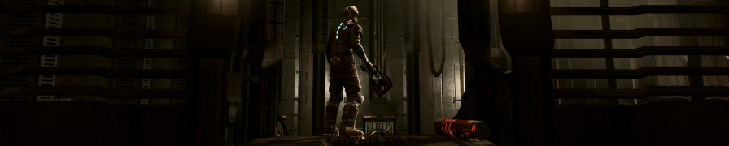

{.shadowed}

## Summary

Feature | Supported
--|--
Vanilla Photo Mode | No
Hotsampling | Yes
DSR | Yes
Custom Aspect Ratios | Yes
Reshade | Yes 
Ansel | No
DirectX versions | 9

Resolution can be changed in configuration file. GeDoSaTo is supported. [(guide)](https://steamcommunity.com/sharedfiles/filedetails/?id=604010024)  

## Free Camera
[Table by GhostInTheCamera (modified)](../CheatTables/DeadSpace_GITC_Mod.CT)  #
[source](https://github.com/ghostinthecamera/PhotomodeCheatTables/blob/master/WIP/Dead%20Space/GITC%20-%20Dead%20Space%20WIP.CT)

**Easing attach process**  
In settings, set auto-attach to `Dead Space.exe` and tick `Even ...`.  
Alternatively, set and use hotkey `Attach to current foreground process`.  
Otherwise, use script `Attach to game` or do it manually.

**Hotkey delay**  
Single hotkey used to toggle scripts - for correct command interpretation, set `Keypoll` to `100` in `Settings → Hotkeys`.  
Source table used two hotkeys for on/off instead.  

### Description: 
Free Camera:
* Toggle with `Num 0`.  
* Move `Num 4-9`.  
* Rotate `Ctrl ←↑↓→`, `Num 1/3`.
* change FOV `Num +/-`.

Timeflow - pause (freeze) the game to move camera:
* toggle with `Num /`  
* side effect - it breaks physics, making the gravity act horizontally until reload.  

Modify Timescale and Aspect Ratio.    
 
Customize hotkeys and their function by pressing `Ctrl+H` on selected entry.  

## Fixed Camera Control
[Cheat Table by Jim2Point0 (modified)](../CheatTables/DeadSpace_Jim2Point0_Mod.CT)  

- FOV, Camera, Char Size. 
- Supports every game version by AoB scan. 
- [source](../CheatTables/Archive/deadspace.CT)

### Text Description

Based on [original description by Jim2Point0](https://web.archive.org/web/20141021190640/flickr.com/groups/deadendthrills/discuss/72157631765632995/).

FOV: Field of View.

Cam Distance: How far back the camera sits from character. The further you go, the smaller he is. This is what the "widescreen fixer" app modifies as well.

Cam Move Distance: Same as above, but for when you're walking. 

Cam Height: when the camera is level or pointing up, there is a minimum height the camera is allowed to go. By increasing\decreasing this, the camera will move up and down. HOWEVER, this does not apply when looking down. To change height when looking up and down, you'll need to use distance.

Center Offset 1\2\3: 3 values the game uses to determine how far left\right the camera sits from Isaac. However, it's dependent on where you're looking. No matter where you look, these will always move the camera left\right. To make matters simple, hotkeys are setup to change all 3 at the same time.

Pivot Distance: The camera rotates around a pivot point. By default, that point is located wherever Isaac is. However, if you increase this value, the camera will rotate around a point in front of Isaac. Negative values for behind him. This is one of several ways to simply put the camera in front of Isaac and get him out of the shot. Has other uses too.

@alert important  
Aiming and many other in-game events reset camera values. To prevent value from changing, **freeze it**: click in the box leftside of it's name. Or highlight it and press `Space`.  
@end
  
Change the values manually by pressing `Enter` or double clicking on value. 

### Controls

The controls aren't exactly intuitive, but you can customize them to your liking by pressing `Ctrl+H`.
Hotkeys function even if game window is minimized, use with care.

Key | Function
--|--
Numpad -/+ | camera distance
Numpad 4\6 | left\right offset
Numpad 8\2 | camera height
Numpad 9\3 | pivot offset
F5| reset defaults[^1]

[^1]: this sets distance to a value of 4 instead of the game's normal default of 2.

## Useful Links

* [PC Gaming Wiki](https://www.pcgamingwiki.com/wiki/Dead_Space)
* [SweetFX Settings DB / Dead Space](https://sfx.thelazy.net/games/game/304/)
