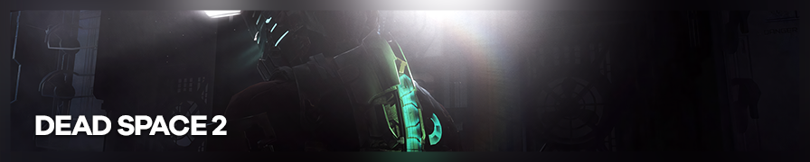

{.shadowed .autosize}

## Summary

Feature | Supported
--|--
Vanilla Photo Mode | No
Hotsampling | Yes
DSR | Yes
Custom Aspect Ratios | Yes
Reshade | Yes 
Ansel | No
Graphics API | 9

Resolution can be changed in configuration file. GeDoSaTo is supported according to [whitelist](https://github.com/PeterTh/gedosato/blob/master/pack/config/whitelist.txt#L52). 
Configuration is similar to [DS1.](https://steamcommunity.com/sharedfiles/filedetails/?id=604010024) 

## Common Info

**Easing attaching to process**  
In settings, set auto-attach to `deadspace` or `dead` for short and tick `Even`.  
Alternatively, set and use hotkey `Attach to current foreground process`.  
Otherwise, use script `Attach to game` or do it manually.

Change the selected value by pressing `Enter` or double clicking on it.

Customize hotkeys and their functions by selecting entry and pressing `Ctrl+H`. Hotkeys work even if game window is minimized, so it's better to use unusual combinations.

## [Cheat Table](../CheatTables/deadspace2_v2b.CT) Features:
credits: 
[GhostInTheCamera](https://github.com/ghostinthecamera/)
[One3rd](https://github.com/One3rd/)
[r3sus](https://github.com/r3sus/) 

### Detached Free Camera 
Supports both DS2 and DS3.  
  1. Ctrl+numpad_0 activates camera, detaching it from isaac. Press again to deactivate.
  2. Also detaches the camera from the mouse. Do not move the mouse if you want the flashlight and lasers. 
  3. Use the classic aiming hud as the centered hud is always in the center of the screen. 
  4. Position controls:   

DOF | Direction | Numpad  
--|--|--
Plane | forward, backward, left, right | 8, 5, 4, 6  
Height | up, down | 9, 7  
Aim | Angles | hold down Num+ and ...  
Pan | up, down, left, right | 8, 5, 4, 6  
Zoom | in, out | 9, 7 (reset to default: ctrl+numpad*)  
Tilt | left, right | 1, 3 (reset: 2, set to 90 degrees: 0)  

### Time Control
  1. Activate the script manually.
  1. Press Ctrl+0 to toggle pause time.
  2. Game Speed  keybinds - [Ctrl + 9 - slomo 0.3]  

The game speed multiplier is 1.00 - default, >1 faster, 0 (and lower) pauses the game, while still able to control the camera.  

### Notes
  1. Hotsampling does not seem to work when CE is running. Set game to desired DSR resolution before starting CE. (it runs well at large resolutions)
  2. Run Dead Space 2, set the desired screenshooting resolution, open table in CE and enable the `Attach to game process` script. 
  3. Time control and camera work during in-game cutscenes and in main menu.

### Extra Cheats

- Invisible - enemies don't see you.
- Disable Gravity - 0g anywhere.
- New Game Checkpoint & Suit Changer
- Other

### Other scripts
(see previous [Cheat Table](../CheatTables/DeadSpace2_camera.CT) version)

#### Relative Camera Control (RCC)
Control the camera position, relative to player. Limited by walls. 

Description:

- `FOV`: Field of View.
- `Zoom` (Cam Distance): how far back the camera sits from character. The further you go, the smaller char is. 

- `Cam Height`: by increasing\decreasing this, the camera will move up\down. HOWEVER, this does not apply when looking up or down - change distance for this.

- `Center Offsets`: 3 values the game uses to determine how far left\right the camera sits from character. However, it's dependent on where you're looking. No matter where you look, these will always move the camera left\right. To make things simple, hotkeys are setup to change all 3 at the same time.

- `Pivot Distance`: The camera rotates around a pivot point. By default, that point is located wherever Isaac is. However, if you increase this value, the camera will rotate around a point in front of Isaac. Negative values for behind him. This is one of several ways to simply put the camera in front of Isaac and get him out of the shot. Has other uses too.

@alert important  
Aiming and many other in-game events reset camera values. To prevent value from changing, **freeze it**: click in the box leftside of it's name. Or highlight it and press `Space`.  
@end

Hotkeys:

Controls|CTRL +
--|--
Zoom|Num +/-
Height|Num 2/8
X|Num 4/6
Y|Num 3/9
Char Size|PgUp/Dn

Technical info: 

This is the port of [Jim2Point0](https://github.com/jim2point0)'s DS1 table. See [original description.](https://web.archive.org/web/20141021190640/flickr.com/groups/deadendthrills/discuss/72157631765632995/) Altho code differs, the same camera values with similar structure were found using CE's 'Group search'. The table only modifies values, without changes to code.

#### Free Camera
Detaches camera from character. 

Control your camera by modifying 3 values. In-game rotating still works and you still control the character. 

Controls|ALT +
--|--
Toggle|Num 0
Height|Num 2/8
X|Num 4/6
Y|Num +/-

Controls are not handy, as they move camera in absolute coordinate system. Recommended to use after RCC.

Credits: Notes by [GhostInTheCamera](https://github.com/ghostinthecamera/).

## Useful Links

- [PC Gaming Wiki](https://www.pcgamingwiki.com/wiki/Dead_Space_2)
- [SweetFX](https://sfx.thelazy.net/games/game/30/)
