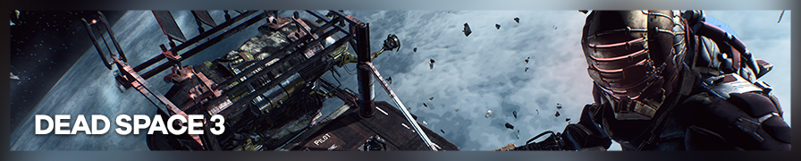

{.shadowed .autosize}

## Summary

Feature | Supported
--|--
Vanilla Photo Mode | No
Hotsampling | Yes
DSR | Yes
Custom Aspect Ratios | Yes
Reshade | Yes 
Ansel | No
Graphics API | DirectX 9

Resolution can be changed in configuration file. 
Configuration is similar to [DS1.](https://steamcommunity.com/sharedfiles/filedetails/?id=604010024) 

## Common Info

**Easing attaching to process**  
In settings, set auto-attach to `deadspace` or `dead` for short and tick `Even`.  
Alternatively, set and use hotkey `Attach to current foreground process`.  
Otherwise, use script `Attach to game` or do it manually.

Change the selected value by pressing `Enter` or double clicking on it.

Customize hotkeys and their functions by selecting entry and pressing `Ctrl+H`. Hotkeys work even if game window is minimized, so it's better to use unusual combinations.

## [Cheat Table](../CheatTables/deadspace3_v2a.CT) Features:
credits: 
[One3rd](https://github.com/One3rd/)
[Jim2Point0](https://github.com/jim2point0)
[r3sus](https://github.com/r3sus/) 
[GhostInTheCamera](https://github.com/ghostinthecamera/)

### Detached Free Camera 
Supports both DS2 and DS3.  
  1. Ctrl+numpad_0 activates camera, detaching it from isaac. Press again to deactivate.
  2. Also detaches the camera from the mouse. Do not move the mouse if you want the flashlight and lasers. 
  3. Use the classic aiming hud as the centered hud is always in the center of the screen. 
  4. Position controls:   

DOF | Direction | Numpad  
--|--|--
Plane | forward, backward, left, right | 8, 5, 4, 6  
Height | up, down | 9, 7  
Aim | Angles | hold down Num+ and ...  
Pan | up, down, left, right | 8, 5, 4, 6  
Zoom | in, out | 9, 7 (reset to default: ctrl+numpad*)  
Tilt | left, right | 1, 3 (reset: 2, set to 90 degrees: 0)  

### Time Control
  1. Activate the script manually.
  1. Press Ctrl+0 to toggle pause time.
  2. Game Speed  keybinds - [Ctrl + 9 - slomo 0.3]  

The game speed multiplier is 1.00 - default, >1 faster, 0 (and lower) pauses the game, while still able to control the camera.  

### Notes
  1. Hotsampling does not seem to work when CE is running. Set game to desired DSR resolution before starting CE. (it runs well at large resolutions)
  2. Run Dead Space 3, set the desired screenshooting resolution, open table in CE and enable the `Attach to game process` script. 
  3. Camera works in main menu and during in-game cutscenes but time control does not.

### Extra Cheats

- God mode, ammo, 0g, etc.
- Checkpoint Changer. 

## Useful Links

- [PC Gaming Wiki](https://www.pcgamingwiki.com/wiki/Dead_Space_3)
- [SweetFX](https://sfx.thelazy.net/games/game/92/)
