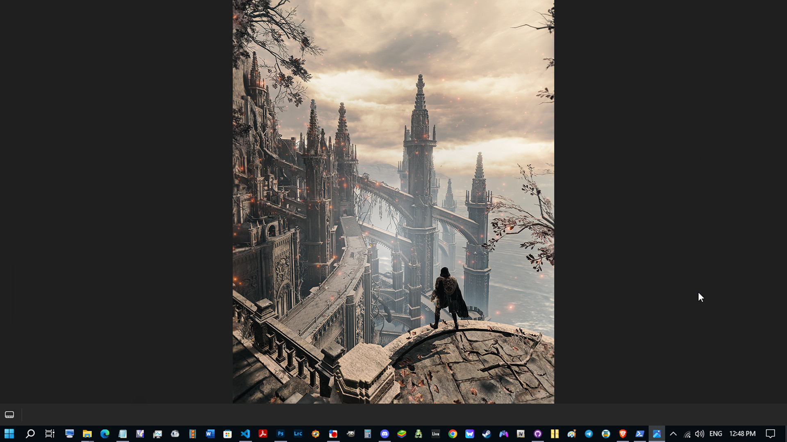
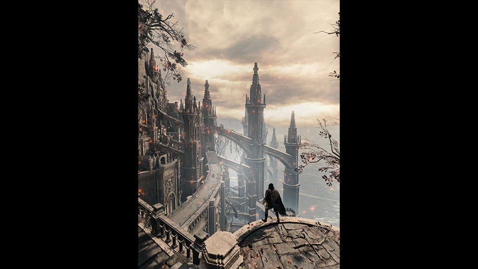

{.shadowed .autosize}

## Summary

Feature | Supported
--|--
Vanilla Photo Mode | No
Hotsampling | Yes (with v1.0.15+ [tools](https://opm.fransbouma.com/Cameras/eldenring.htm))
DSR | Yes
Custom Aspect Ratios | Yes with [tools](https://opm.fransbouma.com/Cameras/eldenring.htm)
Reshade | Yes
Ansel | No
Graphics API | DirectX 12
Game version | 1.12+
 
## Tools

* [Camera tools by Otis_Inf](https://patreon.com/Otis_Inf)  
**[Features](https://opm.fransbouma.com/Cameras/eldenring.htm)**: Camera control(Also in cut scenes), FoV control, HUD toggle, timestop/gamespeed, Pillarbox/letterbox removal in custom aspect ratios (UW support), Higher LODs

### Support
* [Cheat Table](https://www.nexusmods.com/eldenring/mods/48?tab=files) Useful CT if you want to re-spawn certain bosses for shots etc.
* [Cheat Engine Tables Guide](../GeneralGuides/cheat_engine_tables.htm)
* [WeMod Trainer](https://www.wemod.com/cheats/elden-ring-trainers) Features Day Time +1 hour, Freeze Day Time, Freeze Enemies Position and more.

@alert neutral  
Since the latest Elden Ring update and the release of the DLC hotsampling support is now available **only if you have latest version of the tools**. The guide bellow remains viable for those with older versions of the tools alongside older versions of the game.
@end

## Tips and Tricks

Game doesn't support [hotsampling](../basics.htm#hotsampling) **with older version of the tools**. However, if you are using the older versions for some reason, you can still take high-resolution shots in this game.
You can activate the DSR (Dynamic Super Resolution) from the Nvidia Control Panel, but that will let you go up to 4x multiplier only and you will be limited when it comes to custom aspect ratios.

**It's highly recommended** going [here](../GeneralGuides/custom_dsr_resolutions.htm) to set up as many DSR resolutions as you want to take high-resolution shots in **different aspect ratios**. This is the best way, and it's really everything you need to setup the resolutions and ratios of your [choice](https://i.imgur.com/gfPhRCN.png). This is for Nvidia cards.

For AMD card users, you might want to tweak VSR (Virtual Super Resolution). Here are some useful links that can help you achieve this: [Activating VSR](https://www.amd.com/en/resources/support-articles/faqs/DH-010.html), and [AMD GPU Scaling](https://www.amd.com/en/resources/support-articles/faqs/DH-019.html). You wanna go with Centered GPU scaling, because its description is similar to Nvidia's No Scaling. However, you will have to crop since there is no VSR guide for different aspect ratios for next generation of AMD cards like the one above for Nvidia. So this guide will focus more on Nvidia, with the same idea for the AMD as well.

___
### First Method
So after you set up everything, make sure to run the game in fullscreen mode and play. When you want to work on a shot, head over to video settings and set it to the high DSR resolution of your choice that you created with the tool (you don't need to set your desktop resolution to DSR one for this to work). 

Then what you wanna do is press `Alt`+`Enter` to enter the windowed mode which brings you to monitor's native resolution. Then you can play with the ReShade, *compose* the shot, and when you are ready to take the high-res shot, press the `Alt`+`Enter` to switch back to previously set DSR resolution. 
Press `Alt`+`Enter` again to return to windowed mode. 

This method is good because you can see the entire shot in that particular aspect ratio and even tweak FoV, or compose, however, the rest of the area will be surrounded with black bars, but fear not. Capturing the screenshot will not include those black bars thanks to Nvidia's No Scaling option that you had previously set in Nvidia Control Panel. *(example bellow)*

  

    
IN WINDOWS WITHOUT BLACK BARS

    
  

  

    
IN GAME WITH BLACK BARS

    
  

  <input type="range" min="0" max="100" value="50" step="0.01" 
    id="slider" class="slider__input" 
    autocomplete="off" onwheel="this.blur()" 
  />

Left: example of the composed ER 3:4 shot at resolution of 3037x4050 surrounded by the black bars in 16:10 monitor. Right: example in windows after the shot was taken. So you get a nice crisp 3:4 image result, no black bars.

This method comes with a penalty though, which is needing to compose a shot on high-resolution. For instance, if you align your shot in 16:10 and then switch back to 3:4, you will need to make some adjustments in the 3:4 aspect ratio.

Having the beefier card will make these things significantly much easier of course (you can even play the game in 5k), but as an example, to give you a general idea, with cards such as the GTX 1060 6GB you are still able to take high-resolution shots from this game. 

Its a bit slower progress of course with the first method because sometimes, if not always, you will need to tweak FoV while running the game at high DSR res because if your monitor has a 16:9 ratio, and you want to take the shot in 21:9, you will need to compose a bit on that DSR res and if you turned on Higher LODs from the tools along with ReShade it can be quite laggy. But there is also the other way of taking the high-res shots in this game.

### Fullscreen Way
@alert tip
You can access the video settings even if your game is paused, while the free cam is on! This can be useful if you want to switch to different aspect ratios in fullscreen mode while not ruining your perfectly aligned shot. You just gotta do this with a keyboard and mouse if the camera control device is set to `Gamepad` in tools. If it's set to `KeyboardMouse`, then you can access the menu with the controller. If it's set to `Both` it will not work. Don't forget to turn the `HUD` back on otherwise you won't see the menu after pressing the `ESC`.
@end

Let's say you are in 21:9 or 16:9, but you decide that 3:4 or 1:1 would work better for you right now, or you want to try things out, press `ESC` and use a mouse (if the camera control device is set to `Gamepad` in tools) to navigate to the video settings and select the resolution of your choice, and it will switch to that DSR resolution instantly! You are free to repeat this as often as you like. It's rare to crash while playing for four hours straight and repeat this repeatedly.

Be aware that this method may not function if you accidentally or for some reason press the `Windows` or `Alt+Enter` keys. The menu will be visible to you, but it will not be functional. Hence, if you want to use this method right away, pay attention to that; if the menu bugs out, reset to refresh, combine. This is uncommon and will only occur if you press `Alt+Tab` excessively when using a custom aspect ratio.

## Resembling Hotsampling

If you are dedicated, you can generate lower custom DSR resolutions with the tool only for composing, then do the [fullscreen](../GameGuides/EldenRing.htm#fullscreen-way) menu trick to go to much higher res in that aspect ratio to take the shot and also the same way to return to lower one. Avoid setting custom DSR resolutions too low, because it will crash your game. Generated resolutions shouldn't have lower width/height than your monitor's native one. In 16:10 case, x1.5 for 21:9, and x2.25 for 3:4 will work. Any lower will cause your game to crash.

Examining additional [tools](https://i.imgur.com/dRk02S8.png) that allow hotsampling is another useful suggestion. This way, you can find aspect ratio resolutions offered for your monitor that can be used with the DSR tool.

It would be wise to test a variety of custom DSR resolutions to determine which suits best for your card.

## Useful Links

* [PC Gaming Wiki](https://www.pcgamingwiki.com/wiki/Elden_Ring)
* [Skip the intro logos and remove white startup screen](https://www.nexusmods.com/eldenring/mods/421)
* [Elden Mod Loader](https://www.nexusmods.com/eldenring/mods/117)
* [Metis Mod Launcher](https://www.nexusmods.com/eldenring/mods/3102)
* [Mod Engine 2](https://github.com/soulsmods/ModEngine2/releases)
* [More Armors](https://www.patreon.com/MaxTheMiracle)
* [More Mounts](https://www.nexusmods.com/eldenring/mods/991) You can also type **Mount** in nexus search bar to check for more mounts.
* [New Idle Animations](https://www.nexusmods.com/eldenring/mods/2397)

