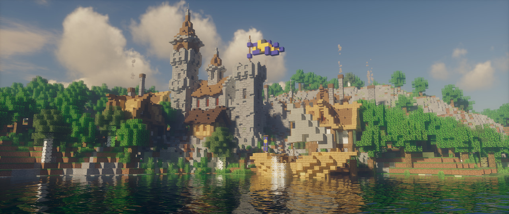
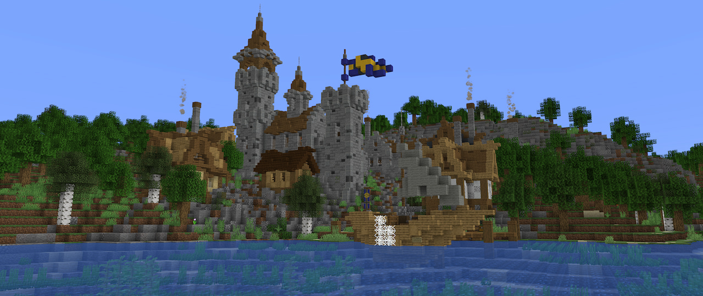
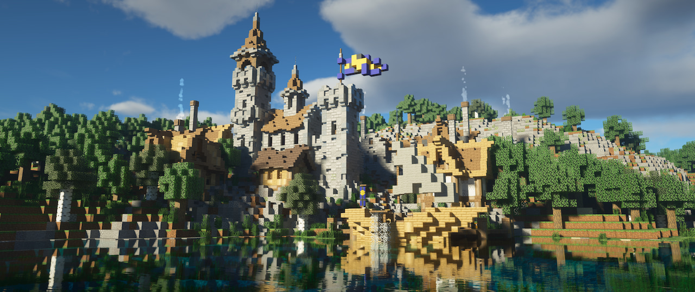
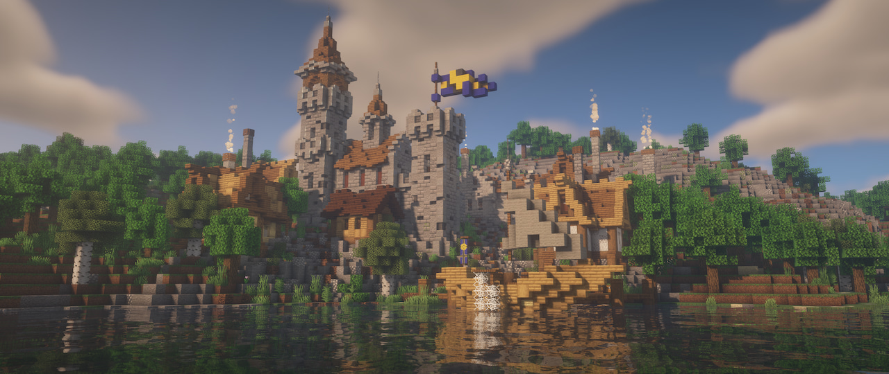
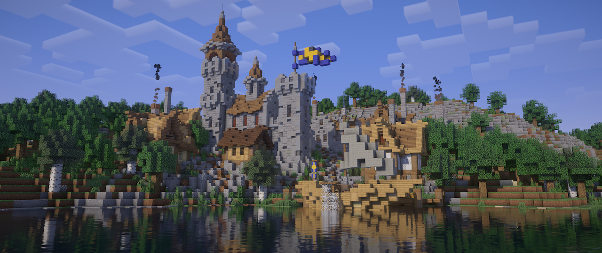
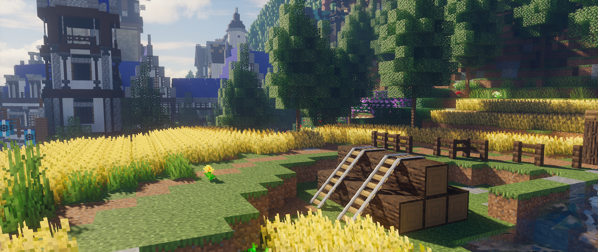
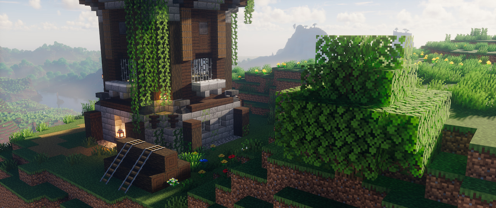
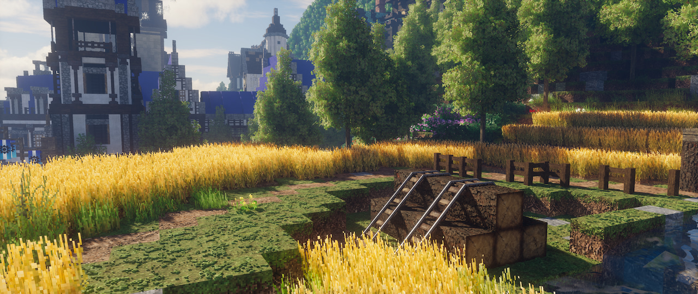
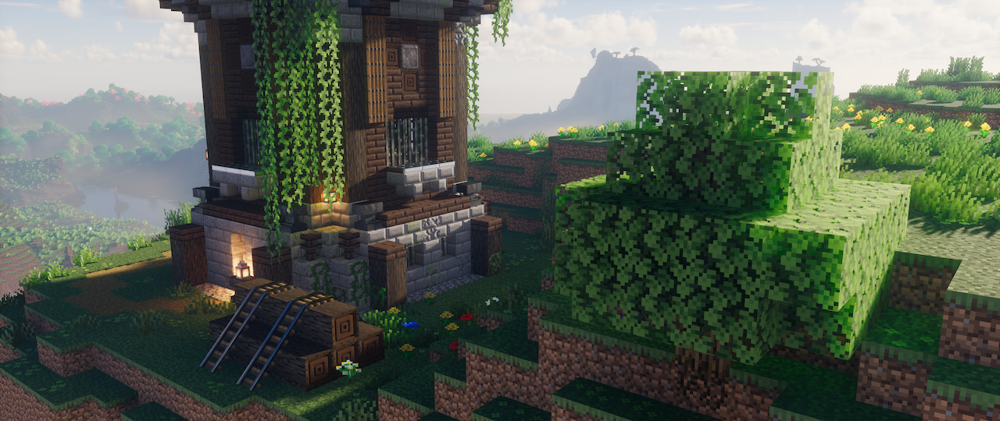
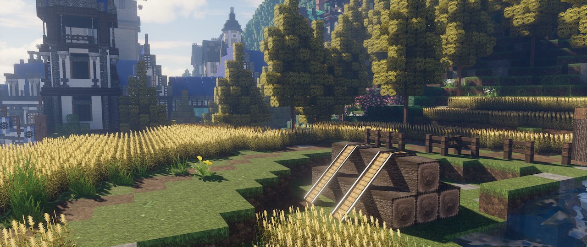

{.shadowed .autosize}

## Summary

Feature | Supported
--|--
Vanilla Photo Mode | No
Hotsampling | Yes
DSR | Yes
Custom Aspect Ratios | Yes
Reshade | Yes (OpenGL)
Ansel | No
Graphics API | OpenGL
Game version | 1.18.2

@alert neutral
This guide is for the **[Java Edition](https://minecraft.fandom.com/wiki/Java_Edition)** of Minecraft. Not to be confused with [*Bedrock Edition*](https://minecraft.fandom.com/wiki/Bedrock_Edition), an entirely different multi-platform version of the game.
@end

## Setup

Tools aren't necessarily required for Minecraft, as the majority of shots can be taken vanilla. Here are some quick bindings to get you started.

Key | Description
-- | --
F1 | toggle HUD
F2 | <abbr title="Saves to C:\Users\user\AppData\Roaming\.minecraft\screenshots. Does not save ReShade effects."> capture screenshot</abbr>
F3 | toggle <abbr title="Displays mostly performance information.">debug overlay</abbr>

### Commands  

Opening chat with `t` allows you to type in a myriad of commands. Here are some useful ones:

Command | Description
-- | --
`/gamemode creative` | puts you in creative mode
`/gamemode spectator` | puts you in spectator mode
`/gamerule doDaylightCycle false` | disables sun/moon movement
`/gamerule doWeatherCycle false` | disables weather changes
`/time set [number]` | sets <abbr title="0 for sunrise, 6000 for noon, 12000 for sunset, 16000 for night">time of day</abbr>
`/kill @e[type=!player]` | kills all mobs

Spectator mode can be very helpful as you can noclip through blocks and change fly speed with the scrollwheel. It also stops shaderpacks from rendering your shadow.

Some worlds you download may not come with cheats enabled, preventing the use of these commands. You'll need a save editor like [NBTExplorer](https://www.minecraftforum.net/forums/mapping-and-modding-java-edition/minecraft-tools/1262665-nbtexplorer-nbt-editor-for-windows-and-mac) to edit the world file and enable cheats. NBTExplorer should find your save files by default. Open the downloaded map's folder, open `level.dat` and look for `allowCommands`. Change that to `1`, then *Save All Modified Tags* (third icon in the top row).

### Improving performance

Minecraft doesn't exactly run well, even in entirely vanilla situations. You can attempt to boost performance by allocating more RAM to Minecraft, through some JVM arguments. In the Minecraft Launcher, head to the *Installations* tab, hover over the `...` and edit your install. Under *More Options*, change `-Xmx2G` to something like `-Xmx4G` or higher. The number sets how much RAM the game's allowed to use, so `-Xmx4G` would be 4GB. You can set it as high as your computer allows, I have mine at `-Xmx8G`.

JVM arguments can get pretty complex, this [reddit post about modded Minecraft and memory consumption](https://www.reddit.com/r/feedthebeast/comments/5jhuk9/modded_mc_and_memory_usage_a_history_with_a/) provides a much more elaborate set of arguments complete with explanations for each.

Mods such as [OptiFine](https://optifine.net/home) and [Sodium](https://github.com/CaffeineMC/sodium-fabric) exist that revamp how Minecraft renders to dramatically improve performance as well. You can install them as is, but we'll be looking into how they can also be used to improve how the game looks right below.

## Shaders

The magic sauce that makes Minecraft not look like Minecraft, shaders overhaul the game's look entirely, giving it everything from dynamic shadows to path-traced lighting.

### Shader Hosts

These mods are **required** for shaders. Pick and install only one.

- [**OptiFine**](https://optifine.net/home)  
OptiFine is an optimisation mod that adds a large number of visual features while improving performance. It is currently the mod shaders are written around, which makes it the obvious choice when you want to play with shaders. However, it is notoriously closed-source, which has spurred on development of alternative mods.

- [**Iris & Sodium**](https://irisshaders.net/)  
Part of the new wave of open-sourced Minecraft modding, Iris is an extension to the optimisation mod [Sodium](https://github.com/CaffeineMC/sodium-fabric), allowing that to load shaders as well. Shader support with Iris is varied, with some shaderpacks poorly supported.

- [Focal Engine](https://continuum.graphics/featured-release/2020/12/20/87433/continuum-rt-build-13-launch-blog/) (*In development*)  
Outright replacing Minecraft's renderer with a custom solution, Focal Engine attempts to bring Minecraft into Vulkan with support for a much larger range of graphics options. It is currently deep in development and **not a viable option**, but is worth mentioning nonetheless.

### Shaderpacks

These are the shaders themselves. They are typically installed to `C:\Users\user\AppData\Roaming\.minecraft\shaderpacks`. If the folder doesn't exist, create it. Here are some recommendations:

#### [Kappa](https://rre36.com/kappa-shader)

  

    
Kappa

    
  

  

    
Vanilla

    
  

  <input type="range" min="0" max="100" value="50" step="0.01" 
    id="slider" class="slider__input" 
    autocomplete="off" onwheel="this.blur()" 
  />

The Kappa Shader by RRE36 is a realistic shaderpack full of features like screenspace raytracing. Currently one of the best out there, IMO. (<i>Shot on v4.2</i>)

#### [SEUS PTGI](https://www.patreon.com/sonicether)

  

    
SEUS PTGI

    
  

  

    
Vanilla

    
  

  <input type="range" min="0" max="100" value="50" step="0.01" 
    id="slider" class="slider__input" 
    autocomplete="off" onwheel="this.blur()" 
  />

SEUS PTGI by Sonic Ether is a realistic shaderpack that offers path-traced lighting. Everyone's favourite buzzword. (<i>Shot on HRR 3</i>)

#### [BSL](https://bitslablab.com/bslshaders/)

  

    
BSL Shaders

    
  

  

    
Vanilla

    
  

  <input type="range" min="0" max="100" value="50" step="0.01" 
    id="slider" class="slider__input" 
    autocomplete="off" onwheel="this.blur()" 
  />

BSL Shaders by capttatsu is a stylised shaderpack offering a wide range of customisations and optimisations. One of the most popular shaders. (<i>Shot on v8.1.02.2</i>)

#### [Vanilla Plus](https://rre36.com/vanilla-plus)

  

    
Vanilla Plus

    
  

  

    
Vanilla

    
  

  <input type="range" min="0" max="100" value="50" step="0.01" 
    id="slider" class="slider__input" 
    autocomplete="off" onwheel="this.blur()" 
  />

Vanilla Plus by RRE36 is a vanilla-styled shaderpack that aims to stay faithful to the vanilla aesthetic while adding dynamic shadows and better clouds. (<i>Shot on v3.0b</i>)

*[Project Orian](https://www.planetminecraft.com/project/the-city-of-meria-8-medieval-world-project-download/), using Vanilla Normals Renewed, OptiFine 1.18.2 HD U H7.*  
Visit [Shaderlabs](https://wiki.shaderlabs.org/wiki/Shaderpacks) for a full, maintained list of all shaderpacks in active development.

@alert info  
Some shaderpacks don't work well with hotsampling past a certain resolution. Always check your captures for artifacts.
@end

### Resource Packs

Previously known as texture packs, these replace in-game textures (and sounds, hence the new name). Most shaderpacks support <abbr title="physically-based rendering">PBR</abbr> and these resource packs provide the textures to make use of the PBR. Here are some recommendations:

#### [Vanilla Normals Renewed](https://github.com/Poudingue/Vanilla-Normals-Renewed/releases/)

  

    
Vanilla Normals Renewed

    
  

  

    
Vanilla

    
  

  <input type="range" min="0" max="100" value="50" step="0.01" 
    id="slider" class="slider__input" 
    autocomplete="off" onwheel="this.blur()" 
  />

Vanilla Normals Renewed is a direct PBR upgrade to the vanilla textures. (<i>Shot on 1.0.4</i>)

#### [Patrix](https://www.patreon.com/posts/free-1-18-32x-59407009)

  

    
Patrix

    
  

  

    
Vanilla

    
  

  <input type="range" min="0" max="100" value="50" step="0.01" 
    id="slider" class="slider__input" 
    autocomplete="off" onwheel="this.blur()" 
  />

Patrix is a fantasy texturepack created with PBR in mind. (<i>Shot on Update 45 32x</i>)

#### [UltimaCraft](https://www.curseforge.com/minecraft/texture-packs/ultimacraft) + [PBR Expansion](https://www.curseforge.com/minecraft/texture-packs/ultimacraft-pbr)

  

    
UltimaCraft

    
  

  

    
Vanilla

    
  

  <input type="range" min="0" max="100" value="50" step="0.01" 
    id="slider" class="slider__input" 
    autocomplete="off" onwheel="this.blur()" 
  />

UltimaCraft is an expanded vanilla texturepack with additional PBR support. (<i>Shot on v.1.2</i>)

#### [Misa's Realistic Texture Pack](https://www.curseforge.com/minecraft/texture-packs/misas-realistic)

  

    
Misa's Realistic

    
  

  

    
Vanilla

    
  

  <input type="range" min="0" max="100" value="50" step="0.01" 
    id="slider" class="slider__input" 
    autocomplete="off" onwheel="this.blur()" 
  />

Misa's Realistic is a realistic texturepack with robust PBR support. (<i>Shot on 1.18e</i>)

*[City of Estellida](https://www.planetminecraft.com/project/city-of-estellida-download/), using Kappa v4.2, OptiFine 1.18.2 HD U H7.*  
[Browse more resource packs](https://www.curseforge.com/minecraft/texture-packs?filter-sort=2).

## ReShade

Setting up ReShade for Minecraft is unique, since it uses a runtime executable that isn't immediately obvious and also deletes ReShade files on launch.

1. **Locating the executable**  
The executable is typically found at `C:\Program Files (x86)\Minecraft Launcher\runtime\java-runtime-beta\windows-x64\java-runtime-beta\bin`. You can also locate this by opening Task Manager while the game is running, right-click on *OpenJDK Platform binary* and clicking on *Open file location*.

2. **Duplicating the executable**  
In order to stop Minecraft from deleting ReShade files, copy the `java-runtime-beta` folder and paste it elsewhere.

3. **Installing ReShade**  
Install ReShade as per normal to this new, duplicated folder. Minecraft uses OpenGL, so remember to pick that.

4. **Getting Minecraft to use the new executable**  
In the Minecraft Launcher, head to the *Installations* tab, hover over the `...` and edit your install. Under *More Options*, paste in the path to your duplicated runtime folder. End the path with `\javaw.exe`, the executable Minecraft uses.

Minecraft should now launch with ReShade properly installed. Do note that **ReShade causes some visual artifacts** in the game. It may also affect how some render mods (OptiFine, Sodium) and shaderpacks render the game. SEUS PTGI and BSL, for example, have major artifacts with ReShade installed.

### Depth Buffer

The depth buffer requires a bit of setup before it can be used by depth shaders. In the OpenGL tab (4.9.1 and below) / Add-ons > Generic Depth (5.0+), *Copy depth buffer before clear operations* has to be ticked. Under *Edit global preprocessor definitions*, change `RESHADE_DEPTH_INPUT_IS_UPSIDE_DOWN` to `1`. 

@alert important  
It seems ReShade cannot reliably grab the right depth buffer upon resolution changes, i.e. hotsampling. It may need to be refreshed by unticking and reticking *Copy depth buffer [...]* or may even be upside down, forcing you to change `RESHADE_DEPTH_INPUT_IS_UPSIDE_DOWN` back to `0`.  
@end

## Tips and Tricks

### Quick-lower FoV

The OptiFine mod includes a 'punch-in' function bound to `c` by default. You can also use an in-game [spyglass](https://minecraft.fandom.com/wiki/Spyglass), however that drops your FoV by 10x, which may be a bit too much of a zoom.

### Exporting a depth buffer

A depth buffer can be exported with [the help of a shader](https://www.youtube.com/watch?v=nakyctgYDM8). This is handy in the cases where ReShade's introduced artifacts make it inconvenient to capture depth effects (and you know [what to do with a depth map](../ReshadeGuides/depthguide.htm)). The capture of this depth map is limited to 8-bit, so you might have to adjust your chunk render distance to get a more precise depth capture.

## Useful Links

* [Console commands](https://minecraft.fandom.com/wiki/Commands) (Minecraft Wiki)
* [Command generator](https://mcstacker.net/) (MCStacker)
* [Minecraft maps](https://www.planetminecraft.com/projects/?order=order_popularity) (Planet Minecraft)
