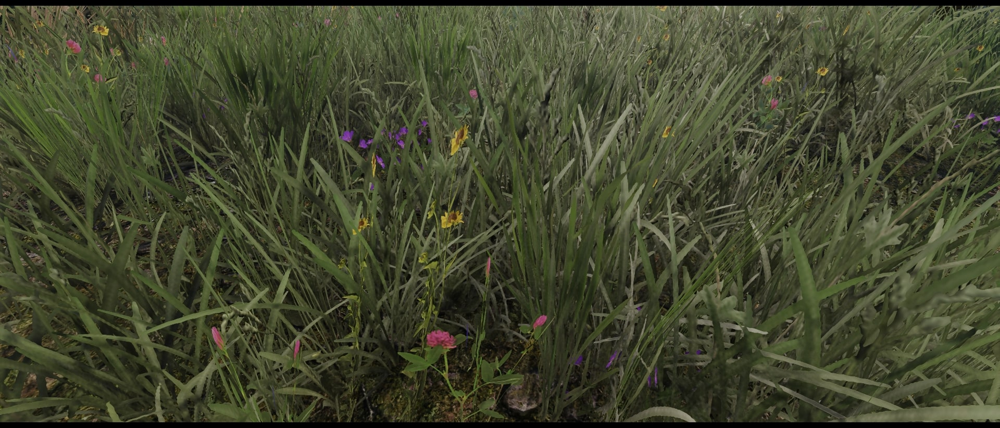
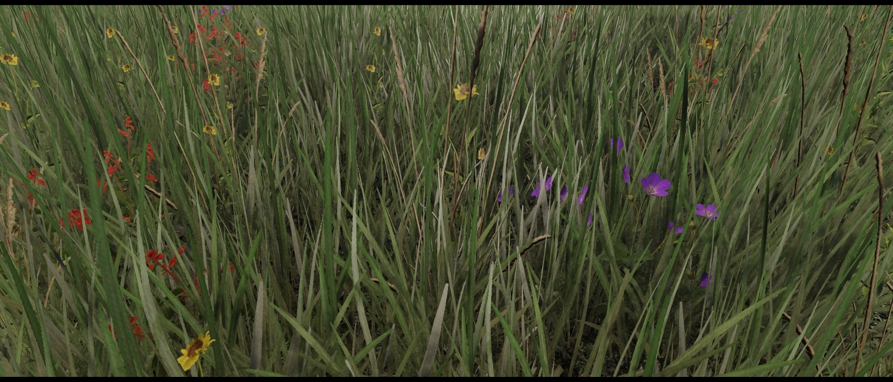

{.shadowed .autosize}

## Summary

Feature | Supported
--|--
Vanilla Photo Mode | Yes
Hotsampling | Yes (with tools)
DSR | Yes
Custom Aspect Ratios | Yes
Reshade | Yes
Ansel | Yes
Graphics API | DirectX 11/12
Game version | 4.0.0.103190  S 
 
## Tools

* [Camera tools by Otis_Inf](https://patreon.com/Otis_Inf)  
**[Features](https://opm.fransbouma.com/Cameras/witcher3.htm)**: Camera control, FoV control, HUD toggle, timestop/gamespeed, hotsampling, Time of Day control

## Useful mods

* [Script Merger](https://www.nexusmods.com/witcher3/mods/8628)- Detects conflicts and allows easy merging. Also allows manual controls for priority.

* [Benis Reloaded NG](https://www.nexusmods.com/witcher3/mods/8628)- Lighting mod based on Immersive Lighting, works fine with and without RT.

* [Tweaks](https://www.nexusmods.com/witcher3/mods/2658)- Expands the graphics options and lets you tweak more variables. Recommended for cards with 8 GB VRAM or more.

* [The Witcher 3 HD Reworked Project NextGen Edition](https://www.nexusmods.com/witcher3/mods/9963)- Improves textures, models and LODs.

* [Elysium Next Gen](https://www.nexusmods.com/witcher3/mods/9396)- A grass overhaul for the Next Gen edition.

  

    
Vanilla Grass

    
  

  

    
Elysium Grass

    
  

  <input type="range" min="0" max="100" value="50" step="0.01" 
    id="slider" class="slider__input" 
    autocomplete="off" onwheel="this.blur()" 
  />

Elysium before/after comparison.

* [Hoods mod](https://www.nexusmods.com/witcher3/mods/4242)- Adds clothing and accessories helpful for shots.

* [Higher Resolution Eyes for Ciri](https://www.nexusmods.com/witcher3/mods/3215)

* [Higher Resolution Eyes for Yennefer](https://www.nexusmods.com/witcher3/mods/2565)

## Useful Links

* [PC Gaming Wiki](https://pcgamingwiki.com/wiki/Game_Title)
* [How to enable the command console](https://steamcommunity.com/sharedfiles/filedetails/?id=2050213631)
* [Console Command List](https://commands.gg/witcher3)