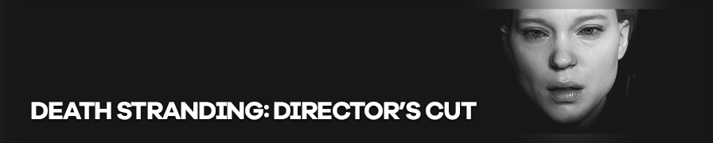

{.shadowed .autosize}

## Summary

Feature | Supported
--|--
Vanilla Photo Mode | Yes
Hotsampling | Yes
DSR | Yes
Custom Aspect Ratios | Yes
Reshade | Yes
Ansel | No
Graphics API | DirectX 12
Game version | 1.00.00
 
## Tools

* [Camera tools by Otis_Inf](https://patreon.com/Otis_Inf)  
**Features**: Camera Control, Camera Paths, FOV control, HUD toggle, timestop/gamespeed, Frameskip, Higher LODs, Hotsampling

## Tips and Tricks

### Hotsampling

Hotsampling at higher than 3x resolution can cause the textures to glitch sometimes so wait a few seconds before taking the shot also keep an eye out for broken textures.

## Useful Links

* [PC Gaming Wiki](https://www.pcgamingwiki.com/wiki/Death_Stranding:_Director%27s_Cut)
* [Suggested Mods](https://www.nexusmods.com/deathstranding)

