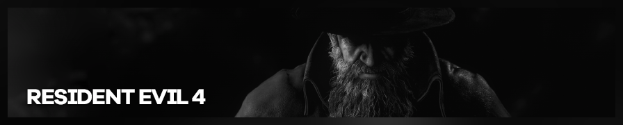

{.shadowed .autosize}

## Summary

Feature | Supported
--|--
Vanilla Photo Mode | Yes
Hotsampling | Yes
DSR | Yes
Custom Aspect Ratios | Yes
Reshade | Yes
Ansel | No
Graphics API | DirectX 12
Game version | 1.0.1
 
## Tools

* [Camera tools by Otis_Inf](https://www.patreon.com/Otis_Inf/posts)  
**[Features](https://opm.fransbouma.com/Cameras/re4remake.htm)**: Camera control, FoV control, HUD toggle, timestop/gamespeed, hotsampling
* [REFramework](https://github.com/praydog/REFramework-nightly/releases)  
**Features**: Modding Tool for RE Engine Games 
* [EMV Engine](https://github.com/alphazolam/EMV-Engine)  
**Features**: Console, Enemy Spawner, Character Poser, Gravity Gun, and more.
Make sure to check out the [guide](../GeneralGuides/emv_engine.htm) on it.
* [RELit by Originalnicodr and Otis_inf](https://github.com/originalnicodr/RELit)  
**Features**: Lighting Control, turn off scene lights, exposure control. 
Make sure to check out the [guide](https://framedsc.com/GeneralGuides/relit.htm) on it.

## Useful Links

* [PC Gaming Wiki](https://www.pcgamingwiki.com/wiki/Resident_Evil_4_(2023))
* [Nexus Mods](https://www.nexusmods.com/residentevil42023)
