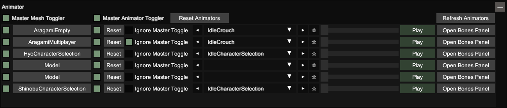

<p align="center">
  
</p>

@alert neutral
**Engine versions supported:** Cinematic Unity Explorer supports most Unity versions from 5.2 to 2021+ (IL2CPP and Mono)
@end

The [Cinematic Unity Explorer](https://github.com/originalnicodr/CinematicUnityExplorer) is a fork of the excellent UnityExplorer mod made by sinai-dev focused on providing tools for creating marketing material for Unity games, which includes an improved freecam, light control, animators control, LOD and shadows improvements, camera paths, and more.

This guide will focus on how to download and install this mod depending on the game, and how to use it to its full potential.

<p align="center">
<a href="https://www.youtube.com/watch?v=--8DOKWzGJ4" target="_blank">
  
</a>
<i>Trailer showcasing the mods features</i>
</p>

# Setup
---
The setup is the most cumbersome step of using the Cinematic Unity Explorer but is essentially extracting a couple of zips into the games folder. We include all of the potential problems you may encounter to be as exhaustive as possible, but chances are you won't need to go through them.

If you stick around and follow the steps as explained below you shouldn't have any problems.

<p align="center">
<a href="https://www.youtube.com/watch?v=qufWSNPyeYQ" target="_blank">
  
</a>
<i>If you ever get lost in this guide I suggest watching the video above for visual aid, even tho it's about installing the original Unity Explorer.</i>
</p>

## Thunderstore

Depending on the game, there may be [Thunderstore Mod Manager](https://www.overwolf.com/app/thunderstore-thunderstore_mod_manager) support. If so, many of the steps below regarding selecting the right BepInEx/MelonLoader may be avoidable, providing a more streamlined process for installation.
Most, if not all, games that can be managed through Thunderstore have their BepInEx version already chosen by other players, making installation of CUE as simple as installing BepInEx through the manager, and dragging CUE into the BepInEx folder.

@alert important
Please note, you still need to identify the type of Unity game so that you download the correct CUE version for your game.
@end

## Identifying the type of Unity game
 
To know what files you have to install you first need to understand if the game is a `Mono` or an `IL2CPP` game.

### Mono or IL2CPP

To identify if a game is `Mono` or `IL2CPP` open the game folder:

- Mono games have a `Managed` folder in the gamedata folder. They also might have a folder with `Mono` on its name.
- IL2CPP games have a `GameAssembly.dll` in the game folder and an `il2cpp_data` folder in the gamedata folder.
 
@alert tip
If the game is on Steam, you can check the file structure before downloading by going to the [SteamDB](https://steamdb.info) page of the game, `Depots` section, and from the table in there, click the ID number on the game's depot (usually the one with the bigger file size).
@end

If you happen to need it for something the Unity Engine version number can be found by going to the game's folder, right-click on `UnityPlayer.dll`, clicking on Properties, and heading over to the Details tab. But this info shouldn't be relevant to the guide.

## MelonLoader (for Mono and IL2CPP games)  

Even tho you can technically use BepInEx as a mod loader for Mono games, we have had more luck getting MelonLoader to work instead, so we proceed to describe the download and installation process for it below.

If you need to use other mods that are only compatible with BepInEx (or just couldn't make MelonLoader work for whatever reason) you can check out the [BepInEx section](#bepinex-for-mono-games).

### Downloading MelonLoader and Cinematic Unity Explorer

- Download [MelonLoader.Installer.exe](https://melonwiki.xyz/#/?id=automated-installation) (make sure you have the requirements described on the site installed).
- [Cinematic Unity Explorer](https://github.com/originalnicodr/CinematicUnityExplorer/releases) (depending on the game, check [this section](#mono-or-il2cpp)):
 - **Mono games**: [CinematicUnityExplorer.MelonLoader.Mono](https://github.com/originalnicodr/CinematicUnityExplorer/releases/latest/download/CinematicUnityExplorer.MelonLoader.Mono.zip)
 - **IL2CPP games**: [CinematicUnityExplorer.MelonLoader.IL2CPP](https://github.com/originalnicodr/CinematicUnityExplorer/releases/latest/download/CinematicUnityExplorer.MelonLoader.IL2CPP.zip)

### Installation

@alert tip
If the game is using a DRM like Steam make sure you are launching said game through Steam and not opening the .exe directly. Some games won't start otherwise and this error might be confused with a problem created while trying to install the mod loader or another mod.
@end

@alert important
Both MelonLoader and BepInEx download some necessary .dlls when first launched with an IL2CPP game, so make sure you have internet access when following the steps below.
@end

- Execute `MelonLoader.Installer.exe`. Select where the exe of the game is, uncheck the **LATEST** checkbox, choose v0.5.7 from the dropdown list instead, and click install. Start your game after installation.
 - Leave the 'Game Arch' on auto. No need to change it. 
 - It can take some time until the game is loaded due to the unhollowing process happening in the background. Your game can also automatically restart once back into the loader process. The process is logged on the console.
 - In some games (e.g. Sable), starting them with MelonLoader installed might sometimes throw error windows about missing .dlls, which may or may not crash your game. If indeed the game crashes, try starting it again. If it doesn't then just continue with the game as usual.

    If you don't see a MelonLoader splash screen when starting the game or any console then there might be a problem with the mod loader. To fix it try the steps described below one by one and start the game again after trying each of them:
  - Rename `version.dll` in `winhttp.dll`


- Extract the CinematicUnityExplorer zip inside the game's main folder. Launch the game. You should be able to see the Cinematic Unity Explorer menu pop up on startup.

    If you don't see such a thing and want to verify you can go to the `Mods\CinematicUnityExplorer` folder. You should be able to see a `Logs` and `Scripts` folder in there. You can also check the mod loader logs generated inside the `MelonLoader\Logs` folder and try to read if there is any error in the latest one. If indeed the mod hasn't been loaded try deleting Cinematic Unity Explorer and downloading and installing [CinematicUnityExplorer.MelonLoader.IL2CPP.CoreCLR.zip](https://github.com/originalnicodr/CinematicUnityExplorer/releases). This is likely the cause as Unity seems to be shifting into CoreCLR for their latest versions.

    Most games work with ML 0.5.7 by default and do not need any changes. Still, there might be a small chance some games (e.g. Tormented Souls) won't work once Cinematic Unity Explorer is installed, and it can lead to a crash. If that happens, we recommend giving [BepInEx 6](https://builds.bepinex.dev/projects/bepinex_be) for IL2CPP a try. If that's the case go to the linked page, scroll down to "Artifacts", and download `BepInEx Unity (IL2CPP) for Windows x86` or `x64` depending on the game (follow the [Mono section](#Mono) of this guide to know which one). If even that fails try so with `BepInEx NET (CoreCLR net6.0) for Windows`.

@alert tip
If you do not want MelonLoader splash screen every time you start the game go to `game_root\UserData\MelonStartScreen\Config.cfg` and under `[General]` change `Enabled` from `true` to `false`.
@end

## BepInEx (for Mono games)

If you can't use MelonLoader or need to use BepInEx for whatever reason follow the steps below. However, if you already installed MelonLoader and Cinematic Unity Explorer with it then you can skip this section.

@alert important
Some games (noticeably the ones published by EA) have encrypted game objects on runtime or something along those lines. Fortunately, MelonLoader is able to get through this encryption, but BepInEx won't work.
@end

### 32-bit or 64-bit

When using BepInEx, you have to make an extra distinction between 32 and 64 bits. To do so, launch the game and use the Task Manager to check if your game is 32-bit or 64-bit (if it is 32-bit, it will have "32-bit" next to the process name).  

{.shadowed .autosize}

Alternatively, you can look up the games page on the [pcgamingwiki](https://www.pcgamingwiki.com/wiki/Main_Page).


### Downloading BepInEx and Cinematic Unity Explorer

Download the appropriate version of each, depending if the game is 32 or 64-bit.

- [BepInEx 5](https://github.com/BepInEx/BepInEx/releases/tag/v5.4.22)
 - **64 bit**: BepInEx_x64_5.X
 - **32 bit (x86)**: BepInEx_x86_5.X
- [CinematicUnityExplorer.BepInEx5.Mono](https://github.com/originalnicodr/CinematicUnityExplorer/releases/latest/download/CinematicUnityExplorer.BepInEx5.Mono.zip)

Even tho there is a BepInEx v6 (which is a patcher/plug-in framework for Unity games) for Mono games, it is still recommended to use v5 since Mono support in v6 is still untested.

### Installation

@alert tip
If the game is using a DRM like Steam make sure you are launching said game through Steam and not opening the .exe directly. Some games won't start otherwise and this error might be confused with a problem caused by a wrong mod or mod loader installation.
@end

- Extract the contents of the BepInEx zip into the game folder. Launch the game.

    You should see more folders created inside the `BepInEx` folder besides the `core` folder, and a `LogOutput.log` file, signaling that the mod loader has been installed correctly. As an alternative to know if the mod loader is working correctly, you can go to `BepInEx\config\BepInex.cfg` and under `[Logging.Console]` change `Enabled` from `false` to `true` to display the console at startup.

    If you don't see the mentioned folders or console then try doing the things listed below one by one and try running the game after each one:
  - Rename `winhttp.dll` in `version.dll`.
  - Double-check that the game architecture matches the downloaded BepInex mod loader (32 or 64 bit).
  - [More troubleshooting tips](https://docs.bepinex.dev/articles/user_guide/troubleshooting.html).


- Extract the CinematicUnityExplorer zip inside the game's `BepInEx` folder. Launch the game. You should be able to see the Cinematic Unity Explorer menu pop up on startup (it might take a while for it to start, so be patient and look at the logs).

    If you don't see such a thing and want to verify you can go to the `BepInEx\plugins\CinematicUnityExplorer` folder. You should be able to see a `Logs` and `Scripts` folder in there. You can also check the mod loader logs generated on `BepInEx\LogOutput.log` and try to read if there is any error. In either case, if the mod is not loading try the steps below one by one and try running the game after each one:
    - Change the preloader entry point (mostly for games running under Unity 5.X). Go to `BepInEx\config\BepInex.cfg`, and under `[Preloader.Entrypoint]` change `Type` from `Application` to `MonoBehaviour`.
    - [More troubleshooting tips](https://docs.bepinex.dev/articles/user_guide/troubleshooting.html).

## Thunderstore Installation

First, download and install [Thunderstore Mod Manager](https://www.overwolf.com/app/thunderstore-thunderstore_mod_manager).
Once the manager is installed, find your game in the options available, and click 'Select Game'.
In the profile screen, either select Default, or create your own if you'd prefer. Click 'Select Profile' to move on to the main section of the manager.
On the left hand side, you will see a 'Get Mods' tab, open this and search for BepInEx. Select the BepInEx result, and click 'Download'. The mod manager will then automatically download and install the version required for your chosen game.

@alert info
Some games will have multiple results when searching for BepInEx, depending on their popularity. You can often find a 'Pinned' release when this is the case, which will be the main install option you need.
@end

Now that BepInEx is installed, boot up the game by clicking the 'Modded' play button in the top right of the window. If all has gone well, you should see a console load up. 
You can now close the game, and move on to installing CUE.
In Thunderstore, navigate to the Settings tab, and select 'Browse profile folder'. This will take you to the location Thunderstore keeps the mods you install.
Open a separate explorer window and find your CUE download. Open the downloaded ZIP folder, and copy the 'Plugins' folder. 
Move back to the window with the game profile, open the BepInEx folder, and paste the CUE plugin folder.
Boot the game again, through the Modded play button. You should see an overlay when the game window appears, meaning CUE has installed correctly.

# Hotkeys
---
The table below describes all of the default hotkeys. You can edit them to your liking by going to the Options panel inside the mod menu, changing the hotkeys you want, and saving the settings (or manually replacing them by editing the `BepInEx\config\com.originalnicodr.cinematicunityexplorer.cfg` file).

Feature | Key
-|-
Freecam | `Insert`
Move the camera forward/left/backward/right | `W`/`A`/`S`/`D` - `UpArrow`/`LeftArrow`/`DownArrow`/`RightArrow`
Move the camera upwards | `Space`
Move the camera downwards | `LeftControl`
Speed up movement | `LeftShift`
Slow down movement | `LeftAlt`
Change freecam orientation | Right mouse click
Tilt left | `Numpad 1`
Tilt right | `Numpad 3`
Reset tilt | `Numpad 2`
Increase FOV | `Numpad +`
Decrease FOV | `Numpad -`
Reset FOV | `Numpad *`
Pause | `PageUp`
Block Freecam in place | `Home`
Block the games input | `Numpad .`
Frameskip | `PageDown`
HUD Toggle | `Delete`
Freeze NPC animations | `Numpad 0`
Open the mod menu | `F7`

# Freecam
---
The freecam can be enabled from the "Freecam" panel on the mods menu or with the `Insert` hotkey. However, there are two kinds of freecams, as explained in the two following subsections.

{.shadowed .autosize}

## New Camera

Without checking the "Use Game Camera?" checkbox on the Freecam panel, the mod will create a new camera object for you to control. This means that some post-processing effects won't be displayed (because they are being applied to the game's camera, not the new one), making the game look "ugly".

However, we would like this to be the case in some games if the gameplay camera happens to bring unwanted effects (like in Somerville, where the gameplay camera didn't render behind the black bars, but this new camera did).

{.shadowed .autosize}

## Gameplay camera

If you need these postprocessing effects you would need to check the "Use Game Camera?" checkbox in the Freecam panel. This will let you control the gameplay camera instead of creating a new one to control.

When doing this, the Cinematic Unity Explorer will attempt to disable the component that controls this gameplay camera, but in some cases, it won't be able to find the right component to disable and unlock the camera from the game. So if you cannot move or rotate the gameplay camera do the following:

- Click on the "Inspect Free Camera" button at the end of the Freecam panel.
- On the Inspector window click on the "Inspect GameObject" button.
- Try disabling the components in the bottom right list by clicking on each component checkbox.
- If disabling a component still doesn't let you move or rotate the camera, turn it on again and try the next component on the list. You will eventually reach the component that controls the camera.

If the steps listed above fail, go to the camera parent game object (by clicking on "◄ View Parent" on the top left) and try the components there. If that doesn't work then you can try entering other children's game objects from this parent and disabling their components. You can also go up in the parent hierarchy until you find the right game object and component or don't have more parent game objects to go to.

If all of that fails you can also try going to the Object Explorer panel and search for game objects with the word "cam", "controller" or "input" on their names (might need to test different scenes if the game has many) in the Scene Explorer. Alternatively, you can also look up these words on the Object Search tab, but expect to get a lot of unhelpful results.

As a last resource, you can try deleting the components instead of just disabling them, but beware since that might block you from returning to normal gameplay (and might even crash the game).

To understand better what a game object is, what a component is and their differences head over to the [playing around with game objects section](#playing-around-with-game-objects).

Remember to enable whatever component or game object you disabled again when you have to return to gameplay, so the game can come back to properly handle the camera.

The *CineMachine* component (a common Unity class used for controlling a gameplay camera) gets automatically disabled by Cinematic Unity Explorer, but some games (e.g. Haven) turn this *CineMachine* component back on whenever it gets disabled, and the only solution for dealing with it is to straight up delete the component. It's advised to go back to the menu or reload the level in some capacity to get this component back once you finish your shooting session.

{.shadowed .autosize}

## Far and near clipping plane

If you encounter the game world stop rendering after a certain point, you can increase the Far clip plane in the Freecam panel to see far-away meshes.

Similarly, if you want to move the camera closer to an object and it gets cut out because of the camera being near it you can decrease the Near clip plane in the Freecam panel.

It is also worth mentioning how there might be situations in which you would want to decrease the far clip plane or increase the near clip plane, like if there are things on the distance that you do not want to include on your shot, or there are things blocking your composition near the camera.

As a side note, beware of bringing the near-clipping plane value below the default one provided by the mod (`0.1`). Doing so would cut the maximum far clipping value down (I imagine the engine can't handle having resolutions such as `0.001` while also having a high maximum clipping value such as `4000`). It probably won't be a problem since the effect would only be noticed very far away from the camera, but still good to keep in mind.

## Block input

You can enable or disable the game input when the freecam is enabled by clicking the "Enable game input" checkbox on the Freecam panel or pressing the `Numpad .` hotkey by default. This is enabled by default to avoid moving the character when moving the freecam.

This can be used in conjunction with the "Block freecam" to freeze the freecam in a specific, nongameplay place, while you move the character around.

Do keep in mind tho that this feature only works if the developers use Unity's Legacy Input system for their game. If the game uses a custom solution or the latest Unity system then this won't work. Implementing this for Unity's new system is in the backlog, so if you find a game using it (should say `Initialized new InputSystem support.` on the logs) then please let me know on the [repository issues page](https://github.com/originalnicodr/CinematicUnityExplorer/issues) so I can implement it using that game!

In the meantime, if you need to disable the game input and the mod isn't doing so automatically you can try looking for the right game object or component to disable. Follow the steps described in the [gameplay camera section](#gameplay-camera) to do so.

## Follow object

Following world objects can be useful for recording video, by creating [camera paths](#cam-paths) that are relative to objects.

Also, by checking the "Follow object rotation" checkbox the camera is "physically" bounded to the gameobject, allowing us to do things like recording on the side of a car, changing the "gameplay camera" by freezing the freecam in non-gameplay positions and unlocking the games input, or do motion blur shots when using it alongside a long exposure Reshade Shader. However, for the latter, it's recommended to also decrease the time dilation as explained in the following section, for smoother blur.

You can make the freecam follow a game object in the world by clicking on the "Follow Object" button in the "Freecam" panel and clicking the object on the screen.

If you want more granular control over the following object (like the head of a character, or a wheel in a car) and have the parent object open in the inspector, you can go through its children (list of objects on the bottom left) and once you identify the object you want to follow click on it to open it on another inspector tab and click on the "Follow Object" button on the top left.

# TimeDilation
---
You can modify the timescale of the game (aka make it go in slow motion, or faster than normal) by clicking the "Override" checkbox on the mods menu navbar to take control of the timescale from the game and moving the TimeScale slider or writing on the input field the desired speed.

{.shadowed .autosize}

To return the game speed control to the game you only need to click on the "Override" checkbox on the navbar again.

## Pause

Given how cumbersome it can be to pause the game by clicking on a button and moving a slider (especially when shooting action scenes), you can instead pause the game by pressing the pause hotkey, which is `PageUp` by default. To unpause the game press the same hotkey again.

## Skipframe

Even tho slow-motion can be useful for action scenes, you can also "skipframe" a paused scene to get the right frame. What this will do is unpause and pause the game immediately to advance only one frame forward, letting the user finetune the scene animations. To do this, press the skipframe hotkey, assigned by default to the `PageDown` key.

# Cam paths
---
The Camera path panel allows the user to set up camera nodes (which hold camera position, orientation, and FOV) all over a scene as keyframes, and make the camera move alongside the curve created by these nodes to record cinematics or promotional video. You can specify the amount of time it takes the camera to complete the current path, which would move alongside it at a constant speed (make sure the game is running at capped 60fps by enabling VSync).

{.shadowed .autosize}

Among the things the camera paths can currently do, there is:

- Add and delete camera path nodes.
- Copy camera position and rotation to an existing node.
- Copy camera FoV to an existing node.
- Change the camera position and rotation to the ones in an existing node.
- Toggler to close the camera path in a loop.
- Toggler to unpause on play.
- Toggler to pause on finish.
- Toggler to wait 3 seconds before start.
- Move nodes up or down on the list.
- Control over the tension and alpha values of the path, which are curve constants that change the resulting path created from the nodes. Their effect can be clearly seen when visualizing the path, as explained below.

As a side note, the mod UI will be disabled once the path starts, to ease video recording.

## Visualizer
You can visualize a camera path with in-world arrows, whose origin and orientation represent the position and orientation that the camera will have at that point in the curve. To enable this click on the "Visualize path" checkbox on the Cam Path panel. Keep in mind that this will be turned off once the path starts playing since its purpose is to help the user set up the path itself.

# Light manager
---
The Light Manager panel allows you to spawn spotlights and point lights, as well as toggle the game's original lights to allow you to relight the scene however you want (a task that is pretty common for screenshots and lighting artists). Please note that this last feature only turns off scene lights and won't turn off ambient light or lights created by emissive materials, effects, or shaders.

{.shadowed .autosize}

Keep in mind that, to be able to spawn lights, you would need to have freecam enabled, as the manager takes the freecam coordinates to spawn the lights.

You can edit the light parameters by clicking on the "Config" button on the panel. There might be a ton of stuff properties there, but you would want to focus on these:

- **Intensity**: How strong the light is.
- **Range**: How far the light travels.
- **Spot Angle**: The angle of the spotlight (bigger means wider).
- **Color**: Pretty self explanatory.
- **Color Temperature**: In case you want to use more natural colors. You would also need to enable the useColorTemperature property.

If you want to move an already created light you can use the "Move to Camera" option after positioning the camera. But if you need to fine-tune its position or orientation you can do so by clicking on the "Config" button, "Inspect Game Object" on the top left, and editing the position and rotation from there.

There also is a default intensity input field on the panel. Since the way the intensity of a light works varies a lot from game to game you have to increase/decrease this property on a light until it looks right, and once you figure out a value that works for your game you can write it as the default intensity and don't have to edit it on the new lights you spawn from that point onwards.

### Further reading
* [Unity Light class](https://docs.unity3d.com/es/530/Manual/class-Light.html)  
* [Unity Lighting](https://docs.unity3d.com/Manual/Lighting.html)

## Visualizer
You can also draw an arrow or sphere representing the light source from spotlights and point lights respectively, to understand your light setups better. To do so click on the "Toggle visualizer" button on a light in the panel.

## Troubleshooting

Some potential solutions regarding light properties to fix problems you may encounter in different games.

### I spawned a light but can't see it

Increase the `intensity` value on the light properties until you can see it. Once you find a value that makes the light visible make sure to type it in the "Default intensity" field so all new lights spawned are done so with said intensity.

If this doesn't solve the issue then try increasing the `range` property.

### The light is doing weird things to the colors in the scene, and it's very bright

This means the light is saturating. Decrease the `intensity` value on the light properties until the colors look natural and it's not blindingly bright. Once again, once you find a value that makes the light visible make sure to type it in the "Default intensity" field so all new lights spawned are done so with said intensity.

### The lighted-up area has some weird shadow stripes on it

Try increasing and decreasing the `range` property of the light to see if it fixes it.

### The game objects are not casting shadows

Go to the Misc panel and toggle the "Make all meshes cast and receive shadows" toggle. It's still possible for the light to not cast shadows on specific meshes even with this toggled on (e.g. Dredge), but it's not that common.

# Animator
---
The Animator panel allows you to manually play and pause animations on the current characters and NPCs loaded in a scene. This should be pretty useful for getting the right animation on each enemy to set up a composition.

{.shadowed .autosize}

Favorite animations appear first on the dropdown list by clicking on the star button with the animation selected.

The way the animator works is that it will replace the animation the entity is doing when the user hit the "Play" button.

Setting a specific frame on an animation we like would look like the following.

- Pause the entities you want to force animations on.
- Go to the Inspector tab, click on mouse inspector on the top right, and then click on "world".
- Click over the character you want to change the animation from. Look at the top field next to the "◄ View Parent" button, it will describe all of the parent hierarchy. The first element on that name will probably have the same name as one inside the list in the animator's panel (these names are often the character names, or something like "enemy-5" or "enemy(Clone)").
- Once you know which row in the Animators panel refers to the character you want to change the animation, select the animation you want to play from the dropdown and click on the "Play" button.
- When you find the right frame pause the animator by clicking on the first checkbox of the entity row.
- Make the entity animator ignore the master toggle.

The Animator panel also allows you to freeze all characters in a scene all at once, alongside giving you control over which characters should ignore this master toggler, which is assigned to `Numpad 0` by default. That way you can make the playable character avoid getting frozen, or avoid un-freezing NPCs or enemies that already have the animations you want them to have.

Once you are done with shooting tho, you should reset the animators of the entities that you manually played animations on. If you can't recall which entities you played animations on or you just forced animations on a lot of entities you can click on "Reset Animators" and all of the non-deleted existing entities will get their animatiors reset.

Alongside all of this, you can also open each character game object by clicking on their names, so you can move, rotate, scale them around, disable them, or further edit their properties and child objects. More on this in the["How to modify a game object's spatial property"](#how-to-modify-a-game-objects-spatial-property) section.

# Post-processing panel
---
It loads all the current vanilla post-processing effects being used when clicking on "Refresh Effects" and offers togglers to disable them. It also lets you inspect the postprocessing objects yourself if you want to edit their parameters instead.

{.shadowed .autosize}

For each effect the panel may offer multiple objects since the mod has no form of knowing which one of them is actually working, therefore, it gives you access to all of the enabled effects objects. However, the effect checkbox still turns off and on all of the effect objects from that row.

The [Shader toggler](../ReshadeGuides/Addons/shader_toggler_repository.htm) Reshade add-on would still be recommended over using this panel (especially as it will be able to catch custom effects that this mod can't), but this might still be useful for some.

# Misc panel
---
## HUD toggle
You can toggle the HUD elements by going to the "Misc" panel and clicking on the "Toggle HUD" checkbox, or with the `Delete` hotkey by default.

{.shadowed .autosize}

Because of how it works, there might be situations in which HUD elements still pop up when you toggle all HUD elements off. This is because the HUD toggle works by disabling every existing HUD element, so if these weren't present when toggling them off, then the HUD toggle wouldn't have caught them and disabled them. This can easily be solved by pressing the HUD toggle twice to turn the HUD elements on and off again.

If you find this annoying (or want more control over what UI elements to turn off with a hotkey) then I suggest also taking a look at [ShaderToggler Reshade addon](../ReshadeGuides/Addons/shader_toggler_repository.htm).

As a side note, you can look up individual UI elements by opening the Inspector panel, clicking on the "Mouse Inspector" dropdown on the top right, and selecting "UI". Then clicking on the UI element you want will result in a list of possible UI elements that you may want to open the inspector with.

## Force High LODs

It forces the highest models possible on all meshes no matter their distance from the camera. LOD is an acronym for "Level of Detail".

## Screenshot support
Allows you to momentarily render the game at a higher resolution than the one being used and takes a screenshot. You can enter the multiplier of the current resolution at which the screenshot should render in the "Supersize" field.

Please take in mind that using this function will not save the screenshot with [Reshade effects](../basics.htm#reshade) if they are being used, as these get rendered outside of the engine.

Having said that, Unity games tend to be easily [hotsampeable](../basics.htm#hotsampling), but the feature might still be useful for users who don't use Reshade effects on their work.

Screenshots are saved inside `BepInEx\plugins\CinematicUnityExplorer\Screenshots` by default, in png format.

For a variety of reasons, some games might not have the necessary info for this feature to work, so if you cannot find it on the Misc panel then it's probably because it's not supported by the game.

You can also set up a hotkey to take a screenshot on the Options panel.

## Make all meshes cast and receive shadows toggle

Take in mind that this might screw some of the original art direction of the game, as well as modify some intended light placement.

## Make all game lights emit shadows toggle

Pretty self-explanatory. As before, this change might enter into conflict with some tricks done by the developers, as well as their original intent.

## Toggle to change the resolution of shadows generated by the game's vanilla lights
Changes the shadows generated by all vanilla game lights resolution to 5k by default. Lights created with the Light Manager already have high-resolution shadows.

Beware of using this one with the previous two options from above, it can easily hang your PC.

# IGCSDOF Support
---

The mod also supports [IGCSConnector](https://github.com/FransBouma/IgcsConnector/releases), and therefore [IGCSDOF](https://opm.fransbouma.com/igcsdof.htm), the best modded DOF available. This is an accumulated DOF solution similar to Forza Horizon's or other offline rendering software. This accumulated solution brings some advantages compared to real-time solutions, such as:

- Accurate near-plane bleed.
- Particle & alpha effects in DOF.
- Depth-accurate reflections.
- Layered defocusing of transparent and translucent materials.

[Before and after](https://framedsc.com/ReshadeGuides/Addons/MSADOF.htm#advantages) showing the advantages of accumulated DOFs over real-time DOFs.

For more information about the DOF itself head over to [Otis docs](https://opm.fransbouma.com/igcsdof.htm).

## Installation

To be able to use this DOF you would need to do the following:

- Install the [add-on version of Reshade](https://reshade.me/) on the game.
- Download [UnityIGCSConnector.dll](https://github.com/originalnicodr/CinematicUnityExplorer/releases/latest/download/UnityIGCSConnector.dll) and put it in the same folder as the games .exe.
- Install IGSCConnector by following the instructions [here](https://opm.fransbouma.com/igcsdof.htm#installation).

@alert important
Be sure to select `Classic (slower)` mode instead of `Fast`, as the latter one seems to render the image out of focus in most games. However `Fast` might still work in some, so it's still worth giving it a try.
@end

# Tips, tricks, and common questions
---

## Why are the lights and changes I made on one session not appearing when launching the game again

Because the changes done with this mod are purely on runtime. Meaning that we are modifying the info of the game in memory, and not serializing it and picking it up in future sessions of the game. However, serializing some things to be able to load them on another session is in the backlog for some features.

# Playing around with game objects

Before explaining some things, I believe it's a good idea to first have a grasp of some of the concepts Unity (and Oriented Object Programming) uses.

Every object in the game world is what is called a "Game Object". Each game object can have other game objects as "children", as well as other type of objects called "components", as we will explain in a bit.

Think of these as two different bags in which you can play around with their elements, with a couple of differences:

- The children's game objects can have, at the same time, their own children, generating a sort of hierarchical family tree.
- Given a game object with a parent game object, if the latter moves then the former will move as well. Making it so that children's game objects move relatively to their father. Also, disabling a game object will also disable all of their children's game objects.
- You can see these hierarchical relationships in the scene itself on the Object Explorer, as well as in the bottom left section of a game object Inspector tab.
- A group of children's game objects is necessary to always be of the same type, a Game Object, but components can be of different types.
- These components can have variables and functions inside of them, but they always represent something, even if that something is abstract (e.g. a light is a Game Object that exists in the game world, which has a `Light` component that holds all of the properties of the light).

So for example, if we wanted to make the head of a character bigger (assuming the character's body parts are in different Game Objects instead of the whole body in a single Game Object) we would first need to find the character game object from the Animator panel or the mouse inspector. Once we have the game object inspector tab open for the character we can start disabling children Game Objects on its tree in the bottom left section. Whenever the head disappears then it would have meant we found our desired Game Object, so we can click on it (instead of disabling it) and modify the game object's uniform scale slider.

## How to modify a game object's spatial property

As explained above, all objects in a scene are Game Objects, and Game Objects have the following properties, between others:

- Position
- Orientation
- Scale

Meaning that we can modify all of these for every object in a scene. To do so, as in the example written above, we first need access to the Game Object we want to edit a property from. There are several ways of doing this, from using the Mouse Inspector to inspect world objects below the mouse, or taking a look at the scene in the Object Explorer tab and looking at the children of each game object until you find a name that makes sense for the object you are looking for (e.g. `Car (Clone)` for a car prop in the scene). Try disabling it to see if the object you are looking for disappears. If it doesn't, keep looking for other Game Objects. If it does, then you found it! Now you can click the object itself (instead of opening its tree to see its children or clicking on its checkbox to disable it) to open the Game Object in an inspector tab and modify any of the properties described above with the sliders at the top of the window.

@alert tip
If trying to find the game object with the Mouse Inspector returns an object that doesn't seem to be useful, look at the text next to the "Follow object" button. It describes its family tree. So there is a chance that the object you obtained with the mouse inspector is actually a child (or something n levels depth in the family tree) of the object you are looking for, so click on the "View parent" button and disable it to check if this is the object you were looking for. Keep going to each level of the hierarchy and try disabling it until you reach the last parent.
@end

## Clone Game Objects

When on the inspector tab of a Game Object you can click on the "Instance" button on the top right to create a copy of the Game Object. This might not work most of the time, as we are just making a new Game Object copying the target game object properties, without evaluating the potentially necessary methods to get the Game Object running and visible. If we happen to understand how to make this properly work will update it with the necessary info.

## Switch scenes

You may be able to force the game to load specific Scenes (levels). To do so, go to the Object Explorer panel, inside the Scene Explorer tab and then click on the bottom dropdown. You would get to see a list of different levels and be able to select the scene you want to load. Then click on "Load (single)".

{.shadowed .autosize}

If you only get abstract scene names like "Manager" then chances are it's not working for this game.

## Activating debug menus
There are different ways of turning on debug options in your game. One is using the [EnableIsDebugBuild](https://github.com/vtvrv/EnableIsDebugBuild/releases) plugin, but you may still need to find the unique button combination to enable these features.

A second method that you can try is going to the object explorer, typing in the class field the word `Debug`, and looking up objects of said class.

As an alternative, you can follow [this guide](https://docs.bepinex.dev/articles/advanced/debug/plugins_dnSpy.html) or [this guide](https://github.com/dnSpy/dnSpy/wiki/Debugging-Unity-Games#debugging-release-builds) which are more exhaustive, but exceeds the scope of this guide.

As always, it might be worth looking up if there is a specific mod for the game that enables the debug menu.

## Reshades Depth buffer

Some Unity games run into a problem when hotsampling. When switching to a higher resolution than the one initially used, after you go back to the original resolution, the closest depth buffer to the current scene might be one that has the scene that was being rendered when you hotsampled frozen, and a little window on the bottom left displaying the current scene depth buffer. Sadly, at the time of writing, there isn't a way to properly fix this, but we have a couple of alternatives to mitigate its effects:

- **Set up scene after hotsampling**: If you go back to the hotsampled resolution, the depth buffer will get "fixed", making it seem like returning to the highest resolution you rendered the game this session will have a working depth buffer. So, instead of trying to set up the scene DOF shader (and any other shader depending on the depth buffer) before hotsampling, do so after hotsampling to have a working depth buffer. Be sure to use a [hotsampling helper shader](../ReshadeGuides/shaderscatalogue.htm#hotsampling) to be able to see the whole window on your screen. This obviously only works for screenshoting, and it's not relevant if you want/need to fix the depth buffer for normal gameplay.
- **Use DSR**: Unity games tend to be very lightweight to run, so running them on 4k or bigger resolutions with [DSR](../basics.htm#dynamic-super-resolution-dsr) shouldn't be a problem, meaning that you won't need to increase resolutions for taking pictures, since the screenshotting resolution would be the same as the gameplay resolution, avoiding the depth buffer to break in the process.

## Running scripts

The original Unity Explorer mod has a C# console that can be useful for doing custom things. If you have programming knowledge know that you can use most of [UnityEngine's Scripting API](https://docs.unity3d.com/ScriptReference/) to write your own scripts. Below I will include some scripts that I wrote. Make sure the console mode is on REPL.

### Making objects parents from each other

Making an object a parent from another means that, when the parent moves, so will the children. This can be useful in specific situations, like spawning custom lights on Outer Wilds. Since the planets are constantly moving in the engine space, you would need to make the spawned light a child of the planet. To do so inspect the planet object with the world object inspector and get the object ID. Then, go to the Lights Manager panel, click on the config button of the spawned light, and also copy the object ID. Then, paste the following script on the console, replace the `parentID` for the planet game object ID and the `sonId` for the light game object ID. Then, run the script.

```C
int parentID = 0;
GameObject parentObj = null;
int sonID = 0;
GameObject sonObj = null;

// Find objects
var objects = RuntimeHelper.FindObjectsOfTypeAll<UnityEngine.GameObject>();
foreach(GameObject obj in objects)
{   
    if (obj.GetInstanceID() == parentID){
        parentObj = obj;
        Log(parentObj);
    }
    if (obj.GetInstanceID() == sonID){
        sonObj = obj;
        Log(sonObj);
    }
}

if (parentObj != null && sonObj != null){
    sonObj.transform.SetParent(parentObj.transform);
}
else{
    if (parentObj == null) Log("Couldn't find parent");
    if (sonObj == null) Log("Couldn't find son");
}
```

As a side note, know that messing with the game objects' vanilla hierarchy could mess with the logic of the game, so use this with precaution.

## Additional tips

* Most Unity games (if not almost all of them) let you [hotsample](../basics.htm#hotsampling), and even let you use custom ARs.
* If the game is exclusively fullscreen and doesn't have the option to play windowed for hotsampling, press `Alt` + `Enter` to go out of fullscreen into windowed.
* It's generally recommended to disable any overlays you have as they may conflict with the keybindings.

# Final comments
---
Expect this guide to be updated with time as we understand the engine better, or we polish the Cinematic Unity Explorer even further.
If you have any suggestions or problems you want to report please head over to the [projects issues page](https://github.com/originalnicodr/CinematicUnityExplorer/issues) and create an issue describing it.

## More links

- [PCGamingWiki Unity page](https://www.pcgamingwiki.com/wiki/Engine:Unity)
- [Games on Steam made with Unity](https://steamdb.info/tech/Engine/Unity)
- [BepInEx Documentation](https://docs.bepinex.dev/master/articles/user_guide/installation/index.html) - Extensive installation, configuration, and troubleshooting site
