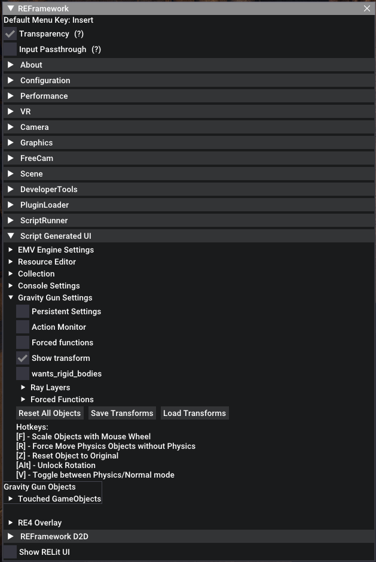

{.shadowed .autosize}

EMV Engine (and the many scripts that come with it) is a large mod made by [alphaZomega](https://github.com/alphazolam) containing many useful features, such as spawning enemies, controlling bones in npcs, and moving objects around, among other things. In this guide, we will focus on the features that can be useful for taking shots, but do be aware that the mod was not made specifically for that and has many, many more features and tools.

As of the time of writing, this guide only covers how to use the Gravity Gun plugin and the Collection plugin for screenshotting purposes. There are, however, more features that can be useful for us:

- Console: It would be very useful for doing stuff on the fly, such as editing engine shadows quality, or perhaps LOD, if the engine allows it.
- Enemy Spawner: Might help with composing scenes with a specific set of enemies.
- GameObject Spawner: Might be useful for composing scenes.
- Enhanced Model Viewer: This should allow us to play out cutscenes and manipulate them as we like. As well as skipping back and forth, besides other stuff.

I would use the [repo's readme](https://github.com/alphazolam/EMV-Engine#readme) as a starting point for expanding the guide with those plugins, but I would accommodate whatever you write to fit our screenshotting needs. Please feel free to upgrade or expand this guide as you see fit.

Also, we will be using Resident Evil 4 Remake as our test subject for this guide.
 
# Installation
----

## Requirements:

* [REFramework](https://github.com/praydog/REFramework-nightly/releases)  
**Features**: Modding Tool for RE Engine Games 
* [EMV Engine](https://github.com/alphazolam/EMV-Engine)  
**Features**: Console, Enemy Spawner, Enhanced Model Viewer, Gravity Gun, RE Engine Resource Editor

[REFramework for Resident Evil 4 Remake](https://github.com/praydog/REFramework-nightly/releases):  
Drop the main folder named `reframework` and the `dinput8.dll` file into your main RE4Remake folder (or whatever game you are installing this on). Installation path usually is `C/Programm Files(x86)/Steam/steamapps/common/RESIDENT EVIL 4  BIOHAZARD RE4`.

[EMV Engine](https://github.com/alphazolam/EMV-Engine):  
It is recommended that you install all Plugins available (Console, Enemy Spawner, Enhanced Model Viewer, Gravity Gun, RE Engine Resource Editor).

- Open the `EMV-Engine-main.zip`, open EMV-Engine-main.

{.shadowed .autosize}

@alert Important!
The following steps have to be repeated for each individual folder inside of EMV-Engine-main. 
@end

- Open up your folder and copy the folder named "reframework" into your main RE4Remake folder (or whatever game you are installing this on). Installation path usually is `C/Programm Files(x86)/Steam/steamapps/common/RESIDENT EVIL 4  BIOHAZARD RE4`.
- **Enemy Spawner** and **Enhanced Model Viewer** also contain a folder named "natives", this one also goes into your main RE4Remake folder, installation path usually is `C/Programm Files(x86)/Steam/steamapps/common/RESIDENT EVIL 4  BIOHAZARD RE4`.
- Start up your Game.
- In the case of Resident Evil 4, an error will pop up, regarding Enhanced Model Viewer currently not being supported. Ignore it and press ok.

REFrameworks Main Window should now pop up in the game, looking like this.

{.shadowed .autosize}

I recommend clicking on the Configuration Tab once and enabling "Remember Menu Open/Closed State", you might as well bind your Menu Hotkey to something you easily remember. In my case "120", which is `F9`.

{.shadowed .autosize}

# Usage

Now, let's get you into the 2 Plugins that have the most use for us. As mentioned the **Enhanced Model Viewer** plugin currently does not work. So we rely on the **Gravity Gun** and the **Collection** plugins.

---

## The Gravity Gun Plugin
**The Gravity Gun plugin lets you grab, move and modify various objects in the game.**

I highly recommend using a Free Camera for the use of it, if you use the integrated REFramework FreeCam or Frans Bouma's IGCS Photomode is up to you. For this guide, I am using Frans Bouma's IGCS Photomode. Having the game paused and hud hidden (by pressing ESC and Delete), will help you a lot if you plan to stage-specific scenes, otherwise, it is not necessary.

Open up your REFramework overlay and click on the "Script Generated UI" Tab and then on the "Gravity Gun Settings" Tab, activate the "Show transform" function and keep the other ones deactivated.

{.shadowed .autosize}

Not everything works tho, here is a simple example:

There is a locked door in front of me which is a shortcut from another path and I would like to skip ahead.

{.shadowed .autosize}

I switch into Free Camera, fly over to the door and aim at it, hold down the middle mouse button and since we have activated the "Show transform" function, now appears small wall of text telling me which object I am trying to grab. In this scenario, it is the door in front of me.

{.shadowed .autosize}

Now I release the middle mouse button and the object is attached to my camera, I am free to move it around and place it in the room ahead of me. I do that by simply pressing the middle mouse button again when I have decided where I want it to be.

@alert Important!
While an object is attached to you, scrolling your mouse wheel will move the object back and forth, if you hold down F and scroll your mouse wheel, you are also able to change the size of it. Objects can be placed anywhere, they clip through everything.
@end

{.shadowed .autosize}

With the door being out of my way, I can just proceed through the opening without any issue. That being said, I recommend you save your game before messing around, moving freely past certain story parts lets you skip events/cutscenes, this might mess up your progress completely.

{.shadowed .autosize}

Now what we just learned can also be applied to any NPC and the player character as well. It follows the same rules, switch into Free Camera, fly over to the target, aim at it, and hold down the middle mouse button. Here again, is a small wall of text telling me what I am looking at. Indicating that it is a character model.

{.shadowed .autosize}

Unlike the door, character models can not be moved through walls and other physical objects.

It is worth to mention, if you have either Ashley or Luis following you around and you decide to move them far away from Leon, they will always try to run back to him. 

That pretty much covers the functionality of the Gravity Gun.

More info on the [repos readme](https://github.com/alphazolam/EMV-Engine#gravity-gun).

### Controls cheat sheet

Feature | Key
--|--
Grab/drop object/NPC | `Middle mouse button`
Move object/NPC | `Scroll mouse wheel`
Change size of object/NPC | `F` + `Scroll mouse wheel`


## The Collection
The Collection is a simple way to search for NPCs nearby, including the player's character. We are particularly interested in two of its features, the *Poser* and the *Action Monitor*, which would allow us to **move (most of) the bones of a character and trigger specific character animations respectively**.

Open up your REFramework overlay and click on the "Script Generated UI" Tab and then on the "Collection" Tab and simply press "Search". 
A bit further down you will now have a list of collected game objects.

{.shadowed .autosize}

The objects listed here can usually be modified in one way or another, you can even attach them to your gravity gun and move them around if you want to. But mainly we use this for posing in and out of cutscenes, without being forced to use the gravity gun and aim at your desired target, since the gravity gun's aim function has issues during cutscenes.

Let's try it out on Leon.
Look at the list of collected game objects, look for "ch0a0z0_body" and click on the small arrow pointing to the right. It will open up more options, first, you will notice there are two checkmarks, one for *update* and one for *enabled*. You can click on enabled once and Leon will disappear, click it again and he is back. This is important to remember for cutscenes if you, for example, would like to hide another NPC in the scene. There is also a button that says "grab", clicking it will attach Leon to the Gravity Gun, we don't need this though.

{.shadowed .autosize}

You may have noticed on the tab here is called *Poser*. **As mentioned above, it allows you to move around most of the bones in a character, letting you create unique poses for them.**
Open it up, you will get a list of bone structures that is specific to this character. 
As it would simply be too much to cover a specific pose for this guide there are still a few things I would like to point out.
Most of the bones can be freely adjusted, and certain NPCs such as Bosses may offer you an even longer list with even more options to adjust their pose.

@alert Important!
I would heavily recommend using the Poser only when the game is paused.
@end

More info on the [repos readme](https://github.com/alphazolam/EMV-Engine#poser).

A bit further down is the *Action Monitor*. **As mentioned before, it allows you to force certain animations.**
If you open it up make sure to activate the "puppet mode", now click on the motion tab (as highlighted in the image below).

{.shadowed .autosize}

Here is another long list of options available to use. As for the Poser, I would recommend you just play around and see what each of these does. For some of them you have to click on the arrow next to it and open up the children tab as well, then select certain actions from there. Beware tho, since some may crash your game.

{.shadowed .autosize}

If you want to adjust additional NPCs that are exclusive for cutscenes, such as Ramon during the castle region of the game, simply click on "search settings", remove the checkmark next to "Must have this Component:" and press search. Now you can look through each individual object available.

{.shadowed .autosize}

Here is a small list of NPCs and their IDs

```
ch0a0z0_body - Leon
ch2a1z0_body - Ashley
ch2a3z0_body - Luis
ch2a200_puppet - Ada
gm84_623_00_0_????.cha700_10 - Trader (shared model with the table)
ch2b8z0_00 - Saddler (Human Form)
ch1f8z0_00 - Saddler (Mutation)
ch1b5z1_00 - Village Chief (Human Form)
ch1f4z1_body - Village Chief (First Mutation)
ch1f5z1_body - Village Chief (Second Mutation)
ch2b600_00 - Ramon (Human Midget Form)
ch1f6z0_00 - Ramon (Mutation)
ch1b7z0_00 - Krauser (Human Form) 
ch1f7z0_body - Krauser (Mutation)
```
*Bosses usually have multiple listings, separated for cutscenes and gameplay.*

More info on the [repos readme](https://github.com/alphazolam/EMV-Engine#action-monitor).
