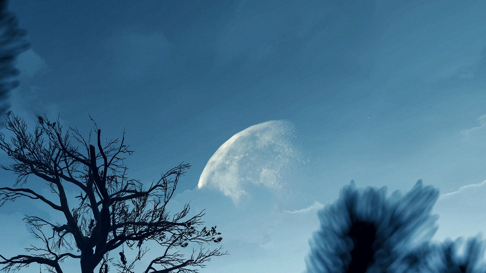
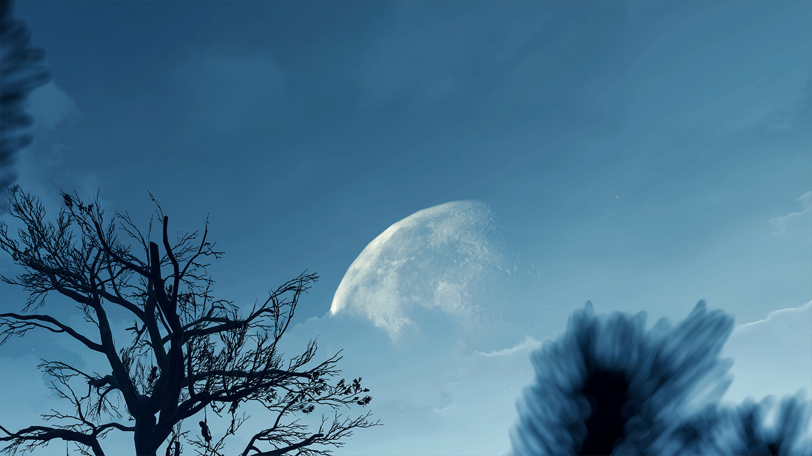
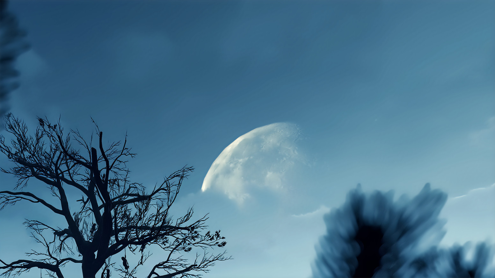
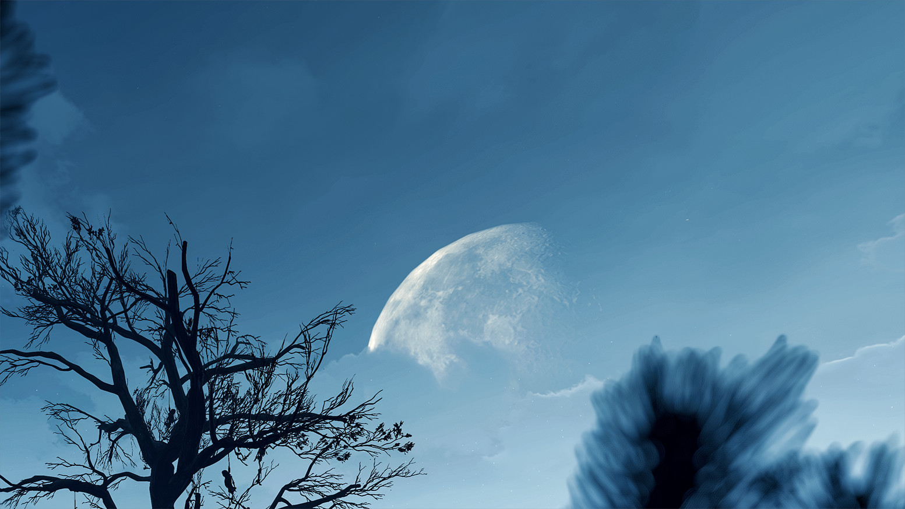
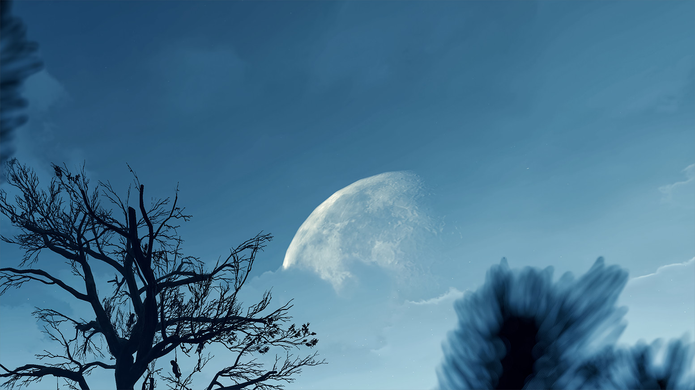

Let’s discuss color banding—why it happens, how to remove it from the sky, subject, or background using useful techniques, and when and why to apply grain, surface blur, and noise. These techniques are simple and not particularly advanced, making them easy to follow and useful for anyone, especially beginners who want to achieve clean screenshots without annoying defects before posting them on social media.

This guide will focus on post-processing after already taking the screenshot rather than in-game with ReShade, and will also cover AI-based methods. It is especially useful for games that don't work well with ReShade, or for those who prefer post-processing offline or encounter crashes in unstable games. If you are interested in [ReShade](../ReshadeGuides/setupreshade.htm) as well, check out the [Deband ReShade Shader](../ReshadeGuides/shaderscatalogue.htm#deband) if you want to try it out which can be helpful for banding as well (especially the ability to apply the effect with the depth buffer, so to only affect the sky with it).

The guide examples below are zoomed [hotsampled](../basics.htm#hotsampling) 20MP shots *cropped* from 21:9/3:4 aspect ratios to inspect closely the sky for banding, or any other defects, and if there are any, this guide will show you how to solve it.

# Banding as our enemy

 Color banding is one of the most disturbing defects that you can find in your image. This phenomenon happens in smooth areas with similar shades, for example, a fading gradient (from light to dark), when the abrupt color change cannot be presented accurately. This results in certain colors appearing as bands rather than smoothly transitioning from one hue to another.

 For banding to occur, it doesn't need to be the image adjustments, but let's say that they are, the more adjustments you make to a screenshot the higher the chances are for banding to occur.
 

Example of banding after applying curves adjustment layer on the gradient. You can see it in the form of straight vertical lines.

So what should appear as a smooth gradient, will instead show straight vertical lines that don't appear to blend well at all. They can appear in different forms of shapes as well.

Not to mention how this case became more evident due to social media websites that apply heavy compression to the images, by further reducing the number of tones available which often results in a mess. 

So let's focus now on how to fix this defect, and how you can deal with this in general. 

Before we dive in, it’s worth mentioning the **ReShade Shader Toggler Add-on**. This tool lets you turn off in-game shaders, helping to eliminate the default vanilla grain and other unwanted effects that could ruin your shot before you even start applying your own edits. If you're interested, head [here](../ReshadeGuides/Addons/shader_toggler_repository.htm) to get to the main release and to see an example of its usage.

@alert neutral
There are simple ways to eliminate the banding on a shot fast in Photoshop and Lightroom, specifically in the sky to begin with.
@end

# Guide Requirements

@alert Important
Since this part of the guide focuses on a post-processing that happens after you are finished with the in-game photo shooting session, you will need to have Adobe Photoshop or Lightroom installed on your computer. You can use the application of your choice as long as you can apply the same techniques
@end
  
# Photoshop

First off, drop your shot into Photoshop and duplicate the background layer by pressing `Ctrl + J` on PC, or by right-clicking the `Background layer > Duplicate layer`. **Its very important** to make sure that you are in 16bit mod by checking `Image menu > Mode`, and make sure that `16Bits/Channel` is selected. Now go to the Filters menu and choose Convert for Smart Filters. This way your duplicated layer becomes a Smart Object and you can work non-destructively. 

Go to `Select menu > Sky` and the AI will make the sky selection for you. You can then use the Quick Selection Tool (W  button) for more precise selection if you are not happy with the result e.g. if AI did not make the selection the way you wanted (don't forget to zoom in while doing the precise manual selection by holding `Alt + Scroll` wheel). 

Then, we want to go to the `Filter menu > Blur > Surface Blur`. With the threshold set to around 19-20 raise the radius slider slowly up to that point until you no longer see the evidence of banding in the small window and press ok. 

@alert Tip
If you see some of the banding defects on the sides or below the sky on the clouds, you can select the main duplicated layer and use the Quick Selection Tool to select that area while the Surface Blur and Noise are applied as Smart Filters. Then, press `Ctrl + J`, and the effect will be applied to the new layer. You can repeat this process as much as you need to fix it quickly. It's pretty straightforward [Before](https://i.imgur.com/XkSzyMq.png) and [After](https://i.imgur.com/BZTvyDN.png)
@end

  

    
AFTER EDIT

    
  

  

    
BEFORE EDIT

    
  

  <input type="range" min="0" max="100" value="50" step="0.01" 
    id="slider" class="slider__input" 
    autocomplete="off" onwheel="this.blur()" 
  />

Example of banding in a sky, and result after the surface blur without blurring out rest of the image such as the moon, and other healthy parts of the sky.

Let's go further now with a different example by adding some noise. So after the surface blur you can now apply some noise to it by going to `Filter menu > Noise > Add Noise`. The percentage of the added noise should be around 2% so you get the idea. Not too much. Leave the options Uniform and Monochromatic checked and go ok.

  

    
AFTER EDIT

    
  

  

    
BEFORE EDIT

    
  

  <input type="range" min="0" max="100" value="50" step="0.01" 
    id="slider" class="slider__input" 
    autocomplete="off" onwheel="this.blur()" 
  />

Sky comparison again, this time with added noise, surface blur with a radius of 10-15, and threshold around 20. No banding.

# Lightroom 

Similarly, you can do this in Lightroom. After importing a screenshot into Lightroom, press `Shift + W` on PC or click on the [circle](https://i.imgur.com/uqktFNI.png) below the histogram to add a mask. Click on 'Select Sky' and Lightroom will automatically select the sky for you. If you're not happy with the AI selection, click on (Subtract from mask with...) while the mask is selected, and choose a brush. To avoid confusion, 'Subtract' is sometimes only shown as a minus sign because your Masks window might be smaller. If that's the case, you can enlarge it by clicking the [arrows](https://i.imgur.com/NZTCyBS.png) at the top-right of the Masks window. Use the brush to remove the effect from areas where you don't want the blur to be applied. Be sure to adjust the brush settings to smooth out the transitions.
@alert Tip
Hold `Space + Left Click` on the image to zoom in and out. If you want to zoom higher go to [navigator](https://i.imgur.com/y2uh0R0.png) and pick a percentage, or hold Ctrl +/- (plus/minus) on a PC to go through all existing magnification levels (hitting the Z button takes you to the previously used zoom level, and by hitting Z a second time, it brings you back to the original zoom state). Control the size of the brush with the mouse wheel.
@end

Once done, you can reduce the sharpness, texture, and a bit of clarity of sky, and then add a bit of grain. Just be careful to control the other settings as well if you decide to reduce the clarity. **Reducing the clarity too much** tends to create unexpected brightness because you are removing some of the contrast, and it's quite noticeable. However, you should be mostly fine by just tweaking the texture.

  

    
AFTER EDIT

    
  

  

    
BEFORE EDIT

    
  

  <input type="range" min="0" max="100" value="50" step="0.01" 
    id="slider" class="slider__input" 
    autocomplete="off" onwheel="this.blur()" 
  />

A comparison of sky, but this time edits are applied in Lightroom with minus texture and added grain around 15 to eliminate the banding.

  

    
AFTER MINUS TEXTURE

    
  

  

    
BEFORE MINUS TEXTURE

    
  

  <input type="range" min="0" max="100" value="50" step="0.01" 
    id="slider" class="slider__input" 
    autocomplete="off" onwheel="this.blur()" 
  />

Also we can see here that adding only grain didn't help to eliminate the banding entirely, so minus texture did the trick.

It's worth mentioning that in general, adding noise or grain to the entire image in the end could benefit the overall look, unless you want to mask certain areas with it to add more details.

@alert Info
Just keep in mind that surface blur cannot fix all types of banding, so we'll need to add noise or grain on top of it. It's best to combine both techniques anyway
@end

# Different cases

If the color banding occurs due to some lighting around the subject, we repeat the same process as above for [Photoshop](../GeneralGuides/simple_techniques_to_fix_color_banding.htm#photoshop), just skip the part where you need to select the sky. 

Apply the surface blur and noise on the duplicated layer as mentioned above, and then click back on the background layer, and then we wanna go to `Select menu > Subject`. You can use the Quick Selection Tool (W button) if needed for more precise selection. Go back to the layer where you applied surface blur and noise, and click on the little icon at the bottom that looks like a camera called layer [mask](https://i.imgur.com/56e7Zis.png). Now after creating a layer mask, click on it, and press `Ctrl + I` to invert that mask. 

Your layers should look like this:

{.shadowed .autosize}

What this will do is isolate the subject from the effect. Lastly, grab the Brush by pressing B on your keyboard or by selecting it from the [left](https://i.imgur.com/sJWYYJ1.png) (make sure it’s a [black brush](https://i.imgur.com/YOhDeUQ.png) with 100% opacity and 100% flow, which it should be by default), and paint around the areas where you don’t want effects to be applied, essentially leaving the healthy areas of the image untouched by the surface blur and noise. If it’s the subject only that you want to isolate, you don’t have to use the brush; you can leave it. You can also play with the opacity of the brush and flow to smooth out the transitions.

Here you can see an example of how everything is set. In the banding area, there is noise, and surface blur applied to fight the banding while other areas are untouched by the effects.

The same goes for [Lightroom](how_to_fix_color_banding.htm#lightroom), just instead of sky select the background, and repeat the same steps as above with Subtract to Mask, and use brushes to smooth out transitions and play with its settings.

To break this down for Lightroom. 

1. [Example](https://i.imgur.com/YzWh5Cv.png) when Lightroom selected entire background. 
2. [Example](https://i.imgur.com/b9gOcZ0.png) of Subtract to Mask with a Brush to clean the areas so you are left with a clean background selected only.
3. [Example](https://i.imgur.com/vVFDAxu.png) of a brush again to remove the background selection to focus only on the color banding area. 
4. Now you can apply the same edits as mentioned above to remove the banding.
___
If the banding occurs due to some lighting that bleeds out behind the subject, you can use the Quick Selection Tool in Photoshop to select the banding area. 

The selection example in Photoshop should look like this: 

{.shadowed .autosize}

Apply edits as mentioned above to remove the banding and they will only cover the selected area.

In Lightroom, go to Masking (`Shift+W`) and select a Subject so the AI makes the selection for you. If there are two subjects and banding covers only one, then what you do is Subtract to Mask with a Brush to remove the selection from the other subject.

The final selection example after doing the Subtract to Mask with a Brush in Lightroom looks like this:

{.shadowed .autosize}

Apply edits as mentioned above to remove the banding and they will only cover the selected area.

Smoothing out the banding that comes from the lighting which bleeds out behind.

# Using grain, noise and blur to solve color banding

@alert neutral
Applying grain to a shot comes down to a personal choice. It is entirely your own individual preference, though it's highly recommended. Adding noise or grain can significantly improve your images.
@end

One of the main fighters against color banding is the grain. As seen above, a bit of grain can help to blend those harsh transitions between the tones. Grain not only can help to eliminate the color banding it can also add a unique special feel and mood to an entire shot, or it can even determine your style. A touch of grain on your shot can add that old-time feel by adding a vintage look to a shot, it can add more details, and it can make a photo look much deeper.

If you decide to not apply grain when you do processing with ReShade because you like to do it afterward that's fine. Simply put, you want to have the cleanest image possible for various tweaks such as color adjustments, etc. that you do in Lightroom. You don't want to deal with a noisy image in the post unless you are already satisfied with the shot result which has grain on it that was applied from ReShade. A small tip anyway would be to always inspect a shot before moving on.

This is not intended to advise you on what to do, because grain is a subjective thing, and its usage depends on what you're aiming for with your content, but it's about how grain can help you against the banding, and how it can improve your shots in general. 

The same can be said for the noise and the surface blur. For example, if the image that contains a paper and a pencil looks too smooth it might appear artificial to our eyes, but adding a bit of noise, it will look sharper, and *natural* to our eyes.

If you need more *convincing*, no worries! Let's bring up now the final comparison on grain, noise, and surface blur, and why would you need to use them in the fight against banding.

Notice the difference in gradients below:

Top: banding example; Middle: 0.58% of added noise to reduce the banding; Bottom: how it looks with surface blur applied only

# ESRGAN and debanding models

Besides the techniques explained until this point, one could also use "upscaling" models whose output resolution is the same (x1 models) but focus on fixing banding. Results may vary depending on the model and the shot, so be sure to experiment a bit by using and mixing different models. You may end up being able to fix very aggressive banding that is impossible to do on Lightroom without a manual editing.

## chaiNNer

There are many programs that can do this upscaling task, but only two of them will be mentioned in this guide. One of them is chaiNNer, because it's actively maintained by the people from openmodeldb, and it's really not that difficult to set up. It gives you much more control over how you process your photos, but at the expense of being a little more complicated.

You can find the release [here](https://github.com/chaiNNer-org/chaiNNer/releases)

### Installing dependencies

Once you are done with the chaiNNer installation, we need to install the required dependencies. This can be done by going to the top right of the chaiNNer window and selecting the download icon (manage dependencies) to install the PyTorch, NCNN, and ONNX packages that are mandatory to perform the tasks inside chaiNNer. 

Alternatively, if the PyTorch download times out, it means something is wrong with the connection to the pip servers, possibly due to an internet connection issue. In this case, you can manually download PyTorch from [here](https://download.pytorch.org/whl/torch/) to have it on your computer. 

You want to look for the one that chaiNNer recommends due to the integrated Python, which can be seen when you click on the PyTorch (6 packages) dropdown menu. The recommended version right now is 2.1.2+cu121, so the one you need to find/download is `torch-2.1.2+cu121-cp311-cp311-win_amd64.whl`. **CP311** correlates to a Python version, and the one that chaiNNer is currently using is version 3.11. This might change in the future, but the process stays the same. The download size is around two gigabytes. 
 
Open CMD (C:\Users\YOUR-PC-NAME->) and paste this command `%appdata%\chaiNNer\python\python\python.exe -m pip install`. Now drag and drop the `torch.wml` file that you downloaded into CMD and the path will be created. Simply press ENTER and wait for process to finish. If everything goes well you will get the message **Successfully installed torch-2.1.2+cu121**. After that restart chaiNNer and go back to dependencies window to install the rest of PyTorch packages which are around 3 megabytes only. Torch is the biggest file of all.

### Downloading debanding models

All the debanding models can be find [here](https://openmodeldb.info/?t=debanding). Test only x1 models because we don't want to upscale our image x2 or above.

### Setting up the nodes

chaiNNer has a node system similar to those found in software like Blender or Unreal Engine. Essentially, we need to connect the nodes and run the task.
Luckily, in chaiNNer, all we have to do is connect the nodes and run the task.

On the left side of the window, there are nodes. Drag and drop them into the working window. The ones you'll need are Load Image, Load Model, Upscale Image, Save Image, and View Image (External). View Image (External) is optional and only necessary if you want to see the image right away (after the task completes the upscaling, a window will pop up so you can inspect the image).

On the nodes, you'll see "Click to select a file/directory," etc. In the Load Image node, you load the image you want to upscale, in the Load Model node, you load a model you downloaded, and so on.

Your chaiNNer setup should look like this:

{.shadowed .autosize}

### Models example

The same image example from the first part of the guide was used. You can see results from all the models:

  

    
AFTER UPSCALE

    
  

  

    
BEFORE UPSCALE

    
  

  <input type="range" min="0" max="100" value="50" step="0.01" 
    id="slider" class="slider__input" 
    autocomplete="off" onwheel="this.blur()" 
  />

Bandage-Smooth-[64] model was used here

  

    
AFTER UPSCALE

    
  

  

    
BEFORE UPSCALE

    
  

  <input type="range" min="0" max="100" value="50" step="0.01" 
    id="slider" class="slider__input" 
    autocomplete="off" onwheel="this.blur()" 
  />

Debandurh-FS-Ultra-lite model was used here

  

    
AFTER UPSCALE

    
  

  

    
BEFORE UPSCALE

    
  

  <input type="range" min="0" max="100" value="50" step="0.01" 
    id="slider" class="slider__input" 
    autocomplete="off" onwheel="this.blur()" 
  />

ITF_SkinDiffDDS was used here

  

    
AFTER UPSCALE

    
  

  

    
BEFORE UPSCALE

    
  

  <input type="range" min="0" max="100" value="50" step="0.01" 
    id="slider" class="slider__input" 
    autocomplete="off" onwheel="this.blur()" 
  />

N64clean was used here

It appears that N64clean performs best in this specific case, removing the banding while preserving most of the cloud edges.

___
There are other fantastic AI upscale programs such as [Upscayl](https://www.upscayl.org/), but as mentioned by openmodeldb, it can work only with models that come with it. 

You can also use non-maintained programs such as Cupscale, particularly if you don't need the ChaiNNer features and want faster results. It's arguably the simplest method for improving the image. 

## Cupscale

You can find it here: [Original GitHub](https://github.com/n00mkrad/cupscale) | [Recommended Fork](https://github.com/DrPleaseRespect/cupscale) | [Alternative Fork](https://github.com/RaaynML/cupscale_continued)

Once you get Cupscale (recommended fork in this case), extract the files wherever you want them on your hard drive.
Follow the GitHub instructions on how to install the update and apply it. If you encounter any issues while using this fork, try using an alternative fork or the original one.

Unlike ChaiNNer, Cupscale comes with a simple interface and no nodes. Go to the folder where your Cupscale is located, search for Cupscale.exe, and run it. After you run it, you will clearly see where to drop the image.

Once you do that, on the left side at the top, select ESRGAN (Pytorch) (it should be selected already by default).

Below it, under model options, select Single Model. Once you **click to change Model 1**, you will get the models window. At the bottom, you will have **Open Models Folder**. Click on that and enter the ESRGAN folder.

Now, find the deband models on your computer, copy them, and then paste them into that folder. Once done, reopen the window, and the deband models will be available for you to choose.

In the bottom right of the Cupscale window, hit **Upscale and Save**. Done.

___
*Written by* StephenCalic(Defaltsiuncula)

*Last Updated: December 22nd, 2024*
