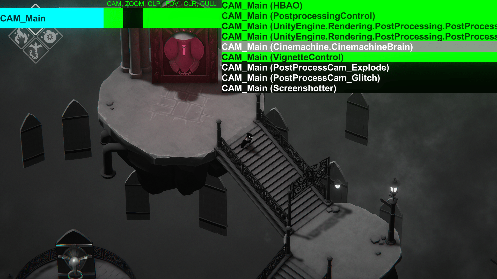
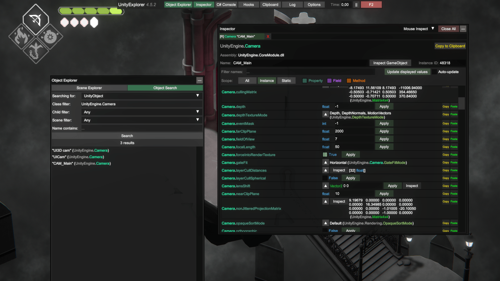
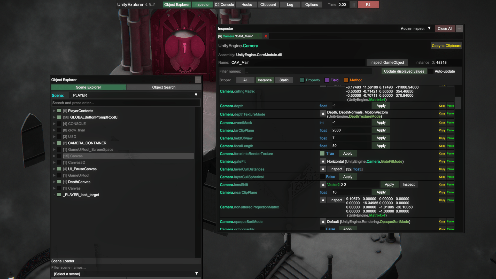

How to install and use the Universal Unity Freecam
=========

**Update:** VTVRVXIV made a new video explaining how to use the `Unity Explorer` alongside the [FreeMoveInjector mod](https://github.com/vtvrv/FreeMoveInjector/releases) to get a freecam. It is supposed to be easier to use than his Universal Unity Freecam, so watch the video and follow it until we can write about it in this guide. Otherwise, follow the rest of the guide and use the Universal Unity Freecam.

---

 
The [Universal Unity Freecam](https://youtu.be/I6igj-u1qlk) (UUF) project by [VTVRVXIV](https://twitter.com/vtvrvxiv) adds a freecam to most Unity games. It's a plugin designed to be installed using Unity plugin loaders like MelonLoader and BepInEx, and works in both Unity backends: Mono and IL2CPP.
 
*If you're curious, [this article](https://learn.unity.com/tutorial/memory-management-in-unity#5c7f8528edbc2a002053b59b) covers the difference between the two types. Basically a difference in scripting.*

# Installation
 
Before installing you would want to check if your game is Mono or IL2CPP.
Somewhere in the installation directory, Mono has a folder called `Managed`. While IL2CPP has `l2cpp_data`.
 
If the game is on steam you can check the file structure before downloading by going to the [SteamDB](https://steamdb.info) page of the game, `Depots` section, and from the table in there click the ID number on the games depot (usually the one with the bigger file size).
 
Once you identified the type of unity backend the game uses, go to the video linked above, download the file according to the backend type from the links in the video description and follow the section of the corresponding type. 

## Installation - Mono: BepInEx

### Needed Plugins

- [BepInEx plugins for Mono games](https://mega.nz/file/OcZ0WTxY#zw3M3ShhqBQAjVwt-xgGElIfbWlEH6k1LSoor5115Zg)

- [No watermark freecam plugin for Mono games](https://mega.nz/file/7dgkSQoR#7wIHoh3QXq6DwRLCQS6BE4vpb4ji9IxdpN984liahXA)

 
[BepInEx](https://github.com/BepInEx/BepInEx) doesn't come with an installer and you will need to check what version you need to install. This process is for Unity Mono games.
 
* Launch the game and use the Task Manager to check if your game is 32-bit or 64-bit (if it is 32-bit it will have "32 bit" next to the program name).  
{.shadowed .autosize}
 
* Close the game. If it's 32-bit, copy the content from BepInEx_x86.zip into the game's installation folder (specifically in the same folder as the games .exe), or the content from BepInEx_x64.zip if it's 64-bit.
* Start the game again.
 
    @alert important
    **Your game may crash at startup** here, but that's OK. You'll be closing it again anyway.
    @end
 
* Close the game and look inside the `BepInEx` folder. You should see that new folders were created.  
* Open `LogOutput.log` and check for a line that gives you the Unity version of the game, like
`[Info   :   BepInEx] Running under Unity v2019.1.10.15730669`  
* Note down the version, then open the config folder and edit the `BepInEx.cfg` file.  
* In the `[Preloader.Entrypoint]` section change `Type` to what their corresponding Unity version pints out in the table below:  
 
    Version | Change to
    -- | --
    Unity 2017 and above | `Type = MonoBehaviour`
    Unity 5 | `Type = MonoBehaviour`   or   `Type = Camera`
    Unity 4 | `Type = MonoBehaviour`

    If you are having problems with this please visit the [bepenix troubleshooting page](https://docs.bepinex.dev/master/articles/user_guide/troubleshooting.html).
 
    @alert important
    For Unity 4 games, `System.dll` and `System.Core.dll` must be present in `<Game Name>_Data/ Managed`. If not, you will have to download an old Unity 5 build as a middle ground and export the 2 files from the Unity Editor.
    @end
    @alert info
    While you are editing the `BepInEx.cfg` file you can also enable console logging under `    [Logging.Console]` by changing `Enabled` to `true`.
    @end
 
* Start the game and confirm it's not crashing or hanging. If it is, you might need to redo the BepInEx process above. Close the game again.  
 
 
* Install the plugins you want by copying them into the `BepInEx\plugins` folder.  
 
    - **vtrvrxiv.freecamplugin.dll**
        - The freecam compatibility section is very important. Many games require fiddling with the mouse hacksection for these inputs to be detected.
        - There is a special section that defines hotkeys for moving the on screen camera menu with the arrow keys. This is a last resort for games that completely prevent mouse movement. You would need to use the arrow keys to move the feature you want to toggle to the center of the screen and then mouse click on it.
 
    - **vtrvrxiv.CursorMode.dll / vtrvrxiv.CursorMode_obsolete.dll**
        - Provides options for making the mouse cursor visible and unlocking it. Some games lock the cursor to the center of the screen which prevents it from interacting with the camera menu.
        - The plugin is not recommended for general use and should only be used if you experience the issue mentioned above.
 
    - **vtrvrxiv.TimeScaleController.dll**
        - Can slow down or speed up game time.
        - Depending on the game can cause extreme frame rate issues.
 
    - **vtrvrxiv.ScreenshotTool.dll / vtrvrxiv.ScreenshotTool_obsolete.dll**
        - Can take screenshots at resolutions up to 16x the current resolution.
        - Generally if the gameData/Managed folder contains a "UnityEngine.ScreenCaptureModule.dll" file use the normal version of the plugin, otherwise try using the "_obsolete" version of the plugin.
        - Screenshots will be saved in the game's "GameName_Data" folder located in the same folder as the exe.
        - Be aware that high resolutions might break some game elements, like postprocessing effects.
        - Keep in mind that postprocessing effects like ReShade won't be shown in shots taken with this plugin. Do however take in mind that almost all unity games can be hotsampled to custom aspect ratios, so you can hotsample the game instead of using this plugin, especially if you want to use reshade in your shots.
       
    - **vtrvrxiv.sceneselect.dll**
        - Loads Unity game scenes found in the scene manager. Scenes usually aren't meant to load this way so it's common for problems to occur.
        - Will likely cause crashes on older games released before the scene management was implemented in Unity.
 
    - [**Configuration manager**](https://github.com/BepInEx/BepInEx.ConfigurationManager/releases)
        - Optional but useful plugin for configuring other plugins' hotkeys and options without restarting the game. The menu to do so can be opened by pressing `F1`.
        - As explained below, if you run into troubles like a black screen at startup try deleting this plugin from the plugins folder.
    
    - [**EnableIsDebugBuild.Mono**](https://github.com/vtvrv/EnableIsDebugBuild/releases)
        - Tries to turn on debug build capabilities in the game. These can be useful to get a freecam working but they probably contain other dev options that can come in handy for screenshotting.
 
    If there are multiple versions of a plugin only use one at a time. The `_obsolete` plugins are for games running on older versions of Unity.
 
    @alert info
    It is possible for any plugin to cause game crashes so it is best to test them one at a time.
    @end
 
* Start the game and confirm that the camera is installed by pressing `Backspace`.  
 
#### Configuring the plugin
 
Each DLL installed has its own CFG file that can be found in `BepInEx/Config`, allowing you to change the hotkeys to your own needs. Alternatively, you can use the `Configuration Manager` plugin to configure plugins in real time.
 
## Installation - IL2CPP: MelonLoader

### Needed Plugins

- [MelonLoader freecam plugin for IL2CPP games](https://mega.nz/file/nZAxEaiI#hOw484JaufTzP5ukX5HKTGttSEWn14wM4QpZChrz6Mk)
 
Unfortunately at the time of writing the IL2CPP version of the freecam is limited compared to its mono counterpart (for example, it doesn't have FoV control). You might be able to find alternatives for these missing features with the Unity Explorer, more on that later.
 
[MelonLoader](https://melonwiki.xyz/#/) comes with an installer to make the installation process quicker and easier. This covers installing the UUF into Unity IL2CPP games.
 
* Launch `MelonLoader.Installer.exe` and select your game's EXE  
{.shadowed .autosize}
 
* Click on INSTALL (or RE-INSTALL if you are upgrading from a previous version)  
* A success popup should appear if the installation has been successful.  
* Upon launching the game, a new window with a console will open on your screen. A process called the unhollowing will start. Wait until MelonLoader is done unhollowing. **This process requires an internet connection.**  
{.shadowed .autosize}  
 
* Close your game and go to your game's installation folder.  
 
* If `MelonLoader/Managed` has `UnityEngine.InputLegacyModule.dll`, copy over `MelonLoader_Freecam_LegacyInput.dll` into the new `mods` folder created by MelonLoader. Otherwise, copy over `MelonLoader_Freecam.dll`.
{.shadowed .autosize}  
 
 
* Start the game and the freecam should be successfully loaded in!  
{.shadowed .autosize}  
 
 **Extra**: As with mono games, you can try the [**EnableIsDebugBuild.IL2CPP**](https://github.com/vtvrv/EnableIsDebugBuild/releases) plugin.
 
## Mono Default Camera Controls
 
Keybind | Description
-- | --
`Backspace` |Open / Close the camera menu
`Z` | Rest camera to default (hold when clicking on camera)
`i` | Move camera forward
`k` | Move camera backward
`j` | Move camera left
`l` | Move camera right
`o` | Move camera up
`u` | Move camera down
`NumPad 8` | Rotate camera forward
`NumPad 2` | Rotate camera backward
`NumPad 4` | Rotate camera left
`NumPad 6` | Rotate camera right
`NumPad 9` | Rotate camera up
`NumPad 7` | Rotate camera down
`Left Control` | Slow down the camera movement
`Left Shift` | Speed up the camera movement
 
@alert important
When in the camera menu, and before activating the free camera, it's important to disable the Cinemachine one! Without that, you won't be able to use the freecam.
@end
 
As an extra, if you install the `vtrvrxiv.TimeScaleController.dll` plugin, the default hotkey for pausing would be the `Pause` key, above the `Page up` key. Alternatively, you can also pause in the Configuration Menu if you have that plugin installed or pause it with a Unity inspector plugin, more on that in the [HUD toggle and more](universal_unity_freecam.htm#hud-toggle-and-more) section.
 
 
## IL2CPP Default Camera Controls
 
Keybind | Description
-- | --
`F9` | Open / Close the camera menu
`F10` | Open the Mono camera behaviour (press and hold F10 while clicking on a camera)
`i` | Move camera forward
`k` | Move camera backward
`j` | Move camera left
`l` | Move camera right
`o` | Move camera up
`u` | Move camera down
`F11` | Decrease camera movement speed by a factor of 2
`F12` | Decrease camera movement speed by a factor of 2
 
@alert important
When in the camera menu, and before activating the free camera, it's important to disable the Cinemachine one! Without that, you won't be able to use the freecam.
@end
 
### Configuration
MelonLoader generates a `UserData\MelonPreferences.cfg` file where configuration can be changed.
Supports keybinds, mouse axis inverting, and specify when mouse look on the freecam is activated.
   
When changing keybinds look at the `keycodes.txt` file in the freecam .zip for a list of working key strings. Case sensitive.
   
By default, mouseLookEnabler is set to `Always` so mouse look is always on when the freecam is enabled. This can be changed to look on when a mouse button is held by changing the setting to `Left`, `Right`, or `Middle`. Case sensitive.
   
These settings must be changed manually with a text editor. The game must be relaunched after the cfg file is edited.
 
 
 
## HUD toggle and more
 
The UUF does not come with a way to hide HUDs. The best way is through a Unity inspector like [Unity Explorer](https://github.com/sinai-dev/UnityExplorer) (Mono/IL2CPP) or [Runtime Unity Editor](https://github.com/ManlyMarco/RuntimeUnityEditor) (Mono). We recommend the `Unity explorer` over the `Runtime Unity Editor` because it's "easier" to use.
 
Besides being able to toggle HUDs these inspectors would allow you to modify a lot of the game objects' properties, like moving the position of light sources, turning off postprocessing effects, or hiding characters entirely. You may also find the camera in some cases, which is useful when FoV control (or the whole freecamera) isn't supported. This will be expanded in the Advanced section in the future.
 
These unity inspectors also come with a button to change the game's velocity, like the mono plugin explained in the `Mono: BepInEx` section, so it's very handy for IL2CPP games.
 
## Additional tips
 
* Most unity games (if not almost all of them) let you [**hotsample**](https://framedsc.github.io/basics.htm#hotsampling), and even let you use custom ARs.
 
* It's generally recommended to disable any overlays you have as they may conflict with the keybinds above.
 
* The console may not appear when you start the game for the first time. Check the game's installation folder for a file named `version.dll`. Rename it to `winhttp.dll`, or vice versa, depending on the situation.
 
* If the game is using a DRM like steam make sure you are launching said game through steam and not opening the .exe. Some games won't start otherwise and this error might be confused with a problem created while trying to install the tools explained in this guide.
 
* When using the camera menu to select the right camera make sure to include all the items referring to postprocessing effects to make sure those are being shown when moving the camera around.
 
## Troubleshooting
 
* If the cursor is still locked and/or missing after using the `vtrvrxiv.CursorMode.dll` (or `vtrvrxiv.CursorMode_obsolete.dll`) plugin then your last resort is to open the `GAME_Data\Managed\Assembly-CSharp.dll` file with DNSPY and delete all the lines of code that refer to the cursor. In most games you want to look for lines that have `Cursor.lockState` and `Cursor.visible`, and if the game is old you could try looking for the lines that have `Screen.showCursor` and `Screen.lockCursor` on them.
 
* If you can point the camera upwards, try rotating it 90° and then changing its orientation "to a side" to make it point upwards.
 
## Advanced
 
* Is it right that it's "technically possible" in some IL2CPP games to find and control the fov with a unity inspector? If not then we should delete what I wrote in the "HUD toggle and more" section.
 
* [RuntimeGraphicsSettings](https://github.com/knah/ML-UniversalMods#runtimegraphicssettings): Could be useful for increasing graphic fidelity in some games.

# Usage

In this part of the guide, we will be using Death Door as a baseline to explain the workflow on how to use both the Universal Unity Freecam and the Unity Explorer to shoot games. We will try to expand and generalize the steps in the future. Take in mind that Death Door is a `Mono` game, so the process might (will) be different for `IL2CPP` games.

## Unlocking the camera

When you want to get the camera press the backspace key to open the Universal Unity Freecam menu. There you will want to click on the light blue box to display a list of unity objects. Here you will need to disable any object that controls the camera of the game so we can control it ourselves. In this case, we will be disabling the Cinemachine.Brain object.

Additional note: You can also disable other unity objects here if you like, to turn off an undesired postprocessing effect for example.

{.shadowed .autosize}  

After doing so click on the light blue box again to hide the objects list and activate each of the boxes (except maybe the FOV one). After doing that we will have full control of the camera!

When you are done using the freecam activate the unity object you disabled and uncheck the boxes to make sure the game doesn't run into weird behaviors later while playing.

## Changing the FOV

Sadly changing the FOV is not as straightforward as unlocking the camera. You will need to first find the camera that the game uses in the object explorer. To do so we will open the unity explorer with F2, click on the first tab that says "Object Explorer", and click the "Object Explorer" tab in the new window that spawned. Here you will search for objects of the class "UnityEngine.Camera". After picking the first one open it by clicking on them. This will open a new window with a bunch of values. Scroll down in this new window to find the FOV. Usually, there are two values, one for far and one for near FOV. You will want to edit the near FOV value to the FOV value you want to use, and that's it!

{.shadowed .autosize}  

If you don't find a FOV value pick another object of class "UnityEngine.Camera" and try again (in the case of Death Door said object is the one called "Cam_Main").

After you are done shooting you won't need to return to the original FOV; activating again the camera object you disabled in the first step (in our case Cinemachine.Brain) will take care of changing the FOV back to the gameplay one.

### Additional notes: 

- Make sure to disable the "Cinemachine.Brain" object (or the equivalent in your game) before attempting to edit the FOV. Otherwise, it probably won't work.

- The unity explorer interface doesn't behave well with vertical aspect ratios, for example, so if you are working on a composition and would need to change the FOV while you move the camera I recommend using the AspectRatioComposition shader in reshade to get a glimpse of what the composition would look like in that AR when you change definitions.

## Pause

The pause is pretty straightforward, you just need to press the `Pause` button on your keyboard, you don't need to look up anything. The key is near the print screen key, but it's possible it isn't on some keyboards. If that's the case open the configuration manager with `F1` and change the key.

Alternatively, you can also pause by clicking on the top right button on the Unity Explorer UI, but it's not very advisable since it might prove difficult to get the pause at the right time in certain situations.

## HUD toggle

This will depend very much on the game and you will need to turn off objects in the scene explorer until you find the HUD. In the case of Death Door, the HUD is in the "Canvas" object, so disabling that will get off the HUD.

{.shadowed .autosize}  

If you can't find the right hud toggle in the Scene Explorer, go at the bottom of the window and change the scene you are inspecting to another until you find it eventually.

## Vignette, lights, and other stuff.

Given that we are basically obtaining access to most (every?) unity object in the scene/game, we can then use that to our advantage to modify the game and scene as we please. For example, in Death Door, one can edit the Vignette object (which is found inside the CAM_MAIN object) properties to disable it (it's not enough to turn the object off in this case).

Depending on the game, one can disable chromatic aberration, hide enemies on screen or even have access to light positions, so if used correctly can prove to be a very useful tool. Just be careful when playing around with it to not break anything that might crash the game, if you can't afford to lose the composition or game progress.

## Tips and tricks:

Unity explorer doesn't block input from the game when interacting with its menu, so I recommend first pausing the game before attempting to unlock the camera or doing something else. I also recommend using the mouse to do stuff whenever possible. For example, in Death Door, when searching for the "cam_main" in the object explorer, if you press enter instead of clicking on the "search" button a game menu will pop up, and pressing enter again will close the menu and unpause the game, so be careful.
A specific tip for Death Door: After you finish the composition and are ready to take the shot press any of the d-pad buttons on a controller to hide the mouse thing that shows up when aiming with a mouse.
Please don't hesitate on expanding this guide to generalize the steps or include more specific info on how to shoot a game in the table below.

 
## More links

- [PCGamingWiki Unity page](https://www.pcgamingwiki.com/wiki/Engine:Unity) 
- [BepInEx Documentation](https://docs.bepinex.dev/master/articles/user_guide/installation/index.html) - Extensive installation, configuration and troubleshooting site
- [MelonLoader Documentation](https://melonwiki.xyz/#/README) - Info about installation, configuration and more
