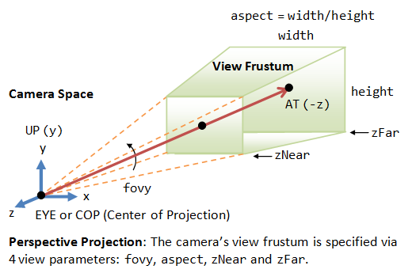
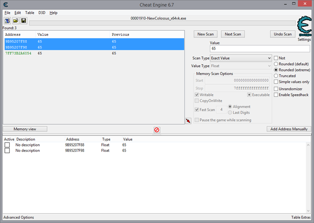
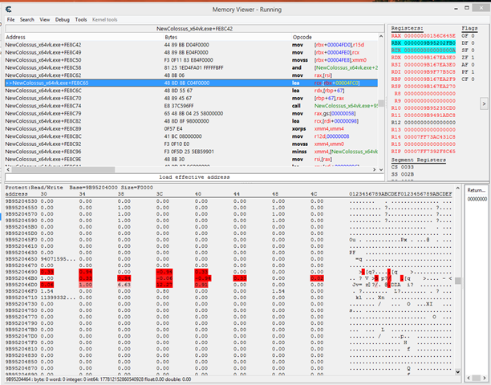
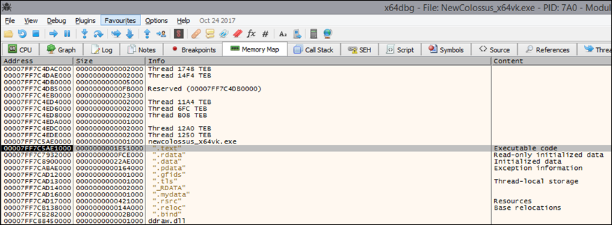
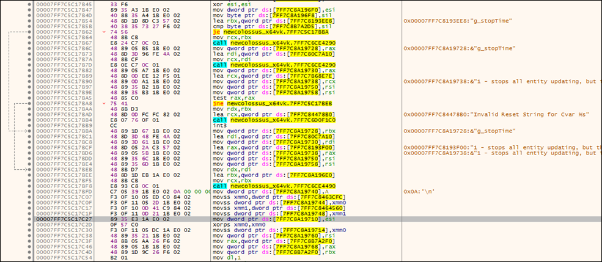
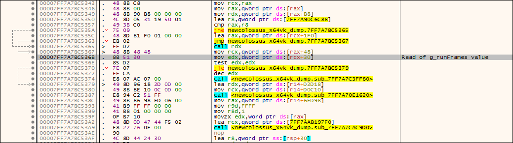
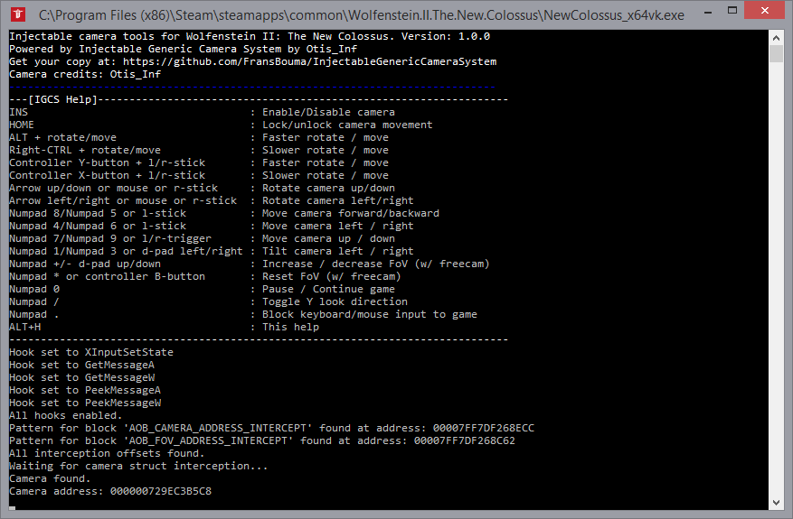
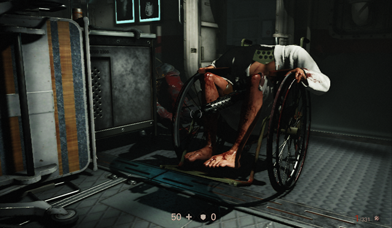

# Let's add a photo mode to Wolfenstein II: The New Colossus (PC)

Written by [Frans 'Otis_Inf' Bouma](https://fransbouma.com). First published on Frans' blog (which no longer exists) on February 16, 2018.

Table of Contents
-----------------

*   [Introduction](#Introduction)
*   [Getting started, the tools we need](#Gettingstarted)
*   [What information do we need?](#Whatinformation)
    *   [The camera](#Thecamera)
    *   [Game pause](#Gamepaused)
    *   [Hide HUD and other on-screen cruft](#Hidehudand)
    *   [To recap...](#Torecap)
*   [Setting things up](#Settingthings)
*   [Memory allocation in windows processes](#Memoryallocation)
*   [Finding the FoV](#FindingFov)
*   [Finding the camera](#FindingCamera)
*   [Hide HUD using the g\_showhud variable](#Hidehudusing)
*   [Game pause / Timestop](#Gamepause)
    *   [Reverse engineering and what it is all about](#Reverseengineering)
    *   [Doom to the rescue](#Doom)
    *   ["Dude, this is just plain luck"](#Dude)
*   [What else is there to find?](#Whatelse)
*   [Creating the camera tools](#Creatingthe)
    *   [Configuring IGCS to hook into the .exe](#ConfiguringIGCS)
        *   [(Raw)Input hooks](#Rawinput)
        *   [Game exe hooks](#Gameexe)
    *   [Setting up IGCS to write its camera data](#SettingupIGCS)
    *   [IGCS' mainloop](#IGCSmainloop)
    *   [Testing the camera tools](#Testingthe)
    *   [Determining hard-coded addresses directly from the exe's bytes](#Determininghard)
    *   [Compiling and testing the release build](#Compilingand)
*   [Conclusion](#Conclusion)

Introduction
------------

I have a weird hobby: I like to take [screenshots in games](https://fransbouma.com/in-game/). Some call this activity game photography, and in a sense this is a bit like photography: composition, light, the things you have to deal with when taking photos in real life, are concepts you work with here as well. For photography you need a camera, and games in general present you with one, but there's a problem: you aren't going to be able to move and handle the camera however you please: it's likely tied to the main character, there's all kinds of info on the screen (Head Up Display or 'HUD') and the lens characteristics used are likely very wide (meaning: high Field of View (FoV) and low focal length).

To solve this, we need to alter the game so we can move and change the game's camera however we want, but how to do that? It's not as if games in general offer options for that. In this article I hope to explain a bit how to create a DLL we're going to inject into the game's process to take over the camera and control other game aspects for the purpose of taking screenshots. For my screenshotting hobby I needed ways to control the cameras in the games I played and so I started another hobby: [creating camera tools](https://github.com/FransBouma/InjectableGenericCameraSystem) so one can take proper screenshots in games without limits. I do that using my own system, which you can find at the link, which is open source software (C++ with a little bit of x64 assembler).

Sometimes a game offers a _photo-mode_ which gives you control of the camera at times and lets you take screenshots within a given bounding box in the game. These are great if there's nothing available, but in general they're pretty limiting and the game we're going to work with in this article doesn't offer one so in cases where the photo-mode is pretty limited or non-existing, we have to add one ourselves.

This all works only on PC, not consoles. On consoles, you have to work with the photo-modes the developer offers you. In case you're wondering whether it's legal: strictly speaking reverse engineering is allowed (Compaq vs IBM). Additionally we're not changing game code on disk, but strictly in-memory at runtime. We're not adding cheats at all, even though some of the tools we're going to use are designed for these. But it's a grey area, and to avoid getting banned online, I have the strict policy not to create camera tools for online only games, but only for off-line single-player games.

The game we're going to work with is the **demo version** of Wolfenstein 2: The New Colossus on PC. [You can download it on Steam here](http://store.steampowered.com/app/612880/Wolfenstein_II_The_New_Colossus/). As the demo version is free, you can try everything discusses below yourself. The resulting tools also work on the full game, btw, so if you own the full game, you can use them there as well.

Disclaimer: I'm not a 3D engine programmer, I develop an [entity modeling and object-relational mapper system for .NET](https://www.llblgen.com/) as my job, but in a past long forgotten I've spent over a decade in the Dutch demoscene ([mostly on Amiga 500](https://www.youtube.com/watch?v=oQE1nzHNob8)) and have written a system called 'DemoGL' back in the early 2000's (a system to create OpenGL based demos with, before the shaders took over) so I'm familiar with assembler, C/C++ and graphics. If you're not familiar with these, that's fine, you'll still likely pick up a few things here and there.

Getting started, the tools we need
----------------------------------

To get started we need some tools. After all, the game's executable is 56MB and how are we going to find the code to tinker with so we can take over the camera? I only use free / open source tools and I'll list them below. I know there are commercial tools available like IDA Pro, but as these tools cost a lot of money, we're going to stick with free tools for now, as they provide the functionality we need.

*   [Notepad++](https://notepad-plus-plus.org/): We have to take notes and scribble things down, so let's do that in the notepad tool which is way better than the one in windows
*   [Visual Studio Community 2017](https://www.visualstudio.com/downloads/). On the page click the link on the left. When installing, be sure to select the C++ related features and the Windows SDK and [check this page to get MASM enabled in your project](https://learn.microsoft.com/en-us/cpp/assembler/masm/masm-for-x64-ml64-exe?view=msvc-170), as we're going to dabble with x64 assembler as well.
*   [Cheat Engine](http://www.cheatengine.org/). This tool is going to be our starting point in finding what we need to alter. It's a tool which has a lot of features but is pretty arcane so you have to use it a bit to get used to its quirks. Be sure to exclude the crap tools it installs during the installation.
*   [X64Dbg](https://x64dbg.com/). This is an advanced debugger, assembler/disassembler and reverse engineering tool and I use this for the features that I need which I find cumbersome in Cheat engine or which aren't available in Cheat engine.
*   Windows calculator in 'programmer mode'.

These are the tools we need to get all information we need so we can then implement them in a C++ project to complete our camera tools. All tools / game are run as Administrator to avoid Windows blocking what we want to do (in general it won't, but just in case).

What information do we need?
----------------------------

For a good photo-mode you need the following:

*   a way to move the camera freely, preferably with a controller besides mouse / keyboard
*   a way to rotate (pitch/yaw/roll) the camera freely
*   a way to change the lens length (resulting in a change to the Field of View or 'FoV') so we can zoom in/out
*   a way to pause the game so we can take our time to setup the shot
*   a way to hide any 2D HUD crap in the frame like ammo icons, mission directive icons and text

Those are the absolute basics. Additionally, things which are nice to have:

*   a way to scale the resolution so we can take a shot at a higher resolution than we're playing the game at
*   a way to enable 'depth of field' to add bokeh blur
*   a way to change time of day, weather, colors

These 'nice to have' things are often complicated to find but if we're lucky we might stumble upon them in our quest for the camera. If not, that's all right, as long as we have the basics, we can take pleasing shots. For most games which use Direct3D or OpenGL we can use an effect library called [Reshade](http://reshade.me/) which allows you to enable effect shaders like Depth of field or color adjustments. The game we're working with uses 'Vulkan', and not Direct3D so we can't use Reshade here.

So how do we find these basic elements? To save us a lot of time, we need to make sure we understand what we're dealing with so we can search dedicated for a given value or range of values. So let's start with the basics: what is a game camera?

### The camera

As we're working with a 3D game, we have a 3D world in which we can move around, and so does the camera. This area is called _world space_. Everything in this world has coordinates related to the world's origin or (0, 0, 0), and so does our camera: it's somewhere in this world at a given coordinate (x, y, z) (no worries, we're not going to do complex math here... for now ;) ). A game camera is essentially a point-camera: it's a camera with infinite sharpness and has no size. It's used to _project_ the elements it sees in world space to a space called _camera space_. Camera space is effectively the area which is _seen_ by the camera so it starts at the camera's location (the infinitely small point in 3D world space) and it ends at the horizon:



At _zNear_ is our screen we're looking at. You're at EYE, looking at the screen. The end of what you can see (often the 'horizon' in 3D world space) is at _zFar_. The cropped pyramid formed by this is called the 'view frustum'. Everything in that frustum is shown on the screen.

How that works, that's not really important. What _is_ important though is that a camera in world space comes with a _direction_ too. So it has a coordinate in world space and also a direction it looks at. In a 3D engine the camera coordinates combined with the direction it looks at and how it's orientated (what's 'up', what's 'right') are bundled in what's called a _projection matrix_. This matrix consists of 4 rows of 4 values (so a 4x4 matrix) and when you multiply it with a coordinate in world space the result is the coordinate in camera space. This neat feature is one of the many things your GPU is doing while you're killing bad guys in the game.

Because of this, 3D engines calculate this _projection matrix_ and use that for rendering the 2D image we see on screen and use it in all aspects of the rendering pipeline. To calculate this projection matrix, it thus has to know where the camera is in world space, and has to know how the camera is oriented (the direction it is looking and what is up/right). We'll be overwriting this data with our own version of it so the game will use our camera as if it's its own. This way we can control the camera's location, direction and orientation without ruining anything inside the game.

You can store the look direction and orientation information in several forms: as a quaternion (a vector with a rotation), a 3x3 matrix (with the vectors lookat, up and right), angles (rotation around x, y and z) and I'm sure there are some other forms I've not yet seen.  Most games use the quaternion variant as it is in practice the most reliable. Some engines use a 3x3 matrix (the engine we're working with does too, so we're going to have to alter a 3x3 matrix) and e.g. Unreal Engine 3 used packed Euler angles for rotation. In practice it doesn't really matter: we're going to use our own camera and convert it to what the engine uses.

In the picture above you see a distance between zNear and zFar. If we move zFar towards zNear, the angle _FoVy_ changes: it gets bigger, or better: by changing FoVy, we change the distance between zNear and zFar. This results in things getting zoomed in/out. You can accomplish this in several ways: by moving the camera location towards zNear or by changing the angle FoVy. Most 3D engines opt for the second form and we're going to exploit that information in our quest.

Our game uses a single value for FoV, it's changeable in the menu. This isn't the complete story: there are two angles, not one: one for x and one for y. However as you can calculate both from the single value given (combined with the aspect ratio) it's easier to simply offer the user a single value to change instead of two and mess up the aspect ratio, as they're all related to each other.

### Game pause

Besides the camera information, we also need to pause the game whenever we want and manipulate the camera at that point. Every game has a way to pause itself (except the Dark/demon souls games and their lookalikes), often by pressing ESC or the menu button on the controller, or by simply alt-tabbing. In the early days when games were single-threaded simpletons, there was just one flag which made things stop. Nowadays with multi-threaded job-oriented 3D engines, a single flag isn't likely going to cut it: various subsystems interact with each-other and stopping one needs to stop other systems too.

So even though we pause the game by pressing ESC and bringing up the menu, this is a multi-step, multi-value process. This sounds complicated but it can be straight forward: all we need is one value which stops at least one subsystem and we can start from there. For performance 3D engines in general use simple byte values (e.g. 1 is paused, 0 is not paused) as writing them is an atomic operation and this doesn't require any locks. So if we find one of them, we can check what code reads / writes these bytes and see what else it checks.

This isn't always successful. Some engines use a totally different way to pause the game, e.g. a float value which is the 'speed', a complicated function which returns 1 or 0 based on a packed bit field, pausing the job system by removing its pointer from a list, there are endless possibilities. For now we're going to go for the easy way out: a byte.

### Hide HUD and other on-screen cruft

To hide the elements of the HUD we have to find what code renders them so we can simply place a 'ret' statement at the start of it, or if the engine is using one, setting a byte to some value to indicate we don't want any HUD elements. For the game we're working with, it's fairly easy: it supports a dev console! To enable it, go into steam, right-click the 'Wolfenstein II: The New Colossus Demo' entry and select 'Properties'. Then open 'Set launch options' and specify:

`+devMode_enable 1 +com_skipbootsequence 1`

After this, when you start the game you skip the intro movies and you get a dev console in the game by pressing the `~` key (the key above the TAB key). The dev console allows you to type in commands which are executed immediately by the game engine. When you type:

`g_showhud 0`

followed by Enter, the HUD elements will all be hidden, and if you type `g_showhud 1` you'll get them back. You can bind them to keys using the 'bind' command, but we're going to use this little statement to find a 1 or 0 value in memory and set it ourselves so the user doesn't need to open a console to hide HUD elements.

### To recap...

We need to find: (float is 32bit single precision floating point value, double is 64bit double precision floating point value)

*   The camera coordinates (X, Y, Z), which are floats or doubles, but usually floats
*   The camera rotation/orientation, which is either a quaternion, a matrix or a set of angles. All of these are stored as floats most of the time.
*   The value which represents the FoV, which is usually a float
*   A way to pause the game, we're going for a byte which is set to either 1 or 0
*   An integer value which represents the variable `g_showhud` in memory, likely a byte.

We can combine this with some other information: most games are written in C++ with parts written in C. This means that they're likely using classes or structs to store the camera data and the like together in memory. This is important because when you find one element like the FoV or the camera coordinates, the other elements we need are often close by as they're in the same class/struct. We can use this to our advantage when we start looking for things. So let's get started!

Setting things up
-----------------

First we have to set things up so we can find what we're looking for. This begins with starting the game. This particular game begins with a lengthy series of heart-breaking cutscenes which are unskippable. You have to sit through them till you end up as the main character in the wheelchair and a gun in your hand, preferably after the scene where you kill the first enemies.

As we have to switch between game and tools a lot, it's easier to run the game in windowed mode with a low resolution, e.g. 1440x900 or smaller, the smaller the better (especially if you have just one monitor). Once you've arrived at this spot where you are controlling the player moving around and there are no enemies around, we can start our journey.

At this point we open notepad++ so we can add notes and we start Cheat engine. When you run Cheat engine, you have to attach it to the game's executable by clicking the flashing computer icon on the toolbar, select the 'Wolfenstein II The New Colossusx64vk' process and click 'Open'.

Before we proceed we first have to setup some hotkeys. In Cheat engine go to 'Edit –> Settings' and then 'Hotkeys'. In the list of actions, click 'Next Scan-Increased value' and specify a hotkey, I use the key **Ctrl-\]**. Do the same thing for 'Next Scan-Decreased value' and give it a hotkey, I use **Ctrl-\[** but really those hotkeys are up to you. It's best not to use function keys as games often use these function keys too and you don't want to activate 'quick load' when you actually wanted to continue a scan!

We're now setup to find our first value. But first a note about memory allocation and code.

Memory allocation in windows processes
--------------------------------------

We're about to search for our first value, however finding that value is just half of it. What we're really after is the code which accesses that value. The main problem we'll run into is that in modern OS-es, memory allocated by the process is placed at random locations (called 'addresses') in the 64bit address space. This means that if you find e.g. the FoV float value at address `0x7FF770620000`, the next time you'll run the game the value is likely on another address and you have to repeat the whole process again. However if you know which statement accesses it, you can set a breakpoint there and obtain the location again. This is also usable for our camera tools later on where we have to intercept code to obtain these addresses at runtime.

So once we find a value, it's crucial we find the code accessing and writing to the address the value is at, so we can intercept it at that location at runtime at any time. We'll see that Cheat engine helps us with that.

Finding the FoV
---------------

To find the camera, there are several ways to do that. Often one will use the 'stair walking' method, which exploits the knowledge that in 3D world space the 'up' axis is usually positive (usually Y or Z). So you can walk up a flight of stairs in-game, search for increased values, then walk down, search for values which are now decreased, and repeat that process till you have narrowed it down to a short list of values. You then block writes to these values, walk up / down the stairs again and if you blocked the right value, the screen will stutter (as Cheat engine will write the old value again and again). You can then narrow it down to the one value you're looking for.

I find that method rather tedious and it's not always needed: often a game stores the FoV close to the coordinates / rotation data and finding the FoV is way easier than walking up/down a flight of stairs as you first have to find one in the 3D world. In this particular game the protagonist is in a wheelchair (at least in the demo, which we're using) so walking up/down some stairs is out of the question anyway.

Looking at the options in-game, under 'Video –> Advanced settings' we spot a 'Field of View' setting. We can also set this in the dev console by using the command `g_fov` _value_. To learn what the value is, go to the in-game options 'Video –> Advanced Settings' and see what 'Field of View' is set to, it's likely either 90 or 72 or something like that. We can scan for that value using Cheat engine. Alt-tab to Cheat engine and go over to the right top corner where our scan controls are. We're going to scan for a floating point value, namely the value we just learned from the Field of View setting. As Value Type, select 'Float', as Scan Type select 'Exact value' and specify the value to search for. My Field of View setting was set to 72 so I type **72**. On the right you see some other options like rounding. I most of the time use Rounded (default) for floating point searches, but for this case either one is fine. Now click 'First scan'. Cheat engine will scan the process' memory for all values of 72 (or whatever your value was). It finds _thousands_ of values. Oh boy, this looks like it is going to take while!

Well... not really. See, within this set of found values, we can scan again for a value. We're now going to change the value FoV was set to in-game to a different value and see which ones have changed! It's easier to do this in the dev console, so bring it up by pressing the ~ key and type `g_fov 65` and press Enter. You'll immediately see the game's camera zoom in a little due to the smaller Field of View angle. Now we go back to Cheat engine by alt-tabbing to it. Change the value you have typed in before (I had 72 there) into **65** as that's the new value the variable should have. Then click _Next scan_. Next scan will scan within the values we've found.

Lovely, the list of thousands of values has been reduced to just a couple. One of them is in green. Green values are values in writable memory pages within the executable's image in memory. This might sound complicated but in general these are _static_ variables and are allocated in memory within the executable in the process' memory (the executable comes with blocks of memory which contain constants and the like and also static variables). The advantage of these values is that they're always on the same spot: they're part of the executable so every time we load the executable, they're on the same location. While this might sound interesting, green values for cameras in general mean: they're used as reference / fallback values (and likely here the value of the menu), but almost never for live camera values. So we'll ignore the green one for now and select the other addresses with the value 65 and click the tiny red arrow in the lower right corner of the grid. This will add the two values to the lower part of the UI. It looks like this:



The addresses you've found are different from the ones in the screenshot above, which immediately illustrates why it's important to find the code accessing these values. We now have two values and we can try to change them and see what that does. If I alter the first value by double-clicking the value in the value column, e.g. to 20, and then go back to the game, I see the camera has zoomed in a lot. The other value we've found has changed to the value 20 as well, so it's a derivative from the first one. We clearly found the FoV!

Now we have to find out what code reads/writes to this value. Select the first value (the one which made the game zoom in when you altered the value) and press F5. This will bring up a popup stating you're about to attach a debugger to the process. Click 'Yes' and Cheat engine will open a window which is empty. Alt-tab to the game and resume the game: you'll now see one line and a counter that is increasing rapidly being added to the window that just opened. Now press the left-mouse button to bring up the gun (or left trigger on the controller, doesn't matter) and then press the right-mouse button to aim. This will slightly zoom out the camera. You'll see more lines are added to the window with counters that increased a bit and then stopped. Release the right-mousebutton. You can repeat this a bit, but nothing new is added. Alt-tab to cheat engine again and click 'Stop', but _not Close(!)_, on the window.

We now know which statements read and write to that FoV value we just found. Select the first line in the window and click 'Show disassembler'. This opens a new window of Cheat engine which is the memory viewer/disassembler. It's an important window which will give us all kinds of information. Click a value in the bottom half (the hex view) and press Ctrl-9. It now shows the memory as floating point values. Go back to the main window and select our FoV value in the bottom grid. Press Ctrl-B. The memory viewer now shows the memory location of our FoV value. Let's see what happens if we go into the game and change things. Alt-tab back to the game and resume. Bring up your gun and aim. In the memory viewer window you should see values light up in red (values which are changing/have changed). You clearly see the FoV value change and also a second one close by which gets the same value. This is the other value we have in the lower grid in the main Cheat engine window.

The top of the memory viewer window shows the executable in disassembled form. It's a full debugger where you can set breakpoints. We're going to set a breakpoint on the line which reads the FoV value. If you lost the line here, just go back to the window with the statements which accessed our FoV value and select the first one, then click 'Show disassembler'. In memory viewer, press F5. This will make the line in the disassembler view green. This means a breakpoint is set on that line. Go back to the game and resume. Whoops, stuff seems to hang! Luckily it's just the breakpoint we just set: the game's executable has now been stopped at the statement we've placed the breakpoint on.

Alt-tab back to Cheat engine's memory viewer. You'll notice there's no mouse pointer. This is because the game grabbed the mouse using a low-level windows function and still has the mouse in its possession, but as it's stopped, it can't free it back to windows and Cheat engine isn't grabbing it either. Luckily things can be controlled by the keyboard as well so we can proceed. The element I'd like to show is the register view in the disassembler. The register RAX and RCX are light-blue, meaning they're involved in the current statement. If you now press F8 you'll step one statement at a time. You'll see things are slowly changing based on the statements executed. F7 will step into a called function and F9 will continue execution.

Press F9. Cheat engine will continue execution but will immediately break on the same breakpoint. Do this a couple of times and you see the value for the register RCX changes every time. Press F5 to get rid of the breakpoint and press F9 to continue the game's execution. As the address where the FoV value was read from is in RCX, this means that the game uses this code for multiple values. We can't reliably use this to find our FoV back. We do notice however that the function reads the value from the address `[RCX+0x18]`:

`NewColossus_x64vk.exe+9551E6 - 8B 41 18 - mov eax, [rcx+18]`

Numeric values are in hex, so the address the FoV value is on, is the value in the register RCX + the offset 0x18. Go over to Notepad++ and store the above information as: "FoV offset is 0x18, address in RCX".

Back to the unreliable spot in the code to find back the FoV value. This is an important part: it's essential you use code which is _only_ used for the value you're working on. If the code is targeting other values, forget it, the code isn't usable. We're now faced with a problem though: the only code which was called a lot which works on our value isn't reliable, the other values are only called when the player aims. Go to the pop up window with the statements which access the value (with the title "The following opcodes ... ") and click 'Close'. We don't need these anymore.

We have one more ace up our sleeves: the other FoV value. It's close by to our real FoV value, finding that one means we found the other one too, it's 0x10 addresses lower. So we'll repeat the process with finding which statements write to the particular value: go to the main window in Cheat engine, select the _second value_ and press F5 (or right-click it and select 'Find out what accesses this address'). This gives us a window which already contains a line of code and a quickly increasing counter.

When we alt-tab to the game and resume, we see other lines being added. When we aim our gun in-game, it will add even more lines. Alt-tab back to Cheat engine and in the window with the statements, click 'Stop'. Select the first line and click 'Show disassembler'. This is clearly a different piece of code, perhaps this is more reliable. Repeat the process of setting a breakpoint at this line by using F5 in memory viewer and see if the value in the RCX register changes. (Spoiler: it does).

So now what? Well, the RCX register is changing a lot in the function we're in based on other values. We could check whether the right one is passed in when the function is called. To do that, we first break again on the line which accesses our FoV value, and now we'll step over the statement by pressing F8 and also over the 'ret' statement (which means 'return'). When we do that we end up at another piece of code. Scroll up the code a bit and the line above the line you're at contains a _call_ statement. This is the call to the function which accesses our FoV value. As the FoV value is accessed with a statement using the RCX register (and an offset, namely 0x28, it's the derivative value from the one at 0x18, remember?), we should check whether the RCX register is set to the right value prior to that call. If that's the case, we can intercept the address of the FoV value right there.

A few lines above the call statement you'll see a 'lea' statement which sets the RCX register to a new value:

```
NewColossus_x64vk.exe+FE8C62 - mov rax,[rsi]
NewColossus_x64vk.exe+FE8C65 - lea rcx,[rbx+00004FC0]         ; reads FoV address in RCX
NewColossus_x64vk.exe+FE8C6C - lea rdx,[rbp+67]
NewColossus_x64vk.exe+FE8C70 - mov [rbp+67],rax
NewColossus_x64vk.exe+FE8C74 - call NewColossus_x64vk.exe+9551B0  ; calls FoV function
```

Click on the line _below_ that line and press F5 to set a breakpoint on that line. It will immediately break. Pressing F9 a couple of times shows no change in RCX, it's always the same. Checking whether it is the value we're looking for, shows it's the right value (the FoV value is read from offset 0x18 in the FoV accessing function). Copy the lines above the call in the disassembler view. Cheat engine will popup a dialog what to copy. Simply click 'Copy' and go to Notepad++. There you paste the lines of code, adding 'FoV' and other info like that RCX at the call statement contains the FoV address and if you hadn't store the info the FoV is at RCX+0x18, you should do that now too.

Pfew, that was a lot! Let's hope finding the camera is simpler!

Finding the camera
------------------

Now, not to make you feel depressed, but finding these values can take a long time and is often making you feel like you're looking for a nail in a haystack. This includes finding the _wrong_ values even though they look perfectly fine. To give you an example of that, I'm going to show you what that looks like. This particular game is a first-person shooter, so the camera is at the same location (roughly) as the player character: moving the player means moving the camera, there's no way in-game to change the coordinates of the camera without moving the player. This gives of course the problem that when we find some coordinates, are these the coordinates of the player or the camera? This matters because you really don't want to move the player, you want to move the camera, the player should stay put.

We've found the FoV and as I said the camera in general is close by, so we should check whether that's the case here too. The easiest way to do that is by simply looking at the memory while we move the camera. Select our FoV value in the main window's bottom grid in Cheat engine and press Ctrl-B. Make sure the display type is 'Float' by selecting a value and pressing Ctrl-9. Now go back to the game and resume and move the mouse around and move the player around a bit using the controller or WASD keys. We've learned that a camera consists of at least 3 values for its coordinates (X, Y and Z) and a couple of values which make up the rotation/direction of the camera. We don't see that much values change here, so the camera might be further up in memory (which is down in the memory viewer ;) ).

Looking at the piece of code I copied above, the line with 'here' on it contains an offset, and a rather big one. 'lea' means that the address in the register RBX + the offset specified is loaded into the register RCX. This means that the value for the FoV is at offset 0x4FC0 in the struct / object which starts at the address in RBX. In theory this could be a big massive object with a lot of data which we have to look at to see whether there are coordinates / matrices and the like. That's quite a lot of ground to cover. But if things are easy, everyone would be doing it, right?

Let's start at the address in RBX at that location. To get that address, we place a breakpoint at the `lea rcx, [rbx+0004FC0]` statement. The game breaks immediately. Now click on the value besides 'RBX' in the Registers view and copy the value from the dialog that pops up and close the dialog. Now right-click a value in the bottom half of the memory viewer and select 'Goto address' and paste the copied value into the dialog and click OK. The memory viewer should now move to the address you've pasted into the dialog. It sometimes switches back to another address, so keep an eye on that.

Now press F5 to remove the breakpoint and F9 to continue executing. The memory doesn't really reveal much, lots of zeros, not much interesting there. Scroll down a few pages and you should see a couple of values grouped together, in the –1.0-1.0 range and values like in the range 6.0-15.0, depending on where you are in the game of course. Scroll these into view and go back to the game.

Moving the camera around should make the area in memory look like this:



A lot of values close together change. Moving the player around also changes the values which are bigger than 1.0. Rotation matrix values are always between –1.0 and +1.0, coordinates of course can have any value. This might be the camera data we need although it looks suspicious: the camera coordinates are part of a full 4x4 matrix (as they're at the bottom of the matrix), and as camera coordinates are often used separately as well, the code reading these values would look rather awkward in C/C++. Nevertheless, it's a set of values that changes whenever we move the camera, so it's worth investigating.

You see at least two values which are larger than 1.0. Right-click the first one (in the screenshot above it's the 6.63 value) and select from the context menu "Add this value to the list". A dialog pops up, for description type in 'X' and press Enter. If you now look at the bottom grid in the Cheat engine main menu you'll see that the address of the value is now added to the grid. We can now check what code access that value. Select the value we dubbed 'X' in the bottom grid of the Cheat engine and press F5 (or right-click and select 'Find out what code accesses this address'. A window pops up but it's empty.

Going back to the game and resuming gameplay, gives only one line, a write. This is clearly not the camera we're looking for, there's no code reading it, at least not this moment. However it must be a copy from somewhere and as the value's changed when we change the camera in-game, the origin where the value comes from might be the right camera. Go to the window with the single line of code and click 'Stop' then select the line of code and click 'Show disassembler'. This brings you to a piece of code which clearly copies values from one place to another. Often these are copy constructors of C++ classes, and when you see them, it's a sign the value you're looking at isn't the right one, but the origin might.

Looking more closely at the code, we see that values from the location in RAX are copied to the location in RSI. So we need to look at the memory RAX points at. Press F5 to set a breakpoint at that location and go back into the game and resume. This will trigger the breakpoint, but there's again no mouse pointer. Press F9 again to continue execution and we have to type the address manually from the register listing. Right-click in the bottom half with the memory values and select 'Goto address'. In the dialog, carefully type the value that's next to the RAX register in the Registers list at the top right corner.

If you type the address correctly, you'll end up in a block of memory where you see three coordinates (likely X, Y and Z) and a matrix following it, likely a 3x3 matrix. This looks more promising. Right click the selected value (the first value at the top left corner) and select 'Add this address to the list' and give it the description 'X2'. After you've removed the breakpoint from the disassembly listing in memory viewer, you can now verify whether this is data that changes when you're moving about in game, you'll see that the values light up red (so do a couple of values which look remarkably the same close by however).

Go to the Cheat engine main window, bottom grid and select X2. Then press F5 to see what code accesses this value. The window that pops up immediately gets two lines of code with increasing counters. Going back to the game and resuming gameplay adds a whole lot more, some with very fast increasing counters making the game stutter a bit. Alt-tab back to cheat engine and click 'Stop' on the window with the statements and counters. All statements are reads (in Intel assembly, statements have the general form of `opcode destination, source`) except one. That one is interesting, as we can now replace it with no-operation (nop) statements so the write is effectively not there anymore. Find the line in the list which looks like this:

`7FF61050A04C - F3 0F11 AB 90FF0000  - movss [rbx+0000FF90],xmm5`

Right-click it and select 'Replace with code that does nothing (NOP)'. Now go back to the X2 value in the main cheat engine window's bottom grid and double click the value to change it. If it's e.g. 6.2, change it to 16.2. Go back to the game and you'll see the camera has moved to another area. This looks promising indeed! However does the game think the player is there too? Sadly, it does. If you,  in-game, press the left-mouse button a couple of seconds the gun will fire and you'll fire bullets right there where the camera is. The player model isn't there though, but the game clearly thinks the player is at that location. We actually found a player location but not the camera. In first person games this often happens, and all we can do is scratch this and move on.

A quick note on replacing code with code that does nothing: you have to be careful what you replace: sometimes data is overwritten by the memcpy function which is in the mvcrt dll or other memory copy function. Replacing that statement will replace it for the complete game and you're modifying the code which is used _a lot_. This in general leads to a quick crash of the game and you can start over. So in general check whether the statement is inside the exe or game dll (Cheat engine shows the module/file the address is in in the first column of the disassembly view) and if not, ignore it entirely as it's not what you're looking for anyway.

In the main Cheat engine window, on the bottom-left you'll see 'Advanced options' (I did warn you the tool is a bit arcane ;) ). Click it and a window pops up. You'll see the line of code you just replaced with 'NOP' statements is there in red. Red means that line is replaced by something else. Right-click it and select 'Restore with original code'. If you now go back to the game, the player object and its model in-game are re-united and everything is as it should.

No camera though. You can look for it further up in this memory block but I can save you the trouble: it's not there. So where is it? What can we do now to find it? This is the point which makes creating these tools so much fun: you have to think out of the box, find tricks and schemes to find what you want, to make the game give you the data you're looking for. Luckily for us, we still have some information left to explore: the two FoV values used for fovx and fovy, calculated from the one FoV value the user can tinker with.

To find the locations of values in cheat engine (which simply scans the process' memory for the value specified) you either have to know the exact value or have a way to change the value in-game so you can search for changed values and narrow it down. We have an easy way to change the FoV in-game: aiming the gun. So let's exploit that here.

We'll start a new scan on the Cheat engine main window. If you still have the scan data from a previous scan, click 'New scan'. If the button says 'First scan', just continue with setting up the scan: This time we don't know the initial value (as the game might store this in radians or in degrees) so we'll pick for Value Type 'Float' and for Scan Type 'Unknown initial value'. Then click on First scan and cheat engine will scan the complete process' memory for floats. It will happily reports it found over a billion different values.

Great.

Now we'll go back into the game and we're going to use the hotkeys we've defined earlier. Resume gameplay and bring up the gun using the left-mouse button or the controller's right trigger. When we aim the gun (by using the right-mouse button or left trigger on the controller), we see that the game zooms _out_ a bit. Zooming out means the FoV value _increased_. This might sound counter-intuitive (as zooming out with a lens means shortening the focal length), but think about it this way: zooming out means there's _more_ in the view frustum to see so the frustum is wider and higher, meaning the angles increased. Now hold the RMB to keep aiming (or the controller's left trigger) and at the same time press the hotkey for _Next scan-increased value_. I have defined `Ctrl-]` for that, so I press and hold RMB and then press `Ctrl-]`. Cheat engine now performs a new scan within the results of the last scan and only keeps values which increased in value.

Now release the RMB / left trigger so the aiming action / zoom in-game is gone, now press the hotkey for _Next scan-decreased value_. I have defined `Ctrl-[` for that so I now press `Ctrl-[`. You can repeat this process a couple of times and the list gets smaller quickly, however you're still stuck with hundreds of thousands of values. To cull that list even more, we can alt-tab to cheat engine and perform a next scan for the scan type 'Value between'. Fill in as values 0.1 and 100 and click Next scan.

This will cull the list to a couple of thousand values. Repeat our aim / not aim steps a couple of times and we're left with a thousand or so values. If you look at the list of addresses found, it's a long list of addresses close together, sometimes a new block starts but all in all they're long lists of addresses which are very similar. For now we'll skip those and scroll till we don't see long lists of similar addresses which is all the way to the bottom. This gives you two addresses with the values in the range of 35-70 which are not green and a couple of green ones. We've learned to ignore the green ones for camera values and therefore select the two addresses right above the green ones which have values close to 40 and close to 65-70. Mine were 39.4 and 66.4, but it depends on the aspect ratio of the window, so yours are likely different, but nevertheless in that range. Once selected click the red arrow to add them to the list.

Select one of them and press Ctrl-B to view their place in memory and the values around them. Go back to the game and move the camera around. Red values change all over. We've found what looks like a camera: coordinates and a 3x3 rotation matrix. Right-click the first value of the changing values (likely in the range of 6-10 if you're still at the start of the game) and select 'Add this address to the list' and give it a description 'CamX'. Do this for the two values next to it as well and name these CamY and CamZ. Now go to the Cheat engine main window and select CamZ and press F5 to see what code accesses this value. Go back to the game and resume gameplay. Nine lines of code are added with fast increasing counters. Alt-tab back to cheat engine and click 'Stop' on the window with the statements and counters.

They're all reads except one, the one which looks like this:

`7FF610508ED9 - F3 0F11 87 F0000000  - movss [rdi+000000F0],xmm0`

This statement writes the Z value. Right click that line and select 'Replace with code that does nothing (NOP)'. Then go over to the Cheat engine main window, double-click the value for CamZ and change it to a slightly higher value (e.g. from 0.9 to 2.9). Now go back to the game and resume gameplay. Whoa, you're at the ceiling, but the player character isn't. Pressing the LMB till the gun starts shooting reveals the game thinks the player is still at the same location as it was before but the camera clearly isn't. This might be the camera we were looking for, but before we can draw that conclusion we have to verify whether the code that _writes_ isn't used by other code, so it doesn't write to other addresses as well.

Click the line above in the window with the statements ("The following opcodes... ") and click 'Show disassembler'. You'll see the list of 'nop' statements instead of the actual statement because we've replaced it with code that does nothing, remember? Right-click the top 'nop' in the disassembly view and select 'Restore with original code'. Looking at the code we can see that the data is coming from a structure on the stack (RBP is the bottom of the stack). When you pass a structure _by value_ in C/C++ the structure is copied onto the stack (if it's not too big), so the calling code has calculated the new values and placed them on the stack so they could be stored at this location. Place a breakpoint at the statement we just restored by pressing F5. The game breaks immediately. Pressing F9 to continue executing breaks the game again, but RDI doesn't change, the destination is always the same.

Bingo! We found our camera!

So the first thing to do is to copy the code we are at to Notepad++. Remove the breakpoint, press F9 to make the game continue executing and select all these lines from the disassembly and copy them over to Notepad++:

```
;Address                     - Opcode bytes          - Disassembler
NewColossus_x64vk.exe+FE8EC2 - F3 0F10 45 C7         - movss xmm0,[rbp-39]
NewColossus_x64vk.exe+FE8EC7 - F3 0F10 4D CB         - movss xmm1,[rbp-35]
NewColossus_x64vk.exe+FE8ECC - F3 0F11 87 E8000000   - movss [rdi+000000E8],xmm0  ; Write X
NewColossus_x64vk.exe+FE8ED4 - F3 0F10 45 CF         - movss xmm0,[rbp-31]
NewColossus_x64vk.exe+FE8ED9 - F3 0F11 87 F0000000   - movss [rdi+000000F0],xmm0  ; Write Z
NewColossus_x64vk.exe+FE8EE1 - 0F10 45 E7            - movups xmm0,[rbp-19]
NewColossus_x64vk.exe+FE8EE5 - F3 0F11 8F EC000000   - movss [rdi+000000EC],xmm1  ; Write Y
NewColossus_x64vk.exe+FE8EED - 0F11 87 F4000000      - movups [rdi+000000F4],xmm0 ; Write matrix value 0-3
NewColossus_x64vk.exe+FE8EF4 - 0F10 45 F7            - movups xmm0,[rbp-09]
NewColossus_x64vk.exe+FE8EF8 - 0F11 87 04010000      - movups [rdi+00000104],xmm0 ; Write matrix value 4-7
NewColossus_x64vk.exe+FE8EFF - F3 0F10 45 07         - movss xmm0,[rbp+07]
NewColossus_x64vk.exe+FE8F04 - F3 0F11 87 14010000   - movss [rdi+00000114],xmm0  ; Write matrix value 8
NewColossus_x64vk.exe+FE8F0C - 48 8B CF              - mov rcx,rdi
```

As there's just one write (that we know of at this moment), we can now build a basic camera and intercept it. But we're not done yet, we still have to hide the HUD and find the game pause. So before we're going to develop camera tools, we continue with our research.

Hide HUD using the g_showhud variable
--------------------------------------

The next piece of information we need to find is to disable the HUD elements and other 2D stuff that's rendered on top of the 3D scene. We have some help in this case, as there's a handy cvar we can set on the dev console: g\_showhud. If the cvar has the value 1, HUD elements are shown. If it's 0, everything (including crosshairs) are hidden. We could leave it at that and force the user to make sure they have the dev console enabled and bind some hotkey to this cvar but that's a bit of a hassle. On top of that, in general devs don't really enable these engine cvars in release builds, so it might very well be that the publisher (Bethesda) will update the game and remove all access to these cvars, making the camera tools useless.

Finding this variable should not be that hard: What we have to do is setting the variable in the dev console a couple of times and use Cheat engine to search for a byte value being either 1 or 0. To find this value, start a new scan in the Cheat engine main window: for Value Type select 'Byte', for Scan Type select 'Exact value'. To prevent you screaming at the screen for 10 minutes because Cheat Engine seems to hang: _never_ and I mean **never** start a _new_ scan for the value '0'. Cheat engine searches the whole x64 memory space available to the process and most addresses have the value 0. Searching for 0 will therefore lead to a _lot_ of data and Cheat Engine has to write this in a temp file on disk. Even with an SSD it will take a lot of time and it's unnecessary: start your scan for the value 1 instead of 0.

To make sure we scan for the right situation, alt-tab to the game and press the ~ key to bring up the in-game console. Type `g_showhud` (without the quotes) and press Enter. It should say "1". If it says "0", type `g_showhud 1`. We now know the HUD is enabled and the variable we're looking for has the value 1. Alt-tab to Cheat engine and specify for value the value 1 and click 'First scan'. It finds _billions_ of values. Alt-tab to the game and in the dev console type `g_showhud 0` (without the quotes) and press Enter. Alt-tab back to Cheat engine and fill in for value the value 0 and click 'Next scan'. Click it a couple of times, you should have a lot less values now, likely 50K or less.

Alt-tab back to the game, type `g_showhud 1` (without the quotes) and press Enter. Go back to Cheat engine, fill in for the value the value 1 and click 'Next scan' to scan within the found values. You likely have a thousand or less values. Click 'Next scan' a couple of times to further limit the list (after all the value didn't change so we can weed out false positives which changed while we're using Cheat engine). Repeat this process again: set `g_showhud` to 0, go back to Cheat engine, specify the value 0 and click 'Next scan', then set `g_showhud` to 1, search for 1 using Next scan, do this a couple of times till you have a small list of only 50 or less addresses found.

After a couple of further scans, you'll end up with just one address. It's a green address (`NewColossus_x64vk.exe+2F960E0`), which means it's a static variable and this time we're going to use it. Values like this are often defined statically (which means it's a global variable) and it's not unreasonable to see this variable being defined as global here too. The beauty of a static variable is also that its location is always the same. We can't really depend on that however as we'll learn later because we want our tools to survive a game update if there is one (which might change addresses where things are located, including static variables).

So to be on the safe side, we still need to see the code which reads this address so we can use that to find the variable's address reliably in our camera tools. Select the address we found and click the red arrow to add it to the bottom grid of the main Cheat engine window, select it and press F5 to make Cheat engine show what code accesses this value.

When going back into the game and resuming gameplay you'll see 4 lines of code show up in the opened window with quickly increasing counters. Alt-tab back to cheat engine and click 'Stop' on the window as we no longer need to track access to the value. The 4 lines are the same: `cmp dword ptr [7FF6BAF160E0], 00`. This statement compares the value on the given address with 0. But... it checks a 4 byte value, we searched for a single byte. As the other 3 bytes are 0 it doesn't matter, but if we had searched for 4 bytes instead of 1 we might have found this value quicker. It doesn't really matter which line we're going to copy to our notes, so pick the first one, click 'Show disassembler' and copy a couple of lines around it (10 or so) and copy them over to the notes in Notepad++, and specify after the cmp statement that it reads `g_showhud` there.

Game pause / Timestop
---------------------

We now have almost all basic ingredients for a good photo mode: FoV, camera control and a way to hide the HUD. There's one element left: to pause the game whenever we want. This is a tough nut to crack however. As I explained earlier: game engines have a lot of different options to implement a 'pause' in the engine, and as several subsystems work together in parallel, it's often a multi-step process. The first thing to try is to see whether we can find a byte variable which is 1 when the game is paused through e.g. the menu or by opening the journal and 0 when we're in the game playing.

It's key we have a shortcut setup for 'New scan, exact value'. The reason being that we want to start the scan when the game window is active, even if we're in the menu: some engines shut down almost all internal processes when you alt-tab away and therefore searching for a byte flag as we're trying to do won't work. Go into Cheat engine main menu –> Edit –> Settings and under 'Hotkeys' define a key combination for _New scan – Exact value_, this is different from _Next scan-exact value_, as New scan starts a new scan. I use Alt-=, but you can pick anything as long as you avoid function keys.

In the search area on the main window in Cheat engine, click 'New scan' if you just have scanned for a value. Specify for Value Type 'Byte' and for Scan Type Exact Value. For value specify the value 1 and alt-tab to the game and you're likely in the menu. Now press your hotkey for New scan-exact value. It will find millions of values. Alt-tab back to Cheat engine and specify for value the value 0, then alt-tab back to the game and resume playing. Now press the hotkey for _Next scan-exact value_. I have the hotkey Ctrl-= defined for that. It will limit the list a lot. Look around with the camera, move the player a bit, and press Ctrl-= again a couple of times, the list will shorten.

Alt-tab to Cheat engine, now specify as value 1, go back to the game, and while the menu is still up, press your hotkey for Next scan, exact value. These steps should be repeated a couple of times, be sure you scan for 1 when the menu is up and for 0 when the menu is down and you're in the game. You can undo one scan in Cheat engine, so be careful or you have to start over (it happens to everyone ;) ).

After a while you are greeted with a list that's a couple of hundred values and it won't get much smaller. So we have to investigate what these values do, what they're used for. If we think a bit about what we're searching for, a variable that's 1 if the game should be paused, and 0 if the game should be running normally, code reading / writing the variable should compare it to either 0 or 1. If there are just statements writing a 1 or a 0 to it, or it's never read when the menu is up or the game is playing normally, the game won't react to a value change when we ourselves set it so if that's the case, we can skip them.

This was a bit of a nasty exercise, I'm sorry, as the results won't result in what we're looking for: this particular build of idTech 6 doesn't have a byte flag for game pause. I've tried everything to find it, using the menu, using the journal, scanning for byte, for a 4-byte dword, but none would lead to a variable we can set which makes the game pause. So we are back to square one.

### Reverse engineering and what it is all about

This is a good moment to go into what we're doing here: we're reverse engineering a 3D game engine with little to no info and we try to understand what various pieces of code do by investigating and researching things at runtime or by reading the code without running it. The more information we have, the more success we'll have with finding what we're looking for and understanding what we're dealing with. As we've reached a bit of a dead end with our quest to find the game pause, we need more information to perhaps look for a different element, for a different piece of data, or perhaps we can just find the right piece of code.

The game we're working with is built with 'idTech 6', the same engine used in the game 'Doom (2016)'. What if we try to grab some information from that game and try to use it on the game we're working with? I happen to [have made camera tools for Doom](https://github.com/FransBouma/InjectableGenericCameraSystem/tree/master/Cameras/DOOM), and found two timestops there, as well as some photo mode related data. Additionally I found a list of 'cvars' online for idtech 6 which contained variables like `g_freezeTime` and `g_stopTime`. Trying these out in the game's console leads to nothing because they're not supported in this build from the console. But perhaps the code for these variables is still in the game's engine.

### Doom to the rescue

Using Doom, I use the byte scan technique we've used a couple of times to find the 'Photo mode enabled' setting. This leads to a single variable which is used in the following code:

```
; Address          - Opcode bytes      - Disassembly
DOOMx64.exe+79A57B - 48 8B 10          - mov rdx,[rax]
DOOMx64.exe+79A57E - 48 8B C8          - mov rcx,rax
DOOMx64.exe+79A581 - FF 92 B8000000    - call qword ptr [rdx+000000B8]
DOOMx64.exe+79A587 - 48 8B 48 20       - mov rcx,[rax+20]
DOOMx64.exe+79A58B - 83 79 30 00       - cmp dword ptr [rcx+30],00         ; photomode read
DOOMx64.exe+79A58F - 0F84 59010000     - je DOOMx64.exe+79A6EE
DOOMx64.exe+79A595 - 83 BE 9CEA0000 0E - cmp dword ptr [rsi+0000EA9C],0E
DOOMx64.exe+79A59C - 0F84 4C010000     - je DOOMx64.exe+79A6EE
DOOMx64.exe+79A5A2 - 48 8B 0D 27DE5403 - mov rcx,[DOOMx64.exe+3CE83D0]
DOOMx64.exe+79A5A9 - 48 8B 01          - mov rax,[rcx]
DOOMx64.exe+79A5AC - FF 90 80070000    - call qword ptr [rax+00000780]
DOOMx64.exe+79A5B2 - 84 C0             - test al,al
```

This code can be very useful: we can search for the _Opcode_ bytes which are the bytes the processor reads and which form the actual statements and perhaps the same statements are used somewhere in our game so we can start from there. To do this, I use a different tool, X64Dbg. Cheat engine can search for bytes but it often doesn't find something while it's definitely there, and X64Dbg is just never fails and is faster at this as well. The downside of X64Dbg is one you'll soon run into: it will break on exceptions (errors) thrown by the .exe you're debugging. This is annoying as a lot of executables throw a lot of errors at times especially when you alt-tab back into them. Debugging in Cheat engine is therefore easier because of that.

Start X64Dbg and in the File menu click 'Attach'. A dialog pops up with all the processes available: click the NewColossus\_x64vk.exe process and click 'Attach'. As we're attaching a debugger to a running process, Windows will notify the process of this event and an exception will be caught. To proceed, select Debug –> Run (Swallow exception). This should make the debugger continue and you can continue with the game. We now have to locate the actual exe in memory. To do that go to the Memory map tab (6th from the left). Scroll almost all the way down till you see in the 'Info' column our executable: `newcolossus_x64vk.exe`. Now right-click the first row which says ".text" in the info tab (see the screenshot below) and select 'Follow in Dump'. Focus will change to the Dump 1 tab in the lower left corner on the CPU tab. This is the memory at that location in hex. It's the code in byte form.



We're interested in the following statements:

```
DOOMx64.exe+79A587 - 48 8B 48 20   - mov rcx,[rax+20]
DOOMx64.exe+79A58B - 83 79 30 00   - cmp dword ptr [rcx+30],00      ; photomode read
DOOMx64.exe+79A58F - 0F84 59010000 - je DOOMx64.exe+79A6EE
```

To find these statements in our game's executable in memory, we're going to copy the bytes and replace any offset with `??`. This gives us the byte string: `48 8B 48 ?? 83 79 ?? ?? 0F 84`. We can skip the offset after the bottom conditional jump statement. Now click on the first byte in the 'hex' area in the Dump 1 tab and press `Ctrl-B`. A dialog pops up to allow us to search for a pattern. Copy the string of bytes above (`48 8B 48 ?? 83 79 ?? ?? 0F 84`) and paste them in the bottom area below 'hex' and click OK. X64dbg will now scan for this code and will show all places it finds it in a tab under 'References'. It finds 1 reference!

Double-clicking it brings us to the CPU tab, in the disassembler overview of the code we just found. X64Dbg is quite a lot more dense than cheat engine and it overwhelms you with information which might be a bit too much for some, but stay with me, we're almost there. Press F2 to set a breakpoint on that line. Now alt-tab back to the game and resume. It will hit the breakpoint in X64dbg. Alt-tab back to X64Dbg, move the mouse to make the debugger grab it back from the game and now step over the statement with F8. We're now on the `cmp dword ptr [rcx+30], 00` statement. RCX now contains the start of the structure our variable is in. On the right top corner you see the list of registers, click the value next to RCX and press Ctrl-C. We now have to continue the game's execution. Click the line with the breakpoint (the red address) and press F2 to toggle it off. Now press F9 to continue execution. 

We're now going to Cheat engine as it offers something we need: binding a hotkey. In Cheat engine go to memory viewer and right-click in the bottom half and select 'Goto address'. In the dialog that pops up press Ctrl-V and add '+30' (without the quotes), e.g. you now should have: `00007FF7C8A196E0+30`, as the value is at offset 0x30. You should view the memory as bytes, so right-click a value and select Display Type –> Byte (Hex). The variable is in the top left corner and is 0.

Right-click the value in the top left corner in the memory view and select 'Add this address to the list'. For description we'll give it `g_stopTime` and click OK. Now go to the main window of Cheat engine and right-click the value we just added and select 'Set/change hotkeys'. Click 'Create hotkey' in the dialog that pops up. Under 'Type the keys you want to set the hotkey to' type the '\*' key on the numeric keyboard. Click the 'Toggle freeze' value and select 'Set value to'. Below it specify the value 1 and click Apply.

Click Create hotkey again and as hotkey specify `Ctrl-*`, again 'Set value to' and as value 0. When the two hotkeys are added, click 'OK'. You can now control this variable with the hotkeys we defined. Alt-tab to the game and resume playing. Now press the hotkey `Numpad *`. The game should freeze but you can still move the camera. Neat, we found our timestop/game pause! Before we move on, we have to copy the code which references this variable so we can find it again, even if it's a static variable. We still have the code open in X64Dbg so we can copy that, or we can select the variable in the bottom grid on the Cheat engine main window and press F5 to see what code accesses this variable. Add the copied lines to our notes in Notepad++ and specify that it's the game pause variable.

If you do that, you'll see a lot of compare with 0 statements, that's always a good sign for a game pause variable. If you copy code (and thus use it later on) which refers to a register, we have to intercept the code there to read the register's value to be able to write to it. If you copy code which contains the hard-coded variable's address, it's possible to grab that address directly from memory and we don't have to intercept the statements, this is a little easier.

### "Dude, this is just plain luck"

Of course! We barely know anything about this large 56MB big executable and we're just prodding about to see what effect these changes have. If we see a change and it's something interesting, why not use it? If nothing happens or the game crashes, we had bad luck and we have to start over. That we lucked out with the variable from Doom is great, it saves us a lot of time reverse engineering code which works on this variable. Sometimes you luck out a bit, sometimes you don't.

What else is there to find?
---------------------------

Now that we have our game pause, and I already gave away it's the `g_stopTime` cvar, can we find other variables as well? Large 3D engines often use some sort of scripting / command system for e.g. debugging or scripts for gameplay or to be used in the console. idTech 6 is no exception to this. These commands are stored as plain text strings in the executable and we can try to find code which references these strings to see where that leads us.

In X64Dbg, go to the CPU tab where we still have our code visible and right-click in the code area and select Search for –> Current module –> String references. X64Dbg will now search the complete exe for strings and will dig up all code that uses these strings. After a couple of seconds focus moves to the References tab where a subtab is added with the strings. On the bottom you see a 'Search' textbox. Type `g_stopTime` (without the quotes) and X64Dbg will limit the list to the entries which contain the string we typed. Double click the first `g_stopTime` in that list. X64Dbg now switches to the CPU tab where it shows the code using that string reference. Let's look at this a bit closer



On the highlighted line, we see the address of our game pause variable. This piece of code apparently defines and initializes the command, as it refers to a help string as well and an error string. While the statement on the highlighted line is odd, it's related to the value a couple of lines above in the 'lea' statement above the call, which is 0x30 smaller. That offset sounds familiar!

Using the help string we learn that if we set the variable to 2 everything stops, also the player movement. You can test this out right away if you want: go back to Cheat engine, select the variable in the main window of Cheat engine, right-click it and select 'Set/Change hotkeys'. Add another hotkey, e.g. `Shift-*` which sets the variable to 2. Now go back to the game and resume and press `shift-*`. This should be different from when you pressed `*`. If you now press `*` you can rotate the camera but not move. `Ctrl-*` brings everything back to normal. This also proves the variable we found is `g_stopTime`.

If we go back to X64Dbg and scroll up a bit, we see another cvar, `g_runFrames`, with almost the same code: the variable name, a small help string, an error string, and at the bottom a call and the same kind of statements as in the screenshot above. It's now easy to grab the address for `g_runFrames`: double click the line: `mov dword ptr ds:[7FF7C8A18340], esi`, and the dialog that pops up contains the address, so you can easily select it and copy it. You should by now be able to navigate to this address in Cheat engine's memory viewer (Right-click –> Goto address, simply `Ctrl-v` as it's the right address).

This variable, `g_runFrames` is great actually, as we can use it to skip a number of frames when the game's paused. This would be a neat extra feature for the camera tools. Now go through the steps in cheat engine to add the address of the variable to the main screen grid of Cheat engine (right-click in memory viewer on the top-left value, select 'Add this address to the list') and try to determine which statements access this variable (Press F5 once you've selected the value in the grid on the main screen in Cheat engine, then go back into the game). Don't forget to click 'Stop' when you found the addresses on the window as otherwise Cheat engine keeps a breakpoint open and these come in limited supply. There's just one statement accessing g\_runFrames but a hotkey bound to it, combined with pressing the earlier created hotkey numpad-\* proves it still works: if we e.g. set the variable to 30, the game will skip 30 frames and then pause again. Select the line in the window and click 'Show disassembler'. Then copy a few lines around it and paste it in our notes in Notepad++.

Scanning the list of strings some more we locate g\_freezeTime. This is another game pause variable but it freezes everything. Optionally you can perform the steps obtaining its address (as it's the same code structure as g\_stopTime above), and code utilizing it. None of these variables is set by the menu or by opening the journal, so no wonder we missed them!

As we now have all the information we need, it's time to build the actual tools. We could research some more to find the DoF settings, perhaps resolution scaling if it's implemented (it's in the menu, but tinkering with a value higher than 1.0 gives garbage on screen so some investigation is required) but those are pretty advanced topics and this article is already reaching a massive length so we'll leave those for later.

Creating the camera tools
-------------------------

To create the camera tools, we're going to use my [Injectable Generic Camera System (IGCS),](https://github.com/FransBouma/InjectableGenericCameraSystem) which is an open source library which contains all the features we need. To get started I usually copy an existing one and modify the copied source, instead of writing one from scratch and link to a .lib file. I opted for this setup because every camera requires a lot of customization and there's always a feature or two which are supported in other cameras but not this one, or which are unique for this particular camera so linking to a .lib would be a bit of a burden, as it has to be kept backwards compatible with older cameras as well. In the future when things are settled down and not a lot of features are added anymore I'll make it more generic and a universal lib.

For the camera tools we're going to create here we can re-use the logic in the [Doom camera tools](https://github.com/FransBouma/InjectableGenericCameraSystem/tree/master/Cameras/DOOM) I've made some time ago as it's the same engine, e.g. for rotation order and what's up: Z or Y and what's right: X or Z or Y. However the Doom camera tools are pretty old: it doesn't use Array Of Byte (AOB) scanning to find the code to intercept but instead uses hard-coded offsets. Therefore we're going to re-use the [camera tools for Hitman 2016](https://github.com/FransBouma/InjectableGenericCameraSystem/tree/master/Cameras/Hitman2016) instead and modify that one to make it fit for Wolfenstein 2. The Hitman 2016 camera tools don't use an overlay (as we can't use one, as the game doesn't use Direct3D so we can't hook into Dxgi's Present function) but still contain the more advanced calculations for addresses and the like so we use that as our base. As there are quite a lot of tiny changes and migrating the Hitman 2016 camera from vs2015 to vs2017 format, I'm not going to document them all here. What I will do is try to explain how IGCS works and how we use the information we gathered during our research in IGCS so the compiled dll is usable with our game and does what it must do.

[The final camera sourcecode is available in the IGCS repository](https://github.com/FransBouma/InjectableGenericCameraSystem/tree/master/Cameras/Wolfenstein2) so you can download that and use the code with the article to get a better understanding what all parts of IGCS do. To compile the camera source in Visual Studio 2017, you have to set up Masm, the Microsoft Macro Assembler. Opening the camera tools .sln file in Visual Studio gives you a project node in Solution Explorer with the name 'Wolfenstein2CameraTools'. Right click that node –> Build dependencies –> Build customizations and check the checkbox in front of 'masm' and click 'OK'. Then in the tree, under 'Game specific' right-click 'Interceptor.asm' and select Properties. Under 'General' change Item type to 'Microsoft Macro Assembler' and click OK. The project should now compile.

### Configuring IGCS to hook into the .exe

Camera tools built with IGCS are a dll, and are injected with an injector into the .exe at runtime. The injector is an open source tool (or you can use Extreme Injector if you want) and [is part of the IGCS code base](https://github.com/FransBouma/InjectableGenericCameraSystem/tree/master/Tools/IGCSInjector). It's a simple command line tool but does the job. Once the camera tools dll is injected into the executable at runtime, Windows will call the _DllMain_ function of the dll and will pass a value indicating what happened. This DllMain function is found in the Main/Main.cpp file. We're only interested in _Process Attach_ and _Process Detach_ events. Process Attach is happening when the dll is injected and the process attaches to the dll: the dll becomes part of the address space (is mapped into the address space of the process) of the exe's process and the dll can now reach everything the exe can too. The DllMain function is fairly simple: it creates a new thread which executes the function _MainThread_. This function first obtains information about the host process (the game's exe), then starts up the IGCS system and then waits till the system ends. This way our code is kept alive as long as the game runs.

IGCS hooks into a couple of things: RawInput to obtain controller / keyboard / mouse input, the game exe itself to obtain addresses of where the camera is and other variables at runtime and if necessary the Dxgi Present function to show an overlay (this isn't supported here, the game doesn't use Direct3D). A _hook_ is adding a _detour_ at the start of an existing function in memory by changing its code: it first jumps to a function we provide (the _detour function_) and then if we want, we call the original function's code, or we can simply return there, and the original function is never called. This hook functionality is provided by a clever library called _MinHook_. 

#### (Raw)Input hooks

To be able to hook RawInput we need the window which for our process receives the raw input data. To find this window we simply need to specify the window title. In our game that's "Wolfenstein II The New Colossusx64vk". We specify that in the file Game Specific/GameConstants.h in the constant _GAME\_WINDOW\_TITLE._ This file contains other game specific constants as well and we'll adjust them for Wolfenstein 2, like the version and game name. To be able to intercept XBox controller input, we need to hook the XInput dll's functions. We do this in Hooking/InputHooker.cpp, where also the Windows message hooks are located. There are two versions of XInput, xinput1\_3 and XInput9\_1\_0, which one to hook?

To find that, we can use Cheat engine. When Cheat engine is attached to a game's process you can find all dlls the game's exe references at runtime. Go to the memory viewer and click View->Enumerate dlls and symbols. This gives a tree view of all dlls and the functions/symbols these dlls offer. The game we're working with, Wolfenstein2, however references both. This is fairly odd, as one is enough. Doom used 1.3, so for now we'll hook xinput3\_1. To do that, we have to specify the name of the library to hook on line 165 in InputHooker.cpp.

#### Game exe hooks

For hooking into code in the game exe itself I use a different method: I set the jmp statements myself and jump back to a specific location in the .exe. The main reason is that in almost all cases I need to intercept a specific piece of code in the middle of a function, or in a piece of code that's linked with jmps and it's unclear what the function is. Hooking these pieces of code with MinHook is difficult as there's no function known to intercept, it can't find a function to hook.

The hook is a simple `jmp qword ptr [0]` followed by the 8 bytes forming the address to jump to. As we're in 64bit land here, we have to use this setup as all other assembler instructions for a jmp can't reach potentially further than a 32bit range: it might very well our camera dll is more than 2GB in address space away from the exe. Using a `jmp qword ptr [0]` instruction solves that. It simply says to the CPU: jump to the address at the offset 0 from this instruction (meaning: right after it).

The problem is: the jmp instruction + the 8 bytes of the address to jump to is 14 bytes we need to overwrite. It might very well be the bytes we're overwriting contain multiple statements (a CPU executes bytes, as the bytes form the code) and some jmp statement elsewhere jumps right in the middle of the block of statements we're overwriting. If we write our address there (which can be anything so the bytes could form invalid commands or anything else) the jump will end up on those bytes likely causing problems, perhaps even crash the game.

So we can't write our jmp instruction everywhere, we have to make sure no code jumps to that location. This is easy to see in X64Dbg. To avoid having to work with the live exe running, we will work with a _dump_ of the exe instead. To create one, we have to have the game running and we start X64Dbg. In the menu select Plugins –> Scylla. Scylla is a nifty tool which can dump almost any process' memory without being noticed. In the dialog select the game's exe in the list of processes and simply click the Dump button. It will ask you where to write the dump .exe file, by default it picks the same folder as where the normal exe is located. After the dump has been created, we can load this dump exe in X64Dbg. One thing to keep in mind: the absolute addresses of the code in X64Dbg in the dump differ a bit from the ones in Cheat engine or when you attach the debugger directly to the exe. I haven't been able to find a way to make these equal. It's just an inconvenience as you have to recalculate the addresses if you need them, but as we're working with relative stuff anyway for the most part, it's not that big of a deal, just something to keep in mind.

The hooks IGCS sets in the game's code at runtime all have the same structure: they jump to a small piece of assembler in the camera tools, all located in the file Game Specific/Interceptor.asm, where e.g. values from registers are written to variables of the camera tools (like an address in a register), and/or small pieces of code are skipped when the camera is enabled (writes to the camera matrix for instance), after which the assembler will jump back to the game exe to a pre-calculated offset. To find the exact spot where to write the jmp, we'll use _Array of Byte_ (AOB) scanning. AOB scanning is fairly simple: as an executable is simply a large block of bytes, as statements are strings of bytes, we can simply search for a unique string of bytes which is relative to the location of the code where we need to write the jmp.

In general it's a good idea to use the bytes which make up the code we have to intercept/hook. We also have to make sure the strings of bytes are unique, so the string of bytes we're looking for doesn't match with more locations in the exe (IGCS's AOB scanner can work with multiple locations, you can specify e.g. to use the 3rd one, but this is fragile). X64Dbg is better suited for this and the dump we just made of the process is good for finding these strings. So let's see how this works with the code which writes the camera data. We can use that piece of code from the game exe to intercept the address where the camera data is located and at the same time block writes to that camera data when our own camera is enabled (so the data we're going to write there isn't overwritten by the game).

I always make notes like this:

```
;Camera:
;Address                     - Opcode bytes          - Disassembly
NewColossus_x64vk.exe+FE8EC2 - F3 0F10 45 C7         - movss xmm0,[rbp-39]
NewColossus_x64vk.exe+FE8EC7 - F3 0F10 4D CB         - movss xmm1,[rbp-35]
NewColossus_x64vk.exe+FE8ECC - F3 0F11 87 E8000000   - movss [rdi+000000E8],xmm0    ; WRITE X. Intercept here
NewColossus_x64vk.exe+FE8ED4 - F3 0F10 45 CF         - movss xmm0,[rbp-31]          ;
NewColossus_x64vk.exe+FE8ED9 - F3 0F11 87 F0000000   - movss [rdi+000000F0],xmm0    ; WRITE Z
NewColossus_x64vk.exe+FE8EE1 - 0F10 45 E7            - movups xmm0,[rbp-19]         ;
NewColossus_x64vk.exe+FE8EE5 - F3 0F11 8F EC000000   - movss [rdi+000000EC],xmm1    ; WRITE Y
NewColossus_x64vk.exe+FE8EED - 0F11 87 F4000000      - movups [rdi+000000F4],xmm0   ; WRITE Matrix values 0-3
NewColossus_x64vk.exe+FE8EF4 - 0F10 45 F7            - movups xmm0,[rbp-09]         ;
NewColossus_x64vk.exe+FE8EF8 - 0F11 87 04010000      - movups [rdi+00000104],xmm0   ; WRITE Matrix values 3-7
NewColossus_x64vk.exe+FE8EFF - F3 0F10 45 07         - movss xmm0,[rbp+07]          ;
NewColossus_x64vk.exe+FE8F04 - F3 0F11 87 14010000   - movss [rdi+00000114],xmm0    ; WRITE Matrix value 8
NewColossus_x64vk.exe+FE8F0C - 48 8B CF              - mov rcx,rdi                  ; Continue here
```

This means: I want to intercept the code at the statement with the comment 'Intercept here' and I want to jump back to the game to the statement with the comment 'Continue here'. I have to make sure there are at least 14 bytes between them (there are as you can see) and that there aren't any jmps to code in the middle of it, as it's detoured in our own version of this code in Interceptor.asm:

```
movss 	[rdi+000000E8],xmm0 --->; replace with jmp qword ptr [0] to function in Interceptor.asm
movss 	xmm0,[rbp-31]       
movss 	[rdi+000000F0],xmm0 
movups 	xmm0,[rbp-19]      
movss 	[rdi+000000EC],xmm1 
movups 	[rdi+000000F4],xmm0
movups 	xmm0,[rbp-09]      
movups 	[rdi+00000104],xmm0
movss 	xmm0,[rbp+07]       
movss 	[rdi+00000114],xmm0 
mov 	rcx,rdi              <;--- Interceptor.asm function jumps back to this statement
```

We now have to select a string of bytes from the set of opcode bytes starting with the point where we want to intercept the code. In general it's best to avoid offsets in jmp statements and call statements. Luckily we have just mov statements in our codeblock. The offsets from the register RDI are the offsets in the struct the camera data is part of and this isn't going to change much in patches. The other offsets, from the register RBP can change, as RBP is a stackpointer (the bottom of the stack). It's best to replace these with `??` in the byte string.

To test our byte string, we use the same technique as we used to find the code we found in the Doom exe which led us to `g_stopTime`: follow the .text memory block in Dump in X64Dbg and using the pattern search using Ctrl-B. Using the byte string `F3 0F 11 87 ?? ?? ?? ?? F3 0F 10 45 ?? F3 0F 11 87 ?? ?? ?? ?? 0F 10 45` leads to 1 location in the exe. Double clicking it brings us to the code in the CPU tab in X64Dbg and the code is indeed the right block. If you scroll it a bit down you see on the left of the code all kinds of arrows. Those are jump lines where code jumps to another place in memory to continue execution. No arrow ends in the block we're intercepting, so we're all good!

IGCS defines AOB strings as constants in Game Specific/InterceptorHelper.cpp, in the `initializeAOBBlocks` function. There it defines for every AOB string to find a string of bytes, binds it to a key (so we can display some text and refer to it), and then searches the string in memory. The address it locates the string on is stored in the AOBBlock instance. In the `initializeAOBBlocks` function, we're specifying the string of bytes from the previous paragraph to the constant CAMERA\_ADDRESS\_INTERCEPT\_KEY. The AOB scanning in IGCS has another trick: if you place a `|` character in the string of bytes, the byte following that character is the address stored in the AOB block instance. This can be helpful if you need to specify some bytes in front of the bytes on the location you're after to make the match unique.

The function `setCameraStructInterceptorHook` in Game Specific/InterceptorHelper.cpp is the one which sets the hook in the exe for the camera address intercept function, using the address found with the CAMERA\_ADDRESS\_INTERCEPT\_KEY AOB block. It specifies a couple of parameters which are important, let's look at them below:

```
GameImageHooker::setHook(aobBlocks[CAMERA_ADDRESS_INTERCEPT_KEY], 0x40,            
                  &_cameraStructInterceptionContinue, &cameraAddressInterceptor);
```

It passes the AOB block with the address to set the hook (the jmp statement), the offset from that address where to _continue_ execution in the main exe. It then passes two addresses, namely the address of the variable to store the continue address in (as the value is used in the function in Interceptor.asm: it will jump to that address to continue), and the address of the function in Interceptor.asm which is the address the jmp statement written over the game code will jmp to. The offset specified here, the 0x40, is calculated from the offset values besides the .exe name in the listing from the notes: the value where to continue (`0xFE8F0c`) minus the value where to start intercepting (`0xFE8ECC`), resulting in 0x40. The Windows calculator in 'programmer' mode (in Hex view!) helps here.

So how does our function `cameraAddressInterceptor` in Interceptor.asm look like?

```
cameraAddressInterceptor PROC
    mov [g_cameraStructAddress], rdi       ; store the camera struct in the variable
    cmp byte ptr [g_cameraEnabled], 1      ; if our camera is enabled, skip writes
    je exit
originalCode:
    movss dword ptr [rdi+E8h],xmm0         ; original code from the game, intercepted
    movss xmm0,dword ptr [rbp-31h]
    movss dword ptr [rdi+F0h],xmm0
    movups xmm0,xmmword ptr [rbp-19h]
    movss dword ptr [rdi+ECh],xmm1
    movups xmmword ptr [rdi+F4h],xmm0
    movups xmm0,xmmword ptr [rbp-9h]
    movups xmmword ptr [rdi+104h],xmm0
    movss xmm0,dword ptr [rbp+7h]
    movss dword ptr [rdi+114h],xmm0
exit:
    ; jmp back into the original game code, which is the location after the original statements above.
    jmp qword ptr [_cameraStructInterceptionContinue]
cameraAddressInterceptor ENDP
```

After the setHook function has run for the camera address intercept, it will write a `jmp qword ptr [0]` on the address the first movss statement is on which jumps to this function, cameraAddressInterceptor. The camera address struct in memory is in the register RDI. We store it in the variable `g_cameraStructAddress`. We do this every time because the location of cameras can change at any minute: your character dies and you have to reload, or you load a different level, or the game uses a different camera e.g. in a cutscene. This way our camera is always written to the right location. Not shown here but visible in the Interceptor.asm source is that I also always copy the notes I made in comments above the function so it's easier to see what original code was used, where it was intercepted etc.

As the code we're intercepting also performs the writes for the coordinates and rotation matrix, we have to disable those when our own camera is enabled, to avoid our own values being overwritten. We can do that by simply jumping over them and not executing them at all. A careful reader has noticed the statements in the 'original code' are slightly different: there are 'h' suffixes behind every numeric value and e.g. xmmword ptr keywords. These are necessary because the Masm assembler otherwise doesn't work properly: all numeric constants are seen as decimal, not hexadecimal. 7 decimal is equal to 7 hexadecimal, but 12 hexadecimal is equal to 18 decimal, so things could lead to serious problems.

The other interception I'll describe in more detail here is for the FoV variable address. The FoV read code was on a terrible location with a lot of conditional jumps. As we've seen earlier, we analyzed that the address in RCX was the one we needed and it was already set at the start of the function. So all we needed to do was looking at the code _calling_ that code where it set the RCX register and intercept that. That's done on the code below. This code was also mentioned earlier but is copied here for convenience.

```
;FoV Read
;Address                     - Opcode bytes      - Disassembly
NewColossus_x64vk.exe+FE8C62 - 48 8B 06          - mov rax,[rsi]           ; Intercept here
NewColossus_x64vk.exe+FE8C65 - 48 8D 8B C04F0000 - lea rcx,[rbx+00004FC0]  ; Load FoV Address
NewColossus_x64vk.exe+FE8C6C - 48 8D 55 67       - lea rdx,[rbp+67]
NewColossus_x64vk.exe+FE8C70 - 48 89 45 67       - mov [rbp+67],rax    
NewColossus_x64vk.exe+FE8C74 - E8 37C596FF       - call NewColossus_x64vk.exe+9551B0        ; call FoV function; Continue here
```

Avoiding any offsets, we can use the byte string `48 8B 06 48 8D 8B ?? ?? ?? ?? 48 8D 55 67 48 89 45`, which leads us to the location of the code above. Checking the block in X64Dbg shows there's no jump to a statement between intercept and continue, so we can use this block. It's quite tiny but it'll fit: remember we're going to write 14 bytes of data. If there are less than 14 bytes between the intercept and the continue location we're going to overwrite the statement we'll jump back to so that won't work. Just a quick reminder: I made _all_ these mistakes and more and still do from time to time ;), no sweat if you don't get it right the first time.

Our interception function looks like this (in Interceptor.asm). We have to copy this much code because we have to write 14 bytes.

```
fovAddressInterceptor PROC
originalCode:
    mov rax,[rsi]
    lea rcx,[rbx+00004FC0h]          ; Read the FoV address in rcx
    lea rdx,[rbp+67h]
    mov [rbp+67h],rax
exit:
    mov [g_fovStructAddress], rcx    ; Store the address in the variable
    ; jmp back into the original game code, which is the location after the original statements above.
    jmp qword ptr [_fovAddressInterceptionContinue]
fovAddressInterceptor ENDP
```

The hook for this function is set in the function `setPostCameraStructHooks` in InterceptorHelper.cpp, which is called after the camera address has been found. In general you'll need to intercept more code snippets than these, as in some engines a lot more code is writing to e.g. the camera addresses. However intercepting them isn't hard, they work the same way as the ones described above.

For the variable `g_runFrames`, which we'll be using in combination of the variable `g_stopTime`, we use the same technique as for the FoV: we intercept the original code which reads the variable's address from memory (so the pointer to the variable) in a register and we store this value in a variable ourselves, then continue the code as if nothing happened. There's a problem though:



if we simply intercept the code the actual line is on which reads the `g_runFrames` variable, we don't have enough bytes to place our `jmp qword ptr [0]` statement on: it will overwrite the conditional jump below it or we need to take the call below it into account. This is difficult, as the call below it uses RIP relative addressing (using an offset relative to the address of the statement, see below for more details), and copying this code to our detour function in Interceptor.asm will require us to calculate this offset into a real address, adjust our own code, which is more work than necessary. We can however use more lines above the read statement, as long as we are sure we copy all lines which are involved in the small jumps in the code, see the small arrows on the left. If we start on cmp rax, r8 and continue on test edx, edx, we have all the space we need and can intercept the address without problems. This is why it's important to check these jmp lines to see you're not overwriting something with your hook which is actually a statement some other statement jumps to.

The full function to intercept `g_runFrames` then becomes (the addresses are corrected with local labels c1 and c2):

```
runFramesAddressInterceptor PROC
originalCode:
    cmp rax,r8                            
    jne c1
    lea rax,[rcx+000001F0h]
    jmp c2
c1:
    call rdx
c2:
    mov rcx,[rax+48h]
    mov edx,[rcx+30h]
exit:
    mov [g_runFramesStructAddress], rcx    ; Store the address in the variable
    ; jmp back into the original game code, which is the location after the original statements above.
    jmp qword ptr [_runFramesAddressInterceptionContinue] 
runFramesAddressInterceptor ENDP
```

### Setting up IGCS to write its camera data

We now have code in place which intercepts the exe on the right locations and which will give our own code the right addresses for FoV and camera data. Well.... almost. The addresses we intercepted are start addresses of structs/objects. The variables we're after are located _inside_ those structs, on a given offset. For the camera coords these are the offsets used with the RDI register in the intercepted code. For the FoV we have to look at our notes and see that the actual FoV variable is at offset 0x18. I always define constants for these, they're in GameConstants.h, at the bottom and have names like CAMERA\_COORDS\_IN\_CAMERA\_STRUCT\_OFFSET.

All camera / other data read/write code is in Game Specific / CameraManipulator.cpp. When the camera is enabled, it first backs up the current coordinate values, rotation matrix values and FoV value. This is done in the function `cacheOriginalCameraValues`. Its counterpart is called _restoreOriginalCameraValues_ and is called when the camera is disabled. In theory not really necessary (disabling the camera enables the writes) but it's good practice to clean up after you trashed the place.

IGCS's main loop, which is located in the file System.cpp and is in the function _mainLoop_, calls every loop iteration a function which will update the current frame, which will end up in the function `writeNewCameraValuesToCameraStructs` which by default terminates if the camera is disabled. When the camera is enabled however,  it will calculate a new rotation vector, a new movement direction vector based on the movement commands received via controller or keyboard and use those to calculate new camera coordinates. This information is then written to the camera location in memory in the function `writeNewCameraValuesToGameData` in the CameraManipulator.cpp file. Based on the game engine's coordinate system and what rotation system it uses (e.g. matrix or quaternion) we have to perform different calculations, but in general the code is roughly the same.

Internally IGCS uses a quaternion system for the camera. This has the advantage that it's always the same, no matter the engine. The quaternion is the direction in which the camera looks and also its orientation. This quaternion is built by creating three quaternions from the three axis and for each axis (X, Y or Z) the angle the current rotation rotates around that axis and multiplying them in the right order. The angles for the axis are the ones which are changed by the user using the mouse, keyboard or controller. My system isn't the most optimal, in theory I could use the previous quaternion and update that one, however the approach I have is fairly common and works great so for simplicity's sake I picked that one (also because I'm not a mathlete and quaternion math isn't... simple).

The rotation / coordinate calculations are in the Camera class, namely in the `calculateLookQuaternion` function to calculate the quaternion to produce the new rotation matrix, and the _calculateNewCoords_ function which calculates the new coordinates of the camera based on the current ones and the movement in x/y/z multiplied with the direction the camera is looking at (which happens to be the quaternion we calculated with the calculateLookQuaternion), so we move relative to where the camera looks and at different speeds. Rotation calculation is tricky, as rotating around x, then y and then z is different from rotation around z, then y then x for example.

The coordinate system of the engine used in the game is leading here: if for instance X is facing into the screen, the rotation around X is equal to 'tilt' and has to use the angle for tilt, plus it then has to be multiplied last (so it's applied first). Note that the code uses DirectXMath.h for its calculations, which is the OSS 3D math lib for Direct3D, even though the game uses Vulkan and is clearly based on OpenGL. This works because the math 3D rendering is based on is universal, the different APIs just use different axis orientation and matrix layout (which are stored in memory the same way, btw).

So how does this all work together?

### IGCS' mainloop

After IGCS' system has been started in the thread created in DllMain, it will initialize the hooks like RawImput, message interception and the hook to intercept the camera address. This is done in Initialize in System.cpp. The initialize method will then wait till the game calls the piece of code we've hooked to jump to our own `cameraAddressInterceptor` function in Interceptor.asm (see above). When that happens, e.g. you load a level in the game, the camera address variable will be set and the initialize function of IGCS will know the camera has been found and will proceed with setting the rest of the hooks like FoV, game pause and other hooks we might need.

After that's all done, it simply runs an infinite loop in _mainLoop_ in System.cpp. Every loop iteration it will first handle the user input (e.g. controller, mouse, keyboard input) and then write the new camera coordinates/rotation data to memory if the camera is enabled, otherwise it will skip that step. User input like controller stick movement or button presses will update rotation angles and direction movement data every frame. It also makes sure that the user can enable / disable the camera (through the keyboard) and can perform other actions like pause the game before the camera is enabled. It's a simple system but very effective.

Now that we have our hooks setup for the camera and FoV we can build a dll and test it out.

### Testing the camera tools

We compile the project in Visual Studio by pressing Ctrl-Shift-B. This will give us (if everything is OK) a dll. Unless you're going to ship this dll, it's best to compile a debug build (which can be selected in the Visual Studio toolbar). A debug build will write extra information to the console which can be very helpful if things don't go as planned. To test the dll, we first run the game, and then run an injector to inject the dll. You can use the [IGCSInjector if you want](https://github.com/FransBouma/InjectableGenericCameraSystem/releases/tag/IGCSInjector_100), or e.g. Extreme Injector if you can find the download online. I'll use the IGCSInjector. I configure the IGCSInjector.ini file like the following:

```
[InjectionData]
Process=NewColossus_x64vk.exe
Dll=Wolfenstein2CameraTools.dll
```

This requires that the IGCSInjector.exe, the IGCSInjector.ini and the Wolfenstein2CameraTools.dll are in the game's root folder where the .exe is also located. Then first run the game normally and after it has opened the window, you run the IGCSInjector.exe. You're greeted with a console window which looks like this:



Here it tells us that all AOB blocks were found successfully and all hooks were set properly. Furthermore the camera was successfully intercepted and everything should now work properly. Pressing the INS key in the game should now give us a free camera with FoV control. This console will provide you with a help screen but also will state what command is activated. Although IGCS won't block input by default when you enable the camera, it's advisable to do so, as moving the camera around with the controller will still pass the controller input also to the game. To block that press numpad-.

Enabling the camera in-game gives us this fancy overview:



We can fly the camera around freely, zoom in/out and look at ourselves, well, at our headless alter-ego at least. Looks good so far, but as you can see we still have some work to do: the HUD is still in view and game pause isn't implemented yet. Let's do that now, which will utilize a different technique than we've used till now.

### Determining hard-coded addresses directly from the exe's bytes

For the HUD toggle and game pause, we have found hardcoded static variables. Let's look again how these look. Here's the g\_showhud variable read statement in the game's exe:

```
NewColossus_x64vk.exe+F9C173 - 83 3D 669FFF01 00 - cmp dword ptr [NewColossus_x64vk.exe+2F960E0],00
```

If you pay close attention you see on the right an offset inside the .exe, as source address, `NewColossus_x64vk.exe+2F960E0`. However if you look at the bytes which actually form this command you can't find back that offset at all, it's 0x66FFF01. What's going on? In x64 assembly, statements often use what's called 'RIP relative addressing'. It's quite simple actually: the offset specified in the command is the offset relative to the instruction pointer's address (in the RIP register in the CPU) which points to the address the offset is on.

Well, simple for the CPU but for us this isn't really helpful at all: looking at the offset, we have to calculate what the RIP register will contain at that location, add the offset in memory to it and that will be the actual address the offset refers to. It's actually more complicated than that, but that's the gist of it. In Utils.cpp there's a function, `calculateAbsoluteAddress`, which accepts an AOB Block with the location of the offset bytes in memory (here, the `0x66FFF01` value) and a value which tells the function where the next statement will be (here 1 byte further as the offset is followed by a 0 byte, so 4 for the offset size and 1 for the '00' byte following the statement) and it will pull the offset from memory, calculate the real address it refers to at runtime and we can then use that in our code.

We now have to find unique byte strings which will find the statements which contain the offsets for the variables we're after. We're not going to overwrite any code this time, so it's ok if there are jmp statements into the blocks. All we need is a unique set of bytes. It's key to replace the offsets with `?? ?? ?? ??` markers instead, as with a patch these offsets likely change: there's more/less code in the exe so the memory pages where the variables are on is further/closer to the statement and thus the offset relative to the RIP register changes. 

For the `g_showhud` variable above, we can use the following byte string: `48 8D 54 24 ?? 48 89 44 24 ?? 48 8B CB E8 ?? ?? ?? ?? 83 3D | ?? ?? ?? ?? 00`. There's a `|` character in it too, which tells the AOB scanner to use the address of the byte _following it_ to use as the address to store in the AOB Block instance, not the address of the first byte of the string. We can then use that address as the address of the offset to read from memory and use that to calculate the actual address of the variable, in this case g\_showhud. The full statement then becomes:

```
CameraManipulator::setShowHudAddress(
                     Utils::calculateAbsoluteAddress(aobBlocks[SHOWHUD_CVAR_ADDRESS_INTERCEPT_KEY], 5));
```

This calculates the address from the address found by the AOB scanner and passes it to the camera manipulator, so when we press the hud toggle key it can set the variable to a 1 or a 0. We'll use the same mechanism for the other variable we've found which offset is hardcoded in the exe: `g_stopTime`.

### Compiling and testing the release build

Now everything's implemented we can do a final debug run and see if things work. This happens to be the case. However, it's good to also test a release build as well before shipping the dll out to your friends. The thing is that in C/C++ a debug build gets extra code which makes sure variables are initialized with a default value (usually 0), but in release builds this isn't the case. Another difference is that release builds are optimized and this could mean the assembler created by the compiler changes a bit which in theory could lead to code that doesn't work. This isn't necessarily the fault of the compiler, but often the result of sloppy code in your own project which worked in the debug build because the compiler initialized everything properly but in the release build it crashes.


This is the final console startup output from the release build, with a slightly altered help menu to make things more clear, no debug output here as we're running the release build, and things seem to work great. We've completed our task: creating a photomode for Wolfenstein II: The New Colossus!

Conclusion
----------

In this article I've tried to illustrate what steps it usually takes to create camera tools for a game. I hope it taught you something new and was helpful to you too and perhaps it even motivated you to start writing low-level tools like these yourself. Will this now give you the knowledge needed to create camera tools for all other games out there? Not necessarily: every game, even if they use the same engine as another game, might look completely different and it might be you need different tricks to get the information you need. That's the fun part of this though: you have to outwit the executable with your own set of tricks, come up with new ones. A lot of your attempts might be unsuccessful, but don't see them as failures: see them as learning opportunities, as you will get better because of them.

The camera tools can [be downloaded from GitHub](https://github.com/FransBouma/InjectableGenericCameraSystem/tree/master/Cameras/Wolfenstein2), use that link as well if you want to download / look at the source code.

Thanks for reading and have fun !