{.shadowed .autosize}

RELit is a powerful tool to create spotlights and pointlights in RE-powered games. RELit was written by [Originalnicodr](https://github.com/originalnicodr) and [Otis_inf](https://github.com/FransBouma).

At the time of writing the supported games are *Devil May Cry 5*, *Monster Hunter Rise*, *Resident Evil 2 Remake*, *Resident Evil 3 Remake*, *Resident Evil 7* and *Resident Evil Village*, *Resident Evil 4*, *Dragon's Dogma 2*, and *Monster Hunter Wilds*. But we would expect future Capcom games that run on the RE Engine and are supported by REFramework to work as well.

---
# Installation
- Install REFramework
  - Go [here](https://github.com/praydog/REFramework-nightly/releases) and download the .zip file for the game you want to use RELit with. If you are having trouble with the nightly release try the [stable release](https://github.com/praydog/REFramework/releases).

  - After downloading the REFramework zip for your game, unpack that zip into a folder. Then copy the `dinput8.dll` file and the `reframework` folder into the game's folder, where the exe is (so e.g. in the case of DMC5, you download the DMC5.zip from the REFramework releases, 
unpack it into a folder, and then copy the `dinput8.dll` file and the`reframework` folder to the DMC5 game folder, which is `<steam folder>\common\Devil May Cry 5`).

- Install RELit
    - Download the last version of RELit from the [releseas page](https://github.com/originalnicodr/RELit/releases).
    - Simply copy the `reframework` folder from the RELit zip into the game's folder (the same one into which you placed the `dinput8.dll`).
    Alternatively, you can download the RELit.lua file from the repo and put the file inside `reframework/autorun` folder.

# Configuring RELit and REFramework
The default key to open the REFramework GUI is the `Insert` key. If you use the Otis_Inf cameras you'd like to rebind this key in REFramework
to another key, e.g. scroll lock. When the REFramework GUI is open, go to configuration and rebind the menu key there, by clicking `Menu key`
and then press the key you want to use, e.g. scroll lock, to open the REFramework GUI.

When the REFramework GUI is open, click on `Script Generated UI`, and you'll see the `Show RELit UI` checkbox. Checking it will open the 
RELit window. It has an initial width and height, you can resize it which will be remembered for the next sessions.

@alert Important!
If the spawned lights don't show up in cutscenes, enable the REFramework freecam first.
@end

---
# Usage

{.shadowed .autosize}

## Creating lights
In the RELit GUI, click on `Lights` to open the menu to create custom lights.

- To create a light, click on the `Add new spotlight` or `Add new pointlight` buttons to create a light of that type. The light is created at the position of the camera.

- To edit a light's properties, click on the `Edit` button next to the light in the list of lights, which appears after creating a light.

- You can also return a property to its default value by right-clicking on the slider and pressing "Reset to Default".

- The lights can also be moved to the camera position again by clicking `Move to camera`, or be tied to the camera by checking the `Attach to camera` checkbox.

- You can also click on "Show Gizmo" to display a gizmo representing the light's position and rotation, which you can interact with to better tweak the light.

- To delete a light, click on the `Delete` button.

- You can also disable the light by clicking the checkbox next to its name. Doing that turns the light off without the need to delete it.

- You can also copy a light's property into another light by clicking the `Copy` button. This will create a new light in the camera's position with the same properties as the original light.

## Managing scene lights
In the RELit GUI, clicking the `Scene Lights` header opens the scene lights menu, which lets you turn off and on the lights the game spawned by itself. You can obtain the list of current scene lights by clicking the `Update scene lights` button.

- You can switch the currently switched-on lights off with the `Switch off scene lights` button. To turn the lights on again click on the `Switch scene lights back on` button. 

  

    
Scene Lights off

    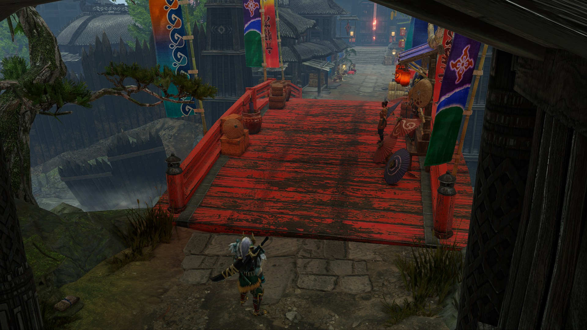
  

  

    
Scene Lights on

    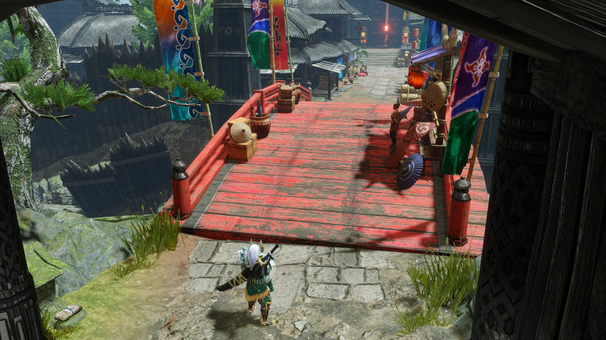
  

  <input type="range" min="0" max="100" value="50" step="0.01" 
    id="slider" class="slider__input" 
    autocomplete="off" onwheel="this.blur()" 
  />

 

Not all emitting lights are lights we can control. So the elements that are left that emit lights aren't exactly "light objects", and we can't switch them on or off, sadly.

## Tonemapping
In the RELit GUI, click on `Tonemapping` to open the tonemapping menu.

In there, you can turn off the Auto Exposure and edit the exposure by yourself by moving the sliders. This way you can make sure the scene exposure will be consistent no matter the angle of the camera or the lights involved in the scene.

  

    
Auto Exposure off

    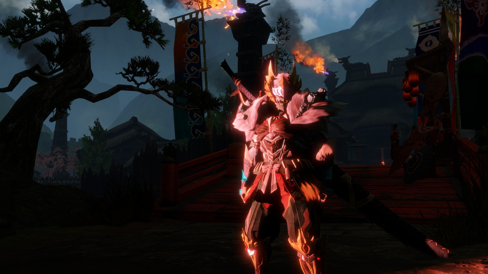
  

  

    
Auto Exposure on

    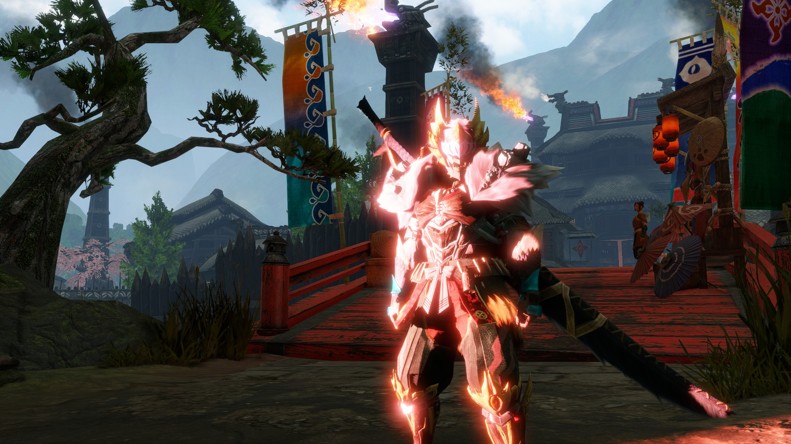
  

  <input type="range" min="0" max="100" value="50" step="0.01" 
    id="slider" class="slider__input" 
    autocomplete="off" onwheel="this.blur()" 
  />

Besides turning Auto Exposure off we reduced the exposure itself.

---
# Documentation

The following information was based on the lights documentation on [Cyberpunk 2077](GeneralGuides/cyberlit.htm), [UUU4 documentation](https://opm.fransbouma.com/uuuv4.htm#lights), and [UE4 documentation](https://docs.unrealengine.com/4.27/en-US/BuildingWorlds/LightingAndShadows/LightMobility/DynamicLights/) and also inferred with trial and error. If you notice something wrongly explained in this readme please hit us up!

Also, please take in mind that the values shown in the images below might not translate well to other games, so be sure to play around with the sliders until you get shadows (and lights) that you are satisfied with.

# Light Types

## Point lights
Radiate light in all directions from a single point in 3D space. It's best used for environmental lighting due to its omnidirectionality.

## Spotlights
Shoot a cone of light in a specified direction, also from a single point in 3D space. This is best used for lighting portraits, as it can be aimed at certain parts of a face.

# Light Properties

## Position
Here you can change the position of the light, to finetune how it affects your scene without losing the composition.

## Orientation - Spotlight only
You can also change the orientation of the spotlights from this menu.

## Intensity
Controls how bright the light is.

## Color picker / RGB / HSV / Hex
Allows you to select the color of the light by changing the RGB, HSV, or HEX values, or by using the fancy color picker.

## Temperature
This adds to any set of colors with a color that corresponds to the temperature of an ideal black-body radiator. In other words, you can set warm and cool lights with this. Represented in Kelvin, you can mimic sunlight, candlelight, and various other natural lights with this setting.

{.shadowed .autosize}
*From [docs.arnoldrenderer.com](https://docs.arnoldrenderer.com/display/A5AFMUG/Lights)*

## Bounce intensity
How much will the light bounce from environments and NPCs.

## Min roughness
The minimal roughness value that a material can have when the light is shining on it. In proper English, it means that, if the value is low (close to or is 0), the material can be shiny if it's shiny as the minimal roughness is very low. If you set it to a higher value if the material's minimal roughness is 0 (so it's shiny) it will still be matte / less shiny because you set the minimal roughness of the light to a higher value. This effectively can be used to reduce the shininess of light on a material, (e.g. wet skin) by increasing the min roughness value.

  

    
Min roughness = 0

    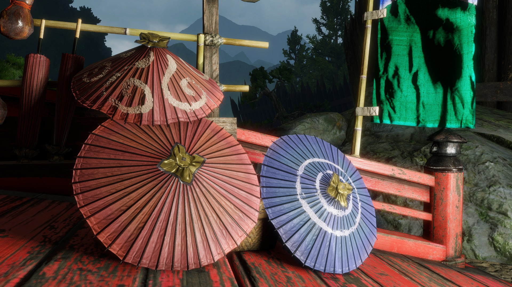
  

  

    
Min roughness = 1

    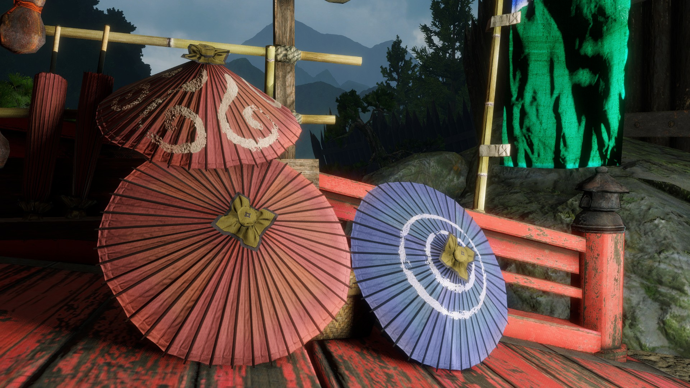
  

  <input type="range" min="0" max="100" value="50" step="0.01" 
    id="slider" class="slider__input" 
    autocomplete="off" onwheel="this.blur()" 
  />

 

## AO Efficiency
It introduces extra ambient occlusion shadowing based on the light if you increase the value.

  

    
AO Efficiency = 1

    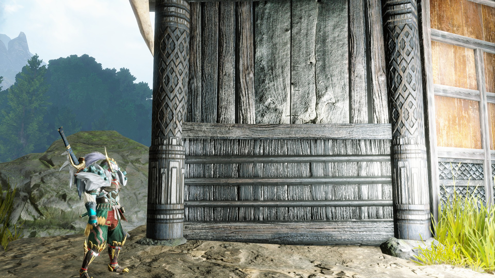
  

  

    
AO Efficiency = 0

    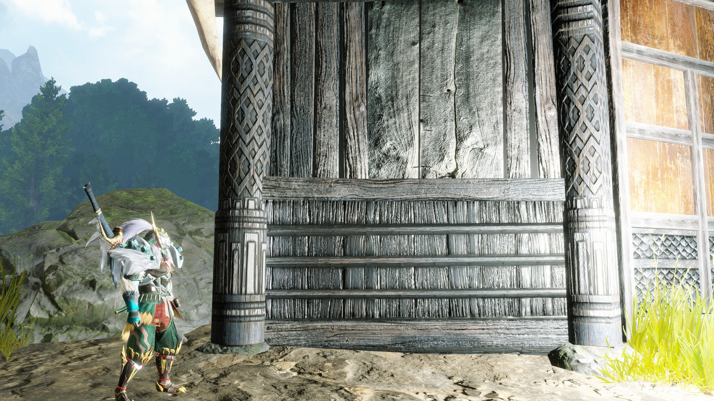
  

  <input type="range" min="0" max="100" value="50" step="0.01" 
    id="slider" class="slider__input" 
    autocomplete="off" onwheel="this.blur()" 
  />

 

## Volumetric Scattering Intensity

This is how much the light affects the in-world volumetric fog. It might be this option doesn't do anything, because there's no fog volume in the game at the light's location.

## Radius
This controls how far the light can travel, likely in in-game meters. Keep in mind that, for the light to be able to render farther it will increase its "intensity" closer to the origin (like a real-life light would do).

  

    
Radius = 2

    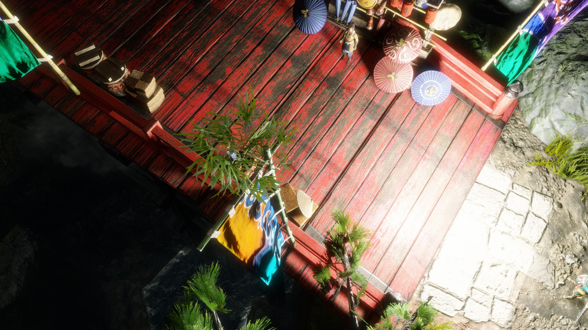
  

  

    
Radius = 0.7

    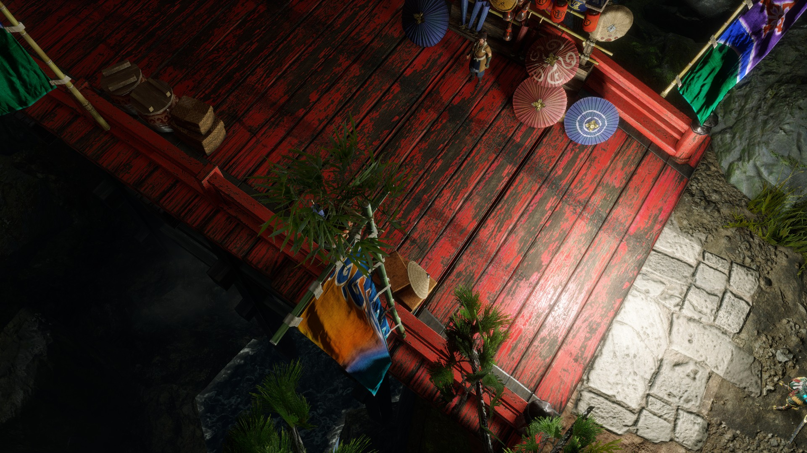
  

  <input type="range" min="0" max="100" value="50" step="0.01" 
    id="slider" class="slider__input" 
    autocomplete="off" onwheel="this.blur()" 
  />

 

## Illuminance Threshold - Spotlight only
Seems to be another, "harder",  kind of falloff of the light.

  

    
Illuminance Threshold = 20

    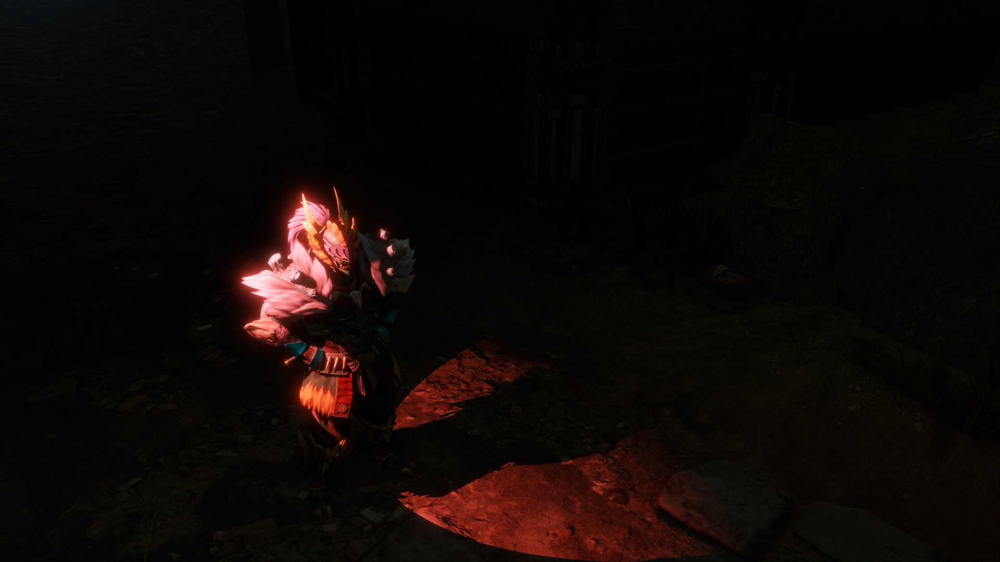
  

  

    
Illuminance Threshold = 1

    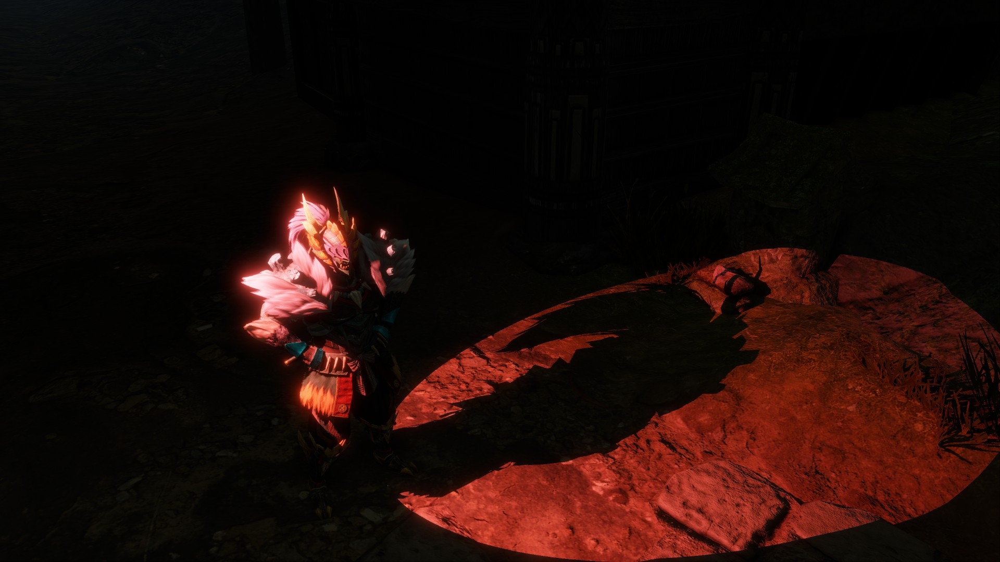
  

  <input type="range" min="0" max="100" value="50" step="0.01" 
    id="slider" class="slider__input" 
    autocomplete="off" onwheel="this.blur()" 
  />

 

## Cone - Spotlight only
This controls how wide the whole cone of light is, in degrees.

  

    
Cone = 80

    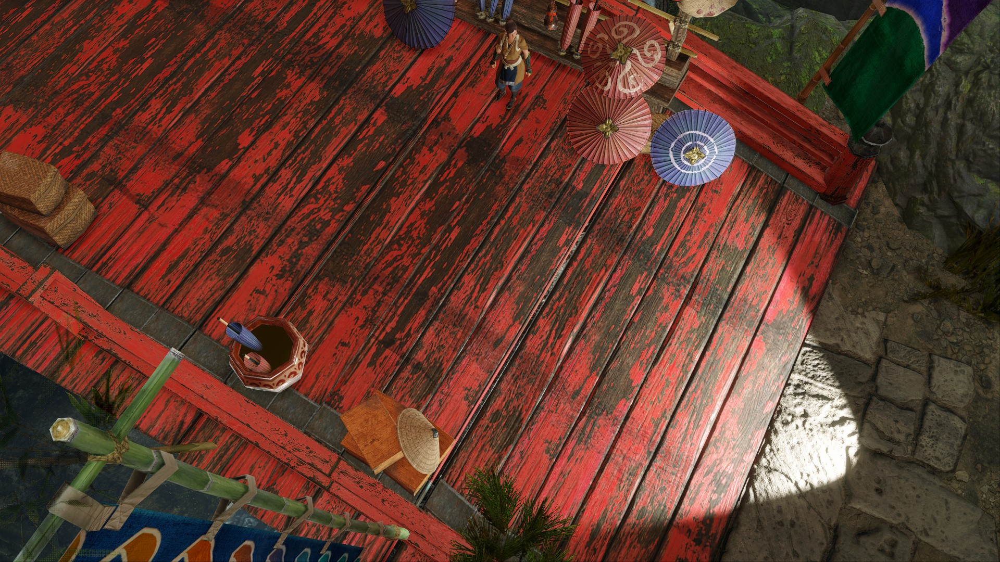
  

  

    
Cone = 25

    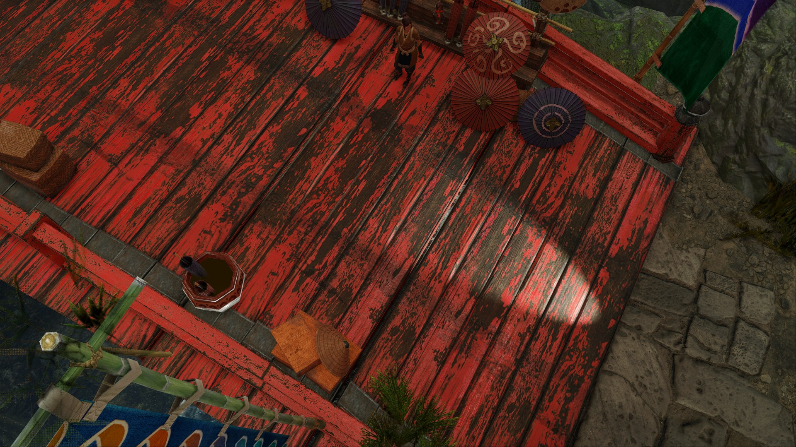
  

  <input type="range" min="0" max="100" value="50" step="0.01" 
    id="slider" class="slider__input" 
    autocomplete="off" onwheel="this.blur()" 
  />

 

## Spread - Spotlight only
This controls the softness of the light relative to the outer angle, in degrees. Anything within the inner cone will be evenly lit while the light gradually falls off closer to the outer cone. Setting the inner angle to zero creates a spotlight with hard edges.

  

    
Spread = 20

    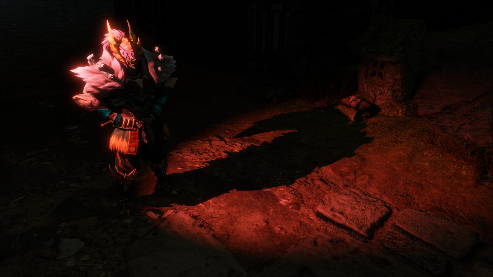
  

  

    
Spread = 1

    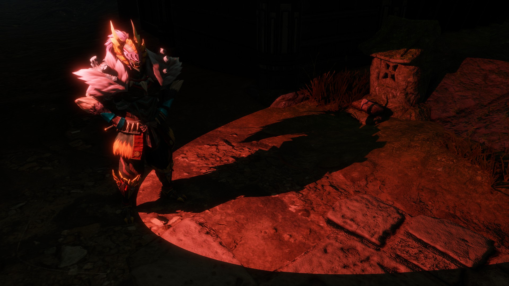
  

  <input type="range" min="0" max="100" value="50" step="0.01" 
    id="slider" class="slider__input" 
    autocomplete="off" onwheel="this.blur()" 
  />

 

## Falloff - Spotlight only
This slider controls how far in the world the light will affect geometry and models. The smaller the value the more will be lit by the light.

  

    
Falloff = 2.5

    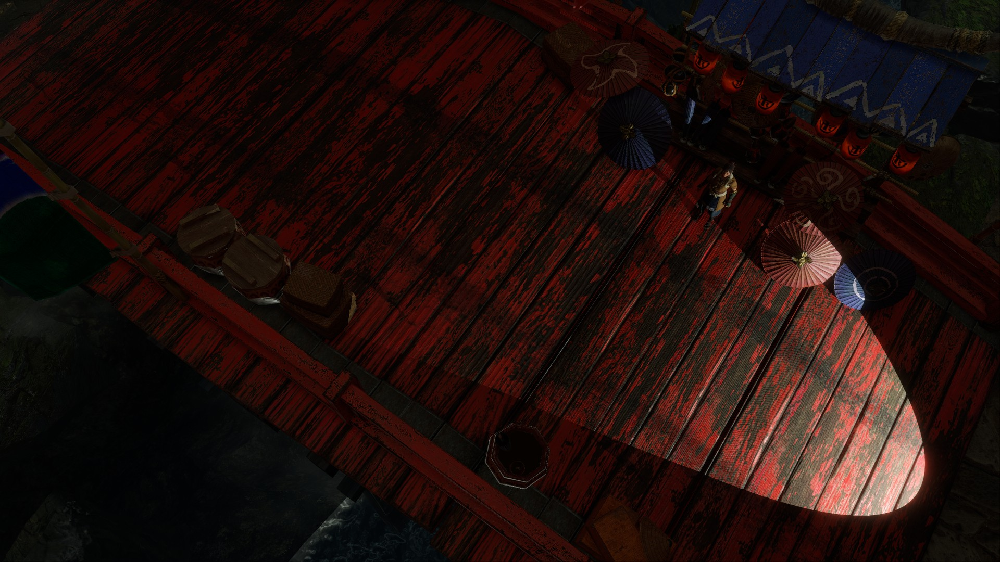
  

  

    
Falloff = 1

    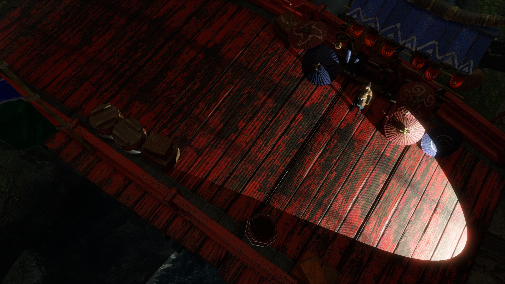
  

  <input type="range" min="0" max="100" value="50" step="0.01" 
    id="slider" class="slider__input" 
    autocomplete="off" onwheel="this.blur()" 
  />

 

# Shadow Properties

## Enable shadows
This checkbox toggles shadow rendering of the light. Off means no shadows at all.

## Shadow Bias
At 0, shadows will start at their caster surface but there will be many self-shadowing artifacts. With larger values, shadows will start further from their caster and there won't be self-shadowing artifacts but the object might appear to fly or float above a surface.

In general, if the light is close to the object that's being occluded, setting this to a lower value gives sharper shadows and no banding.

## Shadow Blur
It's actually "Shadow Variance". Using a value of 0 will give you very defined shadows, but sometimes some can be very blocky (especially with self-shadow casting), and introducing a bit of "variance" could help.

  

    
Shadow Blur = 0.0017

    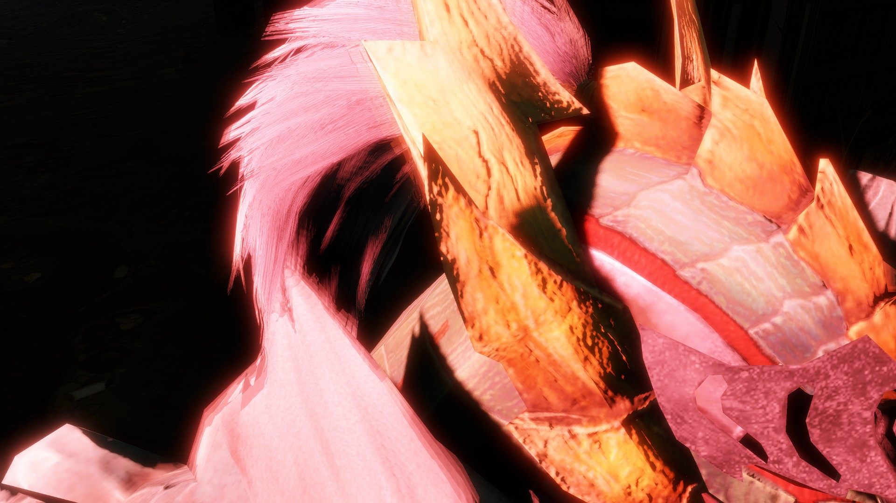
  

  

    
Shadow Blur = 0

    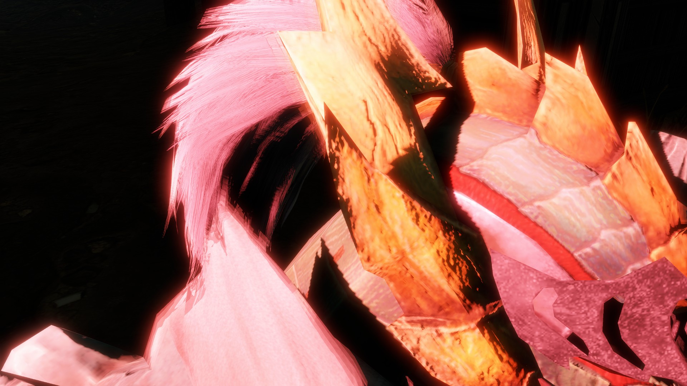
  

  <input type="range" min="0" max="100" value="50" step="0.01" 
    id="slider" class="slider__input" 
    autocomplete="off" onwheel="this.blur()" 
  />

 

## Shadow LOD bias
Unknown by the time of writing. I suppose it's related to the shadows cast on objects far away from the player, but haven't noticed much difference with it.

## Shadow Depth Bias
It controls how far should the occlusion start happening from the object that caused said occlusion.

  

    
Shadow Depth Bias = 0.5

    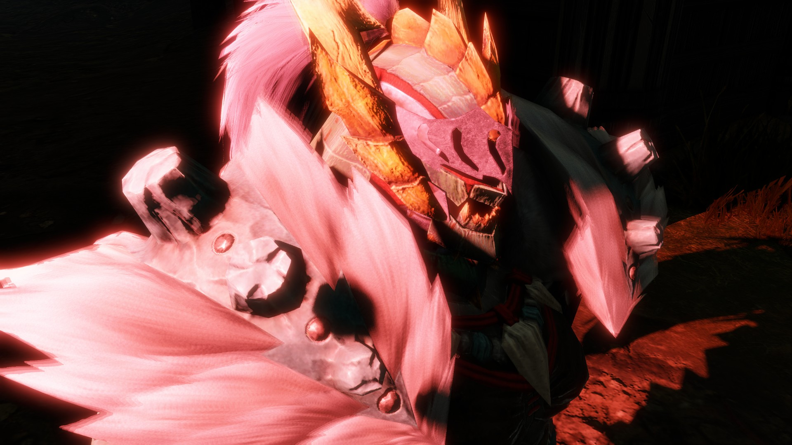
  

  

    
Shadow Depth Bias = 0

    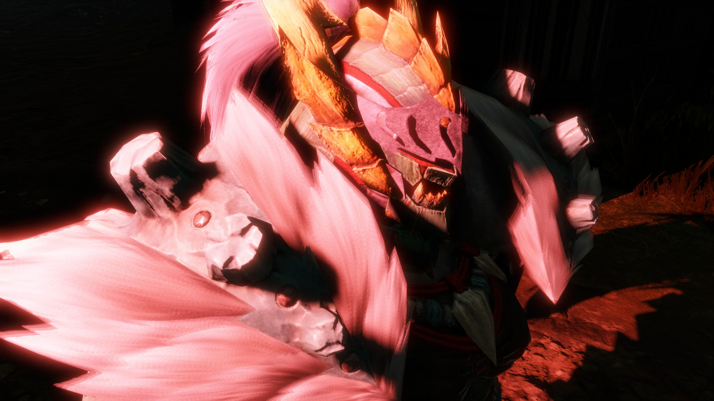
  

  <input type="range" min="0" max="100" value="50" step="0.01" 
    id="slider" class="slider__input" 
    autocomplete="off" onwheel="this.blur()" 
  />

 

## Shadow Slope Bias
Works in addition to Shadow Depth Bias in controlling how accurate self-shadowing of whole scene shadows from this light is. It works by increasing the amount of bias depending on the slope of a given surface.

## Shadow Near Plane
It controls the distance from which the light starts casting shadows. We usually want this to be as low as possible so it casts shadows everywhere, but if the light source is not close to the object then it won't cast shadows either. You will have to play around with it a bit to see what a good range for this value is to cast shadows on the subject.

  

    
Shadow Near Plane = 1.5

    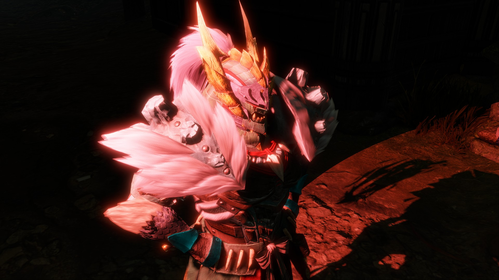
  

  

    
Shadow Near Plane = 1

    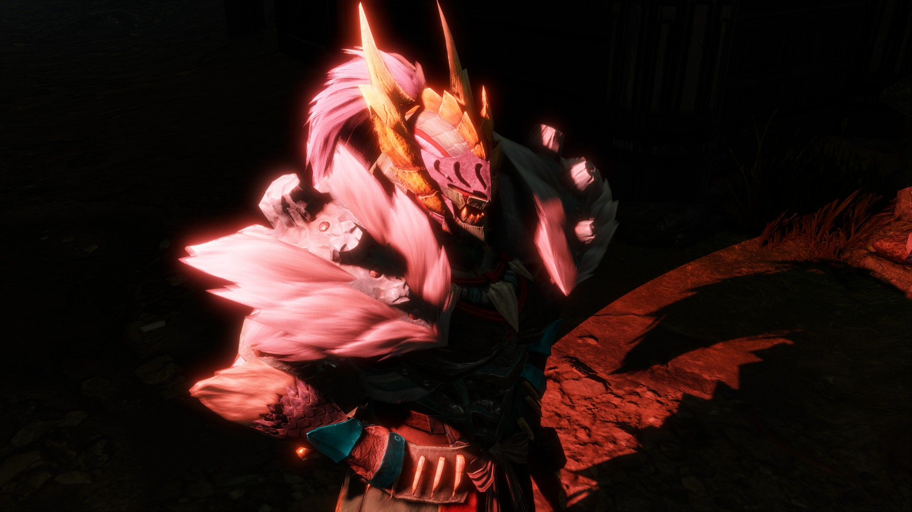
  

  <input type="range" min="0" max="100" value="50" step="0.01" 
    id="slider" class="slider__input" 
    autocomplete="off" onwheel="this.blur()" 
  />

 

## Detail shadow - Spotlight only
Looks to be the resolution of the shadow. As with the other properties, results using different values might vary from game to game.

  

    
Detail shadow = 0.2

    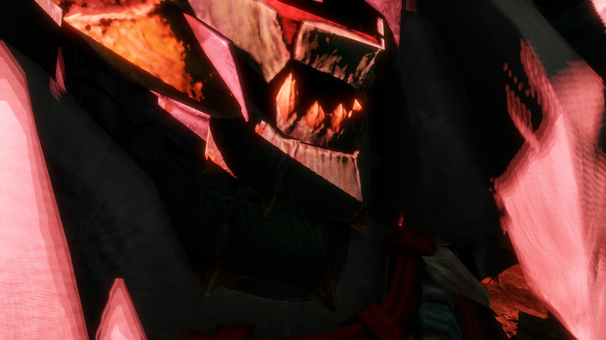
  

  

    
Detail shadow = 0.2

    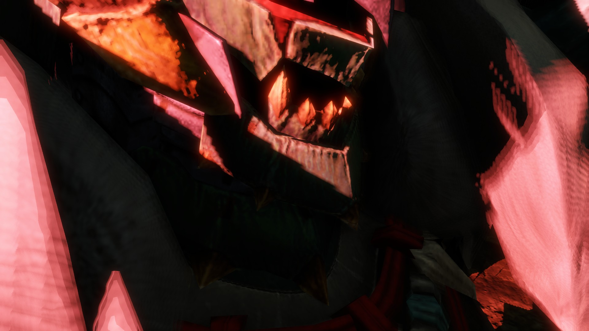
  

  <input type="range" min="0" max="100" value="50" step="0.01" 
    id="slider" class="slider__input" 
    autocomplete="off" onwheel="this.blur()" 
  />

 

# Extra tips

- Sometimes a spotlight will stop rendering when moving it around or modifying some of its properties (or it might not even be rendered when first created). This looks to be an engine error, and the only workaround we have found so far is to move the light or the value of its properties just slightly until it gets rendered.

- Not seeing any shadows when creating a spotlight it's likely due to the `Shadow Near Plane` value being too low/wrong. Go into the light editor and increase the Shadow near plane value to a higher value till you see the shadows appear and they look ok.

- If you see big stripes in the shadows when creating a light, it might be due to the default `Shadow Bias` value. To correct these stripes, increase (or decrease) the `Shadow Bias` value until they are gone.

- As with other imgui-based applications, you can move sliders slower or faster by pressing `Control` or `Alt` respectively when moving them. You can also edit the value of the slider itself with `Control` + `Mouse Click`, even outside of the slider boundaries. We recommend you stick to these, but since we are still experimenting with these values (and every game might behave around them differently) feel free to experiment.

- As with other light systems, lights can be mixed to simulate dispersed light.

{.shadowed .autosize}

- Although it might not cause problems, it would be a good idea to delete spawned lights once they are not needed anymore to avoid making the game run into unpredicted behavior.

- Users have reported having problems making the spawned lights interact with subjects on cutscenes in some Resident Evil Remakes.

---
*Last updated 3rd April 2025*