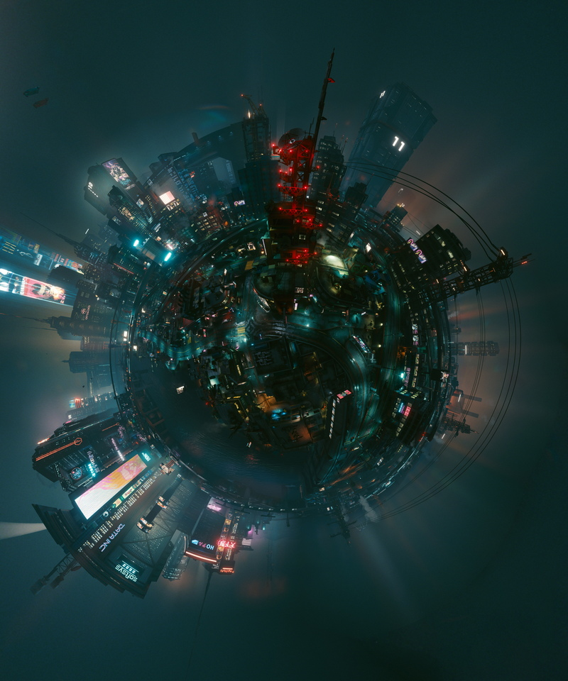

Creating tiny planets
=========

{.shadowed }

## Requirements

- A (1st Person) camera in a fixed position able to rotate about at least 2 axes (Yaw and Pitch)
- Image stitching and projection software

The easiest software I’ve found for this is [Microsoft Image Composite Editor](https://www.microsoft.com/en-us/research/product/computational-photography-applications/image-composite-editor/). 
It’s free, has low system requirements, and does a great job at both stitching and projection with very little fuss. 

## The quick version

- Move camera to a fixed point in space.
- Take photos in every possible direction with a little bit of overlap between shots.
- Load all shots in to Image Composite Editor and hit Stitch
- Set projection to Stereographic
- Set Orientation to:
- Roll 0 Degrees
- Pitch -90 Degrees
- Yaw 0 Degrees
- Adjust the composition with the rotation tool
- Crop image and export to an appropriate format.

## The lengthy version

The camera needs to be placed in a fixed location, like it’s on a tripod or stationary drone. Once you’ve found a spot, don’t move from here. It’s possible to use an Orbit camera if the orbit is fairly tight, but noticeable camera movement will cause the stitching routine to malfunction. Take photos of the horizon, rotating the camera yaw on each shot, but overlap the images slightly. On a 90 degree FOV, I aim for about 6 to 8 shots to fully rotate the yaw through 360 degrees. 

Once this is done, change the pitch of the camera down by around 30 to 40 degrees (or about 1/5th of the vertical FOV of your camera), and take another set of photos rotating the yaw between each shot until all directions are covered, ensuring there is some overlap in each photo between rotation. Repeat this until the camera is pointing straight down to Nadir, and get the final shots.

Now repeat this but pitch up above the horizon and get shots up to [Zenith](https://en.wikipedia.org/wiki/Zenith). Once you’ve got shots in all directions, open [Microsoft Image Composite Editor](https://www.microsoft.com/en-us/research/product/computational-photography-applications/image-composite-editor/) and drop all the files into the program.

Check the Camera Motion is set to AutoDetect, and hit Next. The program should have selected a projection (usually Spherical). Check the readout at below the stitching window, it should read Spans 360 degree Horizontally and 180 degree Vertically. This tells you that the tool was able to find and stitch together enough information.

Change the projection to Stereographic, then set the Orientation to:

- Roll 0 Degrees
- Pitch -90 Degrees
- Yaw 0 Degrees

The image should have formed something that resembles a tiny planet, and I would recommend only rotating the image using the mouse as this will significantly simplify Cropping for the purposes of maintaining symmetry. Once you are satisfied with the composition, hit Next.

Crop out the image to remove significant distortion above the horizon (and to keep the file size sensible). If you have only rotated as suggested, the horizon of the original scene should form a perfect circle, and a 1:1 aspect ratio crop will be align the planet to the middle of the image. For 1:1 crops, around 7500x7500 to 10000x10000 in .PNG keeps the file size manageable. 

## Composition tips

Getting a feeling for how the distortion works takes some time.  For tiny planets, the distortion is lowest directly below the camera, and increases to infinite directly above. Apparent angular size of objects and their relative angle from directly below the camera determines how distorted they will appear. This means a tree off in the distance will look relatively undistorted, but one a few meters from the camera will be massively warped.

"Balancing" the planet shape is a major part of composing these shots. Having (for instance) a mountain range on one side of the scene and a valley on the other will significantly unbalance the shot. The simplest shots have a flat and even horizon, but I find them a bit dull. A very rough rule of thumb I use for quick shots is avoiding scenes where objects appear more than 30 degrees above the horizon, since they tend to distort quite badly.

Height of the camera and distance to the nearest object plays a massive role in how the scene looks and feels. I almost never shoot at ground level, and find for most of my scenes I want the camera around 5 to 10 meters off the ground. Adjusting the height is also a way of keeping things closer to the horizon
Pay attention to large nearby objects, such as buildings, poles, and trees, as they can distort significantly, potentially ruining an otherwise pleasing scene. 

Objects suspended in the air above the horizon should be noticed when planning a shot. Power lines are the main contender for interfering with the perfect shot, but anything we expect to arch in a particular way, including overhead bridges and railways also can just look distractingly wrong.
I tend to keep the scene relatively empty directly below the camera due to it making things look tiny.

If you’re adding a person to the scene and shooting at around head height, there will be a bobblehead effect that’s stronger the closer they are to the Camera. If the person is at least 5 meters from the camera, they should look relatively undistorted. Also having people on all sides of the planet can look a little bit weird.

## Some notes on this technique

This technique works in real life and in photomode, since under the hood it’s a just projecting a sphere on to a plane using the [Stereographic Projection](https://en.wikipedia.org/wiki/Stereographic_projection), and it’s been in use for some time. The technique used in this guide was originally demonstrated by Horace Bénédict de Saussure in 1779 for [mapping out the view from up in the Alps]( https://en.wikipedia.org/wiki/File:Vue_circulaire_des_montagnes_qu_%E2%80%98on_decouvre_du_sommet_du_Glacier_de_Buet,_from_Horace-Benedict_de_Saussure,_Voyage_dans_les_Alpes,_pr%C3%A9c%C3%A9d%C3%A9s_d%27un_essai_sur_l%27histoire_naturelle_des_environs_de_Geneve._Neuchatel,_l779-96,_pl._8.jpg).

If you’re attempting this in real life, remember to photoshop out any objects supporting the camera (such as a tripod, or a drone if this is being done from a gimbal mount), or shadows cast by the camera in your shots. You can do this before or after stitching, depending on your preference.

Image Composite Editor claims to be able capture scenes from video as well as from photo, but I’ve had limited success with it working for this technique, including when the video is just a basic horizontal yaw rotation without any pitch or roll.

### Examples and shameless self-promotion

* [A gallery of examples created by Hyperchlorinated since 2016](https://tinyplanetsandscreenshots.tumblr.com/)

