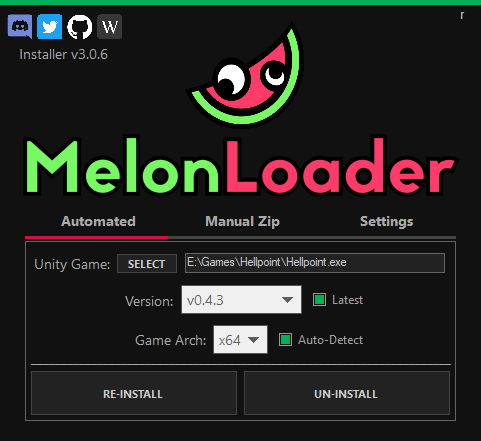
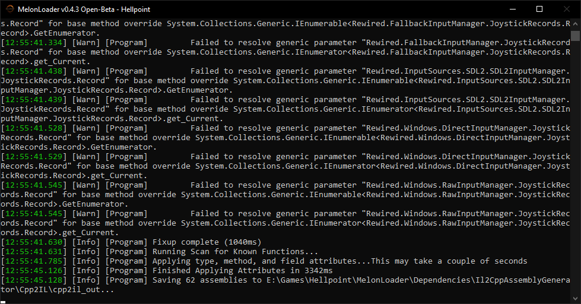
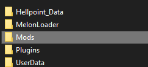
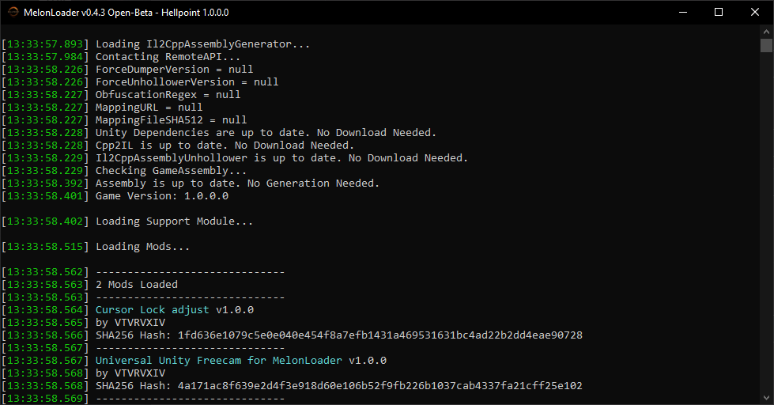

How to install and use the Universal Unity Freecam
=========

The [Universal Unity Freecam](https://youtu.be/I6igj-u1qlk) (UUF) project by [VTVRVXIV](https://twitter.com/vtvrvxiv) adds a freecam that works in most Unity games. It is a plugin designed to be installed by Unity plugin loaders like MelonLoader and BepInEx, and works in both Unity backends: Mono and IL2CPP.

*If you're curious, [this article](https://learn.unity.com/tutorial/memory-management-in-unity#5c7f8528edbc2a002053b59b) covers the difference between the two types. Basically a difference in scripting.*

## Installation 

### MelonLoader

[MelonLoader](https://melonwiki.xyz/#/) comes with an installer to make its installation process quicker and easier. This covers installing the UUF into Unity IL2CPP games.

* Launch `MelonLoader.Installer.exe` and select your game's EXE  
{.shadowed .autosize}

* Click on INSTALL (or RE-INSTALL if you are upgrading from a previous version)  
* A success popup should appear if the installation has been successful.  
* Upon launching the game, a new window with a console will open on your screen. A process called the unhollowing will start. Wait until MelonLoader is done unhollowing. **This process requires an internet connection.**   
{.shadowed .autosize}  

* Close your game and go to your game's installation folder.  
@alert important 
If `MelonLoader/Managed` has `UnityEngine.InputLegacyModule.dll`, copy over `MelonLoader_Freecam_LegacyInput.dll` into the new `mods` folder created by MelonLoader. 
@end
* Otherwise, copy over `MelonLoader_Freecam.dll`. `CursorMod.dll` is an optional file to override locked / invisible cursors in some games.  
{.shadowed .autosize}  

* Start the game and the freecam should be successfully loaded in!  
{.shadowed .autosize}  

### BepInEx

[BepInEx](https://github.com/BepInEx/BepInEx) on the other hand doesn't come with an installer and you will need to check what version you need to install. This process is for Unity Mono games.

* Launch the game and use Task Manager to check if your game is 32-bit or 64-bit.  
{.shadowed .autosize}

* Close the game and copy the contents from the BepInEx x32 / x64 zip into the game's installation folder.  
* Start the game again. **Your game may crash at startup** here, but that's OK. You'll be closing it again anyway.  
* Close the game and look inside the BepInEx folder. You should see that new folders were created.  
* Open `LogOutput.log` and check for a line that gives you the Unity version of the game, like
`[Info   :   BepInEx] Running under Unity v2019.1.10.15730669`  
* Note down the version, then open the config folder and edit `BepInEx.cfg`.  
* Change `Type` according to the Unity version in the `[Preloader.Entrypoint]` section like so:  

Version | Change to
-- | --
Unity 2017 and above | `Type = MonoBehaviour`
Unity 5 | `Type = MonoBehaviour`   or   `Type = Camera`
Unity 4 | `Type = MonoBehaviour`  

@alert important 
For Unity 4 games, `System.dll` and `System.Core.dll` must be present in `<Game Name>_Data/Managed`. If not, you will have to download an old Unity 5 build as a middle ground and export the 2 files from the Unity Editor. 
@end
@alert info
You can also enable console logging under `[Logging.Console]` by changing `Enabled` to `true`.
@end

* Start the game and confirm it's not crashing or hanging. If it is, you might need to redo the BepInEx process above. Close the game again.  
* Copy over the freecam plugins to the `BepInEx\plugins` folder.  
* Start the game and confirm that the camera is installed by pressing `Backspace`.  

#### Configuring the plugin

Each DLL installed has its own CFG file that can be found in `BepInEx/Config`, allowing you to change the hotkeys to your own needs.

## IL2CPP Default Camera Controls

Keybind | Description
-- | -- 
`F9` | Open / Close the camera menu
`F10` | Open the Mono camera behaviour (press and hold F10 while clicking on a camera)
`i` | Move camera forward
`k` | Move camera backward
`j` | Move camera left
`l` | Move camera right
`o` | Move camera up
`u` | Move camera down
`F11` | Decrease camera movement speed by a factor of 2
`F12` | Decrease camera movement speed by a factor of 2

## Mono Default Camera Controls

Keybind | Description
-- | -- 
`Backspace` |Open / Close the camera menu
`Z` | Rest camera to default (hold when clicking on camera)
`i` | Move camera forward
`k` | Move camera backward
`j` | Move camera left
`l` | Move camera right
`o` | Move camera up
`u` | Move camera down
`NumPad 8` | Rotate camera forward
`NumPad 2` | Rotate camera backward
`NumPad 4` | Rotate camera left
`NumPad 6` | Rotate camera right
`NumPad 9` | Rotate camera up
`NumPad 7` | Rotate camera down
`Left Control` | Slow down the camera movement
`Left Shift` | Speed up the camera movement

## HUD hiding

The UUF does not come with a way to hide HUDs. The best way is through a Unity inspector like [Runtime Unity Editor](https://github.com/ManlyMarco/RuntimeUnityEditor) (Mono) or [Unity Explorer](https://github.com/sinai-dev/UnityExplorer) (Mono/IL2CPP). 

## Additional tips

It's generally recommended to disable any overlays you have as they may conflict with the keybinds above.

The console may not appear when you start the game for the first time. Check the game's installation folder for a file named `version.dll`. Rename it to `winhttp.dll`, or vice versa, depending on the situation.

## More links

- [BepInEx Documentation](https://docs.bepinex.dev/master/articles/user_guide/installation/index.html) - Extensive installation, configuration and troubleshooting site

