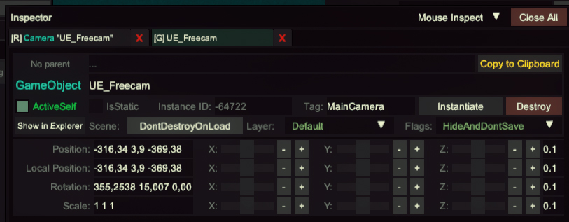

{.shadowed .autosize}

@alert neutral
**Engine versions supported:** UnityExplorer supports most Unity versions from 5.2 to 2021+ (IL2CPP and Mono)
@end

# Setup
---

## Identifying the type of Unity game
 
To know what files you have to install you have to first understand if the game is 32 or 64-bit, and if it's a `Mono` or an `IL2CPP` game.

### 32-bit or 64-bit

Launch the game and use the Task Manager to check if your game is 32-bit or 64-bit (if it is 32-bit, it will have "32-bit" next to the program name).  

{.shadowed .autosize}

Alternatively, you can look up the games page on the [pcgamingwiki](https://www.pcgamingwiki.com/wiki/Main_Page).

### Mono or IL2CPP

Open the game folder to determine if it is Mono or IL2CPP based:
- Mono games have a `UnityPlayer.dll` in the game folder and a `Managed` folder in the gamedata folder. They also might have a folder with `Mono` on its name.
- IL2CPP games have a `GameAssembly.dll` in the game folder and an `il2cpp_data` folder in the gamedata folder.
 
@alert tip
If the game is on Steam, you can check the file structure before downloading by going to the [SteamDB](https://steamdb.info) page of the game, `Depots` section, and from the table in there, click the ID number on the game's depot (usually the one with the bigger file size).
@end

If you happen to need it for something the Unity Engine version number can be found by opening the `globalgamemanagers` file found in the game's data folder, but it shouldn't be relevant to the guide at hand.

{.shadowed .autosize}

## Downloading BepInEx and Unity Explorer

Download the appropriate version of each software, depending if the game is 32 or 64-bit and if its a Mono or IL2CPP unity game:

ㅤ| Mono | IL2CPP
--|--|--
**32-bit (x86)** | - [BepInEx_x86_5.X](https://github.com/BepInEx/BepInEx/releases)   - [UnityExplorer.BepInEx5.Mono](https://github.com/sinai-dev/UnityExplorer/releases)    Optional:   - [FreeMoveInjector.Mono](https://github.com/vtvrv/FreeMoveInjector/releases) (recommended)   - [TimeScaleController](https://www.mediafire.com/file/56dh5g2y08872a4/TimeScaleController.zip/file) (recommended)  - [BepInExConfigManager.Mono](https://github.com/sinai-dev/BepInExConfigManager)   - [EnableIsDebugBuild.Mono](https://github.com/vtvrv/EnableIsDebugBuild/releases)   - [ScreenshotTool](https://www.mediafire.com/file/3iigfn5cbpenutt/ScreenshotTool.zip/file) |  - [BepInEx-Unity.IL2CPP-win-x86-6](https://builds.bepinex.dev/projects/bepinex_be)   - [UnityExplorer.BepInEx.IL2CPP](https://github.com/sinai-dev/UnityExplorer/releases)    Optional:   - [FreeMoveInjector.IL2CPP](https://github.com/vtvrv/FreeMoveInjector/releases) (recommended)   - [BepInExConfigManager.Il2Cpp](https://github.com/sinai-dev/BepInExConfigManager)   - [EnableIsDebugBuild.IL2CPP](https://github.com/vtvrv/EnableIsDebugBuild/releases)
**64-bit** | - [BepInEx_x64_5.X](https://github.com/BepInEx/BepInEx/releases)   - [UnityExplorer.BepInEx5.Mono](https://github.com/sinai-dev/UnityExplorer/releases)    Optional:   - [FreeMoveInjector.Mono](https://github.com/vtvrv/FreeMoveInjector/releases) (recommended)   - [TimeScaleController](https://www.mediafire.com/file/56dh5g2y08872a4/TimeScaleController.zip/file) (recommended)  - [BepInExConfigManager.Mono](https://github.com/sinai-dev/BepInExConfigManager)   - [EnableIsDebugBuild.Mono](https://github.com/vtvrv/EnableIsDebugBuild/releases)   - [ScreenshotTool](https://www.mediafire.com/file/3iigfn5cbpenutt/ScreenshotTool.zip/file) | - [BepInEx-Unity.IL2CPP-win-x64-6](https://builds.bepinex.dev/projects/bepinex_be)   - [UnityExplorer.BepInEx.IL2CPP](https://github.com/sinai-dev/UnityExplorer/releases)    Optional:   - [FreeMoveInjector.IL2CPP](https://github.com/vtvrv/FreeMoveInjector/releases) (recommended)   - [BepInExConfigManager.Il2Cpp](https://github.com/sinai-dev/BepInExConfigManager)   - [EnableIsDebugBuild.IL2CPP](https://github.com/vtvrv/EnableIsDebugBuild/releases)

Even tho there is a BepInEx v6 (which is patcher/plug-in framework for Unity games) for Mono games, it is still recommended to use v5 since Mono support in v6 is still untested. Also, as you may have noticed by the table above, some plugins only work for v5 and they don't have a v6 counterpart.

## Installation

- Extract the contents of the BepInEx zip into the game folder.
- Extract UnityExplorer and BepInExConfigManager's `plugins` and `patchers` folders into the game's BepInEx folder.
- Place `FreeMoveInjector.dll` in the `/BepInEx/plugins/` subfolder.
- Place `vtrvrxiv.TimeScaleController.dll` in the `/BepInEx/plugins/` subfolder.

For other optional mods put the .dll files inside the `/BepInEx/plugins/` folder as well.

## Starting Unity Explorer

@alert important
IL2CPP-based games require Internet access for their first launch with BepInEx.
@end
 
Launch the game and BepInEx will complete the installation process. If everything is working, a UnityExplorer window will appear.

{.shadowed .autosize}
 
@alert important
Follow the [BepInEx Troubleshooting Guide](https://github.com/sinai-dev/BepInExConfigManager) to get a broken game working.
The most common issue is a bad entrypoint.
@end

*If you ever get lost in this guide I suggest watching the video above for visual aid.*

# Freecam
---
As of now, there are two ways of getting a freecam working in Unity games, which are listed below.

## 1 - UnityExplorer native freecam

If you want to use this method there are two main ways of doing so: With or without checking "Use Game Camera?" checkbox.

### 1.1 - Using UnityExplorer created camera

- Open the UnityExplorer UI with `F7` (which can be changed in the options) and click on the top "Freecam" button.
- Click on the "Start Freecam" button on the new window.

Without checking the "Use Game Camera?" checkbox, the unity explorer will create a new camera object for you to control, this means that some post-processing effects won't be displayed (because they are being applied to the game's camera, not the new one), making the game look "ugly" (it might also be useful in some cases where you don't some stuff from the game camera, like in Somerville where the gameplay cam didn't render behind the black bars, but this new camera did).

{.shadowed .autosize}

### 1.2 - Using the game camera

If you need these postprocessing effects for some reason you might want to check the "Use Game Camera?" checkbox in the freecam window. This will let you control the gameplay camera instead of creating a new one to control. However, take in mind that, in order for you to move this gameplay camera, you must first disable any component that controls the camera (most of the time called "Cinemachine"), so you can do it yourself.

To do so, after checking the "Use Game Camera?" (and "Begin Freecam") click on the "Inspect Free Camera" button, then on the Inspector window click on "Inspected GameObject" and disable the Cinemachine object. Remember to enable it again after finishing shooting the scene!

{.shadowed .autosize}

There might be a way of adding the gameplay postprocessing effects camera to the one created by Unity Explorer, but I haven't tested it myself yet, and probably depends on the game.

### Controls

Description | Keybind
-- | --
Move forward, left, backward, and right | `W`, `A`, `S`, `D` / `Arrows`
Move up | `Space` / `Page Up`
Move down | `Left Control` / `Page Down`
Change orientation | `Right Click` + `Mouse`
Increases camera speed | `Shift`
Open Unity Explorer UI | `F7`

Also, whenever you have to use this freecam again without the "Use Game Camera?" checked (meaning by following [1.1](#using-unityexplorer-created-camera)), make sure to click the "Reset" button on the freecam window to go to the gameplay camera position.

@alert warning
Even if this method is pretty straightforward, it has the problem which you can't move the camera position when the game is paused (with UnityExplorer's Time value or the TimeScaleController plugin). If you want to avoid this problem refer to the next section.
@end

## Use FreeMoveInjector freecam

If you want to be able to move the camera while the game is paused follow the steps below.

* Get the camera object. An easy way of getting the camera object is to open the `Freecam` window by pressing the top bar button of the Unity Explore UI, clicking on "Begin Freecam" and clicking on the button that says "Inspect Free Camera" (you can do so with or without the "Use Game Camera?" checkbox checked, just be aware of disabling the cinemachine component if you do).

    If that camera has problems for whatever reason (sometimes they disable shaders or effects and make the game look ugly), then search `UnityEngine.Camera` in Unity Explorer's object search tab to get a list of all cameras.

    Inspect each camera to find the main game cam. Usually, this is a camera with position values that change while the camera is moving.

* Once you have the camera object type `BehaviourInjector.FreeMove` into the inspector window's Add Comp field and press enter to enable free control.

* Disable any `Cinemachine` component the camera object might have. This will detach the camera from the game's automatic movement, allowing you to move it freely with the `FreeMove` component.

* To get out of the freecam just disable the FreeMove component (and click on "End Freecamera" in the Freecamera window if you enabled that) and enable the `Cinemachine` parameter again.

{.shadowed .autosize}

Description | Keybind 
-- | --
Move Forward, left, backward, and right | `I`, `J`, `K`, `L`
Move up, down | `O`,` U`
Change orientation | `Left Click` + `Mouse`
Increases camera acceleration by a factor of 2 | `]`
Decrease camera acceleration by a factor of 2 | `[`
Increases camera dampening by a factor of 2 | `"`
Decrease camera dampening by a factor of 2 | `;`

@alert warning
If you want to avoid using this mod when the game is paused, another alternative would be to use the position sliders on the camera game object to adjust the position manually, altho this can get tiresome after a while.

{.shadowed .autosize}
@end

### Some troubleshooting tips

* When using the camera menu to select the right camera make sure to include all the items referring to postprocessing effects to make sure those are being shown when moving the camera around.

* Many game cameras have existing behaviors that can prevent free movement (e.g. CineMachine). Disabling these behaviors will solve this issue.

    Some games turn the CineMachine component whenever it's disabled, and the only solution for that is to delete the component. You can try adding it back again when you finish shooting, but there is no guarantee the camera will work for gameplay without relaunching the game.

    If you have problems unlocking the camera try clicking on the "Instantiate" button on the game object.

* Changing the orientation of the camera may not work if the game is locking the cursor to the center of the screen. To solve this, keep the UnityExplorer menu open as the plugin will unlock the cursor.

# FoV
---
To modify the field of view to open the `Freecam` window by pressing the top bar button of the Unity Explore, click on "Inspect Free Camera" (no matter if you have "Use Game Camera?" enabled or not, it will always return the cam being used for the freecam) and in the window that appears search for "fieldOfView" to change it.

{.shadowed .autosize}

## Clipping plane

Also, if you notice that while moving the camera, objects in the environment or subjects get clipped out of the scene (aka they get cut or disappear) then you should edit the draw distance properties of the camera (the same game object you used above). As a reference, change the `farClipPlane` to a high value like 9999 and the `nearClipPlane` to something small like 0.01 (if possible, I have had trouble introducing such low values).

# Pause
---
There are multiple ways of pausing a Unity game, which are listed below.

## 1 - UnityExplorer Time
There are two ways of pausing the game. An easy one is to just change the "Time" value at the top right of the UnityExplorer UI to `0`.

Unfortunately, this can be cumbersome, especially if you want to capture action scenes. An alternative (and a very suggested one) is to install the TimeScaleController mod, as explained in the section below. 

## 2 - TimeScaleController (BepInEx v5 only)
This mod will allow you to associate a hotkey with a value to change the timescale to. The default hotkey is the `Pause` button (should be near the print screen button, at the top right of your keyboard).

You can change the hotkey to another button by going to `\BepInEx\config\vtrvrxiv.TimeScaleController.cfg` and changing the default key, as well as the Speed (which I recommend setting to `0` for full pause), or using the [BepInExConfigManager mod](#configuration-manager-optional).

@alert warning
There is a chance that the TimeScaleController mod isn't working. If you press the hotkey and it doesn't pause the game chances are the mod hasn't been hooked up correctly. To fix this go to the Object Explorer -> Scene Explorer, open any of the objects listed there (that are enabled), type `TimeScaleController` into the inspector window's Add Comp field, and press enter.

Be aware tho that if the game ever destroys that object (e.g. when you change a level) then you will have to repeat this process again with another object.
@end

## 3 - The game's pause
As an alternative, you can also try using the game vanilla pause by pressing the `Esc` key, but you will have to disable the pause menu elements, turn off any additional shader the game might use, and even so it might not look exactly as in gameplay depending on the game. Use this method at your discretion.

# Disabling HUD (and more)
---
As with the pause, there are a couple of ways of toggling HUD elements in a Unity game, which are listed below.

## 1 - UnityExplorer

To toggle the different HUD elements off you can go to the Inspector window on the Unity Explorer, click on `Mouse inspect` in the top right, select `UI` and click on the UI element you want to turn off. It will prompt you with a list of objects. Try to disable them one by one until the hud element disappears from the screen. This also allows you to turn off other game objects, such as subjects or stuff from the environment.

{.shadowed .autosize}

Besides being able to toggle HUDs, the UnityExplorer allows you to modify a lot of the game objects' properties, like moving the position of light sources, turning off postprocessing effects, or hiding characters entirely.

## 2 - ShaderToggler

Alternatively (and maybe preferably in the case of the HUD elements), you can use the [shader toggler addon](../ReshadeGuides/Addons/shader_toggler_repository.htm), which will probably be easier and would allow you to toggle the HUD off and on with a hotkey, which isn't currently supported by the UnityExplorer.

# Extra
---

## Turn off screen effects (vignette, grain, chromatic aberration, etc.)

To turn off undesired effects for screenshots go to the object explorer window and search for a class containing the word `grain` (or whatever you are looking to disable). Open every object listed, look for the "active" property and turn it off (remember to also click on "Apply").

{.shadowed .autosize}

As shown above, there might be cases in which the object you open already has "active" turned off, or turning it off does nothing. Just keep trying with all the game objects on the list until deactivating one gets rid of the effect.

## Spawn lights (and other objects)

Besides all the ways we already mentioned the Unity Explorer can be useful, it can also be used to spawn game objects, and among possible objects to spawn, lights are one of them.

Up next I will be explaining how to do so, but if you need visual aid I recorded a video showing how to do so:

- Open the "ObjectExplorer" window in Unity Explorer and click on any object on the scene (preferably one that you know won't be deleted by changing the level if you need those lights back).
- On the "Inspector" window add a new child called "Light - 1" or something like that. You would need to create a new child for every light you want to add.
- Then, go inside this new child and copy the coordinates from the "Freecam" window into the "Position" field in this object (you will probably end up refining these coordinates later).
- Inside this new child add a light component from the class "UnityEngine.Light" by writing the class name on the "Components" section and adding it.
- Click on the Light component and start editing the values of the light. I found the following parameters to be useful:
  - `intensity`: How strong the light is. I suggest increasing this value first because it's set to 1 and it's barely visible.
  - `type`: The light is a point light by default, and you can change it to a spotlight with this parameter.
  - `color`
  - `colorTemperature`: You would also need to turn on the `useColorTemperature` parameter.
  - `range`: How far the light travel.
  - `spotAngle`: The angle of the spotlight (bigger means wider).
- Once the parameters are set, refine the lights' position and rotation to fit your composition.
- Repeat for every light that you want to add.

I haven't been able to make the lights do much shadow-wise. It might depend on the game, but if you know how to control these please let us know!

Regarding spawning another type of object, I haven't been able to do so with anything game-specific, nor have I found other classes of objects useful to spawn, but if you know some, again, reach out!

Also, if you want to turn off lights from the game you can do so by using the "Object Explorer" window in the "Object Search" tab, search for objects of class "UnityEngine.Light" and turn them off one by one. Altho this can be quite tedious. We are planning on working on a mod of our own to do this at some point, as well as improve the whole screenshotting workflow of unity games.

I should also point out that I am in no way knowledgeable of Unity Explorer nor Unity itself, so I have no idea if this is the right or most efficient way of doing things. If you know of a better way that could improve the guide please, once more, send us a message so we can include it in here.

If you need more information on how unity Light class works take a look at their docs:

* [Light class](https://docs.unity3d.com/es/530/Manual/class-Light.html)  
* [Lighting](https://docs.unity3d.com/Manual/Lighting.html)

## Configuration manager (optional)
[BepInExConfigManager](https://github.com/sinai-dev/BepInExConfigManager) is an optional but useful plugin for configuring other plugins' hotkeys and options without restarting the game. The menu to do so can be opened by pressing `F5`.

If it doesn't seem to work, try following the steps explained in the warning box in the [Pause section](#pause).

## ScreenshotTool mod (BepInEx v5 only) (optional)
The ScreenshotTool plugin allows you to take screenshots at resolutions up to 16x the current resolution.

Generally, if the `gameData/Managed` folder contains a `UnityEngine.ScreenCaptureModule.dll` file use the normal version of the plugin, otherwise try using the `_obsolete` version of the plugin.

Screenshots will be saved in the game's `GameName_Data` folder located in the same folder as the exe.

Be aware that high resolutions might break some game elements, like postprocessing effects.

Keep in mind that postprocessing effects like ReShade won't be shown in shots taken with this plugin. Also, almost all unity games can be hotsampled to custom aspect ratios, so you can hotsample the game instead of using this plugin, especially if you want to use reshade in your shots.

As explained above, if this mod doesn't seem to work, try following the steps explained in the warning box in the [Pause section](#pause).

## Activating debug menus (optional)
There are different ways of turning on debug options in your game. One is using the [EnableIsDebugBuild](https://github.com/vtvrv/EnableIsDebugBuild/releases) plugin, but you may still need to find the unique button combination to enable these features.

A second method that you can try is going to the object explorer and typing in the class field the word `Debug`, and looking up objects of said class.

As an alternative, you can follow [this guide](https://docs.bepinex.dev/articles/advanced/debug/plugins_dnSpy.html) or [this guide](https://github.com/dnSpy/dnSpy/wiki/Debugging-Unity-Games#debugging-release-builds) which are most exhaustive, but exceeds the purposes of this guide.

## Additional tips

* Most unity games (if not almost all of them) let you [**hotsample**](../ReshadeGuides/basics.htm#hotsampling), and even let you use custom ARs.

* If the game is exclusively fullscreen and doesn't have the option to play windowed for hotsampling, press `Alt` + `Enter` to go out of fullscreen into windowed.
 
* It's generally recommended to disable any overlays you have as they may conflict with the keybindings.
 
* The console may not appear when you start the game for the first time. Check the game's installation folder for a file named `version.dll`. Rename it to `winhttp.dll`, or vice versa, depending on the situation.
 
* If the game is using a DRM like steam make sure you are launching said game through steam and not opening the .exe. Some games won't start otherwise and this error might be confused with a problem created while trying to install the tools explained in this guide.

## More links

- [PCGamingWiki Unity page](https://www.pcgamingwiki.com/wiki/Engine:Unity) 
- [BepInEx Documentation](https://docs.bepinex.dev/master/articles/user_guide/installation/index.html) - Extensive installation, configuration and troubleshooting site
