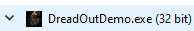
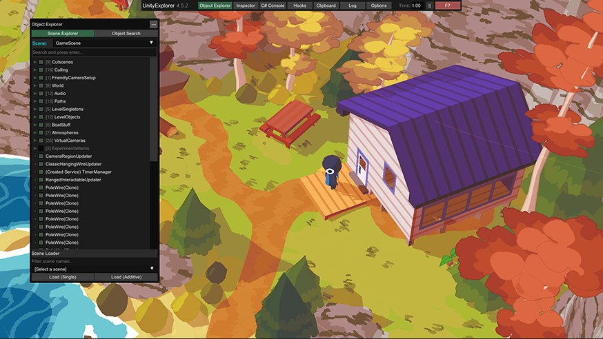
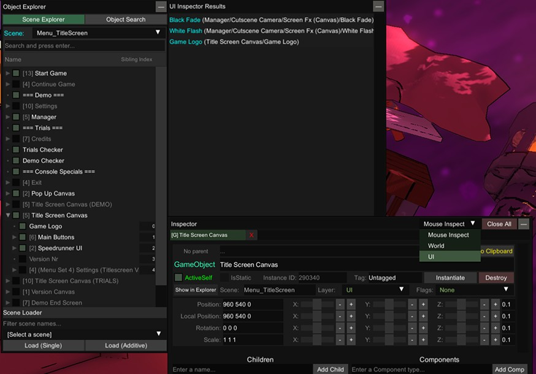

{.shadowed .autosize}

**Engine versions supported:** UnityExplorer supports most Unity versions from 5.2 to 2021+ (IL2CPP and Mono)

*If you ever get lost in the setup or usage of this tool I suggest watching the video above for visual aid.*

# Setup
---

## Identifying the type of Unity game
 
Launch the game and use the Task Manager to check if your game is 32-bit or 64-bit (if it is 32-bit it will have "32 bit" next to the program name).  
{.shadowed .autosize}

Open the game folder to determine if it is Mono or IL2CPP based
- Mono games have a <code>UnityPlayer.dll</code> in the game folder and a <code>Managed</code> folder in the gamedata folder.
- IL2CPP games have a <code>GameAssembly.dll</code> in the game folder and an <code>il2cpp_data</code> folder in the gamedata folder.
 
@alert tip
If the game is on steam you can check the file structure before downloading by going to the [SteamDB](https://steamdb.info) page of the game, `Depots` section, and from the table in there click the ID number on the games depot (usually the one with the bigger file size).
@end

The Unity Engine version number can be found by opening the <code>globalgamemanagers</code> file found in the game's data folder.

{.shadowed .autosize}

## Downloading BepinEx and Unity Explorer

Download the appropriate version of each software.

- [BepinEx v5](https://github.com/BepInEx/BepInEx/releases) (For Mono games)
- [BepinEx v6](https://builds.bepinex.dev/projects/bepinex_be) (For IL2CPP games)
- [UnityExplorer](https://github.com/sinai-dev/UnityExplorer/releases)
- [FreeMoveInjector](https://github.com/vtvrv/FreeMoveInjector/releases)
- [BepInExConfigManager](https://github.com/sinai-dev/BepInExConfigManager) (optional)

## Installation

- Extract the contents of the BepinEx zip into the game folder.
- Extract UnityExplorer and BepinExConfigManager's <code>plugins</code> and <code>patchers</code> folders into the game's BepinEx folder.
- Place <code>FreeMoveInjector.dll</code> in the <code>/BepinEx/plugins/</code> subfolder.

## Starting Unity Explorer

@alert important
IL2CPP based games require Internet access the first time they are launched with BepinEx.
@end
 
Launch the game and BepinEx will complete the installation process. If everything is working a UnityExplorer window will appear.

{.shadowed .autosize}
 
@alert important
Follow the [BepinEx Troubleshooting Guide](https://github.com/sinai-dev/BepInExConfigManager) to get broken game working.
The most common issue is a bad entrypoint.
@end

# Usage
---
## Select Camera
 
 Unity Explorer v4.7.4+ comes with a simple solution to create freecams but it may disable graphical effects.

 {.shadowed .autosize}

 This issue can be avoided by taking control of an existing camera.

* Search <code>UnityEngine.Camera</code> in Unity Explorer's object search tab to get a list of all cameras.
* Inspect each camera to find the main game cam. Usually this is a camera with position values that change while the camera is moving.
* Type <code>BehaviourInjector.FreeMove</code> into the inspector window's Add Comp field to enable free control.

## Controls

Keybind | Description
-- | --
`F5` | Open keybind config menu
`i` | Mov  forward
`k` | Move backward
`j` | Move left
`l` | Move right
`o` | Move up
`u` | Move down
`]` | Increases camera acceleration by a factor of 2
`[` | Decrease camera acceleration by a factor of 2
`"` | Increases camera dampening by a factor of 2
`;` | Decrease camera dampening by a factor of 2

@alert tip
The inspector window can be used to modify camera features such as FOV, draw distance (clipping plane) and more.
@end

## Camera Locking

* Many game cameras will have existing behaviours that will prevent free movement (e.g. CineMachine). Disabling these behaviours will solve this issue.
* Mouse look may not work if the game is locking the cursor to the center of the screen. To solve this keep the UnityExplorer window open as this plugin will unlock the cursor.

## Disabling HUD

The scene explorer window can disable any game object including HUD graphics. Alternatively, the inspector window's mouse inspection tool can easily select specific HUD graphics.
 
  {.shadowed .autosize}

## More links

- [PCGamingWiki Unity page](https://www.pcgamingwiki.com/wiki/Engine:Unity) 
- [BepInEx Documentation](https://docs.bepinex.dev/master/articles/user_guide/installation/index.html) - Extensive installation, configuration and troubleshooting site
