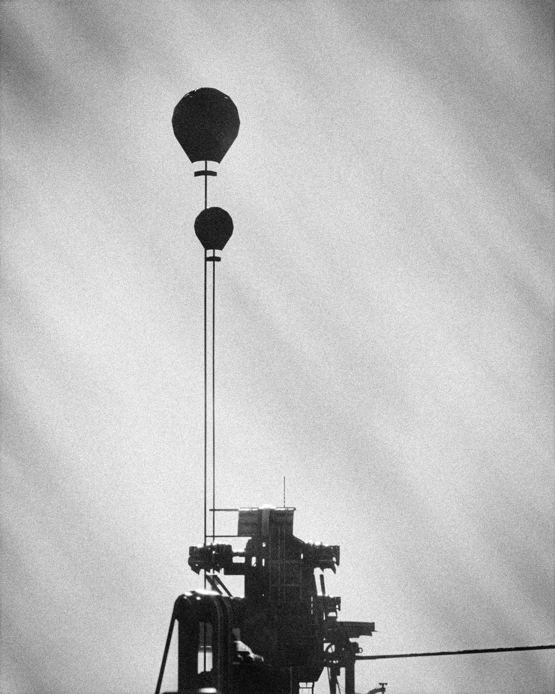
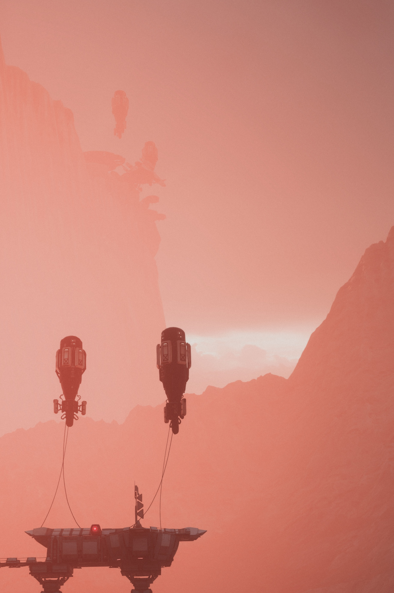
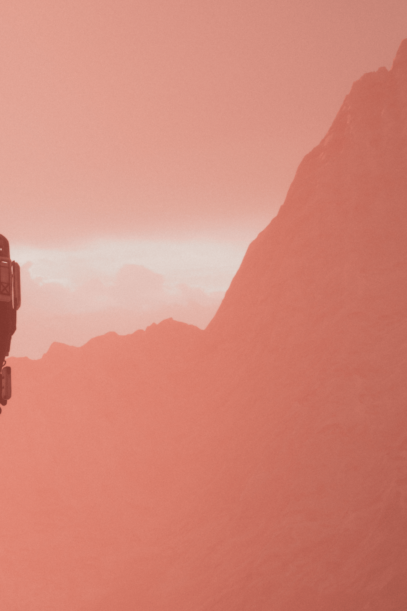

{.shadowed .autosize}

@alert important
This is, like all other photography guides on this site, a guideline, not an absolute rule of 'do this or your shot will be bad'. In photography, there are no rules, just guidelines that can help you avoid pitfalls. These guides are meant to explain why certain aspects work and once you know why these work, it's up to you to use them to achieve what you're after, or go against them if you want to achieve the opposite.
@end
## Grain and Noise
In photography, grain and noise are visual artifacts that result from how the image is captured/processed, grain refers to the optical effect caused by particles of silver halide crystals that form during the development of analog (film) photographs, color film grain also has dye clouds (not just silver crystals)

These crystals are light-sensitive and have a response curve to them. They vary in size and distribution depending on the shooting medium (film stock) used. Larger crystals lead to **coarser grains**, and smaller ones lead to **softer grains**.

@alert info
Grain structure can also be influenced by the developer's chemistry and agitation, not just crystal size. Some developers enhance grain (e.g., Rodinal), while others try to minimize it (e.g., fine grain developers like Kodak XTOL). Brief: A photographic developer is a chemical that makes images on a film or print visible.
@end

Having said that, some people see grain as a desirable feature of photos while others see it as a problem that detracts from the image quality. However, grain is present in a lot of works, is almost unavoidable when shooting analog film, and can also sometimes be added to digital works to achieve a film-like look. 

Grain in analog can vary based on light and dark parts in the image. Usually, there is almost no visible grain in bright spots, because the silver crystals are fully exposed to light, and there is less visible grain in black parts of the image, because there isn't enough light to illuminate the particles there, so grain is more prominent in the shades and tints of the image.

However, dark and light parts of the image can still have visible grain if the film is pushed or developed aggressively because that amplifies the signal in those areas, making the grain visible to the naked eye (same with editing the image in software).

Also, something of note is the trade-off of **film speed (light sensitivity, also known as the film stocks ISO which is pre-determined by the manufacturer)** and **crystal size**. So the bigger the crystals, the more chances it receives enough light to go into a developable state. This means that large crystals result in more sensitive film but at the expense of being visibly grainier and less detailed, while smaller crystals (finer grain) are better at preserving detail but require more light.

@alert info
The amount of film grain can also depend on the definition at which it is observed. For example, it can be more noticeable in an over-enlarged film photograph. 
@end

On the other hand, **noise** in photography refers to random variations of color information/brightness in digital camera photography, more so under low light, high ISO, long exposure times, and heat.

Noise is often colored, which can come in random RGB dots and/or luminance-altered dots, which are often undesired in photography. The noise pattern depends on the sensor, with cheap sensors that may show [banding](../GeneralGuides/how-to-fix-color-banding.htm) or fixed pattern noise, and higher-end sensors which tend to have more random noise (closer to film grain).

It also can be removed with denoising software without altering the overall look of the image much, but removing grain from analog-based media is often invasive and involves altering the overall film look. Although some photographers intentionally reduce grain for a cleaner scan.

@alert important
It's crucial to know when implementing grain into your pictures that putting a constant (even) texture like what **Lightroom** or **Photoshop Camera Raw** do by default may not be accurate to what actual analog (film) looks like. We will dive into getting closer to mimicking real grain later on in the guide.
@end

## Grain Vs Noise

Grain | Noise
--|--
Film Cameras | Digital cameras
Organic, textured | Pixel-level, harsh
Random-sized particles | Random or patterned dots
Monochromatic or colored | Usually colored (RGB dots)
Artistic/Vintage | Generally undesirable

@alert info
* Grain can be deliberately added for a vintage/film look.
* Noise can sometimes be added to mimic film grain.
@end

## Why Film Grain?
There are a lot of reasons to use grain, for example, you could use grain to fake detail on low LOD objects in some games, or try to reduce [banding](../GeneralGuides/how-to-fix-color-banding.htm) in the image. More uses for grain include mimicking the film look found in movies, or adding that layer of realism to a shot like it was taken from a real camera.

Here's a quick comparison of grain vs no grain, you can see the difference in how the overall image feels much less plastic-looking:

  
With grain

  

  
Without grain

  

<input type="range" min="0" max="100" value="50" step="0.01"
    id="slider" class="slider__input"
    autocomplete="off" onwheel="this.blur()"
/>

Shot by Ray_st in Frostpunk 2

Here's another example from Mass Effect: Andromeda:

    
    
Shot by Originalnicodr

You can see the mountains to the right appear to have detail to them. Here's a zoomed-in comparison with the vanilla shot:

  
With grain

  

  
Without grain

  

<input type="range" min="0" max="100" value="50" step="0.01" 
    id="slider" class="slider__input" 
    autocomplete="off" onwheel="this.blur()" 
/>

Shot by Originalnicodr

## How to add it to pictures
There are multiple ways to implement film grain into your pictures, we however recommend using [Reshade](https://reshade.me/) as the best way to implement it:

* **[Shaderdeck](https://github.com/TreyM/SHADERDECK)** by TreyM. *(free version also available inside Reshades setup)*.
* **[PD8006_Film_Grain.fx](https://github.com/prod80/prod80-ReShade-Repository/blob/master/Shaders/PD80_06_Film_Grain.fx)** by prod80, within the shader pack called "Color effects by prod80" in Reshades setup.
* **[MartysModsFILMGRAIN.fx](https://github.com/martymcmodding/METEOR/blob/main/Shaders/MartysMods_FILMGRAIN.fx)** by Marty McFly. Also available in Reshades setup.

However if for any reason you cannot use Reshade to add this, there are other ways to mimic grain:

* Lightroom can actually mimic grain, however, you'd have to mask the highlights, midtones, and shadows of the image and adjust grain manually for each. This can be tedious if you have a bunch of images to work on, though there is a [paid preset](https://vmoldo.com/grain-in-lightroom/) which should make this process easier.
* Photoshop with the [Exposure plugin](https://exposure.software/). Exposure has a lot of film-like settings and presets which can serve as a starting point for custom edits. The plugin's grain implementation lets you adjust the shadows, highlights, and midtones of the grain without extra work which is super convenient.
* You could also use free image manipulation software alternatives like [Gimp](https://www.gimp.org/downloads/). After you install it from the official website, drag and drop your desired image inside the editor, go to `Filters/Noise` then select the type of `Noise` you want to add. I recommend using `HSV Noise`, change dulling to 8 and saturation to 0, and play around with the value until you settle on something that looks right according to the guidelines in the first section. Also, try playing around with other noise types and values.

## How much grain do I apply?
This depends on your understanding of grain in film photography. For example, images that appear to be taken at a higher ISO (film speed) should have coarser and bigger grains, while images that are lower in ISO (film speed) should have finer grains.

This is just one of the aspects you should consider when attempting to replicate real grain in an image. We'd suggest reading more into the first section of the guide to better understand how much or how little to apply if you haven't already.

@alert important
When taking shots in-game it's important to turn off the game's vanilla film grain until you are finished editing every other aspect of the picture, and add it back at the end using a shader or a post-processing tool if desired (if using grain with a Reshade shader, such shader should be positioned last in the order of active shaders),

Doing that allows you to have a clear view of the actual image without grain, then you have complete control over the appearance of the grain without having to juggle how it looks with other effects applied.
@end

*Written by: [NotRay_st](https://x.com/NotRay_st)*

*Last updated on:* 2025/6/30
