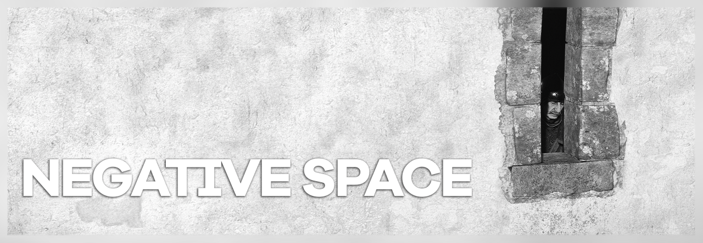
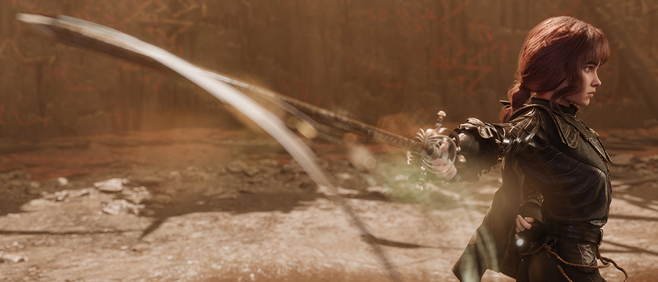

<i>Kingdom Come: Deliverance II</i>, <a href="https://framedsc.com/HallOfFramed/?imageId=1757467115" target="_blank">shot</a> by DaftPope

## Part 1: Introduction (Philosophy and Definition)
If we treat our frame as a canvas in photography, our obsession is usually fixated on the main elements we call "positive space": the character, the action, or the focal object. We concentrate on what to include in the frame, meticulously lighting and framing it. However, what we leave out, or what we leave "empty" around the subject, is just as important as the subject itself. This often-overlooked area—negative space—is one of the most powerful and subtle tools in your visual storytelling arsenal.

Negative space is never just a functionless void or an ordinary background left within the frame. On the contrary, it is a highly active compositional element. It is the breathing room of the frame, a source of visual tension, and a silent narrator that shapes how the audience perceives the scene. It is crucial to remember that negative space is not truly "empty"; it carries its own visual weight and maintains a constant, dynamic interaction with the positive space within the frame.

Especially in Virtual Photography (VP), where we have complete control over the light, weather, and camera (at least in some games), creating this space is entirely in our hands. Negative space is an unparalleled way to establish a minimalist aesthetic, direct the viewer's eye straight to the subject, and define the emotional tone of your work. At its core, negative space is deeply intertwined with the concept of minimalism, fully embracing the "less is more" philosophy. The more isolated and simply you present the subject in your composition, the closer you align with minimalism and, by extension, a powerful negative space composition. These two concepts go hand in hand seamlessly. Understanding and mastering this conscious choice of silence elevates your shots from simply looking good to a level that resonates both artistically and emotionally. While a cluttered frame creates chaos and dynamism, a shot that intelligently utilizes negative space evokes feelings of loneliness, serenity, isolation, or an epic sense of scale.
                                              
## Part 2: How to Create Negative Space: Methods and Techniques
Understanding the philosophy of negative space is only half the journey; the true art lies in applying it within the game engine. Depending on the tools your Virtual Photography setup provides, here are eight highly effective methods to carve out that essential breathing room in your compositions:

### 1. Isolating with Flat Surfaces
This is one of the most fundamental and widely used methods in any virtual photographer's toolkit. Without needing any complex lighting or camera adjustments, simply placing your subject in front of a flat, patternless wall or a clear sky is the most direct way to isolate them. This approach immediately strips away visual distractions and instantly establishes a strong sense of minimalism. It proves that sometimes, finding the right blank canvas in the game world is all it takes to create a striking composition.

    <a href="https://framedsc.com/HallOfFramed/?imageId=1701804218">
        <i>Alan Wake 2, shot by Hary</i>
    </a>

### 2. Lighting and Shadows (Chiaroscuro)
Negative space does not always have to be a physical object or a wide-open landscape; sometimes, it is the sheer absence of light. By increasing the contrast and crushing the black levels in your photo mode, you can drown the unlit areas of your frame in pitch-black darkness. This vast, inky void acts as powerful negative space, guiding the viewer's eye directly to your illuminated subject. Keep in mind that not every game features a custom lighting rig in its photo mode, so you may need to carefully scout the map for the perfect environmental light. However, if the game does allow you to spawn and position artificial lights, this technique becomes incredibly intuitive and rewarding. The way you carve your subject out of the darkness can help you convey a profound range of emotional states.

    <a href="https://framedsc.com/HallOfFramed/?imageId=1678402899">
        <i>Cyberpunk 2077, shot by Gabriella</i>
    </a>

### 3. Silhouettes and Blown-out Highlights
This technique is the extreme opposite of using deep shadows: you are transforming the subject into a dark, graphic mark while turning the background into pure, radiant light. By pointing your camera directly at the sun or a brilliant light source and lowering the exposure, your character is reduced to a stark silhouette. Consequently, the bright sky expands into a massive, glowing negative space. The background doesn't even need to be a flat, solid color for this to work. A backlit character naturally falls into silhouette against a vibrant, fiery sunset, turning the atmosphere itself into your negative canvas.

    <a href="https://framedsc.com/HallOfFramed/?imageId=1622981011">
        <i>Days Gone, shot by pino44io</i>
    </a>

### 4. Depth of Field and Bokeh
When the virtual world around you is too crowded or chaotic and you cannot find a clean background, you can use optical illusions to simply "erase" the clutter. By opening up your aperture (lowering the f-stop) and increasing the blur strength, you lock the focus solely on your character. The messy city lights or dense forest textures behind them melt into soft, smooth color transitions known as bokeh. This creates an artificial, highly aesthetic negative space that rests the eyes. While this method works best for portrait shots, it can occasionally be applied to environmental captures as well. A crucial warning: be very careful with the strength of your blur. Pushing the depth of field too far will completely detach your character from the world, making them look like a cardboard cutout pasted onto a background. The exact intensity of the blur is the key; too much of it will completely ruin the immersion and sabotage the intended effect.

    <a href="https://framedsc.com/HallOfFramed/?imageId=1616598289">
        <i>Star Wars Jedi: Fallen Order, shot by pmi_plotnikov</i>
    </a>

### 5. FOV and Lens Distortion
The focal length of your virtual lens directly dictates the volume of space in your composition. By increasing your Field of View (FOV) to simulate a wide-angle lens, you physically stretch the background away from your character. This distortion creates the illusion of a massive, expansive void between the subject and their surroundings. It is arguably the best method for isolating a character within a landscape, making them appear small and vulnerable while dramatically amplifying the epic scale of the environment.

    <a href="https://framedsc.com/HallOfFramed/?imageId=1729128773">
        <i>Final Fantasy XVI, shot by Otis_Inf</i>
    </a>

### 6. Atmospheric Weather Effects
Harnessing the power of nature—or rather, the game engine's weather system—is a fantastic way to turn a busy background into a blank canvas. By utilizing weather options in photo mode to spawn thick fog, a dense sandstorm, or a blinding blizzard, you can effectively wipe away distracting mountains, trees, or buildings. These atmospheric layers act like a giant eraser, converting the majority of your screen into a soft, gray or white void. While not every game allows you to manually control the weather, fog is a fairly common environmental feature you can hunt for. It is a highly effective, yet surprisingly underutilized, method for generating negative space.

    <a href="https://framedsc.com/HallOfFramed/?imageId=1759969262">
        <i>Tom Clancy's Ghost Recon Wildlands, shot by Axelis</i>
    </a>

### 7. Aspect Ratios
Sometimes, creating space is just a matter of changing the shape of your frame. If you cannot apply the previous methods, or simply want a quick, highly cinematic fix, framing your shot in a 2.35:1 (Ultrawide) aspect ratio instead of the standard 16:9 instantly leaves massive empty spaces on the left and right of your subject. Conversely, switching to a vertical (Portrait) format allows you to utilize the tall expanse of the sky above your character as a towering column of negative space.

    <a href="https://framedsc.com/HallOfFramed/?imageId=1615390137">
        <i>No Man's Sky, shot by nuvolari</i>
    </a>

### 8. Color Blocking
Color blocking involves creating massive, monochromatic areas that completely dominate the frame. This is a technique where texture is minimal, but color is incredibly strong. For instance, if your character is wearing a bright red outfit, framing them entirely against a deep blue ocean or a vivid green field creates a striking visual contrast. These massive, opposing blocks of color eliminate visual clutter and serve as a beautiful, modern form of negative space that immediately catches the eye.

    <a href="https://framedsc.com/HallOfFramed/?imageId=1616990198">
        <i>ABZ\u00db, shot by Dread</i>
    </a>

## Part 3: From Theory to Practice: Compositional Scenarios

### 1. The Art of the Gaze: Lead Room vs. Visual Tension
In portrait photography, the golden rule is to leave "Lead Room" (or Nose Room) in the direction the subject is looking. This feels natural to the human eye; it allows the viewer to follow the character's gaze into the negative space, creating a sense of anticipation or curiosity about what lies ahead.

Breaking the Rule: The Power of Unease While following the rule feels "safe," breaking it can be incredibly powerful. If you place your character at the edge of the frame, looking out of the shot (away from the negative space), it instantly creates visual tension. It triggers a subconscious feeling in the viewer that "something is wrong."

    <a href="https://framedsc.com/HallOfFramed/?imageId=1579952547">
        <i>Shadow of the Tomb Raider, shot by ItsYFP</i>
    </a>

**The Narrative of Departure (The Doom Example)**: Context is everything. Imagine the Doom Slayer (or a similar helmeted figure where facial expression is hidden). If you frame him at the far edge, looking away from the vast negative space behind him, you change the narrative entirely. It’s no longer about what’s coming; it’s about what he’s leaving behind.

The Vibe: It says, "The battle is over. I am leaving the chaos in the past." It conveys fatigue, finality, and a "cool," stoic dismissal of the destruction in the background. Only players who know the character's history will fully grasp this depth, making the shot even more rewarding.

    <a href="https://framedsc.com/HallOfFramed/?imageId=1630363269">
        <i>Cyberpunk 2077, shot by syphon</i>
    </a>

**Trapped in Emotion (The UUU Technique)**: In modern Virtual Photography, we have tools to manipulate the scene beyond the game's default animations. Using camera tools like UUU (Universal Unreal Unlocker)—huge thanks to legends like Otis_Inf—we can manually adjust a character's facial expression.

**The Application**: Change a character’s expression to one of deep sorrow or anxiety. Then, frame them tight against the edge of the screen, denying them "looking space." By squeezing them into the corner with a wall of negative space behind them, you visually replicate their mental state: they feel trapped, backed into a corner, and overwhelmed by the void behind them.

    <a href="https://framedsc.com/HallOfFramed/?imageId=1759204059">
        <i>Silent Hill f, shot by Otis_Inf</i>
    </a>

### 2. Environment and Scale: The Architecture of Emptiness
Environmental photography is arguably the most natural and intuitive canvas for utilizing negative space. In these wide, expansive shots, negative space traditionally evokes a profound sense of peace, clarity, and serenity—though, of course, the emotional tone will always shift based on how you build your composition.

**Defining Scale and Grandeur**: Negative space is your most powerful tool for conveying sheer scale. Imagine a massive castle or a towering monolithic structure. If you position your character small and tucked into one corner of the frame, allowing the structure and the surrounding emptiness to dominate the shot, you instantly amplify the building's imposing presence. The negative space highlights the overwhelming grandeur of the architecture and the insignificance of the character approaching it. This spatial technique works just as brilliantly in vast interior shots, like cavernous halls or abandoned temples.

    <a href="https://framedsc.com/HallOfFramed/?imageId=1771253545">
        <i>Final Fantasy XVI, shot by Hary</i>
    </a>

                                     
**The Ratio of Serenity**: Consider a composition designed to manipulate the viewer's feeling of a location. If you frame a solitary house so that it occupies only the bottom quarter (1/4) of your shot, leaving the remaining three-quarters (3/4) entirely to an empty sky, you create an overwhelming sense of tranquility. The heavy ratio of negative space to positive space forces the viewer to feel the quietness and isolation of that specific moment.

    <a href="https://framedsc.com/HallOfFramed/?imageId=1758845507">
        <i>Kingdom Come: Deliverance II, shot by Hary</i>
    </a>

Ultimately, the Environment category is the most versatile and forgiving playground for negative space compositions. From sweeping landscapes to imposing architecture, these examples barely scratch the surface of the countless ways you can let an environment breathe.
                                       
### 3. Action and Dynamism: Finding Breath in the Chaos
When it comes to the Action category, utilizing negative space correctly and in the right places leaves a lasting and profound visual impact. While we usually associate empty space with calmness, applying it to high-octane moments transforms how the viewer perceives energy, motion, and narrative.

**Trajectory and the Echo of Movement**: In games, weapons and attacks often feature visual effects, such as the sweeping trail of a blade. Leaving a large, empty area in the exact direction a character is swinging their sword does more than just balance the image. It visualizes the sheer power of the strike and the character's professional mastery over their weapon. By providing that empty canvas, you give the kinetic energy of the action a physical space to travel through and resonate with the viewer.

    <i>Clair Obscur: Expedition 33, shot by eulkeke</i>

**Visual Rest in the Midst of Chaos**: Imagine a highly chaotic battlefield where fifty characters are clashing simultaneously. If the entire frame is packed from edge to edge with action, the image quickly becomes overwhelming and exhausting to look at. By intentionally carving out empty areas within that chaos—perhaps by using the blinding flash of an explosion, a thick cloud of smoke, or a stark shadow as your negative space—you provide the viewer's eyes with a crucial place to rest. This "breathing room" allows the audience to comfortably digest the scene, making the epic scale of the battle much easier to read and interpret.

    <a href="https://framedsc.com/HallOfFramed/?imageId=1628047214">
        <i>A Plague Tale: Innocence, shot by t Wi Y</i>
    </a>

**The Relentless Journey and Scale**: Consider a racing game: a lone car speeding down an endless, vast road evokes entirely different feelings compared to a classic, tightly framed automotive shot. While traditional car photography focuses on the aggressive mechanical power of the vehicle, placing that speeding car within a massive void shifts the narrative. It emphasizes the epic scale of the environment, a profound sense of isolation, and the relentless nature of the journey itself. The speed becomes less about noise and more about an unstoppable force moving through an expansive world.

    <a href="https://framedsc.com/HallOfFramed/?imageId=1611552595">
        <i>Assetto Corsa, shot by Lokopixo</i>
    </a>

**Riding into the Unknown**: Similarly, framing a cowboy riding a horse into a vast, undefined emptiness is one of the absolute best tools for conveying a pure sense of freedom. That massive negative space ahead of the character isn't just an empty background; it represents the untamed frontier, an unwritten story, and the quiet thrill of stepping into the limitless unknown.

    <a href="https://framedsc.com/HallOfFramed/?imageId=1671916954">
        <i>Red Dead Redemption 2, shot by emersy</i>
    </a>

