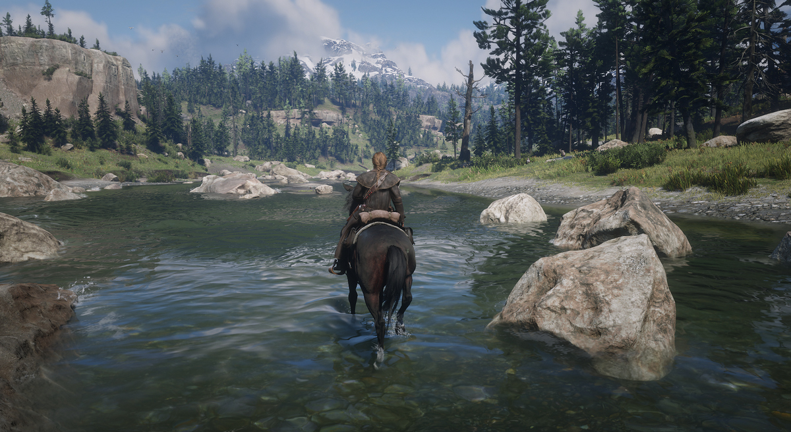
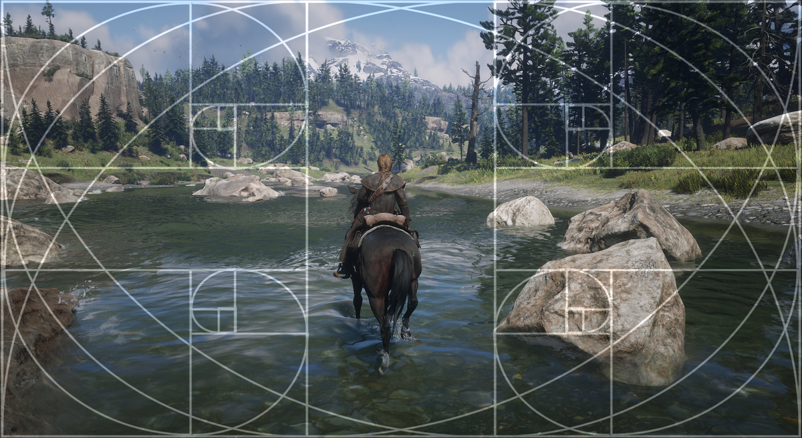
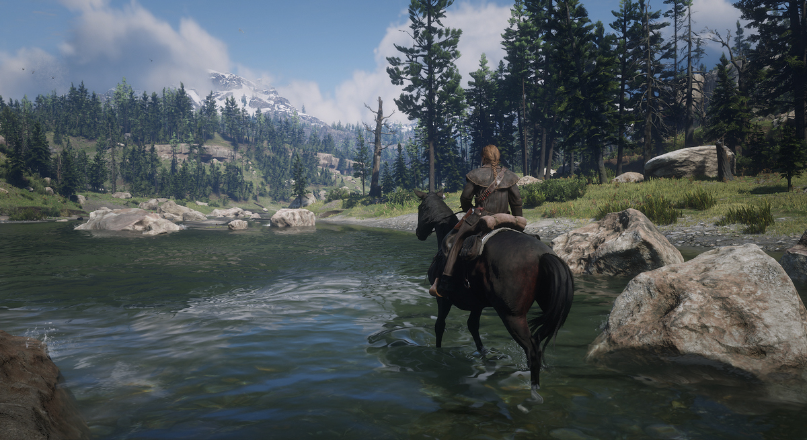

Rule of Thirds
================================

@alert Important
This is, like all other photography guides on this site, a *guideline*, not an absolute rule of 'do this or your shot will be bad'. In photography there
are no rules, just guidelines which can help you avoid pitfalls. These guides are meant to explain why certain aspects work and once you know why these
work, it's up to you to use them to achieve what you're after, or go against them if you want to achieve the opposite. 
@end

In photography, one of the first basic 'rules' about composition is the *Rule of Thirds*. The rule of thirds is about placing your subject at 
one-third of the image, be it vertically or horizontally. It doesn't matter if it's one-third from the left side or from the right side. This guide will have pictures using the Golden Ratio shader for reshade from [OtisFX](https://github.com/FransBouma/OtisFX), which can be a handy helper with respect to finding the location of 
where the one-third of your image is. 

Why does this work? The Rule of Thirds affirms that putting the subjects slightly off the centre will make the image more dynamic. Some argue that better results can be achieved when using the golden ratio (1.618), rather than 1/3, but this is subjective to who you talk to. In the pictures below the golden ratio swirl is visible too. 

Let's look at an example of two shots. The first has the subject spot on in the middle of the shot. As you can see, it's not on one of the lines of the overlay
provided with the Golden Ratio shader. While it might look 'ok', there's some friction. 

  

    
Final shot

    
  

  

    
With grid overlay

    
  

  <input type="range" min="0" max="100" value="50" step="0.01" 
    id="slider" class="slider__input" 
    autocomplete="off" onwheel="this.blur()" 
  />

Shot not in line with the Rule of Thirds

  

    
Final shot

    
  

  

    
With grid overlay

    
  

  <input type="range" min="0" max="100" value="50" step="0.01" 
    id="slider" class="slider__input" 
    autocomplete="off" onwheel="this.blur()" 
  />

Shot in line with the Rule of Thirds

The bottom shot has the subject, the character on the horse, at one-third of the shot from the right side and also one third of the shot from the bottom. Together
with the mountain in the background which is close to one-third from the left side of the shot, it balances things out better. 

## Useful Links

There's a lot written about Rule of Thirds. Here are a few links of you want to learn more

- [Digital Photography School on Rule of Thirds](https://digital-photography-school.com/rule-of-thirds/)
- [SLR Lounge on Rule of Thirds](https://www.slrlounge.com/glossary/rule-of-thirds-definition/)
