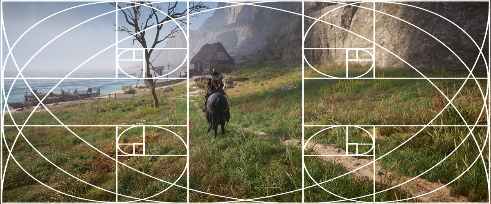
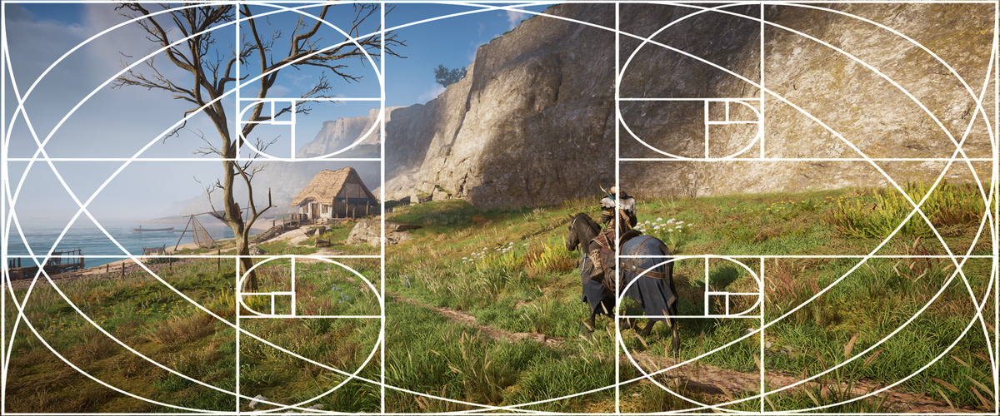

Rule of Thirds
================================

In photography, one of the first basic 'rules' about composition is the *Rule of Thirds*. The rule of thirds is about placing your subject at 
one-third of the image, be it vertically or horizontally. It doesn't matter if it's one-third from the left side or from the right side. This guide will have pictures using the Golden Ratio shader for reshade from [OtisFX](https://github.com/FransBouma/OtisFX), which can be a handy helper with respect to finding the location of 
where the one-third of your image is. 

WHy does this work? The Rule of Thirds affirms that putting the subjects slightly off the centre will make the image more dynamic. Some argue that better results can be achieved when using the golden ratio (1.618), rather than 1/3, but this is subjective to who you talk to. In the pictures below the golden ratio swirl is visible too. 

@alert Info
As with all 'rules' in photography, this rule isn't an absolute, which means if you don't want to obey them, it's OK! See these 'rules' more as guidelines
to achieve a shot that will likely be pleasing to the eye of your viewer. 
@end

Let's look at an example of two shots. The first has the subject spot on in the middle of the shot. As you can see, it's not on one of the lines of the overlay
provided with the Golden Ratio shader. While it might look 'ok', there's some friction. 

{.shadowed .autosize}

{.shadowed .autosize}

The bottom shot has the subject, the character on the horse, at one-third of the shot from the right side and also one third of the shot from the bottom. Together
with the small house in the background which is close to one-third from the left side of the shot, it balances things out better. 

## Useful Links

There's a lot written about Rule of Thirds. Here are a few links of you want to learn more

- [Digital Photography School on Rule of Thirds](https://digital-photography-school.com/rule-of-thirds/)
- [SLR Lounge on Rule of Thirds](https://www.slrlounge.com/glossary/rule-of-thirds-definition/)
