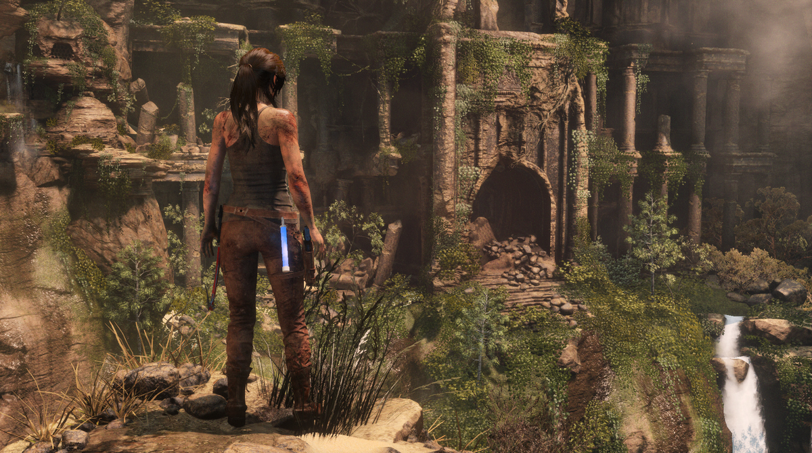
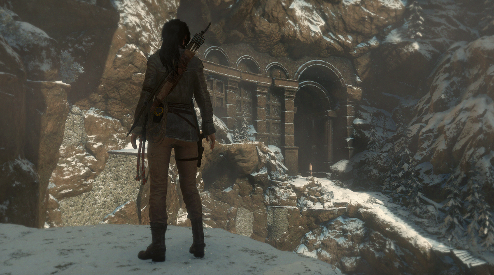
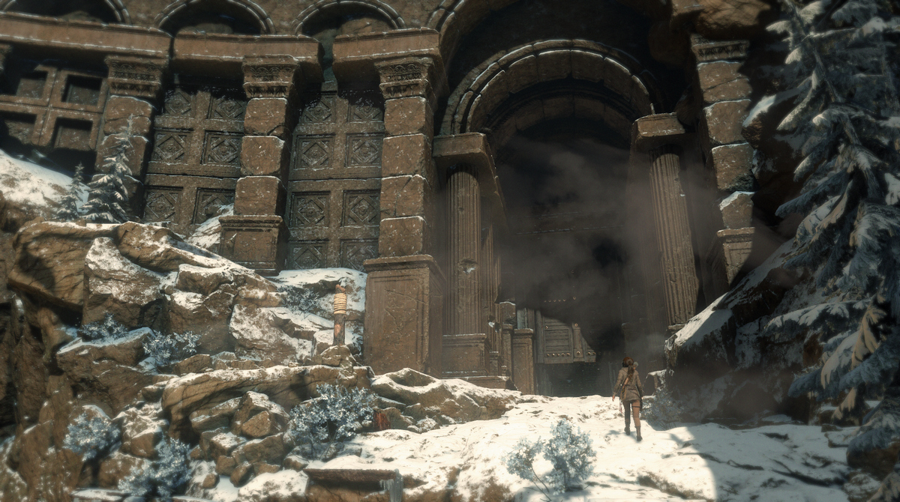
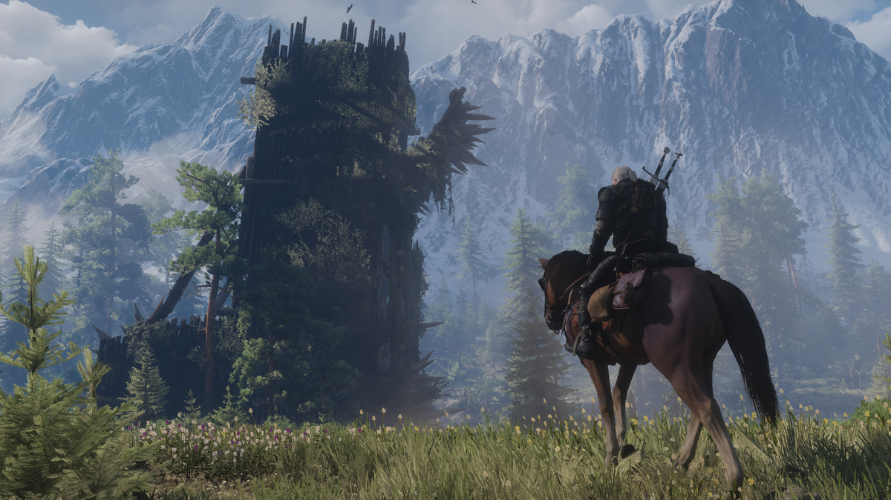
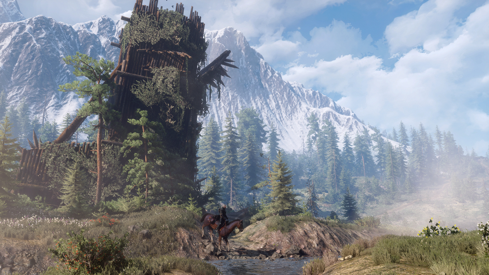
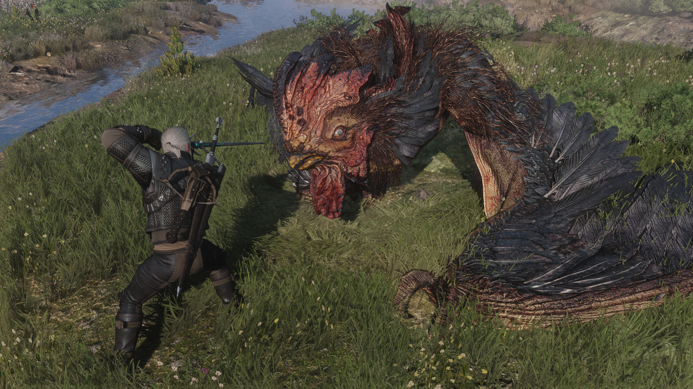
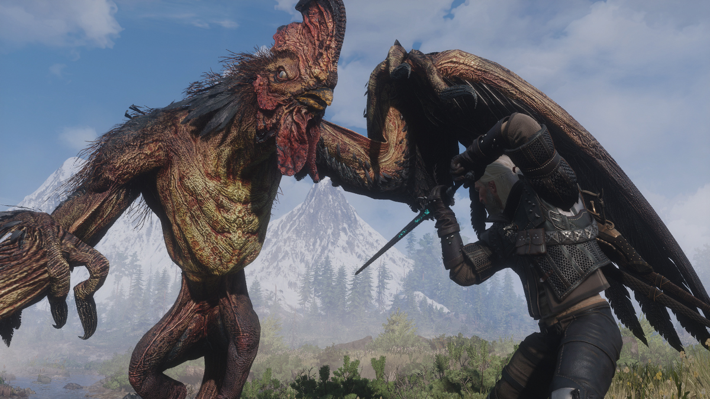

Perspective and Scale
================================

@alert Important
This is, like all other photography guides on this site, a *guideline*, not an absolute rule of 'do this or your shot will be bad'. In photography there
are no rules, just guidelines which can help you avoid pitfalls. These guides are meant to explain why certain aspects work and once you know why these
work, it's up to you to use them to achieve what you're after, or go against them if you want to achieve the opposite. 
@end

## Scale of geometry
We work with 2D images, and as such we have to help the viewer to understand sizes in what was the 3D space we took a photograph of. Consider the following example
from Rise of the Tomb Raider:

{.shadowed .autosize}

At first there's not a whole lot wrong with the image: Lara looks at what appears to be a big doorway. However, if we look again, we can't really judge just
*how big* the doorway really is. The crucial information we're missing is *how far is the doorway away?*. All we have is a 2D image after all. So if the doorway
is 2 meters away, or 200 meters away, it will change the perception of how big that doorway really is. 

We also lack any *reference point* to judge how big the doorway is. All we have is the character in the front. If we didn't know better, it looks like Lara
is a giant looking down at a small doorway she'll never fit into.

To fix this we can try to position a human, or other element we know the size of, close to the big object, so we'll know "oh, it appears to be 10 times bigger than
a human". Below are two examples of how we can solve this.

{.shadowed .autosize}

{.shadowed .autosize}

The second shot clearly illustrates the epicness of the massive doorway, while the first shows the doorway but we have no idea how big it is so it loses its power.

{.shadowed .autosize}

{.shadowed .autosize}

In the second shot we clearly can measure the tower's size as a human on a horse is close to it. 

## Scale of enemies

In action shots we often have our subject/hero fighting a monster or other enemy. To make this encouter more dramatic, try to make the enemy look bigger than 
our hero/subject so it makes the situation all the more exciting. Of course this works only with enemies we don't know the size of, like an imaginary monster. 
If your hero fights another human, be at least sure the hero isn't looking down at the enemy.

Below's example illustrates this. The first shot is a shot from above where our hero fights a huge enemy. However the enemy is currently in a lower position than
the hero and looks quite timid. The second shot is the same enemy but now it's towering above our hero, making it way more exciting.

{.shadowed .autosize}

{.shadowed .autosize}

