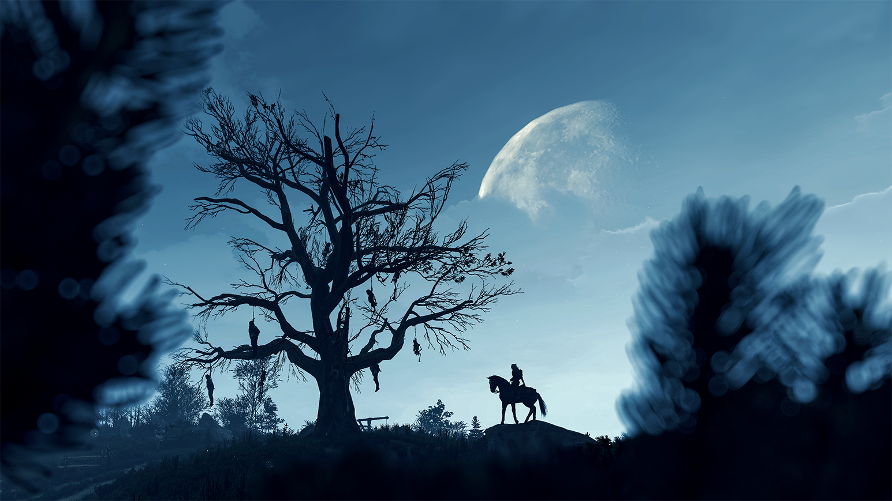
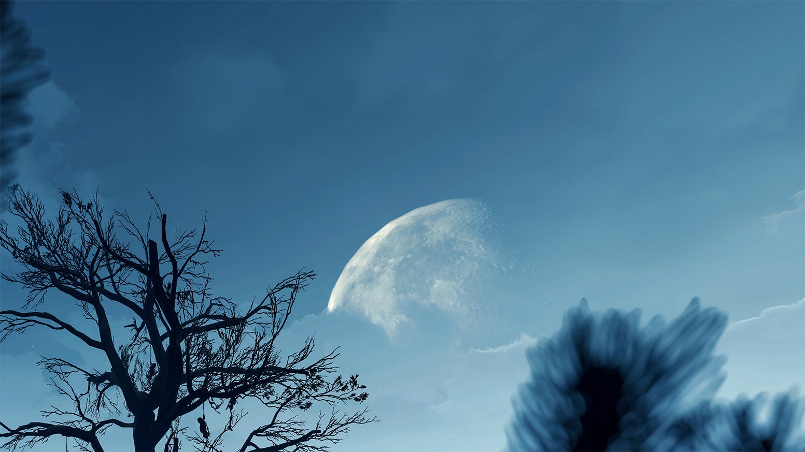
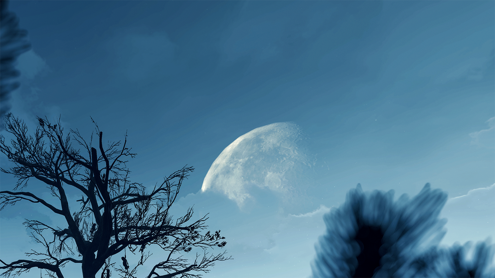
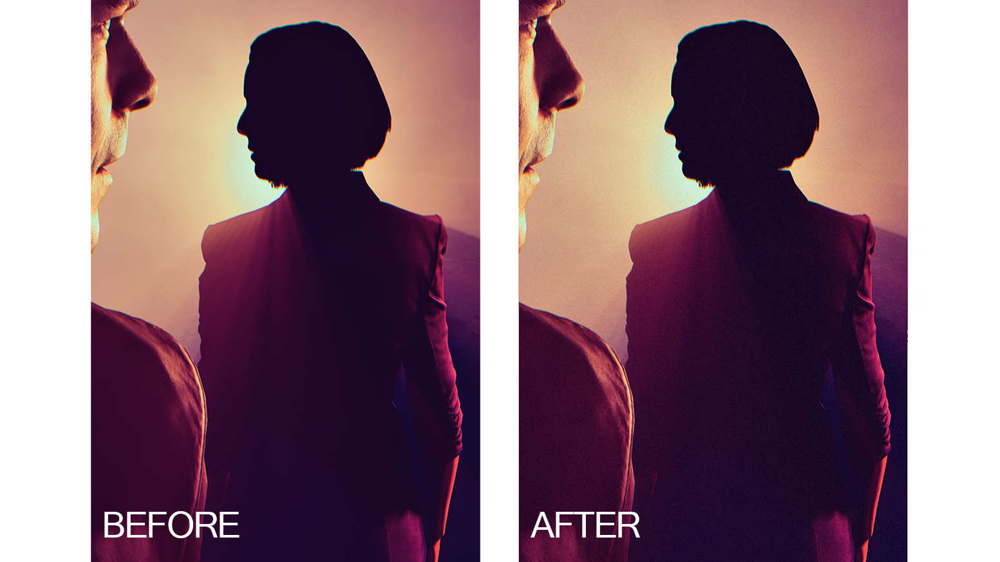

Lets talk about the color banding, why it happens, how to remove the banding from a sky, subject, or a background with useful techniques, and how, when and why to use grain, surface blur and noise. These techniques are nothing advanced neither demanding so its pretty easy and straight forward to follow, and it can be useful to anyone, especially for the people who are just starting this hobby and want to have the clean screenshots without any annoying defects before posting it on social media.

This guide will focus on post-processing with Adobe applications rather then in-game with ReShade. Guide examples bellow are zoomed [hotsampled](https://framedsc.com/basics.htm#hotsampling) 20MP shots <em>cropped</em> from 21:9/3:4 aspect ratios to inpect closely the sky for banding, or any other defects, and if there's any, this guide will show you how to solve it.

 

<left> <b>BANDING AS OUR ENEMY</b>  

 Color banding is one of the most disturbing defects that you can find in your image. This phenomenon happens in smooth areas with similar shades, for example, a fading gradient (from light to dark), when the abrupt color change cannot be presented accurately. This results in certain colors appearing as bands rather than smoothly transitioning from one hue to another.

 For banding to occur, it doesn't need to be the image adjustments, but lets say that they are, the more adjustments you make to a screenshot the higher the chances are for banding to occur.
 

Example of banding after applying curves adjustment layer on the gradient. You can see it in a form of straight vertical lines. <em>(image example created by me)</em>

   

So what should appear as a smooth gradient, will instead show a straight vertical lines that don't appear to blend well at all. They can appear in different forms of shapes as well.

Not to mention how this case became more evident duo to social media websites that apply heavy compression to the images, by further reducing the number of tones available which often results in a mess. 

So lets focus now on how to fix this defect, and how I deal with this in general.   

@alert neutral
There are simple ways on how to eliminate the banding on a shot fast in Photoshop and Lightroom, specifically in the sky to begin with.
@end
 

## Guide Requirements

@alert Important
Since this is a post-processing guide which happens after you are finished with the in-game photo shooting session, you would need to have Adobe Photoshop and Lightroom installed on your computer.
@end
   

## Photoshop

First off, drop your shot into Photoshop and duplicate the background layer by pressing Ctrl + J on PC, or by right clicking the Background layer > Duplicate layer. <b>Its very important</b> to make sure that you are in 16bit mod by checking Image menu > Mode, and make sure that 16Bits/Channel is [selected](https://i.imgur.com/DtjOh5s.png). Now go to Filters menu and choose Convert for Smart Filters. This way your duplicated layer becomes a Smart Object and you can work non-destructively. 

Go to Select menu > Sky and the AI will make the sky selection for you. You can then use Quick Selection Tool (W  button) for more precise selection if you are not happy with the result e.g. if AI did not made the selection the way you wanted (dont forget to zoom in while doing the precise manual selection by holding Alt+Scroll wheel). 

Then we wanna go to Filter menu > Blur > Surface Blur. With the threshold around 19-20 raise the radius slider slowly up to that point until you no longer see the evidence of banding in the small window and press ok. 

@alert Tip
If you see some of the banding defects on the sides, or bellow the sky on the cloud you can select the main duplicated layer, and use Quick Selection Tool to select that area while you have the Surface Blur and Noise as Smart Filters, then press Ctrl + J, and effect will be applied on the new layer. You can go like that as much as you want to heal all of it fast. Its pretty straight forward. [Before](https://i.imgur.com/XkSzyMq.png) and [After](https://i.imgur.com/BZTvyDN.png)
@end

  

    
AFTER EDIT

    
  

  

    
BEFORE EDIT

    
  

  <input type="range" min="0" max="100" value="50" step="0.01" 
    id="slider" class="slider__input" 
    autocomplete="off" onwheel="this.blur()" 
  />

Example of banding in a sky, and result after the surface blur without blurring out rest of the image such as the moon, and other healthy parts of the sky.

Lets go further now with different example by adding some noise. So after the surface blur you can now apply some noise to it by going to Filter menu > Noise > Add Noise. The percentage of the added noise should be around 2% so you get the idea. Not too much. Leave the options Uniform, Monochromatic checked and go ok.

  

    
AFTER EDIT

    
  

  

    
BEFORE EDIT

    
  

  <input type="range" min="0" max="100" value="50" step="0.01" 
    id="slider" class="slider__input" 
    autocomplete="off" onwheel="this.blur()" 
  />

Sky comparison again, this time with added noise, surface blur with radius of 10-15, and treshold around 20. No banding.

   

## Lightroom 

Similar you can do in Lightroom. After you import a screenshot into Lightroom, press Shift + W on PC or bellow the histogram click on the [circle](https://i.imgur.com/uqktFNI.png) to add a mask. Click on Select Sky and Lightroom will magically select the sky for you. If you are not happy with the AI selection then while the mask is selected click on Subtract (Subtract from mask With...) and select a brush (to avoid confusion sometimes subtract is only showed as minus, because your Masks window is smaller, and if thats the case, you can enlarge it by clicking the [arrows](https://i.imgur.com/NZTCyBS.png) at the top right of Masks window). Use the brush to remove the area of the effect where you don't want blur to be applied. Make sure to play with brush settings to smooth out the transitions. 

Click for Lightroom tip!

Hold Space + Left Click on the image to zoom in and out. If you want to zoom higher go to [navigator](https://i.imgur.com/y2uh0R0.png) and pick percentage, or hold  Ctrl +/- (plus/minus) on a PC to go through all existing magnification levels (hitting Z button takes you to the previously used zoom level, and by hitting Z a second time, it brings you back to the original zoom state). Control size of the brush with mouse wheel.

Once done, you can reduce sharpness, texture and a bit of clarity of sky, and then add a bit of grain. Just be carefull to control the other settings as well if you decide to take out a bit of clarity. <b>Reducing the clarity a lot</b> tends to create unexpected brightness, because you are removing some the contrast, and its quite noticeable.

  

    
AFTER EDIT

    
  

  

    
BEFORE EDIT

    
  

  <input type="range" min="0" max="100" value="50" step="0.01" 
    id="slider" class="slider__input" 
    autocomplete="off" onwheel="this.blur()" 
  />

A comparison of sky, but this time edits are applied in Lightroom with minus texture and added grain around 15 to eliminate the banding.

   

Also we can see here that adding only grain didn't helped to eliminate the banding entirely, so minus texture did the trick.

  

    
AFTER MINUS TEXTURE

    
  

  

    
BEFORE MINUS TEXTURE

    
  

  <input type="range" min="0" max="100" value="50" step="0.01" 
    id="slider" class="slider__input" 
    autocomplete="off" onwheel="this.blur()" 
  />

 

Sometimes I blur the sky out quite a bit to make sure I don't see any defects, especially when I decide to shot some of the older games where the sky transitions and its textures are terrible, and where small adjustments can't help. Also, sometimes I leave the shot only with surface blur applied like in the first case, depends on how I want a shot to look like e.g. softer, smooth buttery look in the image for some particular reason, unless I am forced to add some noise or grain to fight the banding. But, in most cases, I go further by adding noise or grain. In general there are no rules really. 
Its all about your personal approach and what you want as your final result.

Also, in general, you should add noise or grain to an entire image in the end, unless you want to mask certain areas with it to add more details. In this guide I used them immediately just to show you an example of their effectiveness against banding.

@alert Info
 Just keep in mind that surface blur cannot fix all types of banding, so we will need to add a noise or grain on top of that. Its the best to combine them all anyways.
@end

 

## Different cases

If the banding happens duo to some lighting around the subject, we repeat the same process as above for [Photoshop](https://framedsc.com/Post-ProcessingGuides/SimpleTechniquesToFixColorBanding.htm#Photoshop), just skip the part where you need select the sky. 

Apply the surface blur and noise on duplicated layer as mentioned above, and then click back on the background layer, and then we wanna go to Select menu > Subject. You can use Quick Selection Tool (W button) if needed for more precise selection. Go back to layer where you applied surface blur and noise, click on the little icon at the bottom that looks like a camera called layer [mask](https://i.imgur.com/56e7Zis.png). 

Now after creating a layer mask, click on it, and press Ctrl + I to invert that mask (layers should look like [this](https://i.imgur.com/ykrE66v.png)). What that will do is it will isolate the subject out of that effect. Lastly, grab a Brush by pressing B on a keyboard, or by picking up the Brush from the [left](https://i.imgur.com/sJWYYJ1.png) (make sure it’s a [black brush](https://i.imgur.com/YOhDeUQ.png)) with 100% opacity and 100% flow (by default it should be already), and paint around where you don’t want effects to be applied basically leaving the healthy areas of the image untouched by the surface blur and noise (if its the subject only that you want to be isolated then you don't have to use the brush, you can leave it). You can play with the opacity of the brush and flow to smooth out the transitions. [Here](https://i.imgur.com/RQF1iY6.png) you will see an example how everything is setup. In the banding area there is noise, and surface blur applied to fight the banding while other areas are untouched by the effects.

Same goes for [Lightroom](https://framedsc.com/Post-ProcessingGuides/SimpleTechniquesToFixColorBanding.htm#Lightroom), just instead of sky select the background, and repeat the same steps as above with Subtract to mask, and use brushes to smooth out transitions and play with its settings.

To break this down for Lightroom. 

1. [example](https://i.imgur.com/YzWh5Cv.png) when Lightroom selected entire background. 
2. [example](https://i.imgur.com/b9gOcZ0.png) when I used Subtract to Mask with a Brush to clean the areas so I am left with clean background selected only.
3. [example](https://i.imgur.com/vVFDAxu.png) when I used a brush again to remove the background selection to focus only on color banding area. 
4. Now you can apply the same edits as mentioned above to remove the banding.

   

If the banding occurs duo to some lightning that bleeds out behind the subject, you can use Quick Selection Tool from Photoshop to select the banding area. Selection example in Photoshop should look like this [this](https://i.imgur.com/LI6uogy.png). Applied edits to remove the banding will only cover that area.

In Lightroom, go to Masking (Shift+W) and select a Subject so the AI makes the selection for you. If there are two subjects and banding covers only one, then what you do is Subtract to Mask with a Brush to remove the selection from the other subject.
Final selection example after doing the Subtract to Mask with a Brush in Lightroom looks like [this](https://i.imgur.com/Cu2SQYJ.png). Applied edits to remove the banding will only cover that area.

Smoothing out the banding that comes from the lighting which bleeds out behind.

  

##Grain usage on shots in general, and why grain, noise and blur

&nbsp;

<left> <b>THEY CAN SOLVE COLOR BANDING</b>  

@alert neutral
Applying grain to a shot comes down to a personal choice. Its entirely your own individual preference, though I highly recommend it. Adding noise or grain can significantly improve your images.
@end

One of the main fighters against color banding is the grain. As seen above, a bit of grain can help to blend those harsh transitions between the tones. Grain not only that can help to eliminate the color banding it can also add a unique special feel and mood to an entire shot, or it can even determine your style. A touch of grain on your shot can add that old times feel by adding the vintage look to a shot, it can add more details, and it can make a photo look much deeper.

I, personally, dont apply grain when I do processing with ReShade. I like to do it after. 
Simply put, I want to have the cleanest image possible for various tweaks such as color adjustments etc. that I do in Lightroom. I don't want to deal with a noisy image in post, unless you are already satisfied with the shot result which has a grain on it which was applied from ReShade.  
A small tip anyways would be to always inspect a shot before moving on.

This is not about me convicing you what to do, because grain is a subjective thing, and its usage depends on what you're aiming for with your content, but its about how grain can help you against the banding, and how it can improve your shots in general. 

The same I can say for the noise and the surface blur. For example, if the image that contains a paper and a pencil looks too smooth it might appear artificial to our eyes, but adding a bit of noise, it will look more sharper, and <em>natural</em> to our eyes.
 
If you need more <em>convincing</em>, no worries! Lets bring up now the final comparison on why I mentioned the grain, noise and surface blur, and why would you need to use them in fight against banding. 

&nbsp;

Can you notice the difference in gradients bellow?

Top: banding example; Middle: 0.58% of added noise to reduce the banding; Bottom: how it looks with surface blur applied only <em>(image example created by me)</em>

&nbsp;

<em>Written by</em>, StephenCalic(Defaltsiuncula)

