{.shadowed .autosize}

**Multi-sampled Accumulated Depth of Field** (**MSADOF**) is an advanced DOF add-on for ReShade developed by murchalloo. It renders depth of field without using a depth buffer for the blurring process, greatly increasing the possibilities of defocused captures. This is an advanced guide that aims to cover the usage of MSADOF, as well as its setup process for you and other users.

@alert important
MSADOF requires **ReShade 5.2+ with [full add-on support](../../Images/reshade_FullAddonSupport.png)** and supported [Otis_Inf camera tools](https://patreon.com/Otis_Inf). *All cameras newer than the 31st of May 2022 should have support for MSADOF, look for "Supports IGCS Connector" in the "Versions and compatibility" table of each [game](https://opm.fransbouma.com/Gamespecificfunctionality.htm).*
@end

@alert neutral
The add-on is currently in closed beta and is unavailable for public download.  
@end

@alert neutral  
This guide is a work-in-progress and will be updated shortly. It currently covers a test build of the add-on and doesn't reflect the updated state of the UI.  
@end

---

## Advantages

MSADOF works by manipulating the game camera around a certain plane in space and progressively blending the result to produce a defocused image that's depth-accurate. This results in:

  

    
MSADOF

    
  

  

    
Traditional depth-based DOF

    
  

  <input type="range" min="0" max="100" value="50" step="0.01" 
    id="slider" class="slider__input" 
    autocomplete="off" onwheel="this.blur()" 
  />

Accurate near-plane bleed.

  

    
MSADOF

    
  

  

    
Traditional depth-based DOF

    
  

  <input type="range" min="0" max="100" value="50" step="0.01" 
    id="slider" class="slider__input" 
    autocomplete="off" onwheel="this.blur()" 
  />

Alpha hair in DOF!

  

    
MSADOF

    
  

  

    
Traditional depth-based DOF

    
  

  <input type="range" min="0" max="100" value="50" step="0.01" 
    id="slider" class="slider__input" 
    autocomplete="off" onwheel="this.blur()" 
  />

Particle & alpha effects in DOF.

  

    
MSADOF

    
  

  

    
Traditional depth-based DOF

    
  

  <input type="range" min="0" max="100" value="50" step="0.01" 
    id="slider" class="slider__input" 
    autocomplete="off" onwheel="this.blur()" 
  />

Depth-accurate reflections.

  

    
MSADOF

    
  

  

    
Traditional depth-based DOF

    
  

  <input type="range" min="0" max="100" value="50" step="0.01" 
    id="slider" class="slider__input" 
    autocomplete="off" onwheel="this.blur()" 
  />

Layered defocusing of transparent and translucent materials.

---

## Installation & initial setup

MSADOF comprises of one file and two folders, `IgcsConnector.addon`, and a `reshade-shaders` and `MSADOF` folder. Copy over `IgcsConnector.addon` to the same folder as your game's ReShade DLL for ReShade to be able to use it. Merge `reshade-shaders` into your current `reshade-shaders` folder, ensuring that the files `MSADOF.fx` and `MSADOF.fxh` are installed. The `MSADOF` folder may be placed in the same folder as the add-on, but the add-on can also be set up to find it elsewhere.

Once installed, upon opening the ReShade GUI, you will now see a new window. This is where you will control the bulk of MSADOF. You must also enable `MSADOF_ADDON` in your shaders list and drag it all the way to the bottom of the list. Depth buffer access is necessary for the full functionality of the add-on.

The add-on should also show up under the *Add-ons* tab of the ReShade GUI.

For the add-on to function as intended, it's typically necessary to enable vsync or an FPS cap of around 30 in your game. This ensures consistent frame pacing for clean results. Motion blur should also be disabled.

---

## List of preconfigured values

As setting MSADOF up from scratch can be tricky, this is a compilation of known MSADOF values for games that have been tested. With the GUI open, switch from the `Photography Mode` tab to the `Tweaking Mode` tab. Scroll down and expand **Game Adjustments** to add these values. You may also have to change some values in **DOF Settings**.

View list

@alert info
The *Frames to skip* parameter is dependent on your own hardware and the current performance of the game. Tweak the value if you notice that the image isn't sharp or if there are [visible rings](#calibrating-the-focus-plane) forming.
@end

@alert important
For all games tested so far, `Flip X` should be checked. Leave `Flip Y` unchecked. 
@end

| Game                                | Near Plane | FOV | Variable Near Plane | Camera Multiplier |Comments|
|-------------------------------------|------------|-----|-------------------------|-----------------------|--------|
| A Plague Tale: Requiem              | 0.0490     | 180 |                         | 0.001                 |The near plane value only works reliably in photomode.|
| Ace Combat 7: Skies Unknown         | 1.0000     | 180 | ✔                       | 0.100                 ||
| Aliens: Fireteam Elite              | 9.9965     | 180 | ✔                       | 0.100                 ||
| Assassin's Creed Odyssey            | 0.0995     | 180 |                         | 0.001                 ||
| Assassin's Creed Origins            | 0.0995     | 180 |                         | 0.001                 ||
| Assassin's Creed Valhalla           | 0.0995     | 180 |                         | 0.001                 |TAA can only be disabled via [HxD](https://www.pcgamingwiki.com/wiki/Assassin%27s_Creed_Valhalla#Anti-aliasing_.28AA.29).|
| Batman: Arkham Knight               | 9.9965     | 180 | ✔                       | 0.100                 ||
| Beyond a Steel Sky                  | 9.9965     | 180 | ✔                       | 0.100                 ||
| Borderlands 3                       | 9.9965     | 180 | ✔                       | 0.100                 ||
| Blind Fate: Edo no Yami             | 9.9965     | 180 | ✔                       | 0.100                 ||
| Chernobylite                        | 1.0000     | 180 | ✔                       | 0.100                 ||
| CHORVS                              | 56.500     | 180 | ✔                       | 0.100                 ||
| Close to the Sun                    | 1.0000     | 180 | ✔                       | 0.001                 ||
| Code Vein                           | 9.9965     | 180 | ✔                       | 0.100                 ||
| Cyberpunk 2077                      | 0.0200     | 180 |                         | 0.001                 |Might require raytracing / a low framerate under vsync targets.|
| Days Gone                           | 9.9500     | 320 |                         | 0.100                 |Setting AA to 0 will result in a loss of HUD and console access.|
| Death Stranding: Director's Cut     | 0.1123     | 180 |                         | 0.001                 |The game will crash after a render in photomode, near plane changes constantly in cutscenes and its recommended to turn on the 30fps cap.|
| Draugen                             | 9.9965     | 180 | ✔                       | 0.100                 ||
| ECHO                                | 0.5600     | 180 |                         | 0.100                 |No custom AR possible.|
| Elden Ring                          | 0.0500     | 180 |                         | 0.001                 |Camera multiplier can change from area to area. **In-game antialiasing can cause blurry results**.|
| Final Fantasy VII Remake Intergrade | 5.6250     | 180 |                         | 0.100                 ||
| Hellblade: Senua's Sacrifice        | 9.9965     | 180 | ✔                       | 0.100                 ||
| Kena: Bridge of Spirits             | 9.9965     | 180 | ✔                       | 0.100                 |The near plane value only works reliably in photomode.|
| Life is Strange: True Colors        | 9.9965     | 180 | ✔                       | 0.100                 ||
| Marvel's Spider-Man Remastered      | 0.0775     | 140 | ✔                       | 0.001                 ||
| Mortal Shell                        | 9.9965     | 180 | ✔                       | 0.100                 ||
| MotoGP 19                           | 9.9965     | 180 | ✔                       | 0.100                 ||
| Observer: System Redux              | 9.9965     | 180 | ✔                       | 0.100                 ||
| Omno                                | 9.9965     | 180 | ✔                       | 0.100                 ||
| Resident Evil 2	(DX12)              | 0.0100     | 180 | ✔                       | 0.001                 ||
| Resident Evil 3	(DX12)              | 0.0100     | 180 | ✔                       | 0.001                 ||
| SCARLET NEXUS                       | 9.9965     | 180 | ✔                       | 0.100                 ||
| Scorn                               | 3.0000     | 180 | ✔                       | 0.010                 ||
| Sifu                                | 9.9965     | 180 | ✔                       | 0.100                 ||
| Spirit of the North                 | 9.9965     | 180 | ✔                       | 0.100                 ||
| Star Wars Jedi: Fallen Order        | 9.9995     | 180 |                         | 0.100                 ||
| Stray                               | 0.5625     | 180 |                         | 0.100                 ||
| Tales of Arise                      | 9.9965     | 180 | ✔                       | 0.100                 ||
| Tell Me Why                         | 9.9965     | 180 | ✔                       | 0.100                 ||
| The Ascent                          | 9.9965     | 180 | ✔                       | 0.100                 ||
| The Medium                          | 2.0000     | 180 | ✔                       | 0.100                 ||
| The Pathless                        | 9.9965     | 180 | ✔                       | 0.100                 ||
| The Shore                           | 9.9965     | 180 | ✔                       | 0.100                 ||
| The Sojourn                         | 9.9965     | 180 | ✔                       | 0.100                 ||
| The Witcher 3: Wild Hunt            | 0.2000     | 180 |                         | 0.001                 |Near plane may switch to 0.4 in cutscenes.| 
| Twin Mirror                         | 9.9965     | 180 | ✔                       | 0.100                 ||
| Vampire: The Masquerade - Swansong  | 1.0000     | 180 | ✔                       | 0.100                 ||
| Visage                              | 9.9965     | 180 | ✔                       | 0.100                 ||
| Way of the Hunter                   | 1.0000     | 180 | ✔                       | 0.100                 ||

*Have some game adjustments values that you want to include? Head up to the [issue site page](https://github.com/framedsc/Sitesource/issues) and create an issue with the values, or [contact one of the mods](https://framedsc.com/index.htm).*

If you have to setup & adjust for a new game, follow the [advanced setup section](#adjusting-for-a-new-game) further below.

---

## Usage

The add-on has two modes, `Photography Mode` and `Tweaking Mode`. `Photography Mode` offers a simple UI for controlling all the necessary values once the add-on is configured, while `Tweaking Mode` is a more advanced set of controls for configuration and tweaking.

Once the add-on is configured and with the freecam active, press `Ctrl+B` to begin a render. The final image is automatically saved to the same folder where your game EXE is located, but a custom save path can be set in the `Settings` tab.

@alert tip
The add-on also supports hotsampling! Simply start the render after hotsampling.
@end

---

## Photography Mode  

This is the tab for controlling the add-on in a simplified manner. The controls are similar to that of a real camera. Values set in `Tweaking Mode` override those set in this mode.

### Camera/Lens Settings

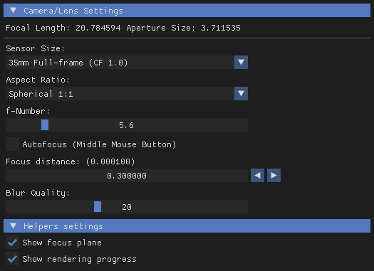{.shadowed .autosize}

**Focal Length**  
The add-on translates the FOV it receives from the camera tool to focal length in 35mm equivalent. Useful for approximating real life focal lengths.

@alert info  
**This isn't an accurate value!**  
The camera tools, and by extension MSADOF itself, have no knowledge of the game world's scale in relation to real life. Game engines also rarely make obvious whether its primary FOV component is horizontal or vertical (or even diagonal!). This means that while MSADOF is physically-based, it cannot accurately reproduce real-world figures and would be unreliable in use as a real-world simulation.
@end

**Aperture Size**  
A readout of how large the bokeh size will be. Translates to *Shape size* in `Tweaking Mode`.

**Sensor Size**  
This is a dropdown list of sensor sizes for the add-on to simulate. Acts as a 'multiplier' to aperture size, picking a smaller sensor with a higher crop factor (CF value) makes bokeh circles smaller and vice versa. 

{.shadowed .autosize}

**Aspect Ratio**  
This is a dropdown list of some common filmic aspect ratios. These affect the shape of your bokeh circles. Useful for quickly switching from spherical bokeh to anamorphic oval bokeh.

{.shadowed .autosize}

**f-Number**  
This sets the aperture size. A smaller f-Number means larger bokeh.

**Focus distance**  
This sets the focal plane. The arrows on the right change the step size of the slider.

**Blur Quality**  
This sets how many samples are taken by the add-on, drastically affecting render times. Increase it if you notice undersampling (each point is clearly visible), decrease it if render times are taking too long. Translates to *Number of rings* in `Tweaking Mode`.

### Helpers Settings

**Show focus plane**  
Overlays a plane on screen. Where the plane cuts the scene is where the focus distance is set.

**Show rendering progress**  
Displays a progress bar.

---

## Tweaking Mode

This is the tab for controlling the add-on in an advanced manner. 

### DOF Settings

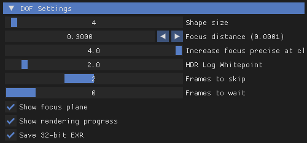{.shadowed .autosize}

**Shape size**  
This controls how large your bokeh will be. 

**Focus by MMB**  
This toggle sets an autofocus point when the middle mouse button is held down. The add-on will continue to autofocus on that spot as long as the ReShade GUI is open.

**Focus distance**  
This sets the focal plane. The arrows on the right change the step size of the slider.

**Increase focus precise at close range**  
This changes the scaling of the focus distance slider. Higher values mean that the focus distance slider can operate in even smaller steps. This is useful for portraits, where extra focus precision is desired.

**HDR Log Whitepoint**  
Affects how bright pixels stack atop each other during the accumulation process. The default value of 2.0 provides the most natural highlighting.

{.shadowed .autosize}

**Frames to skip**  
Skips camera movement of every few frames to make accumulation more consistent. Depending on the performance of your game, this value might have to be changed. If you notice that the add-on is drawing rings/donuts on your focus plane, this value likely has to be changed.

**Frames to wait**  
Similar to above, this value should only be changed if you notice that the focus plane isn't properly sharp.

**Show focus plane**  
Overlays a plane on screen. Where the plane cuts the scene is where the focus distance is set.

### Shape settings

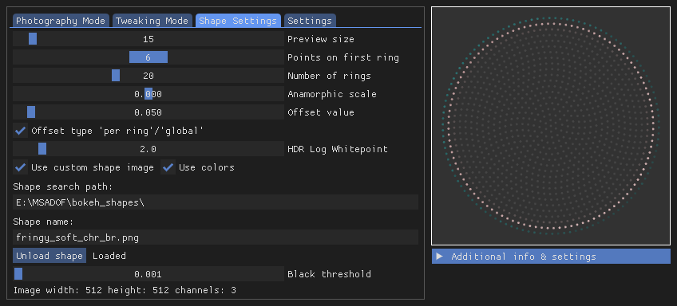{.shadowed .autosize}

These controls configure the shape of the bokeh circles. A preview of the shape can be seen in the UI.

**Preview size**  
Changes the scale of each point only in the preview window beside it.

**Points on first ring**  
This sets the density of the points on each ring. This affects render time.

**Number of rings**  
Changes the number of rings in each bokeh circle. This value affects render time. Increase it if you notice undersampling (each point is clearly visible), decrease it if render times are taking too long.

**Anamorphic scale**  
Stretches/squashes the bokeh circle. Useful for replicating oval bokeh characteristic of anamorphic lenses.

**Offset value / Offset type**  
Affects the alignment of every point relative to the previous ring. Tweak if there's an obvious pattern forming in your bokeh.

**Use custom shape image**  
Checking this allows MSADOF to sample custom images that can be used to drive fringing and bokeh shape, allowing you to mimic bladed apertures or other more creative effects.

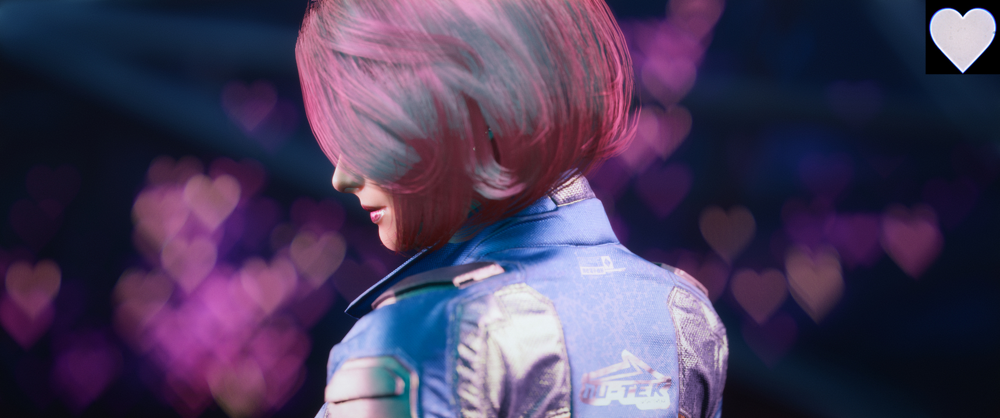{.shadowed .autosize}

A higher ring count is typically necessary for detailed shapes to be accurately sampled.

**Use colors**  
When this is checked, the render will sample the input colors of the bokeh shape. This can be used to introduce chromatic fringing to bokeh, or with certain inputs, some unique depth separation effects.

  

    

    
  

  

    

    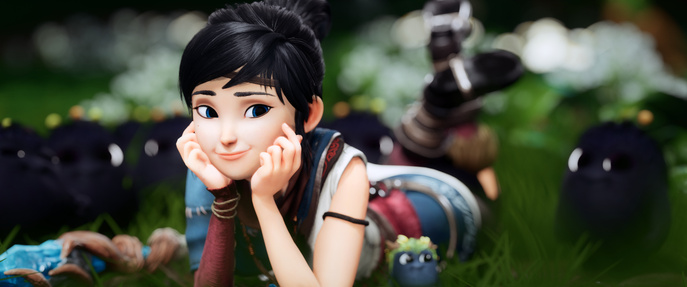
  

  <input type="range" min="0" max="100" value="50" step="0.01" 
    id="slider" class="slider__input" 
    autocomplete="off" onwheel="this.blur()" 
  />

It might be hard to spot, but the bokeh circles now have a subtle blue fringe.

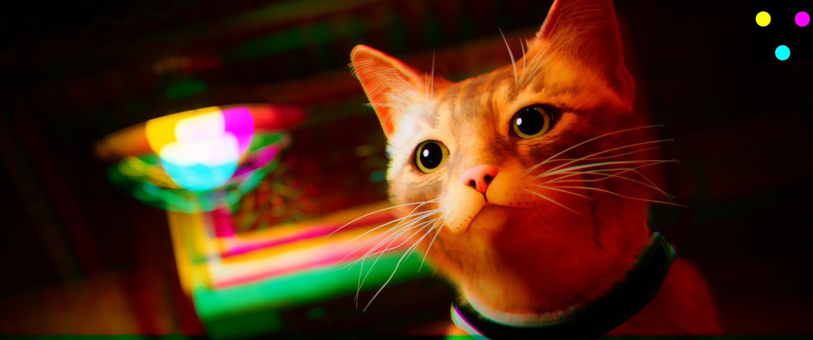{.shadowed .autosize}

**Shape Search Path**  
The file path to the folder that MSADOF will look for images in. **The path has to end with `\`.**  

**Shape Name**  
The name of the image file for MSADOF to load as a custom shape. The file must be in PNG, JPG or BMP format.

**Load shape**  
This button must be presssed to load the image into MSADOF. The preview window on the right will update accordingly.

**Black threshold**  
The luminance value of the darkest pixel that MSADOF will sample. Anything darker than this value will be skipped in the render to save on render time.

### More bokeh shapes

While the standard MSADOF download comes with a few custom shapes for you to try out, this is a pack of additional shapes curated by moyevka for you to play with!

**Fun shapes!**  
The `bokeh_shapes\Fun` folder includes a handful of creative shapes such as the fringed heart seen above and some common "bokeh kit" shapes like stars and other symbols. Also included are some tinted multi-apertures to recreate anaglyph-style images. 

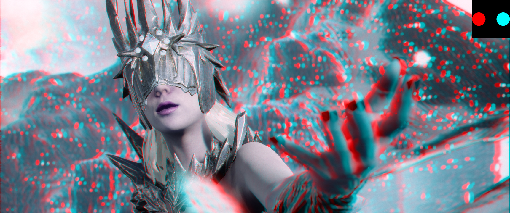{.shadowed .autosize}

**Lens Samples**  
The `bokeh_shapes\Lens Samples` folder is a set of inputs sampled from real lenses at different focal lengths and apertures, curating a repository of realistic bladed aperture shapes and bokeh fringes. 

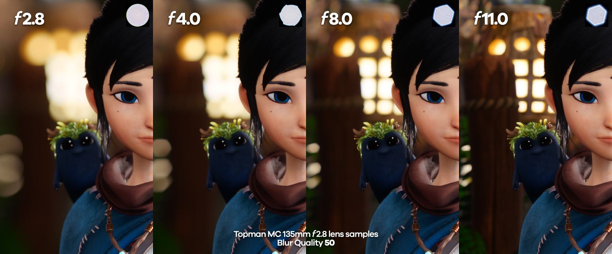{.shadowed .autosize}

 <a href="https://mega.nz/file/jJMGwQSQ#TuXZHXUBfBE0ygQigpTp61fPdvIFluyhALs8LNjIh18" target="_blank"><b>Download</b></a> 

*Bokeh measurements by [MattGunn2010 on Flickr](https://www.flickr.com/photos/46852257@N07/albums), from [PentaxForums](https://www.pentaxforums.com/forums/10-pentax-slr-lens-discussion/81530-lens-bokeh-research-help.html#post943257). The sets have been edited to ensure complete compatibility with MSADOF.*

### Additional info

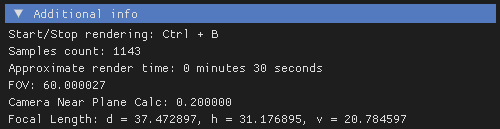{.shadowed .autosize}

This category displays useful as well as debug information. 

### Game Adjustments

This category is to be left alone, as it is for first time configuration of a new game. [See the section below](#adjusting-for-a-new-game) on how to tweak it.

**Camera movement multiplier**  
Sets how fast the camera will move based on a multiplier applied to camera coordinate scale. Turn this up to exaggerate shape size, or turn it down to reduce it.

**Max FOV Value**  
The maximum FOV value that MSADOF will use for its calculations.

**Variable near plane**  
Changes how *Camera near plane* is calculated if a change in aspect ratio causes camera near plane to change as well.

**Camera near plane**  
Offsets the distance of the near plane from the in-game camera. This is primarily used in aligning the focus plane to a known focus distance.

**Cache current value**  
Writes the current near plane value to `MSADOF_CACHE.ini`. This is useful for games that have changing *Camera near plane* values, like *The Witcher 3*.

---

## Settings

This is the tab where the add-on can be further configured.

**Random point rendering**  
Instead of a progressive spiral render, this causes the add-on sample randomly. This can be useful for previewing how large the resulting bokeh will be, or can be used to mitigate animating background elements interrupting the render.  
*This feature is not currently working as intended and will produce ghosts of the focus plane.*

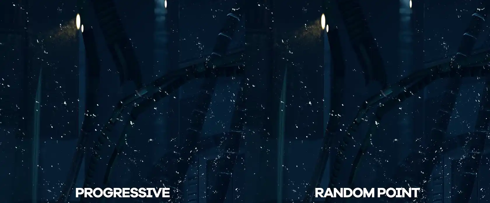{.shadowed .autosize}

**Show rendering progress**  
Displays a progress bar.

**Save 32-bit EXR**  
As the accumulation process can introduce banding, this option stacks the accumulated frames into a higher-precision buffer. This buffer is saved into a high bit-depth (32-bit) EXR, which is able to store 65536x more colours than the standard BMP. This results in much smoother gradients with zero banding, and comes with the added benefit of having much more colour data for colour grading in post. The saved EXR requires [further post-processing](#processing-saved-exrs) to produce the intended result.

  

    
Processed EXR

    
  

  

    
BMP capture

    
  

  <input type="range" min="0" max="100" value="50" step="0.01" 
    id="slider" class="slider__input" 
    autocomplete="off" onwheel="this.blur()" 
  />

A colour-graded shot from <i>Stray</i>. Banding is visible in the left half of the image.

**Screenshot path**  
A custom screenshot save path can be pasted here. **The path has to end with `\`.**

---

## Adjusting for a new game

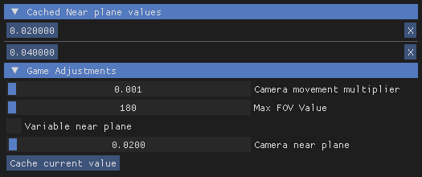{.shadowed .autosize}

If you're playing a game that does not have known values yet or the values produce wrong results on your end, this is the process of setting up the *Game Adjustments* tab.

#### 1. Checking X and Y

Before adjusting anything, do a quick render to judge the shape of the bokeh. You may have to adjust *Camera movement multiplier* and/or bring up *Focus distance* if the shape size is too dramatic, nothing seems to be happening, or you get a kaleidoscope effect.

If the shape of the rendered bokeh is not perfectly circular, the **Flip X** and **Flip Y** checkboxes have to be configured. Mess around with them until the rendered result is circular.

#### 2. Max FOV Value

Set your game to run in a 1:1 aspect ratio. Switch the add-on UI to `Tweaking Mode` and expand *Additional info*, keeping your eye on FOV. With the tool's free camera active, zoom out until the image flips. Note the FOV value at which this occurs, that will be the **Max FOV Value**.

@alert neutral
This value can typically be left at 180 for the majority of games.
@end

#### 3. Calibrating the focus plane

This step requires quite a bit of trial & error, as it involves messing with *Focus distance* until the focus plane is found. A high amount of blur (large *Shape size* / *Camera movement multiplier*) is recommended to help pinpoint the focus point.

If you're struggling to find an area in focus and the results are consistently blurry, you might have to configure *Frames to skip*. The add-on drawing rings/donuts is usually a tell-tale sign of this.

{.shadowed .autosize}

Once you've managed to find the focus plane, adjust **Camera near plane** with *Show focus plane* ticked until the focus helper plane aligns with the actual focus plane. 

@alert tip
Motion blur (and some TAA implementations) can interfere with this part, causing your results to be blurry no matter what. Be sure to disable them if you're still having trouble.
@end

#### 4. Variable Near Plane

This checkbox should be ticked if the focus helper no longer aligns with the focus distance when the aspect ratio is changed. 

#### Done!

This process acts as calibration of the focus helper plane to the actual focus plane, so it can be used to help you set a focus point.

### Video Example  

Does not cover <i>Max FOV Value</i> or <i>Variable near plane</i>.

---

## Tips & Tricks

### Best-case scenario

To get the best possible result out of this add-on, it's best to find a game that can perfectly timestop with no significant jitter, foliage sway, or anything that could interrupt the render. 

Raytracing / specular highlight noise is often the cause of 'dirty' bokeh circles.

### Preview bokeh size  

You can perform a quick preview of how large your bokeh shape size will be by doing a render with a very low *Number of rings* or at a lower resolution.

### Antialiasing & image sharpness

The camera-based nature of the shader means it does its own antialiasing! AA can be entirely disabled in your game to get a sharper image. 

It is **not** recommended to have a sharpening pass prior to the render. Sharpening halos may become exaggerated and/or show up in the accumulation process.

### Have fun with shaders!

This add-on works great with ReShade shaders too! In fact, using a LUT prior to the render and saving the result in EXR can reduce colour banding, thanks to the stacking process. Lens distortion effects like the fantastic [`PerfectPerspective.fx`](https://github.com/Fubaxiusz/fubax-shaders/blob/master/Shaders/PerfectPerspective.fx) can also be captured.

---

## Processing saved EXRs

Saved EXRs are in linear gamma (gamma 1.0). This causes them to look 'washed-out' when viewed with an image viewer. Most image viewers & converters will perform gamma correction for you when compressing them to an 8/16-bit format (e.g. opening it in Photoshop then immediately saving it as a PNG), resulting in an image with the expected colours. 

If you would like to edit these 32-bit colours, a simple gamma correction of 0.454545... (repeating) returns an image at the proper sRGB gamma of 2.2. This can be done with *Image* > *Adjustments* > *Exposure...* or with the Exposure adjustment layer in Photoshop, for example.

{.shadowed .autosize}

You can then perform your edits atop this correction layer. Remember to disable it before exporting your final result to prevent an overdarkened image.

---
*last updated 24th October 2022*  
*images provided and written by [moyevka](https://twitter.com/moyevka)*  
