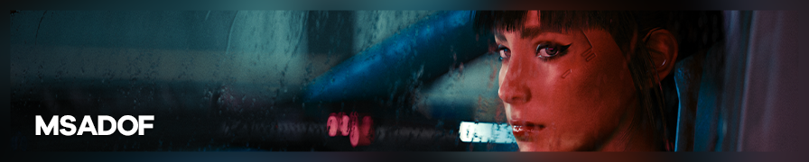{.shadowed .autosize}

**Multi-sampled Accumulated Depth of Field** (**MSADOF**) is an advanced DOF add-on for ReShade developed by murchalloo. It renders depth of field without using a depth buffer for the blurring process, greatly increasing the possibilities of defocused captures. This is an advanced guide that aims to cover the usage of MSADOF, as well as its setup process for you and other users.

@alert important
MSADOF requires **ReShade 5.2+ with full add-on support** and supported [Otis_Inf camera tools](https://patreon.com/Otis_Inf). *All cameras newer than the 31st of May 2022 should have support for MSADOF, look for "interpolation factors" in the camera changelogs.*
@end

@alert neutral
The add-on is currently in closed beta and is unavailable for public download.
@end

---

## Advantages

MSADOF works by manipulating the game camera around a certain plane in space and progressively blending the result to produce a defocused image that's depth-accurate. This results in:

  

    
MSADOF

    
  

  

    
Traditional depth-based DOF

    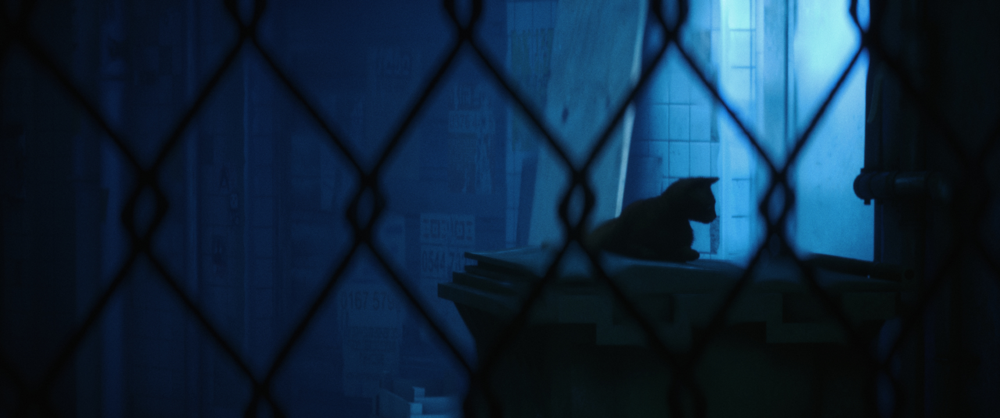
  

  <input type="range" min="0" max="100" value="50" step="0.01" 
    id="slider" class="slider__input" 
    autocomplete="off" onwheel="this.blur()" 
  />

Accurate near-plane bleed.

  

    
MSADOF

    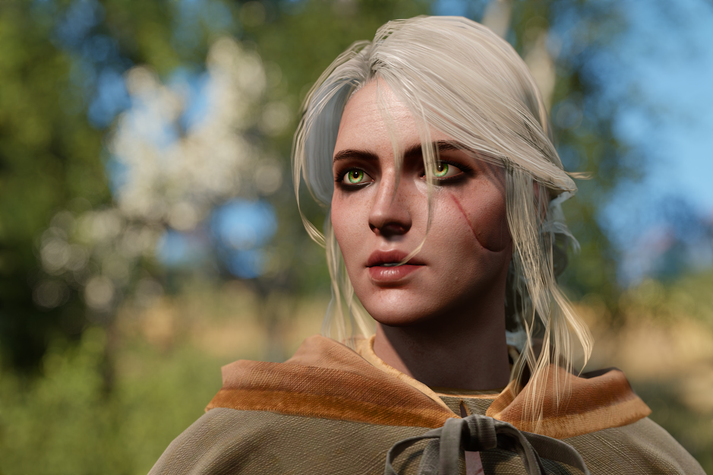
  

  

    
Traditional depth-based DOF

    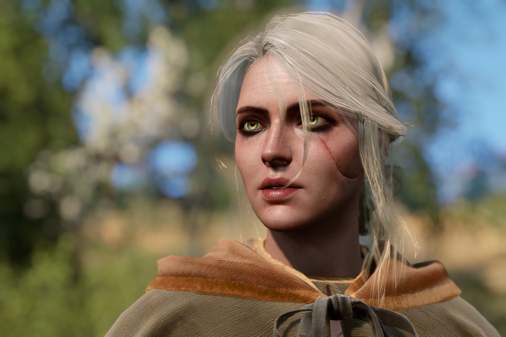
  

  <input type="range" min="0" max="100" value="50" step="0.01" 
    id="slider" class="slider__input" 
    autocomplete="off" onwheel="this.blur()" 
  />

Alpha hair in DOF!

  

    
MSADOF

    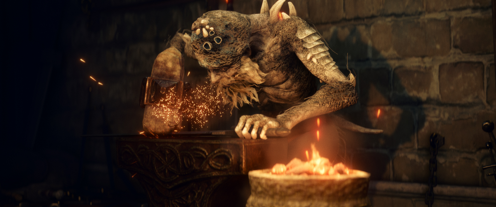
  

  

    
Traditional depth-based DOF

    
  

  <input type="range" min="0" max="100" value="50" step="0.01" 
    id="slider" class="slider__input" 
    autocomplete="off" onwheel="this.blur()" 
  />

Particle & alpha effects in DOF.

  

    
MSADOF

    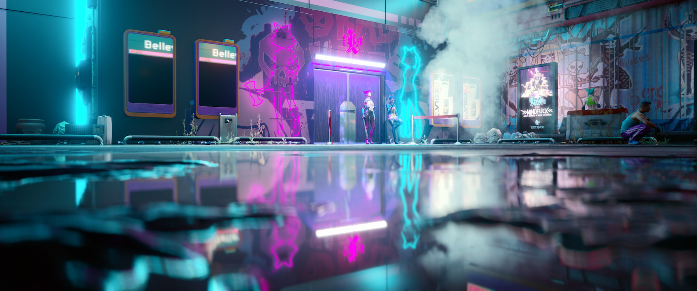
  

  

    
Traditional depth-based DOF

    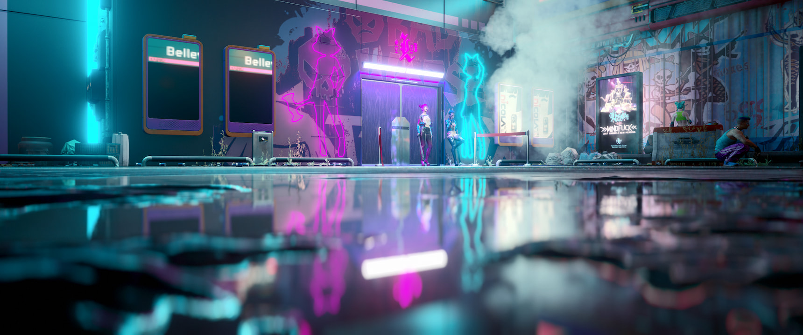
  

  <input type="range" min="0" max="100" value="50" step="0.01" 
    id="slider" class="slider__input" 
    autocomplete="off" onwheel="this.blur()" 
  />

Depth-accurate reflections.

  

    
MSADOF

    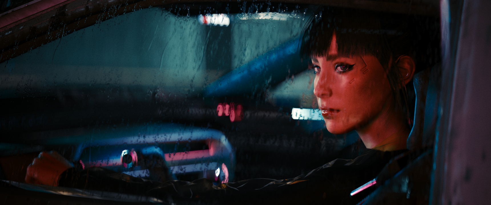
  

  

    
Traditional depth-based DOF

    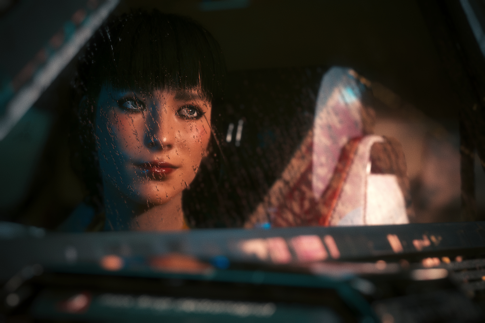
  

  <input type="range" min="0" max="100" value="50" step="0.01" 
    id="slider" class="slider__input" 
    autocomplete="off" onwheel="this.blur()" 
  />

Layered defocusing of transparent and translucent materials.

---

## Installation & initial setup

MSADOF comprises of two files, `IgcsConnector.addon` and `MSADOF.fx`. The first of which is a ReShade add-on, and the second a ReShade shader. The ADDON file is installed in the same directory as your game EXE, while the FX file is installed to your `reshade-shaders\Shaders` folder.

Once installed, upon opening the ReShade GUI, you will now see a new window. This is where you will control the bulk of MSADOF. You must also enable `MSADOF_ADDON` and drag it all the way to the bottom of your shaders list. Depth buffer access is necessary for the full functionality of the add-on.

For the add-on to function as intended, it's typically necessary to enable vsync in your game. This ensures a more consistent frame pacing for better results. Motion blur should also be disabled.

---

## List of preconfigured values

As setting MSADOF up from scratch can be tricky, this is a compilation of known MSADOF values for games that have been tested. With the GUI open, click on **Switch Mode** to switch from `Photography Mode` to `Tweaking Mode`. Scroll down and expand **Game Adjustments** to add these values. You may also have to change some values in **DOF Settings**.

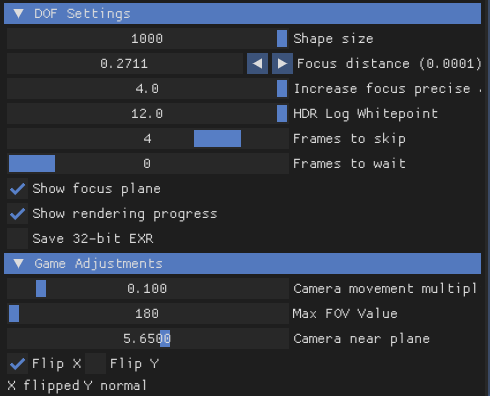{.shadowed .autosize}

  
<b>View list</b>

@alert info
The *Frames to skip* parameter is dependent on your own hardware and the current performance of the game. Do tweak the value if you notice that the image isn't sharp or if there are [visible rings](#calibrating-the-focus-plane) forming.
@end

| Game                          | Near Plane | FOV | Variable Near Plane | Frames to skip | Camera Multiplier | Flip X/Y |Comments|
|-------------------------------|------------|-----|-------------------------|--------------------|-----------------------|----------|--------|
| Ace Combat 7                  | 1.0000     | 180 | Y                       | 2                  | 0.100                 | X        ||
| Alien: Fireteam Elite         | 9.9965     | 180 | Y                       | 2                  | 0.100                 | X        ||
| Assassin's Creed Odyssey      | 0.0995     | 180 | N                       | 2                  | 0.001                 | X        ||
| Assassin's Creed Origins      | 0.0995     | 180 | N                       | 2                  | 0.001                 | X        ||
| Batman: Arkham Knight         | 9.9965     | 180 | Y                       | 2                  | 0.100                 | X        ||
| Beyond a Steel Sky            | 9.9965     | 180 | Y                       | 1                  | 0.100                 | X        ||
| Borderlands 3                 | 9.9965     | 180 | Y                       | 2                  | 0.100                 | X        ||
| Blind Fate: Edo no Yami       | 9.9965     | 180 | Y                       | 1                  | 0.100                 | X        ||
| Code Vein                     | 9.9965     | 180 | Y                       | 2                  | 0.100                 | X        ||
| Cyberpunk 2077                | 0.0200     | 180 | N                       | 4                  | 0.001                 | X        |Might require raytracing / a low framerate under vsync targets.|
| Days Gone                     | 9.9500     | 320 | N                       | 1                  | 0.100                 | X        ||
| Draugen                       | 9.9965     | 180 | Y                       | 2                  | 0.100                 | X        ||
| ECHO                          | 0.5600     | 180 | N                       | 2                  | 0.100                 | X        |No custom AR possible.|
| Elden Ring					          | 0.0500		 | 180 | N				               | 2				          | 0.001            	    | X        |Camera multiplier can change from area to area. **In-game antialiasing can cause blurry results**.|
| Hellblade                     | 9.9965     | 180 | Y                       | 2                  | 0.100                 | X        ||
| Kena: Bridge of Spirits       | 9.9965     | 180 | Y                       | 4                  | 0.100                 | X        ||
| Life is Strange: True Colors  | 9.9965     | 180 | Y                       | 1                  | 0.100                 | X        ||
| Mortal Shell                  | 9.9965     | 180 | Y                       | 4                  | 0.100                 | X        ||
| MotoGP 19                     | 9.9965     | 180 | Y                       | 2                  | 0.100                 | X        ||
| Resident Evil 2	(DX12)        | 0.0100     | 180 | Y                       | 1                  | 0.001                 | X        ||
| Resident Evil 3	(DX12)        | 0.0100     | 180 | Y                       | 1                  | 0.001                 | X        ||
| Scarlet Nexus                 | 9.9965     | 180 | Y                       | 1                  | 0.100                 | X        ||
| Star Wars - Jedi Fallen Order | 9.9995     | 180 | Y                       | 1                  | 0.100                 | X        ||
| Stray						              | 0.5625     | 180 | N                       | 1                  | 0.100                 | X        ||
| Tell Me Why                   | 9.9965     | 180 | Y                       | 1                  | 0.100                 | X        ||
| The Ascent                    | 9.9965     | 180 | Y                       | 1                  | 0.100                 | X        ||
| The Medium                    | 2.0000     | 180 | Y                       | 3                  | 0.100                 | X        ||
| The Shore                     | 9.9965     | 180 | Y                       | 1                  | 0.100                 | X        ||
| The Witcher 3: Wild Hunt      | 0.2000     | 180 | N                       | 0                  | 0.001                 | X        |Near plane may switch to 0.4 in cutscenes.| 
| Twin Mirror                   | 9.9965     | 180 | Y                       | 2                  | 0.100                 | X        ||

*Have some game adjustments values that you want to include? Head up to the [issue site page](https://github.com/framedsc/Sitesource/issues) and create an issue with the values, or [contact one of the mods](https://framedsc.com/index.htm).*

If you have to setup & adjust for a new game, follow the [advanced setup section](#adjusting-for-a-new-game) further below.

---

## Usage

The add-on has two modes, `Photography Mode` and `Tweaking Mode`. `Photography Mode` offers a simple UI for controlling all the necessary values once the add-on is configured, while `Tweaking Mode` is a more advanced set of controls for configuration and tweaking.

Once the add-on is set up, press `Ctrl+B` to begin the render. The final image is automatically saved to the same folder where your game EXE is located.

The add-on also supports hotsampling! Simply start the render after hotsampling.

---

## Photography Mode  

This is the mode for controlling the add-on in a simplified manner. The controls are similar to that of a real camera. Values set in `Tweaking Mode` override those set in this mode.

### Camera/Lens Settings

**Focal Length**  
The add-on translates the FOV it receives from the camera tool to focal length in mm. Useful for approximating real life focal lengths.

**Aperture Size**  
A readout of how large the bokeh size will be. Translates to *Shape size* in `Tweaking Mode`.

**Sensor Size**  
This is a dropdown list of sensor sizes for the add-on to simulate. Acts as a 'multiplier' to aperture size, picking a smaller sensor with a higher crop factor (CF value) makes bokeh circles smaller and vice versa. 

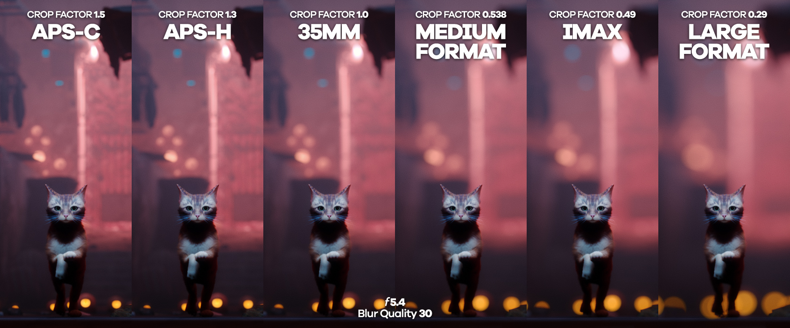{.shadowed .autosize}

**Aspect Ratio**  
This is a dropdown list of some common filmic aspect ratios. These affect the shape of your bokeh circles. Useful for quickly switching from spherical bokeh to anamorphic oval bokeh.

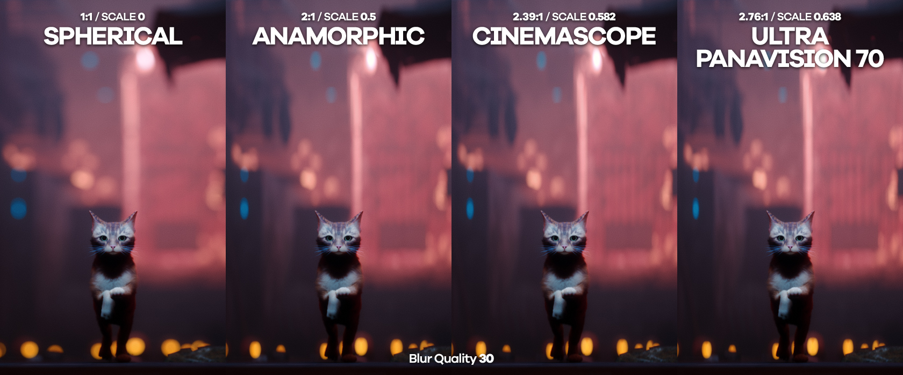{.shadowed .autosize}

**f-Number**  
This sets the aperture size. A smaller f-Number means larger bokeh.

**Focus distance**  
This sets the focal plane. The arrows on the right change the step size of the slider.

**Blur Quality**  
This sets how many samples are taken by the add-on, drastically affecting render times. Increase it if you notice undersampling (each point is clearly visible), decrease it if render times are taking too long. Translates to *Number of rings* in `Tweaking Mode`.

**Lens Imperfections**  
Toggles for some lens imperfections. Fringing introduces a bright ring around bokeh circles and its properties can be adjusted in `Tweaking Mode`.

  

    
Scale: 0.6 Power: 6.0

    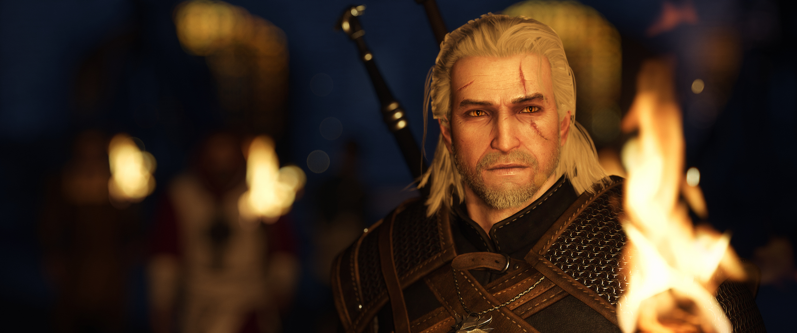
  

  

    
No fringing

    
  

  <input type="range" min="0" max="100" value="50" step="0.01" 
    id="slider" class="slider__input" 
    autocomplete="off" onwheel="this.blur()" 
  />

Note the slight difference in brightness. This is due to the fringing process brightening the last few accumulations to produce the effect.

  

---

## Tweaking Mode

This is the mode for controlling the add-on in an advanced manner. 

### DOF Settings

**Shape size**  
This controls how large your bokeh will be. 

**Focus distance**  
This sets the focal plane. The arrows on the right change the step size of the slider.

**Increase focus precise at close range**  
This changes the scaling of the focus distance slider. Higher values mean that the focus distance slider can operate in even smaller steps.

**HDR Log Whitepoint**  
Affects how bright pixels stack atop each other during the accumulation process. The default value of 2.0 provides the most natural highlighting.

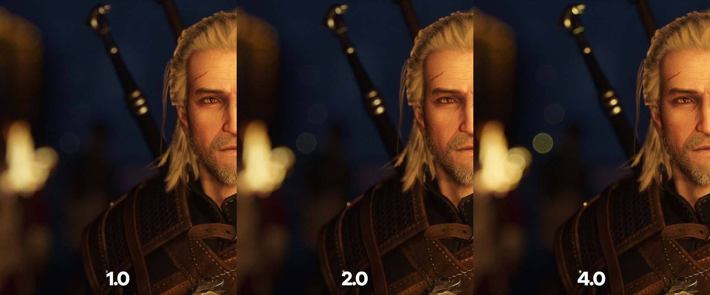{.shadowed .autosize}

**Frames to skip**  
Skips camera movement of every few frames to make accumulation more consistent. Depending on the performance of your game, this value might have to be changed. If you notice that the add-on is drawing rings/donuts on your focus plane, this value likely has to be changed.

**Frames to wait**  
Similar to above, this value should only be changed if you notice that the focus plane isn't properly sharp.

**Show focus plane**  
Overlays a plane on screen. Where the plane cuts the scene is where the focus distance is set.

**Show rendering progress**  
Displays a progress bar.

**Save 32-bit EXR**  
As the accumulation process can introduce banding, this option stacks the accumulated frames into a higher-precision buffer. This buffer is saved into a high bit-depth (32-bit) EXR, which is able to store 65536x more colours than the standard BMP. This results in much smoother gradients with zero banding, and comes with the added benefit of having much more colour data for colour grading in post. The saved EXR requires [further post-processing](#processing-saved-exrs) to produce the intended result.

  

    
Processed EXR

    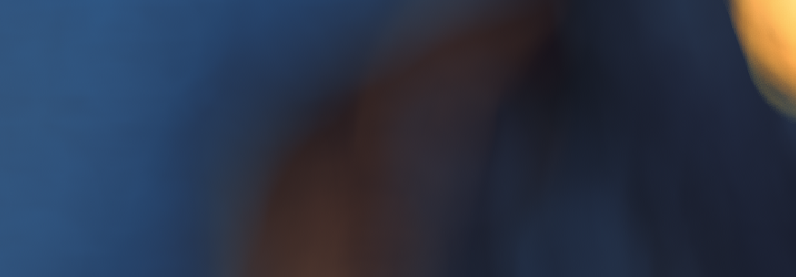
  

  

    
BMP capture

    
  

  <input type="range" min="0" max="100" value="50" step="0.01" 
    id="slider" class="slider__input" 
    autocomplete="off" onwheel="this.blur()" 
  />

Note that <b>exposure has been pushed by 3 stops</b> to highlight banding as well as show how much these 32-bit EXRs can be edited.

  

### Shape settings

These controls configure the shape of the bokeh circles. A preview of the shape can be seen in the UI.

**Preview size**  
Changes the scale of each point only in the preview window above it.

**Number of rings**  
Changes the number of rings in each bokeh circle. This value affects render time. Increase it if you notice undersampling (each point is clearly visible), decrease it if render times are taking too long.

**Points on first ring**  
This sets the density of the points on each ring. Similarly, this affects render time.

**Anamorphic scale**  
Stretches/squashes the bokeh circle. Useful for replicating oval bokeh characteristic of anamorphic lenses.

**Offset value / Offset type**  
Affects the alignment of every point relative to the previous ring. Tweak if there's an obvious pattern forming in your bokeh.

**Swirl scale**  
Introduces swirl to bokeh, useful for Helios-style swirly bokeh.  
*This feature is not currently working as intended.*

**Fringing scale**  
Modifies how much the outer rings are brightened to introduce fringing to the bokeh.

**Fringing power**  
Modifies the falloff of the darkening to sharpen the fringing.

### Additional info

This category displays useful as well as debug information. 

### Game Adjustments

This category is to be left alone, as it is for first time configuration of a new game. See the section directly below on how to tweak it.

---

## Adjusting for a new game

If you're playing a game that does not have known values yet or the values produce wrong results on your end, this is the process of setting up the *Game Adjustments* tab.

#### 1. Checking X and Y

Before adjusting anything, do a quick render to judge the shape of the bokeh. You may have to adjust *Camera movement multiplier* and/or bring up *Focus distance* if the shape size is too dramatic, nothing seems to be happening, or you get a kaleidoscope effect.

If the shape of the rendered bokeh is not perfectly circular, the **Flip X** and **Flip Y** checkboxes have to be configured. Mess around with them until the rendered result is circular.

#### 2. Max FOV Value

Set your game to run in a 1:1 aspect ratio. Switch the add-on UI to `Tweaking Mode` and expand *Additional info*, keeping your eye on FOV. With the tool's free camera active, zoom out until the image flips. Note the FOV value at which this occurs, that will be the **Max FOV Value**.

@alert neutral
This value can typically be left at 180 for the majority of games.
@end

#### 3. Calibrating the focus plane

This step requires quite a bit of trial & error, as it involves messing with *Focus distance* until the focus plane is found. A high amount of blur (large *Shape size* / *Camera movement multiplier*) is recommended to help pinpoint the focus point.

If you're struggling to find an area in focus and the results are consistently blurry, you might have to configure *Frames to skip*. The add-on drawing rings/donuts is usually a tell-tale sign of this.

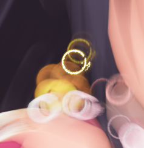{.shadowed .autosize}

Once you've managed to find the focus plane, adjust **Camera near plane** with *Show focus plane* ticked until the focus helper plane aligns with the actual focus plane. 

@alert tip
Motion blur (and some TAA implementations) can interfere with this part, causing your results to be blurry no matter what. Be sure to disable them if you're still having trouble.
@end

#### 4. Variable Near Plane

This checkbox should be ticked if the focus helper no longer aligns with the focus distance when the aspect ratio is changed. 

#### Done!

This process acts as calibration of the focus helper plane to the actual focus plane, so it can be used to help you set a focus point.

### Video Example  

Does not cover <i>Max FOV Value</i> or <i>Variable near plane</i>.

---

## Tips & Tricks

### Best-case scenario

To get the best possible result out of this add-on, it's best to find a game that can perfectly timestop with no significant jitter, foliage sway, or anything that could interrupt the render. 

Raytracing / specular highlight noise is often the cause of 'dirty' bokeh circles.

### Preview bokeh size  

You can perform a quick preview of how large your bokeh shape size will be by doing a render with a very low *Number of rings* or at a lower resolution.

### Undersampling

A DOF shader can be used as a blurring pass before rendering to help and smooth out undersampling artifacts. Simply align the DOF shader's focus point to that of the add-on's and make the DOF strength very subtle. **Do not** use autofocus here, as the autofocus point will slip due to the camera movements.

### Antialiasing & image sharpness

The camera-based nature of the shader means it does its own antialiasing! AA can be entirely disabled in your game to get a sharper image. 

In titles where TAA is integral to shading (*Cyberpunk 2077* and its hair, for example), it can be left enabled at the cost of a slightly softer image. 

It is **not** recommended to have a sharpening pass prior to the render. Sharpening halos may become exaggerated and/or show up in the accumulation process.

### Have fun with shaders!

This add-on works great with ReShade shaders too! In fact, using a LUT prior to the render and saving the result in EXR can reduce colour banding, thanks to the stacking process. 

---

## Processing saved EXRs

The saved EXRs require gamma correction to look as they did on your screen, instead of a washed-out image. This is easiest done with Adobe Photoshop, however any editor that can open EXRs and perform gamma correction would also work.

The EXRs are saved in linear gamma (gamma 1.0), so a simple gamma correction of 0.454545... (repeating) returns an image at the proper sRGB gamma of 2.2.

This can be done with *Image* > *Adjustments* > *Exposure...* or with the Exposure adjustment layer in Photoshop.

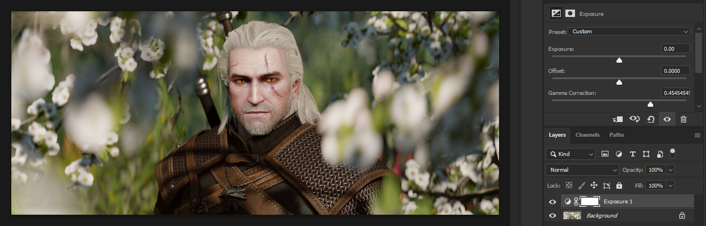{.shadowed .autosize}