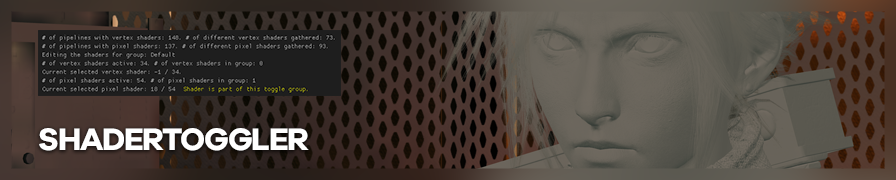
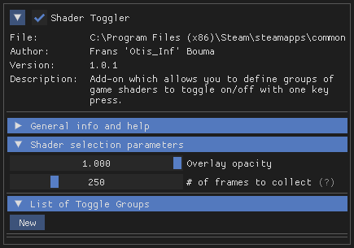
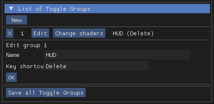

{.shadowed .autosize}

[**ShaderToggler**](https://github.com/FransBouma/ShaderToggler) is an add-on for ReShade written by Otis_Inf. It allows you turn off and on in-game shaders, like [3DMigoto](https://nohud.fandom.com/wiki/Creation_of_Hudtoggle_Mods). This page is a brief guide on how you can use it to toggle shaders, and is also a repository for the toggle groups that people have contributed for various games.

@alert info
ShaderToggler requires **Reshade 5.1+ with full add-on support**.
@end

---

## Installation

[On the releases page](https://github.com/FransBouma/ShaderToggler/releases), there are two relevant files available for download.

* `ShaderToggler_v101.zip` is for 64-bit games, i.e. the majority of modern releases.
* `ShaderToggler_x86_101.zip` is for 32-bit games, typically older titles running in DX9 for example.

Download the appropriate file and unzip it. Copy over `ShaderToggler.addon` to the same folder as your game's ReShade DLL for ReShade to be able to use it.

Launch your game, open the ReShade GUI, and head to the *Add-ons* tab. You should now see *Shader Toggler* in the list of installed add-ons.

{.shadowed .autosize}

---

## Example usage: HUD removal

While ShaderToggler can be used to hide many parts and elements of a game scene (including geometry!), it is probably most useful in removing the HUDs of games.

In this example, we'll be using the add-on to remove the HUD from *The Witcher 3*.

#### Step 1: Creating a new toggle group

{.shadowed .autosize}

Start by clicking the *New* button under *List of toggle groups*. This should create a new entry with a number next to it. Click on the *Edit* button and edit it to your liking. This group will be named "HUD", since we're removing the HUD, and it'll be bound to `Delete`, the common keybind for hiding the HUD in tools.

#### Step 2: Marking shaders

With our new toggle group set up, it's time to start marking shaders. These shaders will be added to the toggle group, and on activation, will be hidden from the scene.

Click on *Change shaders* and wait for the frame collection process (that should appear in the top left) to complete.

Once the frames are collected, use `Numpad 1` and `Numpad 2` to step through the available pixel shaders. These tend to be what HUDs are. As you step through the pixel shaders, note which of them cause the HUD to disappear. Mark these with `Numpad 3`.

{.shadowed .autosize}

Once you've marked all the shaders, click on *Done* to register the toggle group. If done right, when you use your key shortcut, it should now hide all the marked shaders at once, giving you a perfect HUD hide!

@alert important  
**Save all Toggle Groups!**   
Or suffer the pain of having to do everything over again on next launch!  
This creates a `ShaderToggler.ini` file in the same directory as the ADDON file. We encourage contributing this to our repository below.
@end

### Doing even more!

HUD hiding is only one thing possible with ShaderToggler. The process above can easily be used to hide so much more, from various post-processing effects to whole render passes with pixel shader toggles, and even characters or foliage from a scene with vertex shader toggles.

Do note that the add-on does not intercept compute shaders. This is why some effects, like some UE4 DOF implementations, can't be removed with ShaderToggler.

### Video example

---

## Repository

@alert important
These files need to be renamed to `ShaderToggler.ini` and placed in the same folder as `ShaderToggler.addon` for the add-on to pick them up correctly.
@end

Game | Features | Extra Description
--|--|--
[Assassin's Creed Origins](../../ShaderTogglers/assassins_creed_origins.ini) | - Remove head distortion (`Shift` + `6`)  - Chromatic aberration (`Shift` + `7`)
[Assassin's Creed Valhalla](../../ShaderTogglers/assassins_creed_valhalla.ini) | - HUD (`Caps Lock`)  - Eivor, NPCs and animals (`Shift` + `F4`)  - Vertical line markers in the world (`Shift` + `F5`)  - Rain (`Shift` + `F6`)
[Batman: Arkham Knight](../../ShaderTogglers/batman_arkham_knight.ini) | Rain and rain bounce toggle (`Caps Lock`)
[Bayonetta](../../ShaderTogglers/bayonetta.ini) | Pause menu + In Game UI + Effects (`Caps Lock`)
[Call of Juarez: Gunslinger](../../ShaderTogglers/call_of_juarez_gunslinger.ini) |  - HUD/Border (`F2`)   - Color Correction (`F3`)   - Cell Shading Toggle (`F4`)
[CONTROL](../../ShaderTogglers/control.ini) | HUD Toggle (`Caps Lock`)
[Cyberpunk 2077](../../ShaderTogglers/cyberpunk_2077.ini) | HUD  (and some advertisement displays) (`Caps Lock`)
[Death Stranding: Director's Cut](../../ShaderTogglers/death_stranding_directors_cut.ini) | Screen dirt, HUD, Odradek ping effects, Chiral Network boundary lines, Lost parcel glow, location lines, destination guide lines and footsteps (`F3`) | Player added icons dont hide for some reason
[Destroy All Humans!](../../ShaderTogglers/destroyallhumans.ini) | Full HUD Toggle (`Caps Lock`)
[Dying Light 2](../../ShaderTogglers/dying_light_2.ini) | - Lens flare and screen dirt (`Caps Lock`)  - Hides air vents and floaty debris (but also inadvertently hides some other smoke and fire sources) (`F2`)   - Hides Distant Birds (`F3`)   - Hides HUD (`F4`)   - Just floaty debris (`F5`)
[Elden Ring](../../ShaderTogglers/elden_ring.ini) | - Hides Sites Of Grace (`Caps Lock`) - Hides rain, floaty leaves(?) and (SPOILER) end game ash (`F2`)  - Hides gold and grey fog walls (`F3`)  - HUD (`K`)   - Fog (`Caps Lock`)  - Bloom (`[`)   - Direct lighting/character back lighting (`]`) | Hiding Sites Of Grace also hides some other light sources such as candles and torches, cant be avoided.
[Final Fantasy VII Remake](../../ShaderTogglers/FFVIIR.ini) | HUD (`Del`)
[Ghostwire: Tokyo](../../ShaderTogglers/ghostwire_tokyo.ini) | HUD and DOF toggle (`Caps Lock`)
[God of War](../../ShaderTogglers/god_of_war.ini) | Snow toggle (`Caps Lock`)
[Horizon Zero Dawn](../../ShaderTogglers/horizon_zero_dawn.ini) | - Rain: (`Caps Lock`)   - Bloom (`Shift` + `X`)   - HUD (`Shift` + `Q`) | - Rain: Could not find and remove the raindrops bouncing off of the ground   - Bloom: Both from fire sources and machines   - HUD: Both the main game ones and also the item drops / loot HUD popups 
[LEGO Star Wars: The Skywalker Saga](../../ShaderTogglers/lego_star_wars_skywalker_saga.ini) | - HUD (`K`)   - Object outlines (may hide some tiny cubemaps) (`L`)    - Coins & their shadows (may hide other shadows) (`;`)   - Lens flares (`Numpad 7`)  - Hide characters (WIP due to massive variety) (`Shift` + `2`)
[Matrix Awakens](../../ShaderTogglers/matrix_awakens.ini) | HUD Toggle (`Caps Lock`) | Hide the speedo whilst driving
[Shadow of the Tomb Raider](../../ShaderTogglers/SOTTR.ini) | HUD Toggle (`Caps Lock`)
[Sherlock Holmes: The Devil's Daughter](../../ShaderTogglers/sherlock_holmes_devils_daughter.ini) | HUD and DOF toggle (`Caps Lock`)
[Singularity](../../ShaderTogglers/singularity.ini) | - HUD toggle (`Capslock`)  - Rain toggle (`Ctrl`+`1`)
[Spider-Man Remastered](../../ShaderTogglers/spider_man_remastered.ini) | Complete HUD Toggle (`Delete`)
[Submerged: Hidden Depths](../../ShaderTogglers/submerged_hidden_depths.ini) | Rain and raindrops (`Caps Lock`)
[The Quarry](../../ShaderTogglers/thequarry.ini) | Toggles only the glowing shader pillar and sprite at the top, the mouse icon is handled by UUU HUD Toggle. (`F1`) | Remember to turn it back on otherwise it's easy to miss key items.
[The Vanishing of Ethan Carter Redux](../../ShaderTogglers/vanishing_ethan_carter_redux.ini) | - Hide blue mist (`Y`)  - Hide floating texts (`X`)  - Hide fog (`V`)  - Hide main menu (`Del`)

*Have a shader toggler that you want to include? Head up to the [issue site page](https://github.com/framedsc/Sitesource/issues) and create an issue with your shader toggler, or [contact one of the mods](https://framedsc.com/index.htm).*
