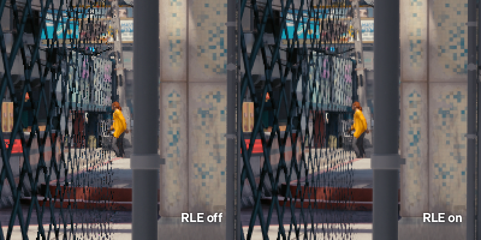
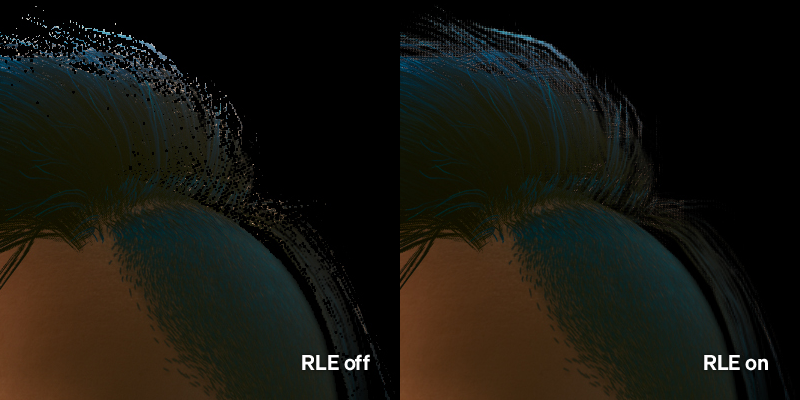
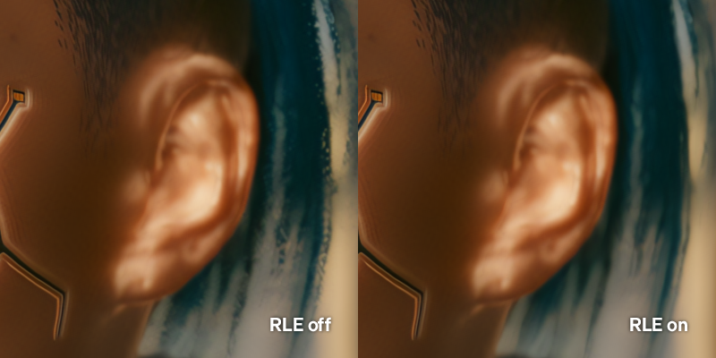
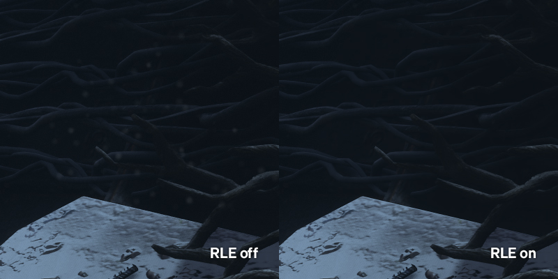

# Using RealLongExposure.fx to hide temporal issues in games

[RealLongExposure.fx](https://github.com/LordKobra/CobraFX/blob/master/Shaders/RealLongExposure.fx) (RLE) by LordKobra is a ReShade shader designed to create long exposure effects by blending frames together. However, it can also be used to blend out artifacts and issues caused by temporal "jitter" effects such as TAA (temporal antialiasing) and some modern hair shaders. It can also be used to hide other distractions, like particle effects (see example #3).

The goal of this guide is to capture a still frame, meaning you need a static camera angle and for your game to probably be timestopped. 

## Recommended Shader Settings
```
Exposure Time: 3-5+ Seconds¹
ShowGreenOnFinish: Off

ISO: Default
Gamma: Default
Delay: Default
```

¹ - Exposure time can be set to anything that's not too short, as the capture only needs to occur after the issues have been blended away.

It's highly recommended to bind `StartExposure` to a hotkey to make it easier to activate when hotsampling. 

## Example Usage

**Scenario 1: TAA Subpixels**  

{.shadowed .autosize}

RLE can help to average out the 'subpixel crawl' caused by jittering temporal antialiasing in modern games, resulting in a much cleaner image. 

**Scenario 2: Temporal Hair Shading**  

{.shadowed .autosize}

Some modern titles (e.g. *Cyberpunk 2077*, *Marvel's GOTG*, *FFVIIR*) employ temporal hair shading, that is to say that while hair looks great in motion, it can suffer from obvious artifacts when the image is still. RLE can help to average these artifacts out to give cleaner looking hair. 

RLE is recommended when shooting with ReShade depth effects like DoF, as the depth buffer jitter caused by TAA can create blocky artifacts with depth effects.

{.shadowed .autosize}

**Scenario 3: Particle Effects**  

{.shadowed .autosize}

RLE can average out subtle particle effects like dust that remain animated while timestopped. Watch the video below for a clearer example of this in action.

## Video Example  
<p align="left">
<a href="https://www.youtube.com/watch?v=np7rKbDEphs" target="_blank">
  
</a>
</p>