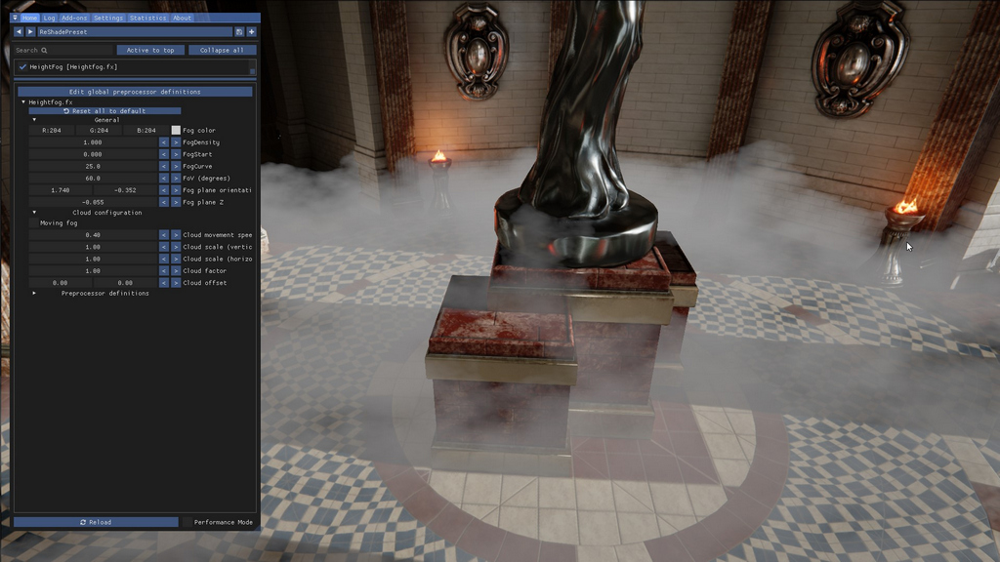
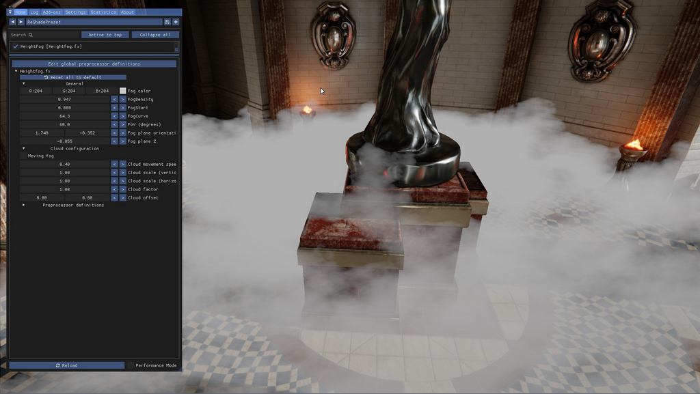
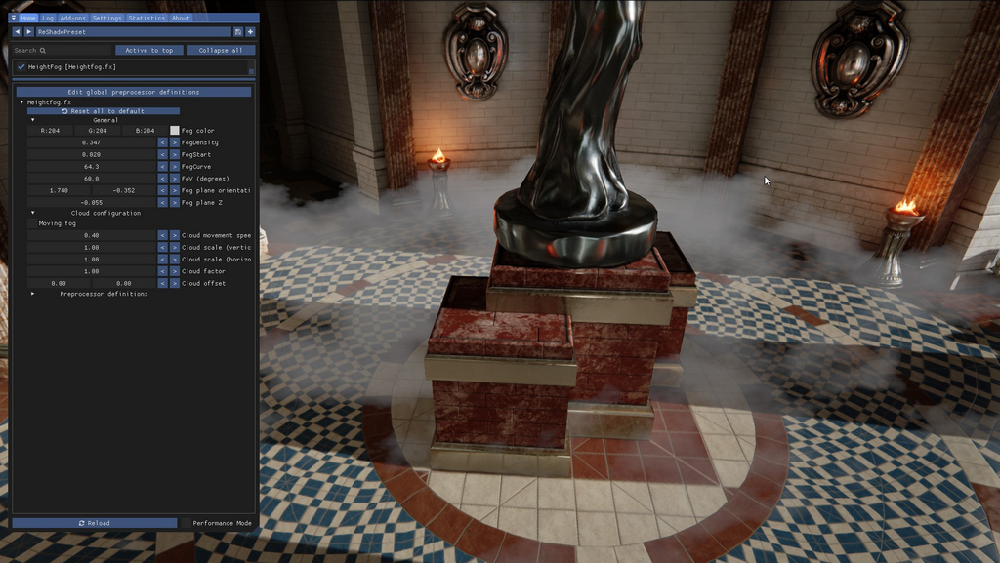
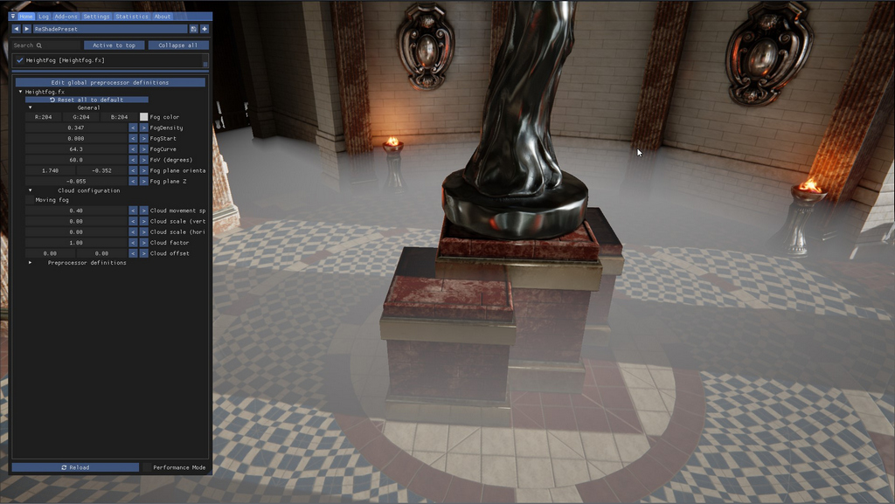
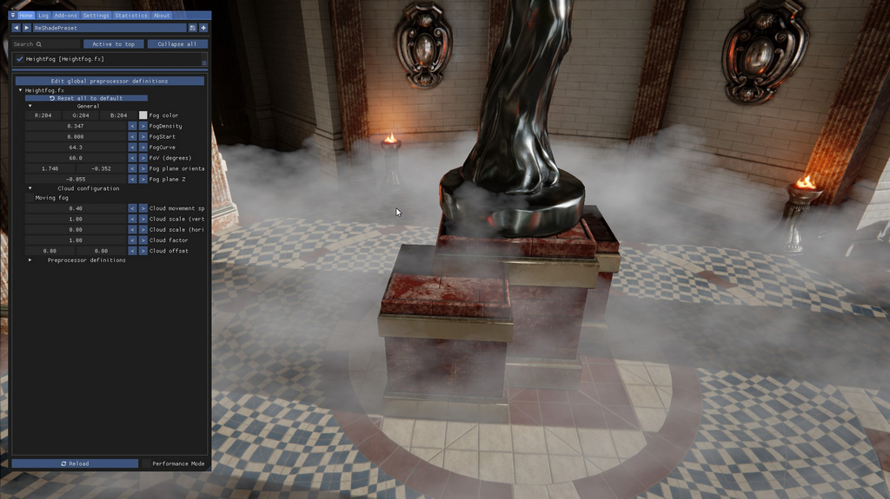
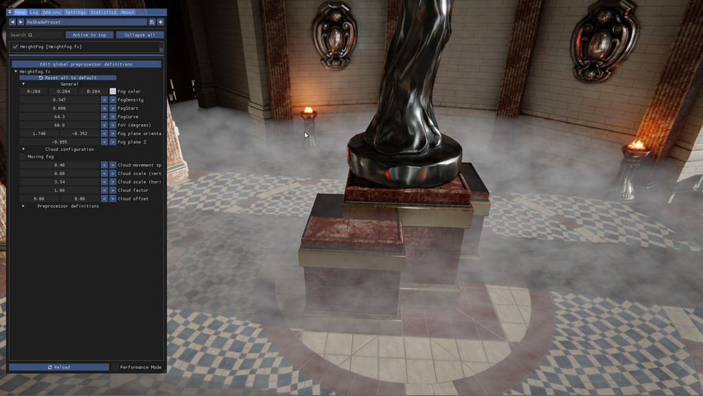

{.shadowed .autosize}

The 'Height fog' shader is a shader for creating height/volumentric fog effects for Reshade and is available in the 
[OtisFX](https://github.com/FransBouma/OtisFX) repository. The OtisFX repository always contains the latest version. Height fog was written by Marty McFly and Otis_Inf.

This guide assumes you have [properly set up the depth buffer in Reshade](../setupreshade.htm#checking-depth-buffer-access).
Height fog is a shader which inserts an infinitely big *plane* in the 3D world of your game and applies fog effects on that plane. How to control this plane to 
create atmospheric fog effects in your scene is described in this guide. 

@alert Important
It's important to realize that the Height fog shader has no idea what is up / down / left / right in your 3D scene. All it knows is the 
camera looking at the scene. This means that when you enable the shader in the Reshade overlay, the height fog is relative to the camera
and when you move the camera, the height fog moves with it. 

It's therefore not really useful for videos.
@end

## Aligning the fog

The default settings look like this:

{.shadowed .autosize}

This looks pretty odd at first, but remember, the fog is relative to the camera and it doesn't know what's up/down, so it doesn't know the 
camera looks down at an angle at the scene. The Heightfog controls however allow you to rotate and move the fog so it looks like it's on top of the 
floor of the temple we're looking at. 

### Fog plane Z

The first parameter to change is the **Fog Plane Z** value. To move the fog down, you have to make the value smaller, so more negative. By default 
it's -0.001, and if you make it smaller, like -0.021, the fog moves downwards (still relative to the camera!). It'll also become more fluffy as there's
more space at the top of the fog layer. 

Moving the Z further down doesn't always help. Especially in our example above where we're looking at an angle at the floor, we need to rotate the fog.

### Fog plane orientation

To rotate the fog element you have the two values of the **Fog plane orientation** setting. The first value is the 'roll' value, so this makes the fog layer 
rotate along the look direction of the camera. The second value is the 'pitch' value, which basically makes the fog plane rotate along the horizontal axis. 

In our example above, if we move the Z down a bit, and then change the second orientation value, the pitch, we can aligh the fog layer with the floor. It'll 
then look something like this:

{.shadowed .autosize}

Another value to tweak might be the **FoV** value. It's set to 60 by default, but if you're using a very wide window it might be needed to change the value a bit
so the plane orientation values align better.

## Tweaking the fog 

### Color
To change the color of the fog, change the **Fog color** parameter. This is fairly straight forward.

### Density control
Now that we've aligned it with our floor, we can now tweak it a bit. The parameters for that are **Fog density**, **Fog start** and **Fog curve**. These three
give you control over the thickness of the fog in the scene. The shader will calculate the thickness based on these values, so the more fog you look at the 
thicker it will be. Fog density and Fog curve are basically controlling the same thing, but Fog density gives a more fine-grained control over the Fog curve value. 
Fog start defines the distance from the camera where the fog should start. 0.0 is at the camera, 1.0 is at the horizon.

Here's a thick fog variant

{.shadowed .autosize}

And here's the same fog setup, but now with a lower density and it is set to start further away from the camera.

{.shadowed .autosize}

### Cloud control

The height fog uses a fog texture to create a cloudy / fluffy layer. You can control this cloudyness with the parameters under **Cloud configuration**. Checking the 
**Moving fog** checkbox will make the fog move slowly, and you can control the speed by changing the **Cloud movement speed**

The fluffy / cloudy nature of the fog layer has two parameters: **Cloud scale (vertical)** and **Cloud scale (horizontal)**. The Vertical value is for how 'wavy' the 
clouds are. The higher the value, the more wavier. The Horizontal value is for the variations the fog layer has across its layer. Combined you can create the 
unique fog your scene needs. Below are a couple of examples

First both horizontal and vertical scale factors are 0:

{.shadowed .autosize}

Then when we set the vertical scale value to 1 and keep the horizontal to 0

{.shadowed .autosize}

Then when we set the vertical scale value to 0 and set the horizontal to 3

{.shadowed .autosize}

With higher cloud values it might be a cloud element is just at the wrong spot. To move it a bit, you can change the cloud offset values, which move the clouds over x or over y. 

