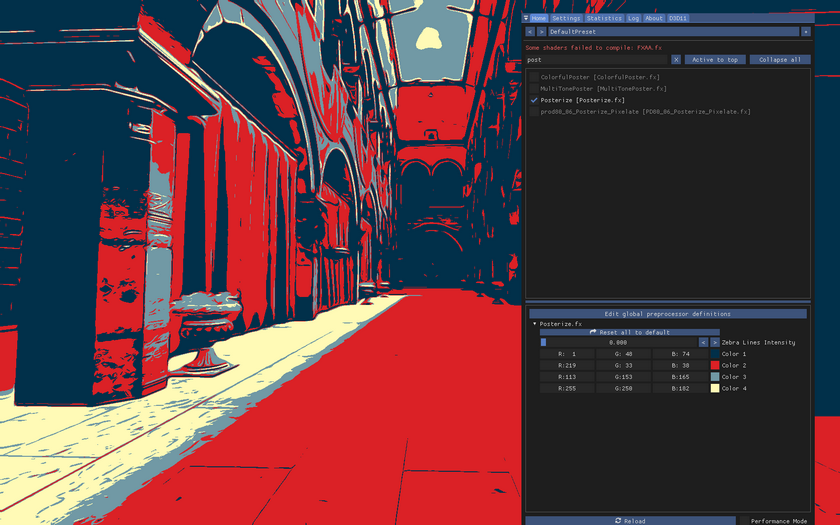
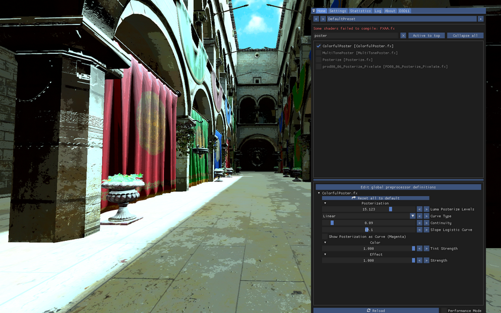
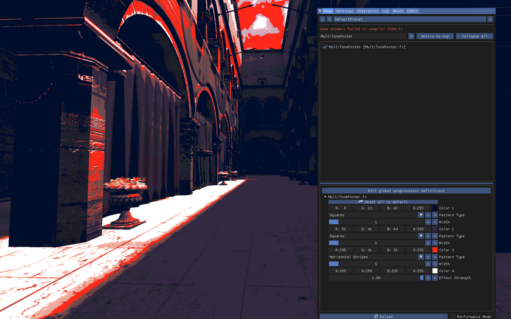
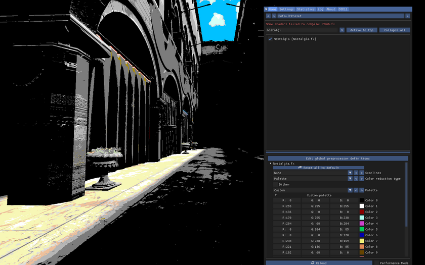
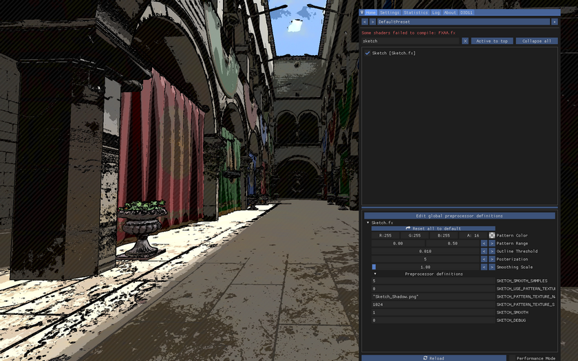

Shaders Catalogue
=========
 
The purpose of this guide is to let you know about the different stuff you can do in [reshade](https://framedsc.github.io/GeneralGuides/basics.htm#reshade) and show you why to use it instead of doing post processing in a common editing software.
 
I have gone through all the effects of every repo I could find and made this list with some (hopefully understandable) explanations. I don't have in-depth knowledge on every shader, so if you think you can write a better explanation, trick or go more in detail on how it works, please feel free to make a pull request or contact someone from Framed to update this guide. The same goes if there is a shader in the list that is outdated, if the link is not the newest version or if you want to include more shaders.
 
If you are not familiar with reshade and want to know about how to use it, shader order, shader duplication and other tricks be sure to check out the [Setting up Reshade guide](https://framedsc.github.io/ReshadeGuides/setupreshade.htm).
 
I wrote this guide with the goal in mind of selecting the shaders that can be useful in post processing screenshots, which means I haven't included CRT shaders or flashlight shaders for example. I also did not include a lot of curves, saturation, contrast, etc. shaders since a lot of them did essentially the same thing (with some exceptions that used very specific algorithms). If you feel like one of these might be worth including, again please do so. In the meantime, I have included most of prod's shaders for these types of shaders.
 
For more info about how each shader works or tips for using them, check the shaders code if there is info about it in the comments, the readme file from the repo the shader belongs to or if there is a thread on the reshade forums presenting the shader.
 
If you are going to download each shader separately, make sure you download the necessary files (like `.fxh` header files) and textures that come along with it.
 
## Essentials
 
These are the shaders that I consider essential to screenshotting. If you have to leave with something from this list, it is among these.
 
### Depth of Field
One of the advantages of using reshade over other post processing softwares (besides the obvious realtime post processing) is the use of the depth buffer. With a depth buffer, effects like depth of field become second nature where if you would want to apply said effect with another software, not only will it take way more time, it would probably not look as good as it does with reshade. 
 
- [**CinematicDOF**](https://github.com/FransBouma/OtisFX/blob/master/Shaders/CinematicDOF.fx): Based on various scientific papers and the most "realistic" and most used Depth of Field shader. It has near plane bleed, configurable highlights, high performance, easy to use focusing code and great bokeh. Please see the [Full guide on this site](Shaders/cinematicdof.htm).
- [**LightDOF**](https://github.com/Otakumouse/stormshade/blob/master/v4.X/reshade-shaders/Shader%20Library/Alternate/LightDoF.fx): Doesnt tank performance and easy to configure.
- [**quintDoF**](https://github.com/martymcmodding/qUINT/blob/master/Shaders/qUINT_dof.fx): A Depth of Field shader that aspires to give movie-quality bokeh blur to video games. It provides a very high quality DoF effect with artistic controls, ideal for both screenshots and gameplay. The bokeh discs it produces can be polygonal, circular and anything in between. It also features a disc occlusion feature (where the bokeh discs look like a boolean intersection between 2 circles) and chromatic aberration at bokeh shape edges. This is done by a unique gradient-based algorithm that has a very low constant cost ignorant of scene complexity or blur settings. To prohibit focused areas from bleeding their color into blurred areas the shader employs a highly sophisticated solution that is capable of mitigating this artifact completely without the overhead of common solutions that also mostly underperform.

### Deband

- [**Deband**](https://github.com/crosire/reshade-shaders): Have you ever seen gradients that don't seamlessly blend into each other? That's called banding. It happens when there aren't enough tones available to recreate a seamless gradation. This shader is ment to fix that. Be sure to grab the one linked since it has an option to adjust the depth of where the shader should act (since most of the time it should be applied only in backgrounds). Deband is part of the official Reshade shaders the Reshade installer will install for you always.
- [**qUINT_deband.fx**](https://github.com/martymcmodding/qUINT/blob/master/Shaders/qUINT_deband.fx): Fixes blocky color gradients and breaks up crushed texture detail.
 
## Screenshotting
 
### Composition Stuff
Shaders that are useful for composition and cropping.
 
- [**AspectRatioComposition**](https://github.com/Daodan317081/reshade-shaders/blob/master/Shaders/AspectRatioComposition.fx): Adds black bars to simulate the desired aspect ratio for latter cropping. Plus you can display fractions with the black bars to guide you through the rule of thirds or the rule of fifths for example. If you want to use different grids you will need to use an image with transparency with the shader Overlay or StageDepthPlus.
- [**AspectRatioSuit**](https://github.com/luluco250/FXShaders/blob/master/Shaders/AspectRatioSuite.fx): Like the previous shader but it allows you to have multiple aspect ratio delimiters at the same time, so you can evaluate all of them at once. It might be difficult to understand each possible AR with all the lines on screen, so make sure to edit the `ASPECT_RATIO_SUITE_VALUES` definition to delete or add aspect ratios.
- [**Aspect Ratio**](https://github.com/Fubaxiusz/fubax-shaders/blob/master/Shaders/AspectRatio.fx): If the images get stretched this can help fix it. Would recommend using another post processing software instead of this (or cropping the shot instead of using an AR the game doesn't accept), but the possibility is there if you want.
 
### Histograms
If you want an histogram while shooting and editing in reshade. Same as you would find in photoshop or lightroom.

- [**Histogram**](https://github.com/LordOfLunacy/Insane-Shaders/blob/master/Shaders/DevShaders/Histogram.fx): Shows an histogram on screen.
- [**HistogramCompute**](https://github.com/LordOfLunacy/Insane-Shaders/blob/master/Shaders/DevShaders/ComputeShaders/HistogramCompute.fx): Same shader as before but faster (does not work in DX9).
 
### Hotsampling
A collateral effect of [hotsampling](https://framedsc.github.io/GeneralGuides/basics.htm#hotsampling) is that if the game is rendering in high definition, you will only see part of the game on your screen. These shaders render the game in a thumbnail preview/picture-in-picture view, so that you can see the whole game window in your monitor. It is also useful for looking at the screenshot as a thumbnail to see how well it reads and looks in a smaller size, and what probably most people will see when they first stumble upon your shot.
 
- [**HotsamplingHelper**](https://github.com/Daodan317081/reshade-shaders/blob/master/Shaders/HotsamplingHelper.fx): As explained above, draws a scaled down version of the image onto the screen. Size and position of the overlay is configurable.
- [**FreezeShot**](https://github.com/originalnicodr/CorgiFX/blob/master/Shaders/FreezeShot.fx): This one is similar to the previous shader whilst also adding the capability to rotate the thumbnail, so it's useful for seeing how a vertical shot will look after rotating it (in the case you are not using a vertical AR). The shader has more options that are irrelevant for the purpose stated here and will be touched on later. Be sure to turn on the Black Background option and use a value of 1 in the Layer Depth value for an easier hotsampling experience.
 
## Graphics improvements
 
I am using quotes since the title can be deceptive. What I mean with it is that these shaders can be used in most situations since they can improve how a scene looks, especially in old titles.
It's worth pointing out that most of these shaders are situational, so you will have to ask yourself if the scene benefits from the use of a specific shader.
But before listing the shaders I will first introduce you to one that can be useful in conjunction with the rest.

- [**ReVail**](https://github.com/LordOfLunacy/Insane-Shaders/blob/master/Shaders/ReVeil.fx): Similar to the dehaze option in photoshop, except that it also allows you to reintroduce the haze afterwards. Super useful with ambient occlusion or raytracing effects to help them look native. Put the shaders that you don't want to see on top of smoke/fog/mist between the `Revail_Top` and `Revail_Bottom` techniques. RadiantGI has native revail support so it doesn't need it.
 
### Anti Aliasing
You are probably familiar with the term, if not Anti Alising helps reduce the "sawtooth" you see in games. Even if the game has an anti aliasing option, these shaders can help you in situations where the game anti aliasing breaks the depth buffer (MSAA for example) or where said anti aliasing implementations are old. These shaders use different implementations of different types of Anti Alisings; SMAA tends to give great results, but feel free to try them and see which one suits you best.
 
- [**SMAA**](https://github.com/CeeJayDK/SweetFX/blob/master/Shaders/SMAA.fx): Anti-aliases the image using the SMAA technique - see http://www.iryoku.com/smaa/. Be sure to download the .fxh file as well.
- [**DLLA_plus**](https://github.com/BlueSkyDefender/AstrayFX/blob/master/Shaders/DLAA_Plus.fx): Directionally Localized Anti Aliasing plus.
- [**NFAA**](https://github.com/BlueSkyDefender/AstrayFX/blob/master/Shaders/NFAA.fx): Normal Filter Anti Aliasing.
- [**Temporal AA**](https://github.com/BlueSkyDefender/AstrayFX/blob/master/Shaders/Temporal_AA.fx)
- [**FXAA**](https://github.com/CeeJayDK/SweetFX/blob/master/Shaders/FXAA.fx)
- [**BIAA**](https://github.com/Mortalitas/GShade/blob/master/Shaders/BIAA.fx): Bilinear Interpolation Anti Aliasing. Based on the temporal AA "Epic Games" implementation.
- [**Pirate_FXAA**](https://github.com/Heathen/Pirate-Shaders/blob/master/reshade-shaders/Shaders/Pirate_FXAA.fx)
- [**TAA**](https://github.com/Mortalitas/GShade/blob/master/Shaders/TAA.fx): Another TAA implementation.
- [**ASSMAA**](https://github.com/lordbean-git/reshade-shaders/blob/main/Shaders/ASSMAA.fx)
- [**FSMAA**](https://github.com/lordbean-git/reshade-shaders/blob/main/Shaders/FSMAA.fx)
- [**HQAA**](https://github.com/lordbean-git/reshade-shaders/blob/main/Shaders/HQAA.fx): Hybrid high-Quality Anti-Aliasing. Smooshes FXAA and SMAA together as a single shader with customizations designed to maximize edge detection and minimize blurring.
- [**LXAA**](https://github.com/grebord/LXAA-Antialiasing-Shader/blob/main/LXAA.fx)
- [**CMAA2**](https://gist.github.com/kevinlekiller/cbb663e14b0f6ad6391a0062351a31a2)

### Raytracing
You probably stumble across the term. Raytracing technology aims to simulate light and shadows more precisely. Even tho a game implementation of this kind of technology would be more accurate than a reshade implementation, most games dont do ray tracing within them and so these shaders can be useful, especially in old titles.
 
- [**Marty's RTGI**](https://www.patreon.com/mcflypg): With a lot of work put into it, Marty's RTGI is the way to go. You might need to learn how to configure it.
- [**RadiantGI**](https://github.com/BlueSkyDefender/AstrayFX/blob/master/Shaders/RadiantGI.fx): BlueSky implementation of global illumination plus subsurface scattering. Can be used in conjunction with marty's RTGI, but it also works very well on its own. It would require you to learn [how to use it](https://www.youtube.com/watch?v=soXozWWV7e0).
 
### Ambient Occlusion
Ambient occlusion aims to simulate shadows based on the scene geometry. As with ray tracing, it's often very useful with old titles.
 
- [**qUINT_MXAO**](https://github.com/martymcmodding/qUINT/blob/master/Shaders/qUINT_mxao.fx): Algorithmically similar to latest-gen tech like GTAO and CACAO, although it features some relatively unique features such as indirect illumination, smoothing filter for depth-derived normal maps, double-layer option at no additional cost and others. Highly configurable, easily tweakable.
- [**MC_SSAO**](https://github.com/ConstantineRudenko/Shaders/blob/master/reshade/Shaders/MC_SSAO.fx)
- [**MXAO**](https://github.com/cyrie/Stormshade/blob/master/reshade-shaders/Shaders/MXAO.fx)
- [**SSAO (HBAO, RayAO, HBAO, SSGI, AO_SAO, SSAO)**](https://github.com/Mortalitas/GShade/blob/master/Shaders/SSAO.fx): The SSAO shader has all the ambient occlusion techniques in parenthesis.
- [**PPFX_SSDO**](https://github.com/Mortalitas/GShade/blob/8f52311f29608456d3db94fa56b6a36522904d02/Shaders/PPFX_SSDO.fx)

### Reflections

- [**qUINT_ssr**](https://github.com/martymcmodding/qUINT/blob/master/Shaders/qUINT_ssr.fx): Adds reflections to the scene, using the data that is already available in the image. As a Screen-Space technique, it suffers like all similar implementations from the fact that nothing outside the screen can be reflected. It also cannot distinguish between reflective and non-reflective surfaces, so it will just cover everything with a reflection layer.

### Bloom
As they sound, bloom shaders are used to imitate bloom in a scene.

- [**AmbientLight**](https://pastebin.com/Lnmrmb3v): Bloom mixed with eye adaptation and lens dirt. The linked version of the shader has a toggle for using dither, since having it turned on can produce artifacts. It's highly recommended to turn off the dither. If the shader gets updated you won't find the latest version in this link.
- [**MagicBloom**](https://github.com/Mortalitas/GShade/blob/8f52311f29608456d3db94fa56b6a36522904d02/Shaders/MagicBloom.fx)
- [**NeoBloom**](https://github.com/luluco250/FXShaders/blob/master/Shaders/NeoBloom.fx)
- [**PD80_02_Bloom**](https://github.com/prod80/prod80-ReShade-Repository/blob/master/Shaders/PD80_02_Bloom.fx):  Bloom shader based on scene luminosity. It uses a Gaussian blur applied on the fly. It blends the bloom with the rest using the Screen blending method.
- [**qUINT_bloom**](https://github.com/martymcmodding/qUINT/blob/master/Shaders/qUINT_bloom.fx): Filter that adds a glow around bright screen areas, adapting to the current scene brightness.
- [**ArcaneBloom**](https://github.com/luluco250/FXShaders/blob/master/Shaders/ArcaneBloom.fx)
- [**BloomingHDR**](https://github.com/BlueSkyDefender/AstrayFX/blob/master/Shaders/BloomingHDR.fx)
- [**Pirate_Bloom**](https://github.com/Heathen/Pirate-Shaders/blob/master/reshade-shaders/Shaders/Pirate_Bloom.fx)
- [**PPFX_Bloom**](https://github.com/Mortalitas/GShade/blob/master/Shaders/PPFX_Bloom.fx)
- [**SimpleBloom**](https://github.com/Mortalitas/GShade/blob/8f52311f29608456d3db94fa56b6a36522904d02/Shaders/SimpleBloom.fx)
- [**KinoBloom**](https://github.com/Brimson/ssSilli/blob/master/kBloom.fx)
 
### Light Rays

- [**PPFX_Godrays**](https://github.com/Mortalitas/GShade/blob/master/Shaders/PPFX_Godrays.fx): If you want to add godrays to a scene then this shader can help you with that.
- [**TrackingRays**](https://github.com/luluco250/FXShaders/blob/master/Shaders/TrackingRays.fx): Similar to the previous shader but the orientation of the rays are automatic.

## Fun effects
If the shaders in the "graphics improvement" section were situational, these ones are even more. They would probably require some fiddling, but use them if you are going for a *very* specific look. In some of them, instead of explaining what they do I will be dropping screenshots because it would be easier to see than read about them.
 
- [**AdaptiveFog**](https://github.com/FransBouma/OtisFX/blob/master/Shaders/AdaptiveFog.fx): Used most for creating a color background, or putting a subject in shadows. It also has some bloom settings for when the fog starts.
- [**Anime4k**](https://github.com/lybxlpsv/ReshadeAnime4k/blob/master/Anime4k.fx): Port of UnityAnime4K, used for upscaling textures, specifically anime style images.
- [**Atmospheric Density**](https://github.com/Mortalitas/GShade/blob/master/Shaders/AtmosphericDensity.fx): A more faithful fog simulation. You will need MShadersAVGen.fxh, MShadersBlendingModes.fxh and 
- [**CanvasFog**](https://github.com/originalnicodr/CorgiFX/blob/master/Shaders/CanvasFog.fx): Used most for drawing colored shapes in the game, but it has a lot of room for creativity. More explanation on how it works on the repos readme.
- [**ChannelMixer**](https://github.com/murchalloo/murchFX/blob/main/Shaders/ChannelMixer.fx): Simple channel mixer shader from mixing or swapping image channels, could be useful to get different black and white images.
- [**ColorIsolation**](https://github.com/Daodan317081/reshade-shaders/blob/master/Shaders/ColorIsolation.fx): This shader lets the user configure the preferred hue and desaturates everything else. It is also possible to desaturate only the user-defined hue. It also has a nice debug option to see the interaction of the shader with the colors.
- [**ColorSort**](https://github.com/LordKobra/CobraFX/blob/master/Shaders/ColorSort.fx): Compute shader, which sorts colors from brightest to darkest.
- [**ComputeGravity**](https://github.com/LordKobra/CobraFX/blob/master/Shaders/computeGravity.fx): Compute shader version of Gravity.fx. It has a better color selection, and inverse gravity option. It runs slower on normal resolution, but a lot faster than Gravity.fx on high resolution, so you can downsample/hotsample without issues. Don't forget to include the texture inside the Textures folder!
- [**DepthHaze**](https://github.com/FransBouma/OtisFX/blob/master/Shaders/DepthHaze.fx): This effect is a simple depth-blur which makes far away objects look slightly blurred. It's more subtle than a Depth of Field effect as it's not based on a lens, but on how the human eye sees far away objects outdoors: detail is lost and the farther away an object, e.g. a tower, the less sharp the human eye sees it. Modern render engines tend to render far away objects crisp and sharp which makes the far away objects too sharp to look natural. Additionally Depth Haze also includes fog based on depth and screen position, which is configurable through parameters. It currently fogs more around the middle line of the screen and gradiently lowers the fog intensity towards the top/bottom of the screen, to avoid fog on the sky. Keep in mind that the blur used in the shader is outdated compared to DoF shaders.
- [**DirectionalDepthBlur**](https://github.com/FransBouma/OtisFX/blob/master/Shaders/DirectionalDepthBlur.fx): Can be used for more abstract backgrounds, but with the "focus point targeting strokes" option it can also be used to simulate movement with slow shutter speed. Keep in mind that it can be a very heavy shader when hotsampling.
- [**DisplayDepth**](https://github.com/crosire/reshade-shaders/blob/slim/Shaders/DisplayDepth.fx): This is a shader mostly useful for checking if the depth buffer is working as intended, BUT it can also help with simple silhouette shots.
- [**Dither**](https://github.com/luluco250/FXShaders/blob/master/Shaders/Dither.fx)
- [**Droste**](https://github.com/LordKobra/CobraFX/blob/master/Shaders/Droste.fx): The "Droste Effect" recursively warps space into a spiral pattern.
- [**DoubleExposure**](https://github.com/murchalloo/murchFX/blob/main/Shaders/DoubleExposure.fx): As the name suggests, it's used to do double exposure shots.
- [**Emphasize**](https://github.com/FransBouma/OtisFX/blob/master/Shaders/Emphasize.fx): Allows you to make a part of the scene pop out more while other parts are de-emphasized. This is done by using the depth buffer of the 3D engine, and by default it desaturates the areas which are not 'in focus'. Additionally you can specify a blend color which allows you to e.g. make what's not important much darker so the not-in-focus parts of the scene are way darker than the area which should be emphasized which is left as-is.
- [**Flip**](https://github.com/originalnicodr/CorgiFX/blob/master/Shaders/Flip.fx): Invert the orientation of the image in the x or y axis. Can be used interestingly with masks.
- [**FreezeShot**](https://github.com/originalnicodr/CorgiFX/blob/master/Shaders/FreezeShot.fx): Can be used to grab a subject from the game, freeze it and carry it into another scene, but keep in mind that the freezed image will be lost if reshade is restarted (for example, after hotsampling).
- [**Gravity**](https://github.com/LordKobra/CobraFX/blob/master/Shaders/Gravity.fx): Lets pixels gravitate towards the bottom of the screen inside the game's 3D environment. This shader consumes an insane amount of resources on high resolutions (4k+), so keep this in mind as a warning. Don't forget to include the texture inside the Textures folder! About the texture: You can replace it with your own texture, if you want. It has to be 1920x1080 and greyscale. The brighter the pixel inside the texture, the more intense the effect will be at this location ingame.
- [**Height fog**](https://github.com/FransBouma/OtisFX/blob/master/Shaders/Heightfog.fx): Inserts a fog plane in the 3D scene which you can use to add a volumetric
fog layer, which is fully configurable. See [the guide on this site](Shaders/heightfog.htm). 
- [**MagicBorder**](https://github.com/FransBouma/OtisFX/blob/master/Shaders/MagicBorder.fx): If you want to add borders in your shot but want the subject to hover over said border then try this shader.
- [**Monocular_Cues(Depth_Cues)**](https://github.com/BlueSkyDefender/AstrayFX/blob/master/Shaders/Depth_Cues.fx): (Image Enhancement by Unsharp Masking the Depth Buffer)
- [**NormalMap**](https://github.com/luluco250/FXShaders/blob/master/Shaders/NormalMap.fx): It allows the use of a normalmap texture to be applied on screen. You can find one of these on the internet, but it's often better to make your own with a software like Substance Designer.
- [**PatternShading**](https://github.com/EDCVBNM/ED-shaders/blob/main/Shaders/PatternShading.fx): Applies a pattern to a black and white version of the scene. Example in the shader repository readme.
- [**PD80_04_Color_Isolation**](https://github.com/prod80/prod80-ReShade-Repository/blob/master/Shaders/PD80_04_Color_Isolation.fx): Sames as the previous Color Isolation shader.
- [**PD80_04_Magical_Rectangle**](https://github.com/prod80/prod80-ReShade-Repository/blob/master/Shaders/PD80_04_Magical_Rectangle.fx): Create a rectangle, change dimensions/rotation, change color, change position in 3D space, blend with depth, blend with colors, create gradients, soften edges, create game mist, remove game mist, create flares, manipulate contrasts/brightness, create light leaks, and so on.
- [**PD80_06_Depth_Slicer**](https://github.com/prod80/prod80-ReShade-Repository/blob/master/Shaders/PD80_06_Depth_Slicer.fx): Similar to AdaptiveFog but with blending mods and other a couple more options.
- [**RealLongExposure**](https://github.com/LordKobra/CobraFX/blob/master/Shaders/RealLongExposure.fx): Enables you to capture changes over time, like in long-exposure photography. If you filter by brightness, it will have the most similar effect to real world photography, but try Freeze on a static scene with brightness turned off and not moving the camera to receive the most interesting results. Keep in mind that having low fps (that being because of hotsampling or using expensive shaders for example) would decrease the amount of samples the shader makes, thus resulting in a low quality result. If the tools that you are using to shoot a game allows you to control the velocity of the game then slow down said velocity for better results.
It can also be used when you have a jitter depth buffer (sometimes caused by TAA or other noisy effects like SSR or raytracing) to accumulate and produce a cleaner image.
- [**Retrofog**](https://github.com/luluco250/FXShaders/blob/master/Shaders/RetroFog.fx)
- [**Retrofog2**](https://github.com/Mortalitas/GShade/blob/master/Shaders/RetroFog2.fx)
- [**ThinFilm**](https://github.com/Mortalitas/GShade/blob/master/Shaders/ThinFilm.fx)
- [**ThreeColorGradient**](https://github.com/EDCVBNM/ED-shaders/blob/main/Shaders/ThreeColorGradient.fx): Like the name suggests it applies 3 gradients to the scene with a couple blending modes.
- [**TiltShift**](https://github.com/Fubaxiusz/fubax-shaders/blob/master/Shaders/TiltShift.fx): Useful for simulating tilt shift photography, altho with the lack of depth controls and an outdated DOF method its recommended to use CinematicDOF and try to recreate the effect with it.
- [**TinyPlanet**](https://github.com/Radegast-FFXIV/reshade-shaders/blob/master/Shaders/TinyPlanet.fx): Its purpose is to create a "tiny planet" image based on what's shown on screen. Useful if you don't know/want to do the proper work in Photoshop or similar post processing softwares.
- [**Trails**](https://github.com/BlueSkyDefender/AstrayFX/blob/master/Shaders/Trails.fx): Similar brightness results to RealLongExposure with improved smoothness and depth effects.
- [**qUINT_frametool**](https://github.com/martymcmodding/qUINT/blob/experimental/Shaders/qUINT_frametool.fx): If you want to hotsample with a background blur similar to the one "DirectionalDepthBlur" makes then this one does the job.
- [**ZigZag**](https://github.com/Radegast-FFXIV/reshade-shaders/blob/master/Shaders/ZigZag.fx): It distorts the image around a point, useful for creating abstract shapes. And since it has an animation opinion, you can get some interesting results in combination with reallongexposure.

## Painty shaders
- [**Oilify**](https://github.com/LordOfLunacy/Insane-Shaders/blob/master/Shaders/Oilify.fx): Applies a Kuwahara painty filter using an optimized method for extracting the image mean and variance separably.
- [**pkd_kuwahara**](https://github.com/Mortalitas/GShade/blob/master/Shaders/pkd_Kuwahara.fx)
 
## Outlines

- [**BilateralComic**](https://github.com/LordOfLunacy/Insane-Shaders/blob/master/Shaders/BilateralComic.fx): Cel-shading shader that uses a combination of bilateral filtering, posterization and edge detection to create a comic book style effect.
- [**Cartoon**](https://github.com/CeeJayDK/SweetFX/blob/master/Shaders/Cartoon.fx): Creates an outline-effect that makes the image look more cartoonish.
- [**Comic**](https://github.com/Daodan317081/reshade-shaders/blob/master/Shaders/Comic.fx): In order to achieve this look this shader uses different sorts of (configurable) edge detection methods on the color and depth information of the frame. Also, every edge layer can be individually faded in and out with distance. After all the layers are combined the resulting layer can be masked based on the luminosity and saturation of the original color (can be useful to mask the game's UI).
- [**dh_anime**](https://github.com/AlucardDH/dh-reshade-shaders/blob/master/Shaders/dh_anime.fx): Outlines and some color stuff.
- [**MeshEdges**](https://github.com/Daodan317081/reshade-shaders/blob/master/Shaders/MeshEdges.fx): More outlines with some color regarding the outlines themselves and the possibility to use a plain color with the outlines on top.
- [**LumaLines**](https://github.com/EDCVBNM/ED-shaders/blob/main/Shaders/LumaLines.fx): Draws an outline depending on the difference in luma between the pixels.
 
## Lens Flare
 
- [**Flair**](https://github.com/BlueSkyDefender/AstrayFX/blob/master/Shaders/Flair.fx): Adds lens flares.
- [**HexLensFlare**](https://github.com/luluco250/FXShaders/blob/master/Shaders/HexLensFlare.fx): More lens flares.
- [**UnrealLens**](https://github.com/luluco250/FXShaders/blob/master/Shaders/UnrealLens.fx)
 
## Screenshot with alpha pixels
Used to screenshot using pixels with alpha value of 0 depending on the depth of the shot. You will probably need to use the latest version of reshade for these ones.

- [**DepthAlpha**](https://github.com/luluco250/FXShaders/blob/master/Shaders/DepthAlpha.fx)
- [**CuttingTool_Depth**](https://github.com/Mortalitas/GShade/blob/master/Shaders/CuttingTool_Depth.fx)
 
## Images
Shaders used for rendering an image in game (like changing the sky). Can be used in combination with shaders like DepthAlpha and CuttingTool_Depth very well.

- [**Image**](https://github.com/Fubaxiusz/fubax-shaders/blob/master/Shaders/Image.fx)
- [**StageDepth**](https://github.com/Otakumouse/stormshade/blob/master/v4.X/reshade-shaders/Shader%20Library/Recommended/StageDepth.fx)
- [**StageDepthPlus**](https://github.com/originalnicodr/CorgiFX/blob/master/Shaders/StageDepthPlus.fx): Allows manipulating an image, letting you resize it independently from the x and y axis, positioning it, rotating it, using depth for masking and the ability of using different blending modes. You can also use a depth map alongside the texture image to interact with the game's depth.
 
## Styles

- **Posterize**: You can only get this shader in the [pack provided by nvidia](https://international-gfe.download.nvidia.com/GFE/GFEClient/ReShadeFilters/v1.0/Curated_ReShade_Filters.zip)

{.shadowed}

- [**Colorful Poster**](https://github.com/Daodan317081/reshade-shaders/blob/master/Shaders/ColorfulPoster.fx)

{.shadowed}
 
- [**MultiTonePoster**](https://github.com/Daodan317081/reshade-shaders/blob/master/Shaders/MultiTonePoster.fx)

{.shadowed}

- [**Nostalgia**](https://github.com/CeeJayDK/SweetFX/blob/master/Shaders/Nostalgia.fx): Tries to mimic the look of very old computers or console systems.

{.shadowed}

- [**Sketch**](https://github.com/luluco250/FXShaders/blob/master/Shaders/Sketch.fx)

{.shadowed}

## Masking
If you are familiar with photoshop or lightroom you probably know what masking is. If not, masking is referred to the act of selecting what parts of the screen you want some editing to take effect, often represented by white and black pixels for (white = the effects in between the CanvasMask shaders will be visible there, black= those effect won't be visible). The shaders that are in between the "Before" and "After" techniques of each mask shader will be masked out of the scene.
 
- [**Cobra Mask**](https://github.com/LordKobra/CobraFX/blob/master/Shaders/Cobra_Mask.fx): A color masking shader designed to be used with the ColorSort and Gravity shader, to apply a Mask with similar settings to the scene.
- [**CanvasMask**](https://github.com/originalnicodr/CorgiFX/blob/master/Shaders/CanvasMask.fx): Use the same controls as CanvasFog for masking pruporses (linear, circle, rectangle gradients with depth interaction).
- [**ColorMask**](https://github.com/originalnicodr/CorgiFX/blob/master/Shaders/ColorMask.fx): Use the color of the image to create a dynamic mask, altho it doesnt mask stuff very well in its state.
- [**PD80_06_Luma_Fade**](https://github.com/prod80/prod80-ReShade-Repository/blob/master/Shaders/PD80_06_Luma_Fade.fx): Use the scene luminance to mask shaders.
- [**UIMask**](https://github.com/crosire/reshade-shaders/blob/slim/Shaders/UIMask.fx): Simply uses an image to mask effects.
- [**UIMaskCreator**](https://github.com/LordOfLunacy/Insane-Shaders/blob/master/Shaders/UIMaskCreator.fx): Not exactly a masking shader, but this shader makes it possible to quickly create a UI mask ingame without making use of a photo editor by directly drawing over the UI, so that it can then be saved with a screenshot and used with a shader like `UIMask`.

## Common software editing tools
So this section has shaders that are similar to what you could expect of a editing software like lightroom or photoshop camera raw. Some of these implementations may be different to what you might find in these softwares, so even if at first glance it may look like these shaders can be seen as "stuff you can do in post after taking the shot" it might be worth trying them anyway.
 
If you want a detailed explanation about what most of prods shaders do make sure to check [his reshade forum thread](https://reshade.me/forum/shader-presentation/6167-prod80-s-shader-library).
 
### Editing
 
- [**ArtisticVignette**](https://github.com/luluco250/FXShaders/blob/master/Shaders/ArtisticVignette.fx)
- [**Clarity**](https://github.com/BlueSkyDefender/AstrayFX/blob/master/Shaders/Clarity.fx)
- [**ColorLab**](https://github.com/luluco250/FXShaders/blob/master/Shaders/ColorLab.fx)
- [**ContrastStretch**](https://github.com/LordOfLunacy/Insane-Shaders/blob/master/Shaders/ContrastStretch.fx): A histogram based contrast stretching shader that adaptively adjusts the contrast of the image based on its contents.
- [**LocalContrastCS**](https://github.com/LordOfLunacy/Insane-Shaders/blob/master/Shaders/LocalContrastCS.fx): A histogram based contrast stretching shader that locally adjusts the contrast of the image based on the contents of small regions of the image.
- [**PD80_01A_RT_Correct_Contrast**](https://github.com/prod80/prod80-ReShade-Repository/blob/master/Shaders/PD80_01A_RT_Correct_Contrast.fx): Automatic contrast correction when it finds a need to correct in the current scene. It works by adjusting white/black points and does not change color. Works like Photoshop "Auto Contrast".
- [**PD80_01B_RT_Correct_Color**](https://github.com/prod80/prod80-ReShade-Repository/blob/master/Shaders/PD80_01B_RT_Correct_Color.fx): Removes the tint of a scene. Works exactly the same (with additional methods/options) as Photoshop "Auto Tint".
- [**PD80_03_Color_Space_Curves**](https://github.com/prod80/prod80-ReShade-Repository/blob/master/Shaders/PD80_03_Color_Space_Curves.fx): : Ability to apply contrast curve in luminance channel of L*A*B*, HSL, HSV, and RGBW color spaces. This would avoid shifts in saturation when adjusting contrast. Also comes with a saturation slider to apply saturation using any of those color spaces.
- [**PD80_03_Curved_Levels**](https://github.com/prod80/prod80-ReShade-Repository/blob/master/Shaders/PD80_03_Curved_Levels.fx): It has a preprocessor definition to show the curves on your screen so you know exactly what you are doing.
- [**PD80_03_Levels**](https://github.com/prod80/prod80-ReShade-Repository/blob/master/Shaders/PD80_03_Levels.fx): It has a switch to apply the effect based on depth. When depth is enabled through the UI, you can apply different settings against the foreground and background, and you are able to set where the foreground and background starts and ends.
- [**PD80_03_Shadows_Midtones_Highlights**](https://github.com/prod80/prod80-ReShade-Repository/blob/master/Shaders/PD80_03_Shadows_Midtones_Highlights.fx)
- [**PD80_04_BlacknWhite**](https://github.com/prod80/prod80-ReShade-Repository/blob/master/Shaders/PD80_04_BlacknWhite.fx)
- [**PD80_04_Color_Balance**](https://github.com/prod80/prod80-ReShade-Repository/blob/master/Shaders/PD80_04_Color_Balance.fx): This effect will let you manipulate the color balance in shadows, mid tones, and highlights. Much like traditional photo editing tools (Photoshop or else). You can shift coloring in individual channels to your liking.
- [**PD80_04_Color_Gradients**](https://github.com/prod80/prod80-ReShade-Repository/blob/master/Shaders/PD80_04_Color_Gradients.fx): Lets you apply a color gradient to the image while preserving luminosity. You can pick the colors in the UI and determine the balance between shadows and mid tones. It will preserve highlights.
- [**PD80_04_Color_Temperature**](https://github.com/prod80/prod80-ReShade-Repository/blob/master/Shaders/PD80_04_Color_Temperature.fx)
- [**PD80_04_Contrast_Brightness_Saturation**](https://github.com/prod80/prod80-ReShade-Repository/blob/master/Shaders/PD80_04_Contrast_Brightness_Saturation.fx)
- [**PD80_04_Selective_Color**](https://github.com/prod80/prod80-ReShade-Repository/blob/master/Shaders/PD80_04_Selective_Color.fx)
- [**PD80_04_Selective_Color_v2**](https://github.com/prod80/prod80-ReShade-Repository/blob/master/Shaders/PD80_04_Selective_Color_v2.fx)
- [**Selective_hue_rotate_xy**](https://github.com/crabshank/HLSL-Reshade-colour-remappers/blob/main/Selective_hue_rotate_xy.fx)
- [**qUINT_lightroom**](https://github.com/martymcmodding/qUINT/blob/master/Shaders/qUINT_lightroom.fx): Highly comprehensive set of color grading filters, modeled after industry applications such as Adobe Lightroom, Da Vinci Resolve and others. It allows for miniscule adjustments of the scene colors with the ability to embed the current preset into a 3D LUT - a small image file that contains all color grading that the LUT.fx of the ReShade repository can easily load and apply. This both saves performance as reading a LUT is faster and it also protects your work as you only need to deploy the LUT along with your preset so you can keep your configuration private.
 
### Sharpening and texture

- [**AdaptiveSharpen**](https://github.com/Mortalitas/GShade/blob/master/Shaders/AdaptiveSharpen.fx)
- [**CAS (ContrastAdaptiveSharpen)**](https://github.com/CeeJayDK/SweetFX/blob/master/Shaders/CAS.fx): AMD FidelityFX Contrast Adaptive Sharpening. Sharpens the image, making details easier to see.
- [**FastSharpen**](https://github.com/guestrr/ReshadeShaders/blob/master/FastSharpen.fx)
- [**FilmicAnamorphicSharpen**](https://github.com/Fubaxiusz/fubax-shaders/blob/master/Shaders/FilmicAnamorphSharpen.fx)
- [**FilmicSharpen**](https://github.com/Fubaxiusz/fubax-shaders/blob/master/Shaders/FilmicSharpen.fx)
- [**LumaSharpen**](https://github.com/CeeJayDK/SweetFX/blob/master/Shaders/LumaSharpen.fx)
- [**PD80_05_Sharpening**](https://github.com/prod80/prod80-ReShade-Repository/blob/master/Shaders/PD80_05_Sharpening.fx)
- [**Smart_Sharp**](https://github.com/BlueSkyDefender/AstrayFX/blob/master/Shaders/Smart_Sharp.fx): Depth Based Unsharp Mask Bilateral Contrast Adaptive Sharpening
- [**qUINT_sharp**](https://github.com/martymcmodding/qUINT/blob/master/Shaders/qUINT_sharp.fx): Attempts to sharpen texture detail only while avoiding common sharpen artifacts such as halos around strong edges, excessive aliasing and flickering. It uses the depth buffer to enhance the detail and mask areas that would otherwise produce oversharpening.

### Tonemapping and color grading

- [**DPX**](https://github.com/CeeJayDK/SweetFX/blob/master/Shaders/DPX.fx): Makes the image look like it was converted from film to Cineon DPX. Can be used to create a "sunny" look.
- [**FilmicPass**](https://github.com/Mortalitas/GShade/blob/master/Shaders/FilmicPass.fx): Applies some common color adjustments to mimic a more cinema-like look.
- [**PD80_01_Filmic_Adaptation**](https://github.com/prod80/prod80-ReShade-Repository/blob/master/Shaders/PD80_03_Filmic_Adaptation.fx)
- [**PD80_04_Technicolor**](https://github.com/prod80/prod80-ReShade-Repository/blob/master/Shaders/PD80_04_Technicolor.fx)
- [**Reinhard**](https://github.com/Mortalitas/GShade/blob/master/Shaders/Reinhard.fx)
- [**Technicolor**](https://github.com/CeeJayDK/SweetFX/blob/master/Shaders/Technicolor.fx): Makes the image look like it was processed using a three-strip Technicolor process - see http://en.wikipedia.org/wiki/Technicolor
- [**Technicolor2**](https://github.com/CeeJayDK/SweetFX/blob/master/Shaders/Technicolor.fx)
- [**WatchDogsTonemapping**](https://github.com/Mortalitas/GShade/blob/master/Shaders/WatchDogs.fx)
 
### Film grain

- [**FilmGrain**](https://github.com/CeeJayDK/SweetFX/blob/master/Shaders/FilmGrain.fx)
- [**FilmGrain2**](https://github.com/Mortalitas/GShade/blob/master/Shaders/FilmGrain2.fx)
- [**PD80_06_Film_Grain**](https://github.com/prod80/prod80-ReShade-Repository/blob/master/Shaders/PD80_06_Film_Grain.fx)
- [**SimpleGrain**](https://github.com/Fubaxiusz/fubax-shaders/blob/master/Shaders/SimpleGrain.fx)

### Chromatic Aberration

- [**CA**](https://reshade.me/forum/shader-presentation/2990-ported-reshade-2-x-effects)
- [**ChromaticAberration**](https://github.com/CeeJayDK/SweetFX/blob/master/Shaders/ChromaticAberration.fx)
- [**FlexibleCA**](https://github.com/luluco250/FXShaders/blob/master/Shaders/FlexibleCA.fx)
- [**PD80_06_Chromatic_Aberration**](https://github.com/prod80/prod80-ReShade-Repository/blob/master/Shaders/PD80_06_Chromatic_Aberration.fx)
- [**Prism**](https://github.com/Fubaxiusz/fubax-shaders/blob/master/Shaders/Prism.fx)
 
### Emboss

- [**Bumpmapping**](https://github.com/guestrr/ReshadeShaders/blob/master/Bumpmapping.fx)
- [**Emboss**](https://reshade.me/forum/shader-presentation/2990-ported-reshade-2-x-effects)
 
## Extra

- [**Film Workshop**](https://discord.com/channels/217504282109411330/815409680590831686/850468467294601288): Emulates the process of real-world film capture, scanning & grading, and printing process workflow of traditional motion picture filmstock for cinema. For more info on the shader see the info displayed on the shader UI or [TreyM tutorial on how to use it](https://www.youtube.com/watch?v=VX_jMMccv5k). To download head out to [TreyM discord server](https://discord.treym.us). You may also want to download the [film workshop expansion](https://discord.com/channels/217504282109411330/805488441868812358/815651512671797269).
- [**NativeEnhancer-FE**](https://github.com/dddfault/NativeEnhancer-FE/blob/master/Shaders/NativeEnhancer-FE.fx): A Film emulation using LUT with various overlay and textures to mimic an old film looks. Lot of stuff.
- [**PandaFX**](https://github.com/FransBouma/OtisFX/blob/master/Shaders/PandaFX.fx): Applies cinematic lens effects and color grading, bloom for example.
- [**FGFXLargeScalePerceptualObscuranceIrradiance**](https://github.com/AlexTuduran/FGFX/blob/main/Shaders/FGFXLargeScalePerceptualObscuranceIrradiance.fx): The Large Scale Perceptual Obscurance and Irradiance is a post-processing effect that attempts to inject obscurance and irradiance in the scene at a large scale (low frequency).
- [**Glamayre_Fast_Effects**](https://github.com/rj200/Glamarye_Fast_Effects_for_ReShade/blob/main/Shaders/Glamayre_Fast_Effects.fx)
Implements fast FXAA, intelligent sharpening, fast ambient occlusion, subtle depth of field, fake global illumination and bounce lighting in a single shader. For more info, comparison shots and troubleshooting check the readme file on the shaders repository.
 
## LUTs
LUTs are a very important part of doing post, that being for screenshotting or just playing. For a more detailed look on what LUTs are and how to make your own go to [this guide](https://framedsc.github.io/ReshadeGuides/lutgenguide.htm). If you want a great source of LUTs head over to [gordinho MLUT shader repo](https://github.com/TheGordinho/MLUT). Below I would list some of my favorites.

- MultiLUTFaustus
- Film_Presets_MLUT
- Instagram_Filters_MLUT
- Kyoto_MLUT
- Luminar_MLUT
- MLUTCRP
- MLUTMarkimoo
- MultiLUT_MLUT_FreeLooks
- MultiLUT_MLUT_Luminar
- Nomad_MLUT
- Sahara_MLUT
- Santorini_MLUT
- Slide_Color_MLUT
- Strawberry_MLUT
- Street_Photography_MLUT
- Sunset_Color_MLUT
- Travelers_MLUT
- Triune_Digital_Cinematic_MLUT
- Urban_Cinematic_MLUT
- Various_MLUT
- Wanderlust_MLUT
- Wanderland_MLUT
- Anime_MLUT
- Hyperbeast_MLUT
 
I would like to also point out to prods LUTS (make sure to download the textures as well):
 
- [**PD80_02_Cinetools_LUT**](https://github.com/prod80/prod80-ReShade-Repository/blob/master/Shaders/PD80_02_Cinetools_LUT.fx)
- [**PD80_02_Bonus_LUT_pack**](https://github.com/prod80/prod80-ReShade-Repository/blob/master/Shaders/PD80_02_Bonus_LUT_pack.fx)

And that's it, I hope I convinced you to start using reshade or presented you a shader you didn't know.