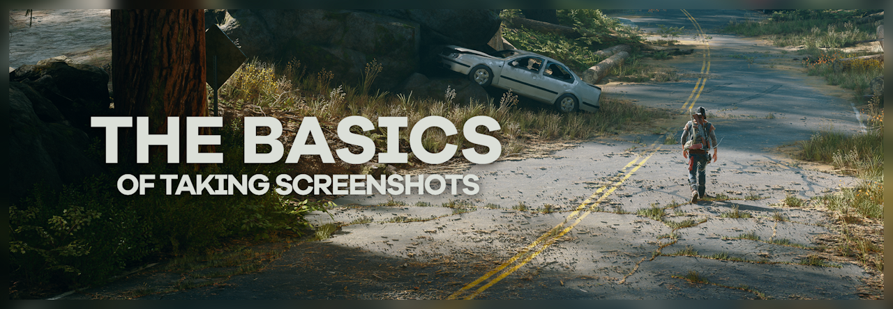
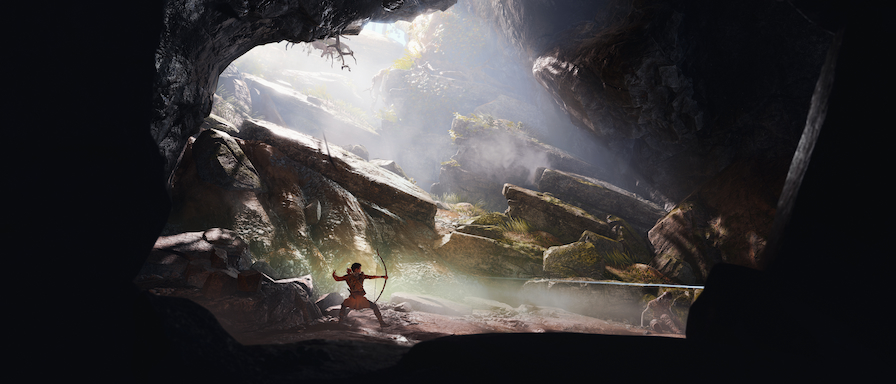
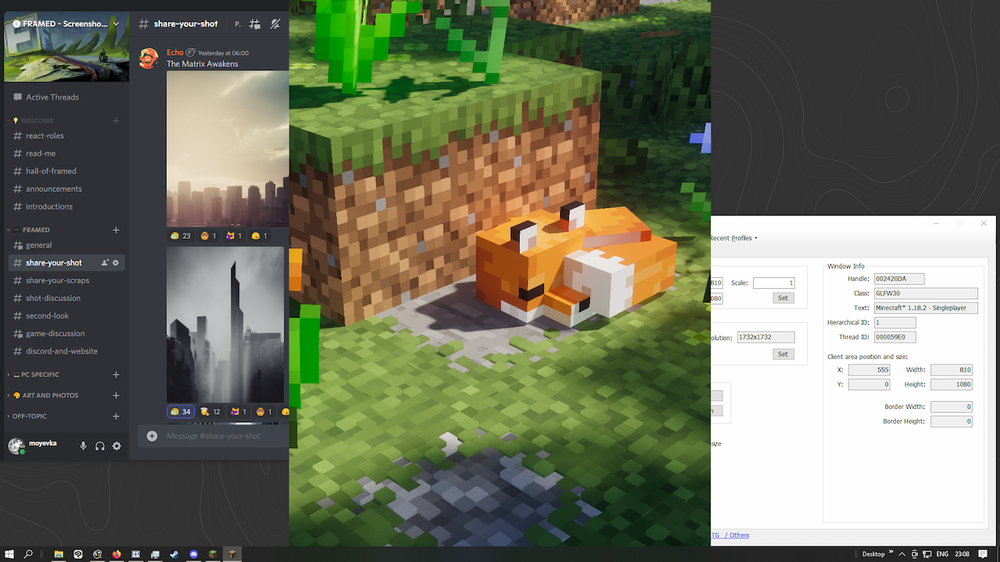
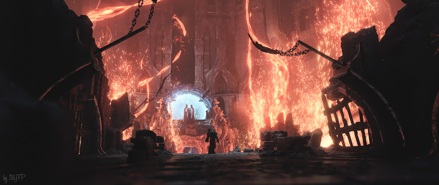
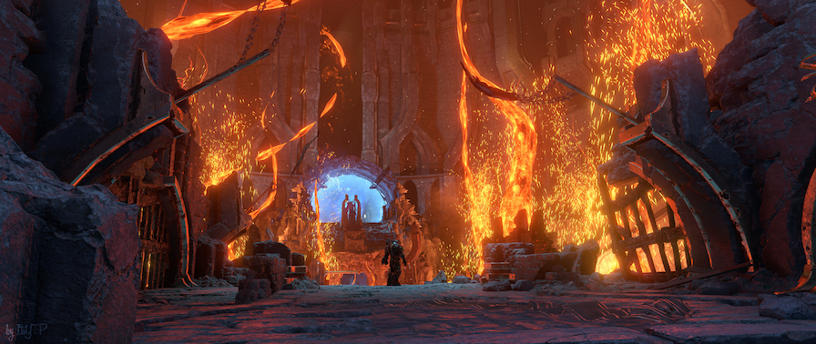

<i>Days Gone</i>, <a href="https://framedsc.com/HallOfFramed/?imageId=1622040794" target="_blank">shot</a> by Jim2point0

Welcome to [framedsc.com](https://framedsc.com/) - a site run by members of the FRAMED community, dedicated to compiling all the ways we know to take better in-game screenshots and more. This page serves as an introduction to the crazy methods we use to push games to their limits and capture the shots we want. Let's start by getting familiar with some terms.

---

## Camera tools

**Camera tools** are the essentials to the greater world of screenshotting. Rather than relying on pesky photomodes plagued with too many restrictions (or the lack of one completely), community-made freecams grant you the complete freedom to take the shots that you want. They typically come with timestops, HUD hides, field of view / zoom and tilt controls, along with the free-flying camera. Some even come with extra features that boost level of detail and more!

Freecams come in multiple forms: cheat tables, dedicated camera tools and if we're lucky, debug modes. 

**Cheat Engine tables** directly manipulate game memory to give you more control over the in-game camera. They can be rudimentary, but they get the job done. Our [game guides](./Gameguides.htm) usually link to these tables, and if a game doesn't have a table or a guide, it might be in our [Cheat Table Archive](./cheattablearchive.htm).

**Dedicated camera tools** take it a step further and package all that into a sophisticated, user-friendly DLL. These are much more streamlined than cheat tables ever will be, however are hard to come by as they can be difficult to make. Our very own [Otis_Inf](https://www.patreon.com/Otis_Inf) is currently the most prominent author of these, having written many camera tools as part of his Injectable Generic Camera System (IGCS). 

On occasion, a game's **debug mode** can be accessed, whether through mods or a certain key combo. These debug modes can have debug cameras (or "noclipping") which can be used in the same way as standard freecams in the absence of the tools above.

### Universal Cameras

As more and more games are powered by the same game engines like Unreal or Unity, it's become possible to make *universal* freecams that work in almost all games that use those engines. 

For Unreal Engine 4, the [Universal Unreal Unlocker](./GeneralGuides/universal_ue4_consoleunlocker.htm) by [Otis_Inf](https://www.patreon.com/Otis_Inf) has become the go-to tool for many UE4 games. It includes a freecam with all the common controls, as well as extra features like access to the console and many more.

For Unity, the [Cinematic Unity Explorer](https://github.com/originalnicodr/CinematicUnityExplorer) project by originalnicodr adds a freecam and much more to most Unity games. Please visit our [guide](./GeneralGuides/cinematic-unity-explorer.htm) for more information how to use it.

The open-source emulator [Dolphin](https://dolphin-emu.org/download/) also includes a built-in freecam known as [Free Look](https://wiki.dolphin-emu.org/index.php?title=Free_Look).

### Ansel

[Ansel](https://www.nvidia.com/en-sg/geforce/geforce-experience/ansel/) is a camera tool developed by Nvidia that's made its way into many modern-day games. Along with a freecam, it's also able to create "super resolution" shots through stitching or AI upscaling, take 360° shots, apply filters, and more. It does come with limitations, depending on the game, so it is what we would consider a last resort. If you have to use Ansel, check out our [guide](./GeneralGuides/anselguide.htm) on making the best of it.

### More links
- [A very large spreadsheet of possible camera tools for more games than our guides cover](https://docs.google.com/spreadsheets/d/1lnM2SM_RBzqile870zG70E39wuuseqQE0AaPW-P1p5E/edit#gid=0), compiled by originalnicodr (Google Sheets)
- [Our Cheat Engine tables guide](./GeneralGuides/cheat_engine_tables.htm)
- [Let’s add a photo mode to Wolfenstein II: The New Colossus (PC)](https://weblogs.asp.net/fbouma/let-s-add-a-photo-mode-to-wolfenstein-ii-the-new-colossus-pc) (Frans Bouma's blog)
- [Cheat Engine Tutorials by Stephen Chapman](https://www.youtube.com/playlist?list=PLNffuWEygffbbT9Vz-Y1NXQxv2m6mrmHr) (YouTube)

---

## Hotsampling

**Hotsampling** refers to briefly running a game in a much higher resolution than your monitor supports, allowing you to capture screenshots with incredible detail, then bringing it back down to a native playable resolution. 

This <i><a href="./GameGuides/gow.htm">God of War</a></i> screenshot was captured at <b>7558x3240</b> with no stitching or overpriced GPU needed. Just SRWE. (<i>wintermute</i>)

Hotsampling works by resizing the game window past the bounds of your monitor, using programs like [Simple Runtime Window Editor](https://github.com/dtgDTGdtg/SRWE) (SRWE) or [Windowed Borderless Gaming](https://westechsolutions.net/sites/WindowedBorderlessGaming/) (WBG). This resizing forces the game to render at the new resolution set by those programs, which will be larger than what fits on your screen. If your image looks "very zoomed in", that's a sign that hotsampling has worked. A game has to be running in **windowed** or **borderless windowed** for hotsampling to work. 

SRWE is the preferred program, however there are cases like with some Ubisoft games (*Steep*, *Ghost Recon Breakpoint*) where WBG will have to be used instead. To hotsample with WBG, open it, right click on the program in the taskbar, and select "Add Window F3". ALT-TAB back to the game and press F3. This may take some tries as the program initialises the game.

Keep in mind that not every game is able to hotsample. Do consult our [game guides](./Gameguides.htm) to check if your game supports it. Occasionally, the ability to hotsample can be enabled through certain cheat tables, tools and/or mods, so check if those exist too. Certain games may also only hotsample to multiples of 16:9, i.e. no custom aspect ratios.

[Most of the camera tools made by Otis_Inf](https://opm.fransbouma.com/Gamespecificfunctionality.htm) come with built-in hotsampling functionality available in the tool's window. While some of the supported games already hotsample with SRWE, the camera tools add the support for titles that don't, such as *[Cyberpunk 2077](./GameGuides/Cyberpunk_2077.htm)*, *[The Witcher 3](./GameGuides/thewitcher3.htm)*, *Death Stranding*, and many more.

### Composing for custom aspect ratios

One of the benefits of hotsampling is arbitrary window sizes. In other words: custom aspect ratios. With hotsampling, it's possible to render your game at aspect ratios like 4:5 or 2:1 to take some stunning portraits and ultrawide landscapes without having to crop from 16:9 or hurt your neck looking at your monitor sideways.

Let's say you want to take a 3:4 portrait at 3000x4000 but you're not sure how to compose it. Cropping from 16:9 wastes a lot of pixels, and hotsampling makes the shot too large to fit on your screen. You could use [hotsampling helper shaders](./ReshadeGuides/shaderscatalogue.htm#hotsampling) for ReShade, they can scale down a duplicate of your hotsampled window to fit in your monitor. That still comes at the cost of running your game at a very high resolution i.e. low framerate, so instead we'll use SRWE to help us out here.

We can use SRWE to set our game window to 3:4 but *within* our monitor's limits. Since we're shooting a portrait, we'll take our monitor's height as our bounds. We can then find out the width from some simple math. So, at 1080p, we'd set the game window to **810x1080**. 1440p would be **1080x1440**, and 4K would be **1620x2160**. This gives us a 3:4 preview of our shot fit perfectly in our monitor where we can now compose in.

Composing a 3:4 <i><a href="./GameGuides/MinecraftJE.htm">Minecraft</a></i> shot in a 810x1080 window.

This of course works with other aspect ratios, 21:9 would roughly be 1920x810 and so on. I would recommend saving this "preview" resolution as well as your final hotsampling resolution as SRWE profiles for ease of use, or you can download a profile pack below.

Additionally, you can use this for thumbnail testing - viewing your composition as a small image to see if elements are well defined. Instead of going to the bounds of your monitor, you could simply go down to something tiny like 300x400 and compose from there. 

@alert Tip
Tip: when you’re testing what the largest resolution is you can choose, multiply the width by the height and that gives you your megapixel amount. Keep track of what MP you can manage in specific games (each game may be different depending on how taxing its graphics are), and that makes it easy to know which size to go for in a different aspect ratio. 

If you know you can handle 14MP in 21:9 then you can handle 14MP in 3:4. Keeping a list somewhere of aspect ratios, resolutions, and MP is useful for if you want to use an aspect ratio not listed in Otis’ tools, or if you want to use SRWE or WBG etc instead 
@end

### Useful links
 
Here are some guides on how to hotsample in better detail:
 
- [Markdown guide in SRWE repository](https://github.com/dtgDTGdtg/SRWE/blob/master/README.md)
- [Dom SRWE guide](https://steamcommunity.com/sharedfiles/filedetails/?id=1119283512) (Steam Community)
- [WBG guide](https://nohud.fandom.com/wiki/Hotsampling_with_SRWE_/_WBG) (NoHUD)

Here are some profile packs you can download to use in SRWE. Made with 16:9 displays in mind, each pack has a total of 10 profiles. In 3 different aspect ratios (a portrait 3:4, an ultrawide 21:9 and a square 1:1), they come in full 16MP resolutions, preview resolutions, and thumbnail resolutions. The final "Default" profile serves as a shortcut to return to your native resolution. Download the pack for your native resolution:

 <a href="https://mega.nz/file/ORc2DLaR#47Cw7gwHdeDBmGWix_uT4JNvizyqQcTwIwNvYTeuL0A" target="_blank">1080p</a> | <a href="https://mega.nz/file/rEU2mZYB#iC7HTuSptLe7EzRiRFpvcIKR5yJ3bZuQNRiO4Kv6FnE" target="_blank">1440p</a> | <a href="https://mega.nz/file/zYdGWRiY#WHo3G73qeY-IOmikOa7gSDRUOLxvW817eCpoK6QJYEo" target="_blank">4K</a> 

### The history of hotsampling

[Skyrim - Unstretched Windowed Fullscreen Mode](https://www.nexusmods.com/skyrim/mods/7347) is a mod originally made to run Skyrim in a smaller window to save performance. But in 2012, the user midhras discovered he could use it to do the complete opposite, rendering the game at much higher resolutions just for screenshots. He then asked the developer to build a generic version of the mod that could be used with more windowed games, thus birthing the first hotsampling tool: SRWE.

As the technique began to grow in popularity, it needed a name. midhras came up with "shotsampling", then Duncan Harris of DeadEndThrills shortened it to *hotsampling*, which was "decidedly cooler".

### More links  
- [midhras guide](https://www.nexusmods.com/fallout3/articles/49/?) (Nexus Mods)
- [Video of SRWE in action](https://youtu.be/gNyQB7jPwEA) (YouTube)
- [Another guide](https://pcgamingexperience.com/resolutions/) (PC Gaming Experience)
- [Yet another guide](https://bsn.boards.net/post/552340) (Bioware Social Network)

---

## Dynamic Super Resolution (DSR)

**Dynamic Super Resolution** is a feature available for Nvidia GPUs that renders games at higher resolutions than your monitor, then downscales them to fit. Screenshots taken with DSR active will still be at those higher resolutions.

DSR is functionally similar to hotsampling with a few caveats. It works only in fullscreen and isn't as flexible as hotsampling, as resolutions can only be changed in the game settings. This means you will have to compose or even play at the resolution you want to shoot at. It should be the alternative when hotsampling is unavailable.

While vanilla DSR only supports multiples of your native res, the [Custom DSR guide](./GeneralGuides/custom_dsr_resolutions.htm) covers how you can add new resolutions even at custom aspect ratios.

Most games support DSR, even to custom aspect ratios. When a game doesn't, your custom resolutions won't show in your game settings. In that case, a possible workaround is to set your *desktop* to that custom resolution and play and shoot that way. 

For AMD users, Virtual Super Resolution (VSR) is the equivalent tech. As far as we know though, the process of VSR is more complicated than it is for DSR. [We are currently looking for someone who can document the process for us](https://github.com/framedsc/Sitesource/issues/89).

### Alt + Enter trick

When the game doesn't allow hotsampling, but does work with DSR, then there is still a chance that you won't need to play in your screenshoting resolution. That is because some games tie resolutions to "window modes". Meaning that you can switch between two resolutions by using fullscreen and windowed mode. 

So, for instance, you could select 4K DSR resolution on fullscreen, and 1080p on "windowed mode". That way, you can just play in windowed mode and set up a shot. When it is time to actually take the screenshot, press `Alt` + `Enter` to enter fullscreen, which would be using the 4k DSR resolution you set up earlier. And when you finish taking the screenshot press `Alt` + `Enter` again to go back to windowed mode and a gameplay resolution. Similarly to how you would hotsample. 

Please take in mind that this doesn't work in all games and it depends on the game settings remembering the resolution in each mode, but it is still worth trying out. Also, in the case that the game has commands that allow you to change resolutions (like Unreal Engine 3 games) you can use those to switch between DSR resolutions on the go if hotsampling isn't on the table.

### More links
- [Nvidia's page on DSR](https://www.nvidia.com/en-us/geforce/technologies/dsr/technology/)
- [An alternative DSR tool](https://www.forum-3dcenter.org/vbulletin/showthread.php?t=593534) (3DCenter)
- [DSR tutorial](https://www.neogaf.com/threads/downsampling-a-simple-method-for-making-your-pc-games-look-better.509076/) (NeoGAF)
- [AMD VSR tutorial](https://www.neogaf.com/threads/downsampling-for-amd-cards-is-now-possible.472941/) (NeoGAF, likely outdated)

---

## ReShade

**ReShade** is a post-processing injector for games, allowing you to add many post-processing effects to games such as bloom, ambient occlusion, depth of field, colour grading and so much more.

  

    
after ReShade

    
  

  

    
before ReShade

    
  

  <input type="range" min="0" max="100" value="50" step="0.01" 
    id="slider" class="slider__input" 
    autocomplete="off" onwheel="this.blur()" 
  />

<i><a href="./GameGuides/doometernal.htm">DOOM Eternal</a></i>, with MXAO, RTGI, SSR, Retrofog and Cinematic DoF. (<i>ItsYFP</i>)

While it is incredibly popular for 'dressing up' a game's looks to a user's taste, it's since become very useful for the PC screenshotting community as an extremely flexible editor that provides an in-game, real-time preview.

### The depth buffer

A 2D representation of how far or close objects are as seen from the camera, the depth buffer is what makes ReShade so powerful. It can be used to generate highly sophisticated effects such as [cinematic depth of field](./ReshadeGuides/Shaders/cinematicdof.htm) and raytraced lighting. It can even add [faux volumetric fog](./ReshadeGuides/Shaders/heightfog.htm) to a scene, or just be used for gorgeous [silhouette effects](https://framedsc.com/HallOfFramed/?imageId=1631466300).

ReShade's ability to grab a game's depth buffer may also be useful for those that know how to work with it in a compositor like Photoshop, After Effects, or Nuke. Our [guide to exporting depth buffers](./ReshadeGuides/depthguide.htm) covers this process.

### Why ReShade?

...instead of more conventional photo editors like Photoshop or Lightroom?

A lot of the depth effects written for ReShade are typically quite difficult if not near impossible to replicate in an external editor without some serious plugins or knowledge on how to recreate them. Many also choose ReShade because it's convenient - it's right there always alongside your game, easy to access and use at any time, and it's *free*.

That's not to say it doesn't come with downsides, ReShade can be a major performance hit, not to mention it gets increasingly unstable the more complex your effects get. Some do prefer the experience of working in an external editor just for the peace of mind that their game won't crash on them after a couple hours of work.

For more use cases for ReShade, check out our [guide to setting ReShade up](./ReshadeGuides/setupreshade.htm) as well as our [catalogue](./ReshadeGuides/shaderscatalogue.htm) of almost every ReShade shader out there.

### More links
- [Official page](https://reshade.me/)
- [List of repositories](https://www.pcgamingwiki.com/wiki/ReShade#List_of_known_shader_repositories) (PCGamingWiki)
- [Game compatibility list](https://www.pcgamingwiki.com/wiki/ReShade#Game_compatibility) (PCGamingWiki)
- [Easy Troubleshooting](https://reshade.me/forum/troubleshooting/5227) (ReShade)
- [How to fix most of your problems with ReShade](https://www.youtube.com/watch?v=hYUiWfvyafQ) (YouTube)
- [How to Fix a Misaligned Depth Buffer on ReShade](https://www.youtube.com/watch?v=1z3VyU_4GQY) (YouTube)

---

## Capturing Screenshots
 
All the info above should have been enough for you to go out and compose a gorgeous shot in your favourite game. Now the question is: *How do you actually save the image?*

There are many ways of doing so, and none of them through a game's built-in capture function. Many games typically save their screenshots as compressed JPGs and don't capture any overlays (i.e. ReShade effects). We want to be able to save a full resolution image, preferably as a lossless PNG, and with all the ReShade effects we've added.

Here are some typical methods:

- **[ReShade](https://reshade.me)**  
ReShade comes with its own capture function and is typically the chosen option for many that have it installed. It should no longer have issues capturing higher resolutions as its PNG capture was rewritten for its 5.0 update. If you continue to use an older version of ReShade and need faster captures, you could also try:
- **[MSI Afterburner](https://www.msi.com/Landing/afterburner/graphics-cards)**  
Favored by quite a few, Afterburner is a graphics card utility that happens to be able to hook into games and take screen captures of them, even when the game isn't in focus. This makes it useful for games that might resize its window or move the camera after alt-tabbing back into the game. However, it's been known to conflict with certain games and their tools, causing crashes. You will also need to install RTSS, bundled with the installer, to be able to take screenshots with Afterburner.
- **[Nvidia GeForce Experience](https://www.nvidia.com/en-sg/geforce/geforce-experience/)**  
Nvidia's game overlay for anyone with an Nvidia GPU, GeForce Experience lets you record videos, livestream, do all sorts of stuff, but most importantly: capture screenshots. Be sure you have *Desktop capture* disabled under *Privacy control*, otherwise it will just save whatever's on your monitor at the moment of capture.
- **[Steam](https://screenshot.help/steam)**  
If you're playing a Steam game and are used to hitting F12, Steam Overlay works just fine for capturing too. Just be sure to enable *Save an uncompressed copy* under Steam Settings > In-Game to save proper PNGs, Steam JPGs can be very low quality.

These methods above have been proven to work well with hotsampling and ReShade, but if you run into issues with them, try switching them up.

---
 
## Further reading
 
- [VP Guide by ILikeDetectives](https://ilikedetectives.com/virtual-photography-101)