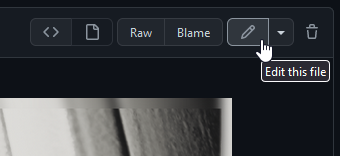

<div class="figure">

<p><i>Industria</i>, <a href="https://framedsc.com/HallOfFramed/?imageId=1633772229" target="_blank">shot</a> by nyxikri</p>
</div>

<center> <b><font size=+3 face="Galano Grotesque Alt">We want you!</font></b> <br>
<i>We're looking for authors! Don't know what to write? Check our</i> <a href="https://github.com/framedsc/Sitesource/issues?q=is%3Aissue+is%3Aopen+label%3A%22needs+author%22" target="_blank"><b>issue tracker</b></a>. </center>

[framedsc.com](https://framedsc.com/) is an open-collaboration project, written and maintained by a community of volunteers. We welcome anyone willing to contribute their own knowledge and expertise on anything relevant, be it to [our game guides](./Gameguides.htm), a [cool technique you know of](./GeneralGuides/tinyplanetsguide.htm), or anything you think could be useful to someone!

---

## Writing guides

If you're interested in writing a guide for the site, please [download this template](https://mega.nz/file/fIdh0AyZ#v44xeHlL_j6hzjn5r7phXRqCBEfCOiWiiUEQEOb14-c). It contains everything you need to get started - a Markdown template for a game guide and a .PSD + font file to generate a header. There are two versions of guide templates, one for [PC guides](./Gameguides.htm) and one for [Console guides](./Consoleguides.htm).

We recommend writing with [Visual Studio Code](https://vscode.dev/) as it has a Markdown preview similar to how the site looks. The site is built with DocNet, however, which includes Markdown extensions not found in the VS Code preview. Learn more about [DocNet's additional features](http://fransbouma.github.io/DocNet/WritingcontentusingMarkdown.htm), or continue reading to learn about some handy formatting features.

The site also supports HTML in Markdown if you want the formatting of your guides to be a little fancier. The centred text above was written in the .MD like so:

```HTML
<center> <b><font size=+3 face="Galano Grotesque Alt">We want you!</font></b> <br>
<i>We're looking for authors! Don't know what to write? Check our</i> <a href="<URL>" target="_blank"><b>issue tracker</b></a>. </center>
```

### Hosting files

We don't host any tools or utilities in the repository itself. If you would like to contribute any tool or utility, we recommend using a filehost like [mega.nz](https://mega.nz). If the tool is hosted publicly on say a modding site or forum, please link to the post instead.

An exception to this is cheat tables. We prefer to archive those internally, provided that you are the author or have been given permission by the author to have them archived on the site. Include them alongside your submitted files.

### Updating guides

If you notice an error in a guide or you simply want to extend an existing guide, you may access the [site source](https://github.com/framedsc/Sitesource). From there, open the markdown folder and navigate to the .md file of the guide you wish to edit. You may download the .md file and edit it offline, or you can use GitHub's editing tool to make a quick edit that will request a pull to the site immediately.

{.shadowed .autosize}

#### Marking outdated guides

There are some outdated tools and guides on the site that we haven't been able to catch! If you notice any of them, do alert the site admins or create a pull request adding the following [alert box](#alert-boxes) underneath the summary table.

@alert neutral  
This guide and its tools are **outdated**. Please help to [update](https://framedsc.com/contribute.htm#updating-guides) the contents of this guide with relevant information. *(September 2020)* 
@end

```
[...]
Game version | 1.19.0

@alert neutral  
This guide and its tools are **outdated**. Please help to [update](https://framedsc.com/contribute.htm#updating-guides) the contents of this guide with relevant information. *([estimate the last month the information was relevant])* 
@end
```

Similarly, there are some guides for UE4 games that were written before the UUU was released, referencing cheat tables that are no longer necessary. *Alternatively, they may be unique UE4 games that require additional game-specific info.* These guides can be marked using this alert box.

@alert neutral  
This guide is for an Unreal Engine 4 game that can use the [Universal Unreal Unlocker](https://framedsc.com/GeneralGuides/universal_ue4_consoleunlocker.htm).  
@end

```
@alert neutral  
This guide is for an Unreal Engine 4 game that can use the [Universal Unreal Unlocker](https://framedsc.com/GeneralGuides/universal_ue4_consoleunlocker.htm).  
@end
```

### Etiquette

We're generally not too concerned with how you write and format a guide, so long as the information is coherent and presentable. A site admin will help to clean up any incorrect syntax before publishing.

When it comes to updating game guides, headers will not be updated.

Unless all download pages are dead and the author is uncontactable, we will not rehost files without the author's permission.

#### Crediting yourself

You may credit yourself at the end of your non-game guides if you feel like it. Game guides don't have credits, but more often than not the headers used are from the guide authors themselves.

---

## Making headers

When making a header for your guide, you may use any shot from the game, including your own. We recommend picking one that allows for good readability of text.

Here are two examples of great headers. The text lies wholly in the dark left side of the shot, contrasting and reading well.  
{.shadowed .autosize}
{.shadowed .autosize}

After you've picked your shot, place it above the Base layer and ensure it's clipped to it. If it isn't, alt-click on the divider between the two layers. You should see a small down-arrow appear. Arrange the shot as you see fit.

Once the shot has been arranged, duplicate it by alt-clicking and dragging the layer below the Base layer. You can also `Ctrl + J` to duplicate and move it below. Go up to `Filter > Blur > Gaussian Blur...` and add a 26.3 radius blur to this duplicated layer to create the blurred border.

Your Photoshop layers should look like so:  
{.shadowed .autosize}

Export it as a .PNG and rename appropriately.

The header template includes a network of guides that can be enabled and disabled with `Ctrl + ;`. These can be used to help you compose a header or as safety margins. In the rare case that a game title is so long it doesn't fit in the header, decrease the font size until it fits in the rightmost margin.

{.shadowed .autosize}

---

## Images

If your guide has images, use this line to embed them:
```Markdown
{.shadowed .autosize}
```

For the subtitle to show, there has to be an empty line above this line.

Images will be sorted into the Images folder by the site admins. You may place them in a subfolder if you'd like to organise them.  

There are a few CSS classes you can use in the Markdown line above to further format your images.

Class | Description
-- | --
`.shadowed` | Adds a drop shadow to the image. **Please include this class.**
`.autosize` | Resizes the image if it's too large. **Please include this class.**
`.center` | Centers an image.
`.smaller` | Reduces the width of an image. Useful if including long vertical images.

These are added at the end of the Markdown line, in between `{}`.

You can also use HTML to embed them instead, if you want a bit more formatting.

```HTML
<div class="figure">

<p>subtitle</p>
</div>
```

#### Accepted images

Images on the site should be in a .PNG / high-quality .JPG format, under 1MB. While there are no current size limits, images on the site are resized to 896px width (with the .autosize tag, which should be added to all images). They don't have to be resized to that width, but we would prefer it if you kept image sizes reasonable.

For excessively large images (say you want to include a full-res screenshot for some reason), they may be hosted externally. Use a trusted, reliable imagehost like [Imgur](https://imgur.com/upload).

---

## Alert boxes  

@alert neutral
You may have noticed that the site has a bunch of these alert boxes!
@end

@alert tip
They're handy for highlighting certain pieces of information!
@end

@alert info
Whether you want to break off a part of your guide to talk about it more in detail...
@end

@alert warning
...or if you want to warn users about something that could happen...
@end

@alert important
Alert boxes are a useful addition to your guide!
@end

@alert danger
FAILURE TO READ THE README WILL RESULT IN PROSECUTION.
@end

Alert boxes can be added by wrapping text around `@alert [box type]` and `@end`, like so:
```
@alert neutral
You may have noticed that the site has a bunch of these alert boxes!
@end
```

The box types mostly correspond to their title above, `@alert tip` produces a green alert box, `@alert info` produces a blue alert box, so on and so forth. The exception is `@alert neutral`, which produces the black alert boxes.

---

## Summaries

Some parts of your guides can be hidden away by a dropdown if necessary.

<details>
<summary>Click me!</summary>
Hello! I'm some text that's been hidden away because I don't want to be visible all the time!
</details>

These can be used to hide tables, images, or anything else that you feel might break the flow of the guide.

```HTML
<details>
<summary>Click me!</summary>
Hello! I'm some text that's been hidden away because I don't want to be visible all the time!
</details>
```

These summaries also support an `important` class, if you need the dropdown to stand out. Use `<summary class=important>` to add one.
<details>
<summary class=important>Now you really have to click me!</summary>
Hello! I'm even more text that's been hidden away, but my author really wanted you to read me. Maybe I'm supposed to be hiding a super long table that would interrupt the guide, but it's still an important table for you to be referencing at some point.  

While we're here, it's a good time to should mention that these summary dropdowns <b>don't support punctuation formatting.</b> You need to use HTML to bold, italicise, and further format your text in these.
</details>

---

## Image comparisons

The site supports sliders to compare two images, if you'd like to show off a before/after or anything similar.

<div class="slider container" style="aspect-ratio: 64/27">
  <div class="slider__img slider__img-after">
    <p>after ReShade</p>
    
  </div>
  <div class="slider__img slider__img-before">
    <p>before ReShade</p>
    
  </div>
  <input type="range" min="0" max="100" value="50" step="0.01" 
    id="slider" class="slider__input" 
    autocomplete="off" onwheel="this.blur()" 
  />
</div>
<div class="figure"><p>Subtitle. Shots by ItsYFP</p></div>

This is done wholly through HTML in your Markdown file:
```HTML
<div class="slider container" style="aspect-ratio: 64/27">
  <div class="slider__img slider__img-after">
    <p>This is the after text.</p>
    
  </div>
  <div class="slider__img slider__img-before">
    <p>This is the before text.</p>
    
  </div>
  <input type="range" min="0" max="100" value="50" step="0.01" 
    id="slider" class="slider__input" 
    autocomplete="off" onwheel="this.blur()" 
  />
</div>
<div class="figure"><p>This is the subtitle text.</p></div>
```

The 'before' image does come after the 'after' image. **Ensure both images are of the same aspect ratio and change `aspect-ratio` in the first line to match.**

---

## Controller buttons

The site supports display of Xbox buttons through a font. You can use these to embellish a controls table like so:

Gamepad | Command
--|--
<font face="Controller">{ / }</font> | Move camera up / down
<font face="Controller">[ / ]</font> | Tilt camera left / right
<font face="Controller">W / X</font> | Zoom in / out

The syntax for this is a little messy as it involves wrapping the specific glyphs in HTML:
```Markdown
<font face="Controller">{ / }</font> | Move camera up / down
<font face="Controller">[ / ]</font> | Tilt camera left / right
<font face="Controller">W / X</font> | Zoom in / out
```

The site also supports PlayStation buttons, if you'd like to use <font face="ControllerPS">[ ] { }</font> instead of <font face="Controller">[ ] { }</font>. To switch to them, use `"ControllerPS"` instead of `"Controller"`.

This feature is unique to the site and not supported by Markdown previews. You may generate previews of the site following our [readme](https://github.com/framedsc/Sitesource) if you'd like to see how they look.

Input | Output | Input | Output
-- | -- | -- | --
`7 8 9` <br> `4 5 6` <br> `1 2 3` | <font face="Controller">7 8 9 <br> 4 5 6 <br> 1 2 3</font> | `7 8 9` <br> `4 5 6` <br> `1 2 3` | <font face="ControllerPS">7 8 9 <br> 4 5 6 <br> 1 2 3</font>
`< >` | <font face="Controller">< ></font> | `< >` | <font face="ControllerPS">< ></font>
`Q W E` <br> `A S D` <br> `Z X C` | <font face="Controller">Q W E <br> A S D <br> Z X C</font> | `Q W E` <br> `A S D` <br> `Z X C` | <font face="ControllerPS">Q W E <br> A S D <br> Z X C</font>
`x y` <br> `a b` | <font face="Controller">x y <br> a b </font> | `s t` <br> `x c` | <font face="ControllerPS">s t <br> x c </font>
`[ ]` <br> `{ }` | <font face="Controller">[ ] <br> { }</font> | `[ ]` <br> `{ }` | <font face="ControllerPS">[ ] <br> { }</font>
`v g m` | <font face="Controller">v g m</font> | `o h r` | <font face="ControllerPS">o h r</font>

*Inputs are **case-sensitive**!*  
*Controller Font by [Dean Tersigni](http://www.thealmightyguru.com/Wiki/index.php?title=Controller_Font)*

---

## Game stores

The site also supports game store icons to specify in which store the game has to be in order for the tools to work (or in which ones it was tested) alongside the game version. You can use these like the following:

Feature	| Supported
--|--
... | ...
Game version	| <font face="Stores">S E M</font> 1.42

With the syntaxis for this being:

```Markdown
Game version	| <font face="Stores">S E M</font> 1.42 
```

Once again, this feature is unique to the site and not supported by Markdown previews. You may generate previews of the site following our [readme](https://github.com/framedsc/Sitesource) if you'd like to see how they look.

Store | Input | Output
-- | -- | --
Battle.net | `<font face="Stores"> B </font>` | <font face="Stores"> B </font>
EA Desktop | `<font face="Stores"> D </font>` | <font face="Stores"> D </font>
Epic Games Store | `<font face="Stores"> E </font>` | <font face="Stores"> E </font>
GOG Galaxy | `<font face="Stores"> G </font>` | <font face="Stores"> G </font>
Microsoft Store | `<font face="Stores"> M </font>` | <font face="Stores"> M </font>
Rockstar Launcher | `<font face="Stores"> R </font>` | <font face="Stores"> R </font>
Steam | `<font face="Stores"> S </font>` | <font face="Stores"> S </font>
Ubisoft Connect | `<font face="Stores"> U </font>` | <font face="Stores"> U </font>

*As with the controller fonts, inputs are **case-sensitive**!*  
*The store icons belong to their respective owners.*  

---

## Publishing guides

Once you're done writing a guide, you may contact one of the site admins (listed on the [homepage](./index.htm)) to get it added. Please zip up your guide and all relevant assets into one compressed folder. Alternatively, you may submit a [pull request](https://github.com/framedsc/Sitesource/pulls) to the GitHub repository. 

Once sent over, a site admin will look through your submission to ensure everything'll look good on the site before we put it up.

Thanks for contributing to FRAMED!
