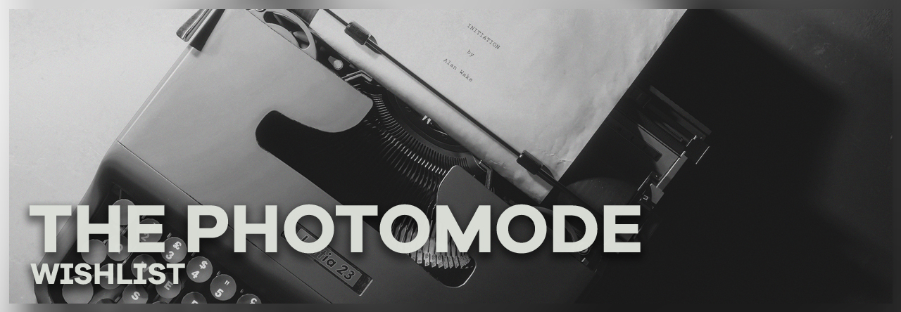
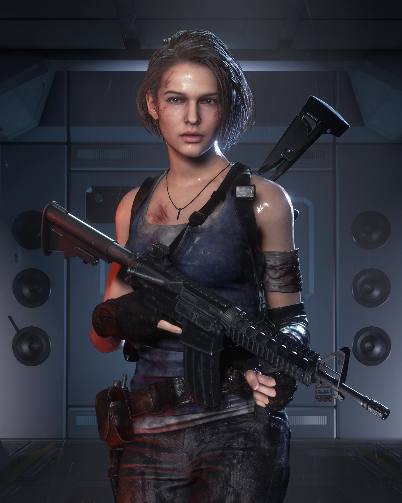
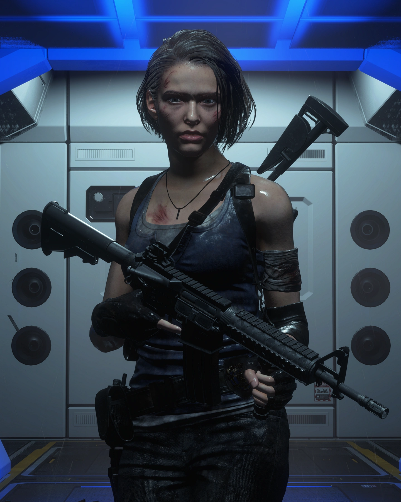

<i>Alan Wake II</i>, shot by seymourglass

This article is aimed at developers who are curious about what the "perfect" photomode looks like to players. Features take resources, and the effort of implementing the ones listed in here can vary, so this list is organized by priority.

Most of the suggestions below involve giving more freedom to the player regarding what and how they can change things. Such control can be overwhelming for some inexperienced users, especially if they have never come across similar things. Check out popular third-party tools such as [Otis_Inf's photomode mods](https://opm.fransbouma.com/) to see how these settings have evolved into pretty straightforward settings. More on that at the end.

## Essentials
----
These are the features that are a must for any photomode. Some may seem obvious, but many games fail to include them.

### Free camera movement and orientation

The following aspects regarding camera movement and orientation are crucial:

- Maximum range as big as possible
  : Maybe your game or engine is not prepared to deal with the camera being far away from the player, but try to push this value as much as you can. Small range limits are one of the things that get modded first on PC, so players will certainly appreciate it. Some studios may be worried about players moving the camera around to find secrets or look at what comes next in the level, but this is a decision that comes from the player and in a photomode context the advantages outweigh the downsides.

- No orbital free cam
  : Some popular console first-party titles like to have their photomodes centered around their characters, so they only let you move the camera around them. Not only is this less intuitive to control than a normal freecam, but it also emphasizes only a fraction of what the game has to offer visually with its characters, instead of letting the user move the camera across the entire environment to find beauty in it.

- Photomode availability during cutscenes
  : We are aware of how many tricks devs pull outside of the camera range in cutscenes, but being able to still use the photomode during them is crucial to have the most amount of variety when it comes to shooting scenes. Besides, players want to show how pretty your game is as much as you do, they won't focus on these imperfections happening around the scene.

- Camera tilt
  : It is often overlooked, but part of the complete movement of a free camera is being able to tilt it (also called roll depending on the bibliography). Such movement can help a lot in making compositions feel more dynamic or allow players to shoot in a vertical aspect ratio (although being able to [hotsample to the desired aspect ratio](basics.htm#composing-for-custom-aspect-ratios) is much preferred, more on that later).

- No camera clipping
  : Having the camera be free to move through geometry can be very useful, as it allows the player to position the camera in those places where it makes the most sense for the shot instead of only in the areas where the photomode allows them to.

- Photomode settings toggle
  : Pretty obvious considering we want to shoot the game itself without any menu getting in the way. Even if your game has a feature that automatically outputs the screenshot into a file, giving the player the option to take a shot of the game with their preferred software would also be a nice perk. Additionally, avoid rendering any kind of watermark in the photomode; they get in the way and end up being very distracting to the overall photo.

### Field-of-view

Being able to control the "angle of the lens" of the camera is very important, but sometimes these have annoying quirks. Try to allow the minimum and maximum field of view that the engine supports, and provide enough granularity in the user interface so the player can choose the right FoV for their shot. Consider the real-world analogue to this control too: smaller values should give a wider view, larger values should be more narrow.

### Pausing the game / gamespeed control

Being able to pause the game at any given moment to catch the right frame or scene is the first step in setting up the perfect shot. Having the ability to skip frames after the game is paused is a welcome addition, as is having the ability to control the gamespeed/time dilation.

For action shots the gamespeed/time dilation control can turn out to be crucial: having the action flow in slow motion gives the ability to the player to pause the game at the right moment.

## Recommended
----
### Dynamic resolution in window mode

This is PC-specific, but being able to [hotsample](basics.htm#hotsampling) is very important for a lot of players to show games at their best. Rendering the shot at a higher resolution leads to a higher image quality and mitigates artifacts. For consoles, rendering the final shot at a higher resolution might be a nice addition.

Don't forget to make sure that shaders such as bloom, ambient occlusion, and lightning scale well with higher-than-average resolution and different aspect ratio changes.

### Time of day and weather controls

If your game has a dynamic time of day, it's most natural to give the player the ability to change the in-game hour for the shot so the sunlight is just right for the composition they have in mind.

Also, if your game has a weather system, allowing the player to cycle between different weathers would give them even more tools to work with. Extra points if you add interpolation between different weathers.

Additionally, control over world variables such as wind and fog can also be incredibly helpful.

### Toggle shader effects

Although effects such as vignettes can give a distinct look to your game, real-life photography often tries to get rid of them, so there is no reason for virtual photographers to have to deal with them, especially on a visually ideal medium such as games. So being able to toggle such effects off is very important to players.

Other effects that players tend to want to turn off (or have control over) are:

- Lens flare
- Grain
- Chromatic aberration
- Depth of field

Letting the player disable depth of field (that being from a cutscene or gameplay) can also be incredibly beneficial. More so if you let the player handle the DoF, but more on that later.

## Nice to have
----
### Custom lighting

Letting the player spawn their own lights to re-illuminate the characters and scene can be a game changer. The controls and UI can be tricky to get right, but we suggest looking at what Insomniac has done with the Spider-Man games and Ratchet & Clank: Rift Apart. And, of course, what Frans has been doing with the [UUU](https://opm.fransbouma.com/uuuv5.htm#lights).

Besides letting the player spawn lights, it's almost equally important to let them turn off the in-game lights. That way they can start lighting the scene from scratch without having to deal with the other lights that don't benefit their composition.

Of all of the features listed in this article, this one likely requires more effort to implement. But, as the example below shows, being able to turn off the in-game lights and re-light a scene completely is one of the most transformative tools screenshotters have.

  

    
Reilluminated

    
  

  

    
Vanilla lighting

    
  

  <input type="range" min="0" max="100" value="50" step="0.01" 
    id="slider" class="slider__input" 
    autocomplete="off" onwheel="this.blur()" 
  />

<i><a href="./GameGuides/re3.htm">Resident Evil 3</a></i>, reilluminated scene (<i>shkegulka</i>)

As a side note, being able to modify the game exposure (the actual engine exposure, not rendering a black image on top of the game; yes that has happened) to tweak the impact of lights on the game can be a great addition as well.

### Increased level of detail

Since the game is paused in photomode and players don't need to engage with it in real-time, additional resources could be made available to increase the image quality. Some games already change their settings to "quality" instead of "performance" when entering the photomode, but going a step further like increasing the level of detail of the scene or increasing resolution of shadow maps can be of much use for the screenshotters.

### Post-processing

Besides the effects we mentioned above that we would like to get rid of (or at least have control over), there are also other post-processing effects that we might not want to delete completely, such as bloom or color correction. Having control over engine-specific post-processing settings is also useful if the resources allow them.

### Aspect ratio options

Players may not be familiar with the concept of aspect ratios, nor how a 16:9 screen is not a common ratio in photography, and are therefore restricted by what games have to offer. Other aspect ratios such as 3:4 or 2:1 can be incredibly beneficial to what they are trying to achieve.

Ideally, these could be achieved by rendering the final image in the desired ratio — like [how it's done on PC](basics.htm#composing-for-custom-aspect-ratios) — rather than with black bar overlays. But understanding the limitations consoles have, black bar overlays might still be useful.

## Extra credit
----
### Poses and animations

Being able to make the characters more expressive can go a long way in improving portraits and making games feel more alive through shots. Full body poses or animation triggers and different facial expressions are of course welcome.

More granularity and control here is appreciated, such as allowing the player to move the head or the eyes of the character into a specific direction. It helps with setting up a desired composition, as well as connecting with the character better.

### Move characters/objects around

Setting up a scene is always a welcome addition, but such a system can be expensive resource-wise. Same as with spawning other characters.

### Saving camera positions

Sometimes (especially when tinkering with lights) we want to move the camera to a previous position, so having a way of saving the current position and orientation is a very welcome addition.

### Accumulation buffer based depth of field

A lot of real-time DoF solutions look great nowadays ([see Epic's Unreal Cinematic DOF for example](https://docs.unrealengine.com/5.0/en-US/cinematic-depth-of-field-in-unreal-engine/)). However, they come with limitations, like fake bleed of near-plane objects, particles, and alpha effects not interacting with the blur correctly, or reflections just straight up not following physics.

Ideally, an accumulation-buffer–based DoF solution like the one in Forza Horizon 4 and 5 would be the best approach to handling all of the problems mentioned above; see [our article on this approach](ReshadeGuides/Addons/MSADOF.htm#advantages) for more details.

### Adjustable shutter speed for long exposure

Having the option to adjust the shutter speed, even in non-racing games, can be useful for many reasons, one of which is allowing the user to take long exposure photos (like trails of cars passing by). This may require an option to unpause the game while still being in photomode for this to work. Also consider introducing some kind of slow motion to have extra frames to work with. Otherwise, movement can look choppy.

Decreasing shutter speed can have other benefits specific to games; see [our article on long exposure in ReShade](ReshadeGuides/RealLongExposure.htm) for more details.

## Final notes
----
As you can see, the different mods and tools we use can be quite varied and complex, and getting the right control scheme and UI is definitely a challenge.
Following real-word camera interfaces is a great place to start, particularly for things like field-of-view and depth-of-field. For more advanced functionality, Frans "Otis_Inf" Bouma has been [iterating on these interfaces](https://opm.fransbouma.com/generalconfiguration.htm#controls) for many years, and these controls are the de facto standard for PC photomode mods.

It is also worth mentioning that, depending on your game capabilities, you may come up with other cool features, such as [Lord of the Fallen 3D photo](https://youtu.be/TCdROP3U4yg?feature=shared&t=186) or changing cosmetics inside the photomode. While real-word camera functionality is a great place to start, it doesn't have to be the limit!

Also consider providing escape hatches for modders when possible, like leaving the console or debug tools accessible without much tinkering.

Please take in mind that, even if you follow most of these suggestions, chances are users on PC will still mod the game to fit their screenshotting needs, and that doesn't mean you didn't make a good enough photomode. Things like "godmode" or being able to pause enemies mid-animation are just some of the things PC players like to use, and they are out of the scope of what a photomode needs to include.

If you have any questions about anything written here please reach out to any of the mods listed on the [main page](https://framedsc.com/). We would love to work with you to bring your photomode to the next level!
